> Git是一个**分布式版本控制工具**，除了分布式版本控制工具，还有一个叫做**集中式版本控制工具**，二者是有一定区别的
>
> 此处Git的安装是基于Windows系统下的安装，是基于官网发布的最新版本进行安装
>
> Git的常用命令也是我们开发中需要的；
>
> Git分支是Git的主打特性，如果公司是使用Git来管理代码，那么分支肯定是会用到的，我们需要了解分支的特性、分支的创建、分支的转换、分支的合并，另外还需要了解在分支合并中代码冲突的问题并掌握解决办法；
>
> 了解在IDEA中集成Git
>
> 另外GitHub是Git的一个官方的代码托管中心，使用来在服务器上存放公司代码的，我们需要了解以下几点：
>
> 1. 如何创建远程库，远程库创建好之后，就是一个代码的推送问题，即**Push命令**，既然代码可以推送，当然也可以拉取，即**命令Pull**，除此之外还有代码的克隆，即**命令Clone**，克隆命令常用在比如经理发送了一个代码的链接给你，那么你就需要使用Clone命令将代码复制一份提前看
> 2. 由于GitHub的服务器在国外，有些时候可能会访问不了，所以需要了解GitHub的另外一种登录方式，即**SSH免密登录**
> 3. 了解完免密登录，就需要了解如何在IDEA上集成GitHub
>
> Gitee码云：被称为我们国内版本的GitHub，因为其官网是中文的，所以渐渐地使用人数变多了，所以也是需要做个了解：
>
> 1. 码云创建远程库
> 2. IDEA集成码云
> 3. 除此之外，这个码云还提供了一种功能，就是能够对GitHub上面的项目做一个代码的迁移和复制，所以还需要了解一下码云链接GitHub，进行代码的复制和迁移
>
> GitLab是一个基于局域网的代码托管中心，就比如公司不是一个开源的公司，而公司写的代码也没有打算放到互联网上，这样就可以搭建公司内部的GitLab服务器，将公司内部代码上传到公司自己内部的服务器上，所以也有可能会用到，可以了解一下：
>
> 1. GitLab服务器的搭建和部署
> 2. IDEA集成GitLab服务器

# 第一章 Git概述

+ Git 是一个免费的、开源的**分布式版本控制系统**，Git可以快速高效地处理从小型到大型的各种项目，说白了Git就是用来管理代码的
+ Git 易于学习，占地面积小，性能极快。它具有廉价的本地库（它的本地库其实就在我们的磁盘上，所以说其廉价），和方便的暂存区域和多个工作流分支等特性，并且官网明确告诉我们Git的性能是优于Subversion、CVS、Perforce和ClearCase等版本控制工具
+ Git的官方网站：https://git-scm.com/

#### 什么是版本控制

+ 版本控制就是一种记录文件内容变化，以便于查阅特定版本修订情况的系统
+ 其实版本控制最重要的一点就是可以记录文件修改的历史记录，从而使用户可以查看历史版本，方便于版本的切换
+ 版本控制的基本思想就是创建源文件的副本，在副本上作改进，如此循环往复，利用多副本机制实现版本的控制，因为你也不确定到底哪一个版本更合适，所以需要**在不改变原有文件版本的基础上不断更新版本**

#### 为什么需要版本控制

> 从个人开发过渡到团队协作，因为如果没有版本控制工具，或者假设就是使用多副本的方式来进行版本迭代，那么很容易造成覆盖，导致被覆盖版本丢失，所以为了避免此类状况的发生，需要使用像Git这样的专业的版本控制工具

#### 常见的版本控制工具

##### 集中式版本控制工具

> 首先集中式的版本控制工具使用较多的就是古老的SVN，而集中式版本控制工具都有一个单一的集中管理的服务器，所有人都将代码维护到了该中央服务器中，并保存所有文件的修订版本，而协同工作的人们通过客户端连接到这台中央服务器，取出最新的文件或者提交更新，多年以来，这已经称为了版本控制系统的标准做法，集中式版本控制工具的基本思想就是多个客户端对应一台中央服务器，为了避免多个客户端所编写的代码产生混乱，就共同将代码统一放到中央服务器上面，无论谁要进行修改，都要到中央服务器中修改，保证同一个团队修改的都是同一套代码，这种方式就是集中式版本控制的核心思想（比如A编写了初始版本的程序并提交到了中央服务器，B想对这个初始版本的程序做修改，必须等到A将此初始版本的程序提交到中央服务器上，再将该初始版本的代码完整地拿到本地做出修改，修改之后再提交到中央服务器，这样一来在中央服务器上就存在A提交的初始版本和B提交的修改版本，这样一来C就可以对B修改后的版本再次作出修改，提交第三个版本到中央服务器上，这样就保证了代码不会混乱），这种做法虽然好，好就好在大家看的都是同一个项目，每个人都可以看到项目中的其他人正在做些什么，而管理员也可以轻松掌控每个开发者的权限；但是它有一个致命缺点就是中央服务器的单点故障，就是中央服务器瘫痪了，如果服务器瘫痪一小时，那么在这一小时之内谁都无法提交更新，也就无法协同工作，因此这种集中式版本控制用的人也就越来越少了，尽而代之就是分布式版本控制工具

##### 分布式的版本控制工具

> 而这个分布式管理工具就以Git为代表，从架构上分布式和集中式是不一样的，在分布式版本控制中已经没有中央服务器了，每个客户端，即**每个程序员的电脑就是一个自己的代码库**，那么就可以在自己的电脑上（本地库中）做版本控制，这就是分布式和集中式最大的区别，但是这里就有一个疑惑，在自己的电脑上搞怎么能保证代码的统一性，这就涉及到了远程库的知识了，分布式版本控制工具都有一个组件，叫做代码托管中心，也就是远程库，比如A编了一段代码，那么A就可以将代码推送到远程库中，而B要对A的代码作出修改，那么就需要链接远程库，将A的代码克隆下来，也就是复制一份到本地库，然后基于自己的本地库做版本控制，做完之后再推送到远程库中，保证远程库中的代码永远是最新的，因此分布式版本控制工具就不再会有单点故障的焦虑了 ，首先远程库轻易是不会瘫痪的，就算挂掉了，在本地也是可以做自己版本控制，只不过在服务器挂掉的那几个小时，没有办法进行代码推送罢了，在本地还是有自己的版本控制的，分布式版本控制工具解决了集中式版本控制工具的缺陷，**比如服务器断网后也可以进行开发（因为版本是在本地进行的），每个客户端保存的也都是整个完整的项目（包含历史记录，更加安全）**

#### Git的工作机制

> 虽然Git的功能非常强大，但是它的工作机制很简单，如下图：


> 在Git中大概分为三个区域，即工作区、暂存区、本地库
>
> + 工作区就是我们写代码的地方，就是代码存放的磁盘目录的位置，比如eclipse的workspace、IDEA的IdeaProjects，所以工作区就是我们存放代码的位置
> + 暂存区：在工作区写了代码之后，你得让Git知道你有这么一个代码文件，因此你需要将工作区中的代码文件**添加(git add)到**暂存区，既然是暂存区，说明我们暂存区的代码是临时存储，既然是临时存储，那么我们暂存区的代码也是可以删除的，当然工作区肯定也是能删除的，只不过在工作区中删除的代码是没有任何历史记录的，暂存区删掉应该也不会有记录
> + 本地库：一旦将暂存区中的代码**提交(git commit)到**了本地库，那么就会生成对应代码的历史版本，一旦生成了对应的历史版本之后，那么这段代码就无法删除了，因为每一个历史版本都是基于上一个版本的，所以无法单独删除，当然可以删除整个远程库（删库跑路）
> + 远程库：当我们将代码从暂存区提交到了本地库形成了对应的历史版本之后，我们也可以将其从本地库**推送(git push)到**远程库，那么若远程库是公开可见的，那么全世界人都可以看见源码

#### Git和代码托管中心

> 代码托管中心是基于网络服务器的远程代码仓库，一般我们简单称为**远程库**
>
> Git的代码托管中心基本上分为两类：
>
> 1. 互联网形式的代码托管中心：代表有GitHub、Gitee码云
> 2. 局域网形式的代码托管中心：代表有GitLab（常用于不开源）

# 第二章 Git安装

1. 官网:https://git-scm.com/中下载对应系统位数的Git

2. 条款下一步

3. 安装目录，非中文且无空格

4. Git选项配置，推荐默认设置

5. 

6. 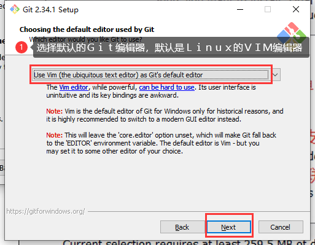

7. 

8. 

9. 这一步不清楚，默认吧

10. 

11. 

12. 

13. 

14. 

15. 

16. 

17. 安装完后，取消勾选查看版本信息，Finish即可，右键查看是否安装成功，如下图：

    > 一般我们不使用GitGUI，而是使用GitBash命令行

# 第三章 Git常用命令

|                 命令                 |                   作用                   |
| :----------------------------------: | :--------------------------------------: |
| git config --global user.name 用户名 |               设置用户签名               |
| git config --global user.email 邮箱  |  设置用户虚拟邮箱<br />或真实邮箱都可以  |
|             **git init**             |               初始化本地库               |
|            **git status**            |              查看本地库状态              |
|          **git add 文件名**          |               添加到暂存区               |
| **git commit -m "日志信息" 文件名**  |               提交到本地库               |
|            **git reflog**            |               查看历史纪录               |
|    **git reset --hard 7位版本号**    |                 版本穿梭                 |
|               git log                |           查看详细版本日志信息           |
|     git remote add 别名 被替换值     |        为指定的值比如链接创建别名        |
|            git remote -v             |                 查看别名                 |
| git push 远程库链接别名或链接 分支名 |         将指定分支推送到远程库中         |
| git pull 远程库链接别名或链接 分支名 | 将指定远程库中的代码拉取到指定本地库分支 |

> Tip：Git不会去验证你的邮箱是否可用，只是单纯设置与用户名对应的邮箱而已

#### 设置用户签名


> 设置完后，如何验证是否生效了，这时候就需要打开Windows用户目录查看.gitconfig配置文件
>
> 打开.gitconfig配置文件就可以看到配置的内容

> 说明：用户签名的作用是区分不同操作者身份，用户的签名信息在每一个版本的提交信息中都能看到，一次确认本次提交是谁做的。**Git首次安装必须设置一下用户签名，否则无法提交代码**
>
> 注意：Git中设置的用户签名与将来登录GitHub或其他托管中心的账号没有任何关系

#### 初始化本地库

> 初始化本地库的意思就是若你要使用Git管理代码目录，首先要让Git获取该目录的管理权，也就是要初始化一下，接下来就来看看如何初始化本地库

1. 首先我们要选择一个项目，然后使用Git来管理这个项目，我们进到该项目的目录下，右键打开Git，那么Git就默认在该路径下打开了，随后进行git init初始化操作
2. 初始化好之后也可以在GitBash命令行输入Linux命令可查看到.git目录与其内部结构
3. 这下本地库就初始化好了，小提示一下Linux的命令与Git是互通的

#### 查看本地库状态

> 当我们刚刚初始化完本地库，执行`git status`命令查看本地库状态，肯定是如下图啥都没有的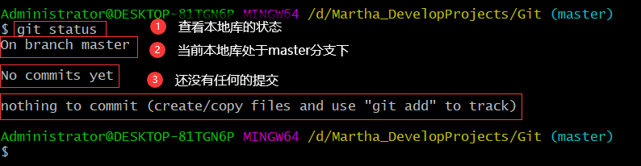
>
> 我们新建一个记事本文件后再查看本地库状态

#### 添加到暂存区

> 我们将hello.txt文件添加到暂存区，再次查看本地库状态就会发现它变绿色了，说明Git知道有这么一个文件了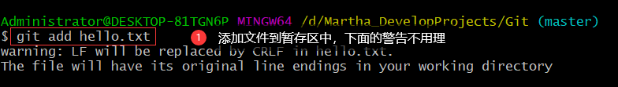
>
> 添加完后查看本地库状态
>
> 这时候Git也告诉你想要在暂存区中删除文件就要使用`git rm --cached 文件名`的方式删除掉暂存区中的文件，但是要注意的是，删除了暂存区中的文件，不影响工作区中的文件

#### 提交本地库

> 我们添加到暂存区中文件只是临时存储并没有生成对应的历史版本，所以我们要将其提交到本地库才能生成对应文件的历史版本
>
> 我们使用`git commit -m "日志信息" 文件名`命令来进行提交到本地库，但要注意，参数-m "日志信息"是必要的，不加上它也还是会打开一个文本框让你输入，所以一般都会直接加上，把这次提交的版本信息写一下
>
> 提交到本地库后我们继续查看本地库状态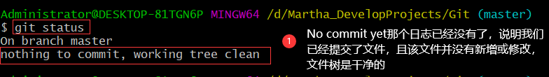
>
> 我们除了可以通过查看本地库状态查看到部分日志信息，还可以通过`git reflog专门查看引用日志信息
>
> 不光如此我们还可以通过`git log`查看详细日志，这个命令中不仅能看到提交了什么版本，还可以看到是谁提交的该版本和提交该版本的时间，我们可以看到下面的版本号非常长，这个版本号才是完整的版本号，而我们之前查看的版本号只是取了完整版本号的前7位

#### 修改文件

1. 我们通过文件的修改来模拟代码版本的迭代，通过vim命令修改了hello.txt文件的内容后，再次查看本地库状态，可以发现信息又不一样了，标识该文件被修改过并且文件还是红色的，说明被修改了的文件还未添加到暂存区中，这时候就需要追踪一下这个文件
2. 将修改后的文件添加到暂存区中
3. 添加到暂存区后再次查看本地库状态，可以发现被修改后的文件已经成功变为绿色，即追踪成功
4. 为了生成对应历史版本，我们再次提交到本地库，可以看到一行被添加一行被删除，为什么呢？因为修改是在原有的基础上添加了内容，而在Git中，它是按照行来维护文件的，修改一行它是没办法表达出来的，只能将原有那一行内容删除后再插入修改后的那一行，所以提示就是一行新增一行删除
5. 将修改后的文件提交到本地库之后，再次查看本地库状态，可以看到还是干净的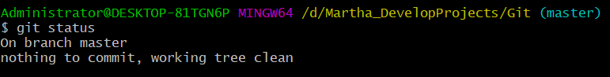
6. 这时候就没有未提交文件，那么我们查看引用版本日志可以发现，指针永远都指向了最新提交的那个版本
7. 这时候我们查看hello.txt文件，就是最新修改过的内容
8. 而在工作区中，它永远都只会显示一个文件，而这个文件也就是指针指向的最新修改过的文件，因为Git不是使用副本来进行版本控制，在Git的底层是使用指针来管理版本的

#### 版本穿梭

> 如果有一天，感觉当前比较新的带代码写的不是很好，想让代码穿越回之前的版本，那我们就会使用到版本穿梭的命令，也就是A提交了初始化版本的代码，A又提交了修改后的版本，但是A又觉得修改后的版本还是不如之前初始的版本，想回退，那么步骤如下：

1. 首先可以通过查看历史版本精简信息`git reflog`的命令查看版本信息，比如想要穿梭到第一个版本，那么我们需要将第一个版本对应的版本号复制下来，右键copy即可
2. 复制完版本号之后我们就可以通过版本穿梭命令修改head指针的版本指向了，修改完后我们再查看版本内容可以发现，确实版本发生了变化

> 当然我们可以进到.git目录下，有一个HEAD文件，打开该文件，就可以看到Head的指向，指向了相对路径下refs/heads/master分支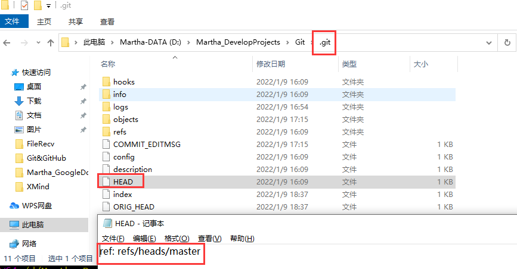
>
> 那么我们就顺着进入到该路径下，可以看到master分支指向了第一个版本的完整版本号
>
> 综上所述，就是head→master→8e40717，所以版本穿梭就是一个修改头指针指向的过程，不仅可以穿梭（指向）到之前的版本，也可以穿梭到之后的版本，当头指针指向的版本发生了修改，对应的内容也就发生了变化

# 第四章 Git分支操作


> 上图需要从右向左看，首先公司中肯定分好几套服务器，每个服务器对应着不同的环境，开发环境、测试环境等等，而客户使用的是线上的服务器，那么若开发者需要对项目进行重构或优化，总不能在用户使用的服务器环境上开发，所以说项目代码需要多复制几个分支，一个分支是用户在使用，开发分支用于开发，测试分支用于测试，所以分支是很重要的

## 什么是分支

> 在版本控制过程中，有时候需要同时推进多个任务，那我们就可以为这每个任务创建对应的分支，使用分支意味着开发者可以将自己的工作从开发主线上分离开来，开发自己的分支时不会影响主分支的运行；对于初学者而言，可以简单理解为副本，一个分支就是一个单独的副本，就算我把这个分支开发坏了，也没有关系；其实分支的底层其实也是指针引用


> 如图，我们有一个master主分支在运行着，在运行的同时，有些功能要增加，比如feature-blue，比如想给master分支的程序添加蓝色的特征，那我们就可以从master分支中复制一份下来，那么feature-blue这个分支就可以接着往下开发了，假设feature-blue分支开发好了，那么就可以将这个分支和用户在使用的master分支合并更新一下，如果合并之后导致master能用，但是界面卡顿等小问题出现，那我们还可以从master分支引申出一个hot-fix分支（热修分支），即紧急修复，修复没有问题了，再进行与主分支代码合并；
>
> 如果还不够，又要添加游戏功能，那么我们就可以从master分支上再引申一条分支feature-game，feature-game就是一个独立的分支在开发中，经历了三个版本的迭代，最后将游戏分支与主线分支进行合并，所以我们用的程序就是这么更新的

## 分支的好处

+ 我们可以并行推进多个功能的开发，提高开发效率
+ 在各个分支开发过程中，若某一个分支开发失败是不会影响其他分支的，失败的分支删除后重新开始即可

## 分支操作的命令

|        命令         |             作用             |
| :-----------------: | :--------------------------: |
| git branch 分支名称 |           创建分支           |
|    git branch -v    |           查看分支           |
| git checkout 分支名 |           切换分支           |
|  git merge 分支名   | 将指定的分支合并到当前分支上 |

### 查看分支

> 通过`git branch -v`命令来查看分支，下图演示中，git明确告诉了我们只有一个指向了第一次提交的版本的master分支

### 创建分支

> 通过`git branch 分支名称`来创建分支

1. 创建紧急修复分支
2. 查看分支，就会发现分支创建成功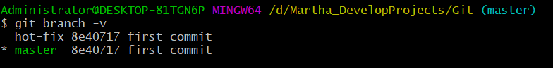

### 切换分支

> 切换分支的本质就是修改HEAD头指针

1. 由master分支切换到hot-fix分支，切换后我们发现括号中的分支标识已经发生改变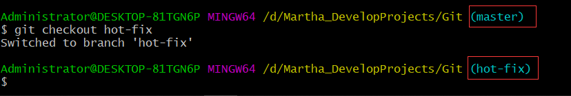
2. 查看分支，我们还可以发现，* 号指向了当前分支，并且当前分支的名称被渲染成了绿色，这就说明我们当前确实是在hot-fix分支上
3. 这时候我们就可以通过紧急修复分支，对master主线分支的内容副本进行修复（我们发现hello.txt中的重复代码过多，将其删除一部分后保存，也称作分支修改）
4. 修改之后，依然还是那个步骤，在hot-fix分支上我们查看本地库状态，发现修改未添加
5. 添加到暂存区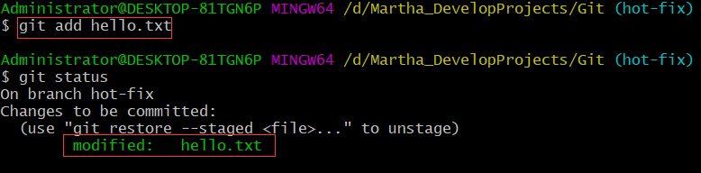
6. 提交到本地库，注意日志信息可以提高可读性
7. 查看一下修改后的内容发现也已经改变
8. 再去.git目录下查看发现HEAD文件所指向的分支也修改了，并且refs/heads目录下也新增了hot-fix分支的索引文件，毋庸置疑，该索引文件保存了所提交的完整版本号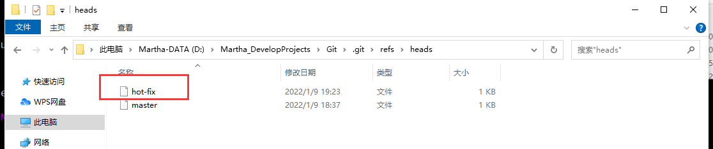

### 合并分支

1. 将head指针重新指向master分支，站在master分支上进行次分支合并到主分支操作，合并后我们发现结果其实就是hot-fix分支修改后的内容
2. 这种合并并没有产生冲突，因为hot-fix是基于master的基础上做出了修改，而前提是在hot-fix分支进行的过程中，master分支并没有被修改，所以自然也就没有合并冲突问题，也就是一个变化，另一个不变的情况下

### 合并冲突

> 冲突产生的原因：两个分支对于同一个文件的同一个位置有两套完全不同的修改，Git无法决定使用哪一个进行合并或如何合并，必须人为地来决定新代码内容，下面演示合并冲突与解决

1. 我们在master分支上，将hello.txt的内容做出修改，修改如下，光修改还不行，还要添加暂存区，提交本地库
2. 切换到hot-fix分支，也对hot-fix分支上的hello.txt的内容作出修改并且不在同一个位置，修改后添加暂存区提交本地库
3. 切换分支到master上，做出分支合并，我们就可以发现发生了冲突
4. 然后查看本地库状态，发现Git告诉我们两个文件都发生了修改，就是两个分支都对同一个文件做出了修改，并且还不是同一个位置，那么Git也不知道如何合并，需要我们人为手动合并
5. 我们vim打开该文件
6. 现在需要人为决定如何合并代码内容，所以我们只需要将需要保留的内容留下，不需要的内容删去即可（比如我既想保留master分支修改过的内容，也想保留hot-fix分支修改过的内容），那么我们删除其他内容，并将标记符和分隔符也删去，保存即可
7. 保存之后，还要将刚刚保存后的文件添加到暂存区
8. 最关键的就是提交本地库操作了，此时提交本地库操作时，就不能再携带文件名了，因为两个分支都修改了hello.txt文件，如果还是携带了这个文件名，就会报错，因为他不知道要提交哪一个，所以干脆直接不带文件名提交合并就成功了，可以发现MERGING已经消失了，说明人为合并成功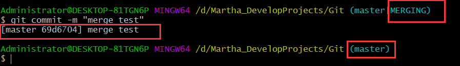
9. 合并成功后，我们查看内容如下
10. 注意合并成功后，只会对master分支上的该文件内容作出修改，而不会影响hot-fix分支上的该文件内容

# 第五章 Git团队协作机制了解

> 想进行团队协作，那么就需要使用到代码托管中心了，A将代码推送到远程库，B拉取下来，就基本上实现了团队协作，团队协作分为以下两种：
>
> + 团队内写作
> + 跨团队协作

## 团队内协作


> A对象先从自己的本地库将自己的代码push进了远程库，B对象可以clone完整复制一份进自己的本地库，B对象做了些修改或优化重新推送到了远程库中，那么A感觉不错，就将代码pull拉取进了自己的本地库，拉取操作会更新A对象的本地库代码，这样一套流程下来，A对象与B对象及其远程库的代码版本就都是一致的了，这就是团队内协作
>
> 当然B对象的推送操作必须是得到授权的才可以，要不然谁都可以往你的远程库中推送垃圾，那就不好了

## 跨团队写作


> 跨团队协作就是A和C这个团队需要其他团队的帮助或者干嘛的，A想让B帮他优化一下代码，那么B就需要将A远程库中的代码fork（叉）进，也可以理解为复制了一份进自己的远程库中，再从自己的远程库clone代码进自己的本地库，做好优化后，再推送到自己的远程库，然后向A对象发起**拉取请求**，A对象先是审核了，审核感觉代码可以就进行**合并**进到自己的远程库中，这样自己的远程库中的代码就会改变，AheC对象就可以再次进行团队内合作，这就是跨团队协作（为什么B不进入A和C的团队，因为不想）

# 第六章 GitHub操作

#### GitHub中创建远程库

1. 访问GitHub网址：https://github.com/

2. 登录GitHub：904103665@qq.com xb2Maserati..
3. 点击 + 号创建新的远程库
4. 
5. 远程库创建好后，就可以看见有HTTPS和SSH两个不同协议的链接，我们先复制HTTPS协议下的链接
6. 复制好连接后我们在GitBash命令行中，对该链接创建别名，因为链接太长不好记，首先我们查看了一下当前有没有起了别名的内容，保证别名不重复，可以看到没有任何别名信息
7. 为HTTPS链接取上别名，别名推荐就是远程仓库的名称，比较不容易忘
8. 再次查看别名信息，发现多了两个出来，意思就是push推送和fetch拉取（包括clone和pull）都可以使用这个别名

#### 本地库代码推送至远程库

1. 使用`git push 远程库别名或链接 分支名`将本地库分支中的项目推送至远程库中
2. 网络较好的情况下，弹窗就会出现，叫我们链接GitHub，那我们可以使用浏览器GitHub账号登录
3. 点击之后会跳转到浏览器端，授权即可
4. 后面可能还需要确认GitHub的用户名和密码
5. 确认之后，会出现以下页面，说明授权成功，再等等就好了，如果还是一直链接失败多试几次就行了
6. 推送成功
7. 

#### 拉取远程库代码至本地库

1. 我们也可以直接在GitHub上面修改代码，打开文件进入，点击小笔就可以编辑该文件了
2. 改完直接提交操作
3. 这时候远程库和本地库就不是同步的了，那么我们就需要拉取下来，更新本地库的代码，通过`git pull 远程库别名或链接 分支名`将远程库中的代码拉取到本地库中，拉取后我们可以看见，本地库中的代码内容与远程库中的一致了
4. 内容一致后，我们再查看一下本地库状态，返现拉取操作**会自动帮助我们提交到本地库**


#### 远程库代码克隆至本地库

1. 首先，要克隆人家或自己的代码，首先就要拿到代码的链接，或者在公司中会将连接发给你
2. 拿到链接后，在Windows本地新建了一个文件夹用于接收，执行命令`git clone 链接地址`，我们发现**克隆代码是不用登录GitHub账号的**，因为这个链接的代码所处的是一个公共库，公共库的读权限是没有限制的，任何人都可以克隆并查看代码
3. 克隆成功之后我们发现本地路径下不仅多了代码文件，而且还有.git目录，所以clone帮我们完成了三件事儿，拉取代码、初始化了本地仓库、创建别名，只不过这个别名是Git自动帮我们取的


#### 团队内协作

> 首先我们的GitB克隆了GitA的代码及相关信息，且GitB开始修改或优化了该代码内容，保存之后，添加暂存区→提交本地库→推送远程库，这样GitA才能看见，但是在推送之前，既是GitA认识GitB，但是GitHub不知道他们是一个团队，所以GitA需要先在GitHub上邀请GitB加入自己的团队，步骤如下：

1. GitA登录自己的GitHub账号，然后点击Settings
2. 进入Settings之后，点击管理访问
3. 点击添加成员
4. 输入成员的GitHub用户名搜索即可，搜索出来之后，添加即可，然后需要在跳转出来的页面中复制邀请函地址，将该地址发送给GitB，GitB复制该链接在浏览器地址栏中搜索
5. GitB点击同意即可加入到GitA的团队，一旦GitB同意了邀请，那么GitB就可以看到GitA的代码项目，只要是你的项目的一个成员，那么GitB就可以将修改好后的代码进行推送了
6. 推送上远程库后，GitA就能看到修改后的代码文件了，并且GitA将GitB推送至远程库中的代码拉取到自己的本地库后，本地库也就同步远程库了，这么一个循环的过程就是团队内协作了

#### 跨团队协作

> 跨团队写作就是找一个团队之外的人，帮助我们优化修改代码等等

1. 首先GitA将的项目的HTTPS链接发送给GitC，方便GitC直接访问到该项目，随后GitC将该项目fork叉进自己的远程库中，如下图，然后就可以在自己的远程库中看到对应的项目了
2. GitC进行了优化和修改之后，点击Pull Request拉取请求，然后点击New pull request，随后在点击创建Pull Request
3. 点击Create pull request之后，GitA就可以在自己的账户下看到这个拉取请求
4. 点击去之后就可以看到GitC修改或优化后的代码，这时候点击下图红框中的内容进入到代码中
5. 点进去之后就可以自己审查一下代码，因为不是所有的代码拉取请求都得同意，如果觉得没问题了，就点击合并拉取请求，后面再确认一下操作就可以了，合并完之后GitA就可以看到自己的远程库也对应地修改了，这就是跨团队协作

#### GitHub SSH免密登录

> 我们使用过HTTPS协议链接之后，还有一个SSH协议的链接，使用SSH协议的链接来推送或者拉取就不用每次登录GitHub账号了
>
> 初次点击SSH协议，它提示说你当前没有任何的SSH的key，自然地也就用不了这个链接，所以第一步就是要添加公钥

1. 在Windows用户目录下，打开GitBash命令行，输入一下命令进行获取公钥操作，输入命令后敲三下回车，即可在用户目录下创建.ssh密钥目录

   ```shell
   ssh-keygen -t rsa -C Martha@qq.com
   ```

   

2. 继续在GitBash命令行访问.ssh目录，并且cat一下公钥文件的内容，然后复制，当然使用记事本打开复制也可以
3. 复制完后，打开GitHub账号，然后点击头像里的Settings，有一个SSH and GPG keys，点击进去，点击New SSH key
4. 粘贴密钥即可
5. 只要看到下面这个界面说明公钥添加成功
6. 然后我们就可以测试在免密登录下进行推送和拉取了，先在GitHub上修改内容，然后命令行中拉取进本地库
7. 在本地修改内容后，添加暂存区、提交本地库、利用SSH免密协议推送至远程库

# 第七章 IDEA集成Git

#### 环境准备

> 要想在集成开发环境中集成Git，那么我们首先要配置一下Git所要忽略的文件，因为无论是Eclipse也好还是IDEA也好，项目工程中难免会有一些别的xml文件啊或者其他配置文件，如下图，我们是不需要的
>
> 
>
> 我们利用Git管理项目，我们只想要pom.xml文件以及代码，其他文件就不要了，因为其他文件与项目的实际功能无关，不参与服务器的部署运行，把他们忽略掉，方便以后屏蔽掉IDE开发环境上的差异，所以我们要配置一个xxx.ignore忽略文件，前缀随便，但是后缀不变（建议是`git.ignore`文件），该文件其实放在哪儿都可以，但是为了方便~/.gitconfig文件引用，建议也将ignore文件放在用户家目录下，这个文件的内容也非常简单，想忽略啥就写啥，.ignore内容模板如下：

```ignore
# Compiled class file
*.class

# Log file
*.log

# BlueJ files
*.ctxt

# Mobile Tools for Java (J2ME)
.mtj.tmp

# Package Files #
*.jar
*.war
*.nar
*.ear
*.zip
*.tar.gz
*.rar

# virtual machine crash logs, see 
http://www.java.com/en/download/help/error_hotspot.xml
hs_err_pid*
.classpath
.project
.settings
target
.idea
*.iml

#other files
.gitignore
```

1. 在Windows用户目录下新建一个文档，内容复制上面的，随后命名并修改后缀git.ignore

2. 保存好后，打开.gitconfig文件，在里面引用一下.ignore文件即可，引用内容如下

   ```
   [core]
   excludesfile = ‪C:/Users/Administrator/git.ignore
   ```

   > 注意：ignore文件路径不同要修改，且要使用**“正斜线（/）”**，不要使用“反斜线（\）”

   

   > 但是这种忽略的方式貌似存在问题：warning: unable to access '‪ C:/Users/Administrator/git.ignore': Invalid argument，所以推荐将git.ignore文件改名为.gitignore文件直接在项目根目录中创建即可
   >
   > 打开IDEA就可以发现黄色的文件都被忽略了，后续如果还需要忽略啥文件，直接添加就行了

3. 保存好后就配置好忽略信息了，随后我们要想在IDEA中使用Git程序，还要继续配置一下，告诉IDEA去哪儿找Git程序，即定位Git程序，打开IDEA→Settings→Version Control
4. 指定完路径后，点击Test，出现版本号后就说明成功了，随后就apply ok就行，到此环境就准备好了

#### IDEA中使用Git

##### 初始化本地库

> 在IDEA中配置完Git后，右键项目，依然没有初始化本地库，也就是说在项目目录下，并没有.git目录，所以我们还需要再配置一下
>
> 点击Create Git Repository，会默认选中我们当前项目的根目录，直接点击OK
>
> 点击OK之后，在项目根目录下就出现了.git配置目录
>
> 那就说明Git已经接管了这个项目，并且在IDEA中明显会看到pom.xml文件变为红色了而在Git中，红色的文件就是未被追踪的意思，也就是目前Git检测到了这个文件，但是这个pom.xml文件还没有被添加到暂存区

##### 添加到暂存区

> 右键pom.xml文件,Git→Add，执行完之后，我们就会发现pom.xml文件变为绿色了
>
> 
>
> 
>
> 但绿色文件代表已经添加到了暂存区，但是还没有提交到本地库

> 我们先不急着将pom.xml文件提交到本地库，先编写一下Java代码
>
> 而我们目前Java代码还没有添加暂存区，这里我们可以右键操作，但是类多了就不好办了，所以当要批量添加时，我们直接右键项目，将整个项目都添加到暂存区，添加之后就相关文件都变为绿色了

##### 提交到本地库

> 添加到暂存区完毕后，我们就可以提交到本地库了，右键项目→Git→Commit Directory
>
> 
>
> 提交到本地库之后，他们就变为了正常的颜色

##### 切换版本

> 当我们修改代码后，类文件的颜色就会自动变化为蓝色，蓝色的文件代表被追踪过，但是又被修改了，那么我们就可以添加暂存区提交本地库，当然在IDEA中我们也可以直接提交本地库，我们分别对每个版本添加了代码并提交到了本地库
>
> 生成了三个对应的历史版本，我们当前所处于第三个版本
>
> 切换版本就直接在对应版本右键checkout即可

##### 创建分支

1. 第一种方式
2. 第二种方式
3. 切换分支就直接右下角选择分支，然后checkout就好了

##### 分支合并

我们切换到hot-fix分支修改一下内容，提交到本地库，然后切换回master分支，然后右下角选择hot-fix分支，选择合并到当前分支即可完成分支合并

##### 冲突合并

我们对hot-fix分支的内容作出修改，随后提交本地库，然后再对master分支的内容做出修改，随后提交本地库，然后合并分支，这是手动合并的界面，箭头表示保留，x表示删除，手动合并之后apply即可完成合并

# 第八章 IDEA集成GitHub

1. 设置GitHub账号，Token口令需要在GitHub账户上获取
2. 生成后将该口令先复制再说，因为刷新后就会永久隐藏找不到，只能重新生成
3. 来到IDEA使用口令登录GitHub，因为账号密码会比较慢，直接将口令复制即可轻松完成登录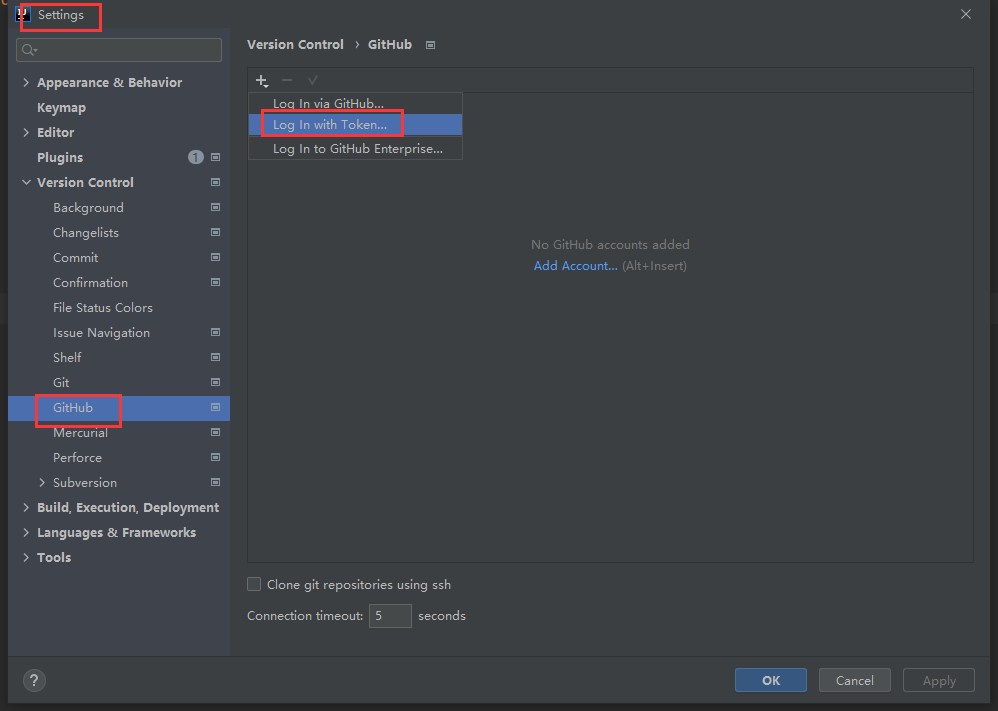

#### IDEA分享项目到GitHub

1. 
2. 
3. 这个操作就相当于在GitHub上创建远程库，将本地库代码推送到远程库，两个步骤一起来

#### IDEA 本地库push推送至远程库

1. 假设我在IDEA修改了代码，然后还是需要提交到本地库，再推送到远程库，实现远程库的同步更新，假设修改完代码内容，要推送至远程库，步骤如下

2. 因为IDEA默认使用HTTPS协议进行推送，很大可能会受到网络的影响，所以推荐使用SSH免密，我们先去GitHub的该项目代码的SSH协议链接复制过来，然后左键点击项目名称`define remote`，添加SSH协议

3. 添加完成后选择SSH-git进行push即可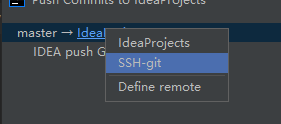

   > 需要注意的是：push 是将本地库代码推送到远程库，如果本地库代码跟远程库代码版本不一致，push 的操作是会被拒绝的。也就是说，要想 push 成功，一定要保证本地库的版本要比远程库的版本高！因此一个成熟的程序员在动手改本地代码之前，一定会先检查下远程库跟本地代码的区别！如果本地的代码版本已经落后，切记要先 pull 拉取一下远程库的代码，将本地代码更新到最新以后，然后再修改，提交，推送！

#### IDEA拉取远程库代码合并本地库

1. 我们在GitHub上修改内容，然后IDEA中拉取合并本地库代码

> 注意：pull 是拉取远端仓库代码到本地，如果远程库代码和本地库代码不一致，会自动
>
> 合并，如果自动合并失败，还会涉及到手动解决冲突的问题

#### IDEA 远程库clone代码到本地库

> 只要我们将代码托管到远程库，那么本地库中的代码就可以随意删除了，这时候即使我们删除了，需要的时候也可以从远程库clone一份下来

1. 
2. 选择所用的协议链接，这里还是选择SSH，将代码克隆进指定目录

# 第九章 Gitee码云

> 众所周知，GitHub 服务器在国外，使用 GitHub 作为项目托管网站，如果网速不好的话，严重影响使用体验，甚至会出现登录不上的情况。针对这个情况，大家也可以使用国内的项目托管网站-码云
>
> 码云是开源中国推出的基于 Git 的代码托管服务中心，网址是 https://gitee.com/ ，使用方式跟 GitHub 一样，而且它还是一个中文网站，如果你英文不是很好它是最好的选择

# 第十章 GitLab

