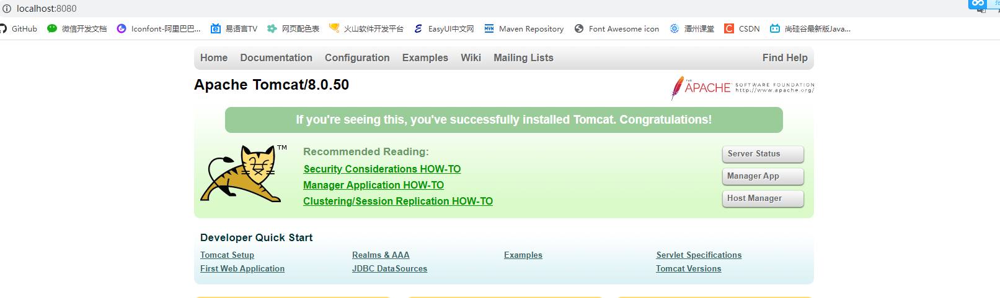

# 	第一章 Tomcat服务器

## 初识JavaWeb

### JavaWeb的概念

+ JavaWeb是指所有通过Java语言编写的，可以通过浏览器访问的程序的总称
+ JavaWeb是基于请求和响应来开发的
  + 请求是指客户端给服务器发送数据，称为请求`Request`
  + 响应是指服务器给客户端回传数据，称为响应`Response`
  + 请求和响应是成对出现的，有请求就有响应

### Web资源的分类

+ Web资源实现的技术和呈现的效果的不同，又分为静态资源和动态资源两种
  + 静态资源：HTML、CSS、JS、TXT、MP4、JPG
  + 动态资源：JSP、SERVLET

### 常用的Web服务器

+ Tomcat：由Apache组织提供对JSP和Servlet的支持。它是一种轻量级的JavaWeb容器`服务器`，也是当前应用最广的且免费的JavaWeb服务器
+ Jboss：是一个遵从JavaEE规范的、开放源代码的、纯Java的EJB服务器，它支持所有的JavaEE规范并且免费
+ GlassFish：由Oracle公司开发的一款JavaWeb服务器，是一款强健的商业服务器，达到产品级质量（应用很少）
+ Resin：是CAUCHO公司的产品，是一个非常流行的服务器，对Servlet和Jsp提供了良好的支持，性能也比较优良resin自身采用Java语言开发（收费应用比较多）
+ WebLogic：是Oracle公司的产品，是目前应用最广泛的Web服务器，支持JavaEE规范，而且不断完善以适应新的开发要求，适合大型项目（收费，用的不多，适合大公司）

### Tomcat服务器和Servlet版本的对应关系

> 当前企业常用的Tomcat版本7.*，8.\*
>
> Servlet程序从2.5开始的xml配置版本是现在世面使用最多的版本，到了Servlet3.0之后，就是注解版本的Servlet使用

| Tomcat版本 | Servlet/JSP版本 | JavaEE版本 | 运行环境 |
| :--------: | :-------------: | :--------: | :------: |
|    4.1     |     2.3/1.2     |    1.3     |  JDK1.3  |
|    5.0     |     2.4/2.0     |    1.4     |  JDK1.4  |
|  5.5/6.0   |     2.5/2.1     |    5.0     |  JDK5.0  |
|    7.0     |     3.0/2.2     |    6.0     |  JDK6.0  |
|    8.0     |     3.1/2.3     |    7.0     |  JDK7.0  |

## Tomcat服务器的安装

> 找到你需要用的Tomcat版本对应的zip压缩包，解压到需要安装的目录即可，解压即安装
>
> 已选择`apache-tomcat-8.0.50`64位进行安装

## Tomcat目录介绍

+ bin：专门用于存放Tomcat服务器的可执行程序
+ conf：专门用于存放Tomcat服务器的配置文件
+ lib：专门用于存放Tomcat服务器的jar包
+ logs：专门用于存放Tomcat服务器运行时输出的日记信息
+ temp：专门用于存放Tomcat运行时产生的临时数据
+ webapps：专门用来存放部署的Web工程，这里面一个目录代表一个工程
+ work：是Tomcat工作时的目录，用来存放Tomcat运行时Jsp翻译为Servlet的源码，和Session钝化（序列化）的目录

## 启动Tomcat服务器的两种方式

### 方式一

> 找到Tomcat安装目录下的bin目录下的startup.bat文件，双击启动Tomcat服务器

**如何测试Tomcat服务器启动成功？**

> 在浏览器中输入以下任意一个地址进行访问既可测试启动是否成功，

+ http://localhost:8080
+ http://127.0.0.1:8080
+ http://真实ip:8080

### 方式二

> 通过系统命令行的方式，步骤如下：

+ 打开命令行
+ cd到Tomcat安装目录的bin目录下
+ 输入启动命令：`catalina run`，即可启动Tomcat服务器
+ 优点就是万一环境变量JAVA_HOME没有配置好会提示你，而不是像startup会直接闪退

**启动成功的首页如下：**



> 小提示：通过localhost:8080访问的是根路径，即Tomcat服务器安装目录中webapps目录

## 停止Tomcat服务器的三种方式

+ 方式一：直接关闭startup.bat启动的命令行窗口，即可关闭Tomcat服务器

+ 方式二：在startup.bat启动的命令行窗口内Ctrl+C`前提是输入法调为英文模式`，即可关闭Tomcat服务器

+ **方式三**：在Tomcat服务器安装目录的bin目录下，双击执行shutdown.bat，亦可停止Tomcat服务器

  > 方式三是我们关闭Tomcat服务器最主要的方式

## 修改Tomcat服务器的端口号

1. 进入Tomcat安装目录下的conf目录，并编辑server.xml配置文件中的如下内容

   ```xml
   <Connector port="8080" protocol="HTTP/1.1"
                  connectionTimeout="20000"
                  redirectPort="8443" />
   ```

2. 修改`port`属性为实际需要的端口号，如下，已将Tomcat服务器默认的端口号修改为了8989

   > 端口号范围1-65535，一般1000以内的都是系统在用，所以建议不要选择1000以内的端口号使用

   ```xml
   <Connector port="8989" protocol="HTTP/1.1"
                  connectionTimeout="20000"
                  redirectPort="8443" />
   ```

3. 修改完端口号后，需要重启Tomcat服务器才能生效

   > 小提示：HTTP协议默认的端口号为80，若端口号为80，则该端口号将被隐藏，平时上百度，看不到端口号，即http://www.baidu.com:80

## 部署Web工程到Tomcat服务器中的三种方式

+ **方式一**：==项目直接放入 webapps 目录中==

  1. 将编写并编译好的Web项目(注意要是编译好的，如果是 eclipse，可以将项目打成 war 包放入)，放入到 webapps 中，当Tomcat服务器启动时会自动解压该war包
  2. 启动Tomcat服务器（双击 bin 目录下的 startup.bat，启动服务器）
  3. 在浏览器输入：`http://localhost:8080/项目名/访问的文件名`

  > 小提示：在webapps目录下自定义一个文件夹即代表一个工程，该目录下存放一个html文件，启动Tomcat服务器，通过路径`http://ip:port/工程名/目录下/文件`即可访问该html文件

+ ###### **方式二**：==项目不在webapps目录中==，在其他路径下，那么我们就需要==修改 conf/server.xml 文件==，来映射到它这个项目

  1. 打开Tomcat安装目录下conf/server.xml，在<Host> </Host>标签之间输入如下==项目配置信息==

  ```xml
  <!-- 
  	path:浏览器访问时的路径名，相当于该具体路径项目的访问别名
  　docBase:web项目的WebRoot实际所在的路径，注意是WebRoot（根目录）的路径，不是项目的路径。其实也就是编译后的项目
  	reloadble:设定项目有改动时，Tomcat是否重新加载该项目
  -->
  <Context path="/WebProject" docBase="D:/WebProject" reloadable="true" />
  ```

  2. 双击 startup.bat，启动 tomcat 服务器，然后在浏览器输入访问的项目名称路径

+ **方式三（推荐）**：==conf\Catalina\localhost==

  1. 进入Tomcat服务器安装目录下的conf\Catalina\localhost目录下创建一个`项目名.xml文件`，**该文件名用于映射工程的实际路径，所以可以使用工程名来命名**，配置文件内容如下

     

     ```xml
     <!--
      Context表示一个工程的上下文
      docBase表示工程所在的实际路径，该路径只能是一个目录路径，而不能是一个文件路径，否则无法进行映射
      reloadable表示项目有改动时，Tomcat是否重新加载该项目
     -->
     <Context docBase="E:\Environment\apache-tomcat-7.0.96\wtpwebapps\mall-manager-web" reloadable="true"/>
     ```

  2. 启动Tomcat服务器，在浏览器输入路径`ip:port/xml文件名/访问的文件名`即可访问工程下的文件

     

     > 小提示：该方式不需要 path属性配置，加上也没什么用，可以理解为path已经替换成xml文件名了

## Tomcat默认访问的工程及其资源

+ 当我们在浏览器地址中输入访问地址`http://ip:port`，**没有指定工程名时，Tomcat默认访问的就是webapps/ROOT/index.html或index.jsp资源**
+ 当我们在浏览器地址中输入的访问地址`http://ip:port/工程名`，**没有指定具体资源名时，Tomcat默认访问的是该工程项目下的 index.html或index.jsp资源页面**

> 小提示：若一个工程中，index.html和index.jsp二者都存在，那么index.html的访问要优先于index.jsp

## IDEA整合Tomcat服务器的方式

1. File | Settings | Build, Execution, Deployment | Application Servers点击+号添加Tomcat Server


2. 将Tomcat的安装目录配置进Tomcat Home，Tomcat base directory将自动识别，点击OK，Apply&OK即可

   

> 小提示：可以添加多个Tomcat版本，以供添加Module时可选择使用，参考↓


> 小提示：当我们的Tomcat整合了IDEA之后，项目会默认部署在本地
>
> C:\Users\Administrator\AppData\Local\JetBrains\IntelliJIdea2021.1\tomcat\目录下

# 第二章 IDEA动态的Web工程的操作

## IDEA创建动态Web工程

1. 在总工程下，创建一个Module，选择Java Enterprise，设置Tomcat服务器版本，勾选WebApplication，默认是勾选状态下的Create web.xml，Next即可

   

2. Next，指明该工程模块的名称，finish即可，结构如下图

   >动态Web工程创建完毕后，还需要在WEB-INF目录下新建一个lib目录用于存放jar包

   

## 动态Web工程目录介绍

+ src目录：主要用于存放自己编写的`Java源代码`
+ web目录：专门用于存放Web工程的资源文件`如HTML页面、CSS文件`
+ WEB-INF目录：是一个受服务器保护的目录，浏览器无法直接访问到此目录下的内容
+ lib目录：需要我们手动定义的目录，用于存放第三方jar包`不同于Eclipse，IDEA需要手动配置导入jar包`
+ web.xml文件：是整个动态Web工程的配置部署描述文件，可以在内部配置很多Web工程的组件`如Servlet程序、Filter过滤器、Listener监听器、Session超时...`

## 动态Web工程添加第三方jar包的方式

+ **方式一**：复制jar包到lib目录下，右键 Add as library，Level选择Module Library，Add to module选择当前工程模块

+ **方式二**：

  1. File | Project Structure | Libraries | + | Java

  2. Select Library Files：找到当前工程模块的lib目录，选中要添加的jar包，点击OK

     3. Choose Modules：指明jar包给哪一个工程使用，点击OK
     4. 可修改当前类库名称`如工程模块名_libs`

     5. 选择Artifacts选项，将类库添加到打包部署中，Add之后Apply | OK即添加jar包完成

## IDEA部署Web工程到Tomcat服务器上运行

1. 建议修改Tomcat服务器名称与当前工程模块名一致`Aplplication Servers | 右键Tomcat服务器 | Edit Configuration`，将名称改为当前工程模块名Apply | OK即可
2. Run即可

## Tomcat实例使用的其他细节说明

+ 修改工程模块默认的访问路径：**建议访问路径与工程名相同**

  > `Aplplication Servers | 右键Tomcat服务器 | Edit Configuration | Deployment`修改Application context为当前工程名即可

+ 修改运行的端口号

  > `Aplplication Servers | 右键Tomcat服务器 | Edit Configuration | Server`

+ 修改运行Tomcat实例所使用的浏览器`默认是谷歌`

  > `Aplplication Servers | 右键Tomcat服务器 | Edit Configuration | Server`

+ **配置资源热部署（推荐）**：如页面代码有改动时，会自动更新资源，在不用重启Tomcat服务器，直接刷新浏览器即可展现改动后的效果

  > `Aplplication Servers | 右键Tomcat服务器 | Edit Configuration | Server | On frame deacivatio`设置为Update classes and resources，Apply OK即可

# 第三章 Servlet

## 什么是Servlet

+ Servlet是JavaEE规范之一，规范就是接口
+ Servlet是JavaWeb三大组件之一；三大组件如下
  1. Servlet程序
  2. Filter过滤器
  3. Listener监听器
+ Servlet就是运行在服务器的一个Java小程序，**它可以接收客户端发送的请求并响应数据给客户端**

## Servlet程序的创建

1. 编写一个类去实现Servlet接口

   ```java
   public class HelloServlet implements Servlet{...}
   ```

2. 实现接口中的所有方法，**service()方法是专门用于处理请求并且响应数据，只要访问到该Servlet程序就会执行该方法**

3. 在web.xml文件中`web-app`标签内配置该servlet程序的访问地址

   ```xml
   <!--servlet标签为Tomcat服务器配置Servlet程序，不配置则服务器找不到该Servlet程序-->
   <servlet>
     <!--给Servlet程序起的别名，别名一般是类名-->
     <servlet-name>HelloServlet</servlet-name>
     <!--标记Servlet程序的全类名-->
     <servlet-class>com.martha.servlet.HelloServlet</servlet-class>
   </servlet>
   <!--servlet-mapping标签给Servlet程序配置了一个访问地址-->
   <servlet-mapping>
     <!--告诉服务器当前配置的访问地址给哪一个Servlet使用，一般是一个Servlet程序的别名-->
     <servlet-name>HelloServlet</servlet-name>
     <!--url-pattern配置该Servlet程序的访问地址，必须以/开头，否则报错-->
     <url-pattern>/hello</url-pattern>
   </servlet-mapping>
   <!--
   	/hello访问地址的解析：
   		/在Tomcat服务器解析的时候代表的地址为：http://ip:port/工程路径/
   		所以/hello的全路径就是：http://ip:port/工程路径/hello
   -->
   ```

   ## Servlet程序的生命周期

   1. 执行Servlet构造器方法，**第一次访问时创建Servlet程序时被调用且只执行一次**
   2. 执行init初始化方法，**第一次访问时创建Servlet程序时被调用且只执行一次**
   3. 执行service方法，**浏览器的每次访问都会调用service()方法**
   4. 执行destroy方法，**在Web工程停止的时候执行**

## Servlet请求的分发处理

> 请求分为GET请求和POST请求，那么Servlet如何针对这两种请求做不用的响应处理呢？

```java
@Override
public void service(ServletRequest servletRequest, ServletResponse servletResponse) throws ServletException, IOException {
  // 想要获取是什么请求，那么就需要将ServletRequest强转为子接口HttpServletRequest，只有子接口HttpServletRequest才具有获取请求方式的方法
  HttpServletRequest hsr = (HttpServletRequest) servletRequest;
  // 获取请求方式 GET or POST
  String method = hsr.getMethod();
  if(method.equals("GET")){
    doGet(); // 为避免代码臃肿，抽出并自定义为doGet()方法
  }else if(method.equals("POST")){
    doPost(); // 为避免代码臃肿，抽出并自定义为doPost()方法
  }
}
// 自定义方法
public void doGet(){
  System.out.println("该方法用于处理并响应GET请求");
}
// 自定义方法
public void doPost(){
  System.out.println("该方法用于处理并响应POST请求");
}
```

## 通过继承HttpServlet类创建Servlet程序

> 实际开发中，我们很少通过实现Servlet接口的方式创建Servlet程序，一般在实际项目开发中，都是使用继承HttpServlet类的方式创建一个Servlet程序

1. 编写一个类继承HttpServlet类

   ```java
   public class HelloServlet  extends HttpServlet {...}
   ```

2. 根据业务实际需要选择重写doGet()或doPost()方法

   ```java
   /**
    * doGet方法在GET请求时调用
    * @param req
    * @param resp
    * @throws ServletException
    * @throws IOException
    */
   @Override
   protected void doGet(HttpServletRequest req, HttpServletResponse resp) throws ServletException, IOException {
     System.out.println("get请求来了");
   }
   /**
    * doPost方法在POST请求时调用
    * @param req
    * @param resp
    * @throws ServletException
    * @throws IOException
    */
   @Override
   protected void doPost(HttpServletRequest req, HttpServletResponse resp) throws ServletException, IOException {
     System.out.println("post请求来了");
   }
   ```

3. 在web.xml文件中配置该Servlet程序

   ```xml
   <servlet>
     <!--别名-->
     <servlet-name>HelloServlet</servlet-name>
     <!--全类名-->
     <servlet-class>com.martha.servlet.HelloServlet</servlet-class>
   </servlet>
   <servlet-mapping>
     <!--需要映射的Servlet的别名-->
     <servlet-name>HelloServlet</servlet-name>
     <!--该Servlet程序的访问地址-->
     <url-pattern>/hello</url-pattern>
   </servlet-mapping>
   ```

## 使用IDEA创建Servlet程序

1. 选中包工程，右键NEW | Create New Servlet
2. 指定Servlet程序的名称`类名`及核对包和全类名，注意取消勾选`Create Java EE 6 annotated class`


> 点击OK后，会自动创建Servlet程序，以及在web.xml文件中配置好了servlet标签内容，servlet-mapping标签需要手动配置，毕竟不清楚你的访问地址

## Servlet类的继承体系说明

+ javax.servlet Interface Servlet：Servlet接口，负责定义Servlet程序的访问规范
  + javax.servlet Class GenericServlet：实现了Servlet接口，做了很多空实现，并持有一个ServletConfig类的引用，并对ServletConfig的使用做了一些方法
    + javax.servlet.http Class HttpServlet：HttpServlet抽象类重写了service()方法，并**实现了请求的分发处理**
      + 自定义的Servlet程序：继承HttpServlet，我们只需要根据实际业务需求重写doGet()和doPost()方法即可

## ServletConfig类

> ServletConfig顾名思义就是Servlet程序的配置信息类

### ServletConfig类的三大作用

> 以下值或对象的获取均在init()方法内，因为init()方法才具有ServletConfig参数

+ 获取Servlet程序的别名即**servlet-name**的值

  1. 首先要创建Servlet程序并在web.xml中配置该Servlet程序

     ```xml
     <servlet>
       <servlet-name>HelloServletConfig</servlet-name>
       <servlet-class>com.martha.servlet.HelloServletConfig</servlet-class>
     </servlet>
     ```

  2. 在Servlet程序中获取servl-name标签中的值`仅展示相关代码`

     ```java
     public class HelloServletConfig implements Servlet {
       @Override
       public void init(ServletConfig servletConfig) throws ServletException {
         // 获取servlet-name标签的值，即该类的别名
         String servletName = servletConfig.getServletName();
         System.out.println(servletName); // HelloServletConfig
       }
     ```

     

+ 获取初始化参数**init-param**

  1. 首先要在web.xml文件对应的servlet标签中定义对应Servlet程序的初始化参数

     ```xml
     <servlet>
       <servlet-name>HelloServletConfig</servlet-name>
       <servlet-class>com.martha.servlet.HelloServletConfig</servlet-class>
       <!--在servlet标签中指明初始化参数init-param-->
       <init-param>
         <!--参数名称-->
         <param-name>username</param-name>
         <!--参数值-->
         <param-value>Martha</param-value>
       </init-param>
       <init-param>
         <param-name>password</param-name>
         <param-value>123456</param-value>
       </init-param>
     </servlet>
     ```

  2. 在Servlet程序中获取初始化参数`仅展示相关代码`

     ```java
     public class HelloServletConfig implements Servlet {
       @Override
       public void init(ServletConfig servletConfig) throws ServletException {
     		// 通过参数名称获取初始化参数init-param
         String username = servletConfig.getInitParameter("username");
         String password = servletConfig.getInitParameter("password");
         System.out.println("参数username的值为:" + username); // 参数username的值为:Martha
         System.out.println("参数password的值为:" + password); // 参数password的值为:123456
       }
     }
     ```

+ 获取**ServletContext**对象`仅展示相关代码`

  ```java
  public class HelloServletConfig implements Servlet {
    @Override
    public void init(ServletConfig servletConfig) throws ServletException {
     // 获取ServletContext对象
      ServletContext sc = servletConfig.getServletContext();
      System.out.println(sc); // org.apache.catalina.core.ApplicationContextFacade@1c81bbf3
    }
  ```

### Servlet类的补充说明

+ Servlet程序和ServletConfig对象都是由Tomcat负责创建，我们负责使用
+ Servlet程序默认是在第一次访问的时候创建，ServletConfig对象是在每个Servlet程序创建时，就会自动创建一个与之对应的ServletConfig对象
+ **每一个Servlet程序都有一个与之对应的ServletConfig初始化配置信息对象，每一个独立的Servlet程序只能通过ServletConfig对象获取到属于自己的配置信息，无法获取其它Servlet程序的配置信息**

+ 在继承HttpServlet方式实现Servlet程序中通过直接调用父类中的getServletConfig()方法获取ServletConfig对象，但是如果在子类重写父类的init(ServletConfig config)方法时，没有调用super(config)将config对象传回父类进行赋值或者自己声明一个ServletConfig成员变量进行保存config对象，那么要显式调用父类中的init()方法，才能获取到ServletConfig对象，否则直接通过config对象获取配置信息时将报空指针异常

  > 若子类想要重写父类的init()方法，并还想得到ServletConfig对象，为避免空指针问题有以下两种方式

  1. 重写带ServletConfig对象参数的init(ServletConfig config)方法，并且显式调用super(config);将config对象传回父类进行赋值，随后通过父类的getServletConfig();方法获取ServletConfig对象`仅展示相关代码`

     ```java
     public class HelloServlet extends HttpServlet {
       @Override
       public void init(ServletConfig config) throws ServletException {
         super(config); // 重写后将ServletConfig对象传回父类进行赋值
       }
       @Override
       protected void doGet(HttpServletRequest req, HttpServletResponse resp) throws ServletException, IOException {
         System.out.println("get请求来了");
         ServletConfig config = getServletConfig(); // 调用父类的方法获取ServletConfig对象
         System.out.println("user=" + config.getInitParameter("user"));
         System.out.println("password=" + config.getInitParameter("password"));
       }
     }
     ```

  2. 自己定义一个属性用于保存ServletConfig对象，随后通过该成员变量的值获取相关配置信息

     ```java
     public class HelloServlet extends HttpServlet {
       private ServletConfig config; // 定义ServletConfig类型成员变量
       @Override
       public void init(ServletConfig config) throws ServletException {
         this.config = config; // 直接赋值给属性保存
       }
     
       /**
          * doGet方法在GET请求时调用
          * @param req
          * @param resp
          * @throws ServletException
          * @throws IOException
          */
       @Override
       protected void doGet(HttpServletRequest req, HttpServletResponse resp) throws ServletException, IOException {
         System.out.println("get请求来了");
         ServletConfig config = this.config; // 通过该属性获取ServletConfig对象
         System.out.println("user=" + config.getInitParameter("user"));
         System.out.println("password=" + config.getInitParameter("password"));
       }
     ```

## ServletContext类

### 什么是ServletContext

+ ServletContext是一个接口，它表示Servlet上下文对象

+ 一个Web工程，只有一个ServletContext对象实例

+ ServletContext对象是一个**域对象**，该域是整个Web工程

  > 域对象：像Map一样存储数据的对象，称为域对象；这里的域指的是存储数据的操作范围

+ ServletContext对象是在Web工程部署启动时创建，在Web工程停止的时候销毁

### ServletContext类的四个作用

+ 获取web.xml文件中配置的上下文参数**context-param**

  1. 首先要定义context-param上下文参数，一般定义于web.xml文件中web-app标签的头部

     ```xml
     <web-app xmlns="http://xmlns.jcp.org/xml/ns/javaee"
              xmlns:xsi="http://www.w3.org/2001/XMLSchema-instance"
              xsi:schemaLocation="http://xmlns.jcp.org/xml/ns/javaee http://xmlns.jcp.org/xml/ns/javaee/web-app_4_0.xsd"
              version="4.0">
       <!--context-param代表上下文参数，是属于整个Web工程的，可根据需求配置多组-->
       <context-param>
         <param-name>name</param-name>
         <param-value>context</param-value>
       </context-param>
       <context-param>
         <param-name>belongs</param-name>
         <param-value>Web</param-value>
       </context-param>
     	...
     </web-app>
     ```

  2. 通过ServletConfig对象获取ServletContext对象`也可直接getServletContext();`，接着通过ServletContext对象即可获取context-param

     ```java
     public class HelloServletContext extends HttpServlet {
       protected void doGet(HttpServletRequest request, HttpServletResponse response) throws ServletException, IOException {
         // 通过ServletConfig对象获取ServletContext对象
         ServletContext context = getServletConfig().getServletContext();
         // 通过ServletContext对象获取上下文参数
         System.out.println("context-param参数name=" + context.getInitParameter("name"));
         System.out.println("context-param参数belongs=" + context.getInitParameter("belongs"));
       }
     }
     ```

+ 获取当前的工程路径`即相对路径`，格式：/工程路径

  ```java
  public class HelloServletContext extends HttpServlet {
    protected void doGet(HttpServletRequest request, HttpServletResponse response) throws ServletException, IOException {
      // 通过ServletConfig对象获取ServletContext对象
      ServletContext context = getServletConfig().getServletContext();
      // 通过ServletContext对象获取当前工程路径
      System.out.println("当前工程路径为:" + context.getContextPath()); // 输出结果为：/Web01
    }
  }
  ```

+ 获取工程部署后在服务器硬盘上的**绝对路径**`即实际路径`

  ```java
  public class HelloServletContext extends HttpServlet {
    protected void doGet(HttpServletRequest request, HttpServletResponse response) throws ServletException, IOException {
      // 通过ServletConfig对象获取ServletContext对象
      ServletContext context = getServletConfig().getServletContext();
      // 通过ServletContext对象获取工程部署后在服务器硬盘上的绝对路径
      System.out.println("工程实际存在的路径为" + context.getRealPath("/")); // E:\DevelopProjects\IDEAProjects\JavaWeb\out\artifacts\Web01_war_exploded\
  }
  ```

  > 小提示：该路径就是工程Web01部署后的web目录，也可通过ServletContext获取web目录下的其它路径

+ 像Map一样存储数据`只要Web工程没有销毁，存入的数据在整个Web工程内都可以访问到`

  ```java
  public class HelloServletContext extends HttpServlet {
    protected void doGet(HttpServletRequest request, HttpServletResponse response) throws ServletException, IOException {
      // 直接通过getServletContext方法获取ServletContext对象
      ServletContext context = getServletContext();
      // 通过ServletContext的setAttribute()方法存入域数据
      context.setAttribute("username","root");
      System.out.println("属性username的值为" + context.getAttribute("username")); // root
    }
  }
  
  // 在不同的Servlet程序中依然可以获取，因为一个Web工程就只有一个ServletContext对象
  public class HelloServletContext2 extends HttpServlet {
    protected void doGet(HttpServletRequest request, HttpServletResponse response) throws ServletException, IOException {
      // 获取ServletContext对象
      ServletContext context = getServletContext();
      System.out.println("属性username的值为" + context.getAttribute("username")); // root
    }
  }
  ```

> ServletContext可以理解为是一个Web工程全局的单例对象，不同Servlet程序所获取到的ServletContext对象的地址是相同的，所以获取的域数据也就相同

## HTTP协议

### 什么是HTTP协议

> 协议是指双方或多方，互相约定好大家都要遵守的规则，这种规则称为协议
>
> 所谓HTTP协议就是指客户端和服务器之间通信时传输的数据需要遵守的规则，这种规则称为HTTP协议
>
> HTTP协议中的数据又称作报文

### 两种请求的HTTP协议格式

> 客户端给服务器发送数据叫做请求；服务器给客户端回传数据叫响应
>
> 请求又分为GET请求和POST请求

#### GET请求的HTTP协议格式

+ 请求行

  1. 请求的方式：**GET**
  2. 请求的资源路径：**资源路径**[?请求参数=值]
  3. 请求的协议的版本号：**HTTP/1.1**

+ 请求头：是由key:value组成的不同的键值对，每个键值对表示不同的含义

  > 以http://localhost:8989/Web01/context为例：下面的内容就是谷歌浏览器GET请求的HTTP协议内容与常见分析

  ```properties
  # 第一行：请求行（三部分依次对应 请求方式 请求资源路径 版本号）
  GET /Web01/context HTTP/1.1
  # 以下全是请求头
  # Host：表示请求的服务器的ip和端口号
  Host: localhost:8989
  # Connection：告诉服务器请求连接要如何处理（keep-alive、closed）
  # keep-alive用于告诉服务器回传完数据后不要马上关闭连接，继续保持一小段时间的连接
  # closed用于告诉服务器回传完数据后赶紧关闭连接释放资源
  Connection: keep-alive
  Pragma: no-cache
  Cache-Control: no-cache
  sec-ch-ua: "Chromium";v="92", " Not A;Brand";v="99", "Google Chrome";v="92"
  sec-ch-ua-mobile: ?0
  Upgrade-Insecure-Requests: 1
  # User-Agent:这些请求报文是浏览器帮我们发送的，所以用户代理就是浏览器的信息
  User-Agent: Mozilla/5.0 (Windows NT 10.0; Win64; x64) AppleWebKit/537.36 (KHTML, like Gecko) Chrome/92.0.4515.159 Safari/537.36
  # Accept：告诉服务器，客户端可以接受的数据类型
  Accept: text/html,application/xhtml+xml,application/xml;q=0.9,image/avif,image/webp,image/apng,*/*;q=0.8,application/signed-exchange;v=b3;q=0.9
  Sec-Fetch-Site: none
  Sec-Fetch-Mode: navigate
  Sec-Fetch-User: ?1
  Sec-Fetch-Dest: document
  # Accept-Encoding:告诉服务器客户端可以接收的数据的编码格式或压缩格式
  Accept-Encoding: gzip, deflate, br
  # Accept-Language:告诉服务器客户端可以接收的语言类型
  Accept-Language: zh-CN,zh;q=0.9,en-US;q=0.8,en;q=0.7
  Cookie: JSESSIONID=C571D332574EB6CA762BE09DFF6A9216
  ```

#### POST请求的HTTP协议格式

+ 请求行

  1. 请求的方式：**POST**
  2. 请求的资源路径：**资源路径**[?请求参数=值]
  3. 请求的协议的版本号：**HTTP/1.1**

+ 请求头：是由key:value组成的不同的键值对，每个键值对表示不同的含义

  `空行：请求体和请求头之间会有换行符隔开`

+ 请求体：就是发送给服务器的数据

> 以以下代码提交为例：下面的内容就是谷歌浏览器POST请求的HTTP协议内容与常见分析
>
> ```
> <form action="/Web01/hello" method="POST">
>   <input type="hidden" name="username" value="root">
>   <input type="hidden" name="password" value="123456">
>   <input type="submit" value="提交">
> </form>
> ```

```properties
# 第一行：请求行（三部分依次对应 请求方式 请求资源路径 版本号）
POST /Web01/hello HTTP/1.1
# 以下全是请求头
Host: localhost:8989
Connection: keep-alive
# Content-Length：表示发送的数据的长度，相当于字符串的.length返回的长度
Content-Length: 29
Pragma: no-cache
# Cache-Control:表示如何控制缓存，no-cache就是不缓存
Cache-Control: no-cache
sec-ch-ua: "Chromium";v="92", " Not A;Brand";v="99", "Google Chrome";v="92"
sec-ch-ua-mobile: ?0
Upgrade-Insecure-Requests: 1
Origin: http://localhost:8989
# Content-Type：表示发送的数据的类型（application/x-www-form-urlencoded、multipart/form-data）
# application/x-www-form-urlencoded表示发送的数据格式为：name=value&name=value且对其进行url编码，url编码是将非英文内容转换为：%xx%xx的十六进制
# multipart/form-data表示以多段的形式提交数据给服务器（以流的形式提交，用于上传）
Content-Type: application/x-www-form-urlencoded
# User-Agent:这些请求报文是浏览器帮我们发送的，所以用户代理就是浏览器的信息
User-Agent: Mozilla/5.0 (Windows NT 10.0; Win64; x64) AppleWebKit/537.36 (KHTML, like Gecko) Chrome/92.0.4515.159 Safari/537.36
# Accept：告诉服务器，客户端可以接受的数据类型
Accept: text/html,application/xhtml+xml,application/xml;q=0.9,image/avif,image/webp,image/apng,*/*;q=0.8,application/signed-exchange;v=b3;q=0.9
Sec-Fetch-Site: same-origin
Sec-Fetch-Mode: navigate
Sec-Fetch-User: ?1
Sec-Fetch-Dest: document
# Referer：表示请求发起时，浏览器地址栏中的地址，即从哪一个地址发起的POST请求（从哪儿来）
Referer: http://localhost:8989/Web01/
Accept-Encoding: gzip, deflate, br
# Accept-Language:告诉服务器客户端可以接收的语言类型
Accept-Language: zh-CN,zh;q=0.9,en-US;q=0.8,en;q=0.7
Cookie: JSESSIONID=757B6DCE9182124CBEA46223E54C46B5

# 请求体：谷歌浏览器的请求体在Form Data中
username=root&password=123456
```

### GET请求与POST请求的说明

#### GET请求有哪些

+ form表单 method=get
+ a标签
+ link标签引入css
+ script标签引入js文件
+ img标签引入图片
+ iframe引入html页面
+ 浏览器地址栏的访问

#### POST请求有哪些

+ form表单 method=post

### 响应的HTTP协议格式

+ 响应行

  1. 响应的协议与版本号：**HTTP/1.1**
  2. 响应的状态码：`如200`
  3. 响应状态的描述符：`如OK`

+ 响应头：是由key:value组成的不同的键值对，每个键值对表示不同的含义

  `空行：请求体和请求头之间会有换行符隔开`

+ 响应体：即回传给客户端的数据

> 以http://localhost:8989/Web01/index.jsp?a=aa为例：下面的内容就是谷歌浏览器响应的HTTP协议内容与常见分析

```properties
# 第一行：响应行（三部分依次对应 响应版本号 状态码 状态符）
HTTP/1.1 200 OK
# 以下全是响应头
# Server：表示服务器的信息，即目前的Tomcat
Server: Apache-Coyote/1.1
# Content-Type:表示响应体的数据类型以及解析该数据要使用的字符编码
Content-Type: text/html;charset=UTF-8
# Content-Length：表示响应体的长度
Content-Length: 368
# Date：请求响应的时间（这是格林时间差8小时）
Date: Thu, 02 Sep 2021 17:59:48 GMT

# 响应体：请求index.jsp，就响应回该页面(谷歌浏览器响应体在Response中)
<html>
  <head>
    <title>$Title$</title>
  </head>
  <body>
  <h1>这是Web01的首页</h1>
着立有修改
  啊啊搜索
  大大大大
  <form action="/Web01/hello" method="POST">
    <input type="hidden" name="username" value="root">
    <input type="hidden" name="password" value="123456">
    <input type="submit" value="提交">
  </form>
  </body>
</html>
```

### HTTP协议常见的响应码说明

+ 200：表示请求成功
+ 302：表示请求重定向
+ 404：表示服务器收到请求，但是你要的数据不存在`如请求地址错误`
+ 500：表示服务器收到请求，但是服务器内部错误`如代码错误`

### HTTP协议中MIME类型的说明

> MIME是HTTP协议中的数据类型，全称是`Multipurpose Internet Mail Extensions`多功能Internet邮件扩充服务。MIME类型的格式是“大类型/小类型”，并于某一种文件的扩展名相对应

**常见的MIME类型**

|   文件后缀    |      文件描述      |      所对应的MIME类型      |
| :-----------: | :----------------: | :------------------------: |
|     .html     | 超文本标记语言文本 |         text/html          |
|     .txt      |      普通文本      |         text/plain         |
|     .rtf      |      RTF文本       |      application/rtf       |
|     .gif      |      GIF图形       |         image/gif          |
| .jpeg \| .jpg |      JPEG图形      |         image/jpeg         |
|      .au      |     au声音文件     |        audio/basic         |
| .mid \| .midi |    MIDI音乐文件    | audio/midi \| audio/x-midi |
|  .ra \| .ram  | RealAudio音乐文件  |    audio/x-pn-realaudio    |
| .mpg \| .mpeg |    MPEG视频文件    |         vedio/mpeg         |
|     .avi      |    AVI视频文件     |      vedio/x-msvideo       |
|      .gz      |    GZIP压缩文件    |     application/x-gzip     |
|     .tar      |    TAR压缩文件     |     application/x-tar      |

### 使用谷歌浏览器查看HTTP协议

> F12 | NetWork | All | Name（选择name想要查看的内容即可）

## HttpServletRequest类

### HttpServletRquest类的作用

> 每次只要有请求进入Tomcat服务器，Tomcat服务器就会将请求的HTTP协议信息解析并封装到Request对象中，随后传递到service方法(doGet和doPost中)给我们使用，我们可以通过HttpServletRequest类获取到所有请求的信息

### HttpServletRequest类的常用方法及代码演示

|              方法              |                       方法描述                       |
| :----------------------------: | :--------------------------------------------------: |
|        getRequestURI()         |                  获取请求的资源路径                  |
|        getRequestURL()         |          获取请求的统一资源定位符`绝对路径`          |
|        getRemoteHost()         |                  获取客户端的IP地址                  |
|          getHeader()           |                      获取请求头                      |
|    getParameter(String key)    |                   获取指定请求参数                   |
|      getParameterNames()       |                获取每个的请求参数名称                |
| getParameterValues(String key) | 获取指定请求参数对应的多个值<br />`如获取复选框的值` |
|          getMethod()           |               获取请求的方式GET\|POST                |
|     setAttibute(key,value)     |                      设置域数据                      |
|       getAttribute(key)        |                      获取域数据                      |
|     getRequestDispatcher()     |                   获取请求转发对象                   |

```java
public class HelloHttpServletRequest extends HttpServlet {
  protected void doGet(HttpServletRequest request, HttpServletResponse response) throws ServletException, IOException {
    // 获取请求的资源路径
    System.out.println("URI = " + request.getRequestURI()); // URI = /Web01/request
    // 获取请求的统一资源定位符`绝对路径`
    System.out.println("绝对路径 = " + request.getRequestURL()); // 绝对路径 = http://localhost:8989/Web01/request
    // 获取客户端的IP地址
    System.out.println("IP地址 = " + request.getRemoteHost()); // IP地址 = 127.0.0.1
    // 获取请求头
    System.out.println("请求头 = " + request.getHeader("Cookie")); // 请求头 = JSESSIONID=A5C20966698D1F673DD5A35E742C308D
    // 获取请求参数
    System.out.println("请求参数 = " + request.getParameter("username")); //
    // 获取每个的请求参数名称
    System.out.println("多个请求参数如下=============");
    Enumeration<String> parameterNames = request.getParameterNames();
    while (parameterNames.hasMoreElements()) {
      System.out.println(parameterNames.nextElement());
    }
    System.out.println("多个请求参数结束=============");
    // 获取多个请求参数对应的值
    System.out.println("多个请求参数及对应值如下=============");
    Enumeration<String> keys = request.getParameterNames();
    while (keys.hasMoreElements()) {
      String key = keys.nextElement();
      System.out.println(key + " = " + request.getParameter(key));
    }
    System.out.println("多个请求参数对应值结束=============");
    // 获取请求的方式GET|POST
    System.out.println("请求的方式 = " + request.getMethod()); // 请求的方式 = GET
    // 设置域数据
    request.setAttribute("user", "Martha");
    // 获取域数据
    System.out.println("获取域数据" + request.getAttribute("user")); // 获取域数据Martha
    // 获取请求转发对象
    System.out.println("请求转发对象 = " + request.getRequestDispatcher("/")); // 请求转发对象 = org.apache.catalina.core.ApplicationDispatcher@2a67f51b
  }
}
```

### 解决POST请求中文乱码问题

> 已知导致中文乱码的两种情况

1. 在POST请求时，未提前设置请求参数的字符编码

   ```java
   public class HelloHttpServletRequest extends HttpServlet { 
     @Override
     protected void doPost(HttpServletRequest req, HttpServletResponse resp) throws ServletException, IOException {
       Enumeration<String> names = req.getParameterNames();
       while (names.hasMoreElements()) {
         String name = names.nextElement();
         System.out.println(name + " = " + Arrays.asList(req.getParameterValues(name)));
       }
     }
   }
   ```

2. 设置了请求参数的字符编码，但是细节出现问题，是在获取请求参数后设置的

   ```java
   public class HelloHttpServletRequest extends HttpServlet { 
     @Override
     protected void doPost(HttpServletRequest req, HttpServletResponse resp) throws ServletException, IOException {
       req.getParameter("密码"); // 此处先获取了请求参数
       req.setCharacterEncoding("UTF-8"); // 这里虽然设置了请求编码，但是无效了
       Enumeration<String> names = req.getParameterNames();
       while (names.hasMoreElements()) {
         String name = names.nextElement();
         System.out.println(name + " = " + Arrays.asList(req.getParameterValues(name)));
       }
     }
   }
   ```

> 正确的解决方式如下：在获取请求参数之前先设置请求的字符编码

```java
public class HelloHttpServletRequest extends HttpServlet { 
  @Override
  protected void doPost(HttpServletRequest req, HttpServletResponse resp) throws ServletException, IOException {
    req.setCharacterEncoding("UTF-8"); // 置于首行，下面获取的请求中文参数和值就不会乱码
    Enumeration<String> names = req.getParameterNames();
    while (names.hasMoreElements()) {
      String name = names.nextElement();
      System.out.println(name + " = " + Arrays.asList(req.getParameterValues(name)));
    }
  }
}
```

### 请求的转发

#### 什么是请求转发

> 请求转发指的是服务器收到请求后，从一个资源跳转到另一个资源的操作；`如一个功能需要多个Servlet程序共同完成，那么假设Servlet1做了一部分，接着将处理过的请求移交给Servlet2作进一步处理，这就是请求的转发`

#### 请求转发的代码演示

> 以http://localhost:8989/Web01/servlet1?username=Martha GET请求为例`Servlet程序xml配置信息省略`

```java
public class Servlet1 extends HttpServlet {
    protected void doGet(HttpServletRequest request, HttpServletResponse response) throws ServletException, IOException {
        // 获取请求参数（如查看材料）
        String username = request.getParameter("username");
        System.out.println("Servlet1 查看了 username = " + username);
        // 设置域数据（给材料盖章）
        request.setAttribute("Identity", "Servlet1的公章");
        //  请求转发（告诉Servlet2怎么走），这里的 / 代表http://ip:port/工程名/
        RequestDispatcher requestDispatcher = request.getRequestDispatcher("/servlet2");
        //  请求和响应作为形参转发到指定资源（带着材料和盖章去了Servlet2）
        requestDispatcher.forward(request, response);
    }
}
```

```java
public class Servlet2 extends HttpServlet {
    protected void doGet(HttpServletRequest request, HttpServletResponse response) throws ServletException, IOException {
        String username = request.getParameter("username");
        System.out.println("Servlet2 查看了 username = " + username);
        System.out.println("Servlet2 查看了 域数据 = " + request.getAttribute("Identity"));
        System.out.println("Servlet2 进一步处理请求...");
    }
}
```

```
执行结果：
Servlet1 查看了 username = Martha
Servlet2 查看了 username = Martha
Servlet2 查看了 域数据 = Servlet1的公章
Servlet2 进一步处理请求...
```

#### 请求转发的特点

+ 请求的转发**不会改变浏览器地址栏中原先发送请求时的请求地址**
+ 请求的转发**自始自终都只是一次请求**
+ 请求的转发**共享Request域对象中的数据**
+ 请求的转发**只能访问工程内的资源**，并且**可以访问到WEB-INF目录下的资源**

### Web中 `/` 的不同意义

> 在Web中 `/` 是一种绝对路径

+ `/`若被浏览器解析，则代表的绝对路径为：`http://ip:port/`

  ```html
  <a href="/"></a>  <!--localhost:8080-->
  ```

+ `/`若被Tomcat服务器解析，则代表的绝对路径为：`http://ip:port/工程名/`

  ```xml
  <url-pattern>/hello</url-pattern> <!--http://ip:port/工程名/hello-->
  ```

  ```java
  servletContext.getRealPath("/");
  request.getRequestDispatcher("/");
  ```

  

+ 特殊情况，Tomcat服务器将`/`交由浏览器解析，则代表的绝对路径为：`http://ip:port/`

  ```java
  response.sendRedirect("/");
  ```

## HttpServletResponse类

> HttpServletResponse类和HttpServletRequest类一样，每次请求进来，Tomcat服务器都会创建一个Response对象传递给Servlet程序去使用。
>
> HttpServletRequest表示请求过来的信息，HttpServletResponse表示所有响应的信息，我们如果需要设置响应给客户端的信息，都可以通过HttpServletResponse对象进行设置

### 两个响应流的介绍

> 两种流在使用时，只能使用其中一个，不可同时使用，否则报错；**开发中常使用字符流**

#### 字节流


#### 字符流

##### 向客户端响应字符串数据

```java
public class HelloHttpServletResponse extends HttpServlet {
  protected void doGet(HttpServletRequest request, HttpServletResponse response) throws ServletException, IOException {
    PrintWriter writer = response.getWriter();
    writer.write("alphabet");
  }
}
```

##### 解决响应中文数据乱码问题

> 必须在获取响应流之前设置上字符编码，否则依然无效

+ 方式一：

  ```java
  public class HelloHttpServletResponse extends HttpServlet {
    protected void doGet(HttpServletRequest request, HttpServletResponse response) throws ServletException, IOException {
      // 1.首先设置服务器响应的字符编码
      response.setCharacterEncoding("UTF-8");
      // 2.设置响应头，告诉浏览器使用UTF-8解码
      response.setHeader("Content-Type","text/html;charset=UTF-8");
      // 3.可输出中文数据
      Writer writer = response.getWriter();
      writer.write("正常显示中文了");
    }
  }
  ```

+ 方式二：

  ```java
  public class HelloHttpServletResponse extends HttpServlet {
      protected void doGet(HttpServletRequest request, HttpServletResponse response) throws ServletException, IOException {
          // 该方法会同时设置服务器与客户端都使用UTF-8字符集，并且设置了响应头
          response.setContentType("text/html;charset=UTF-8");
          // 输出中文数据
          Writer writer = response.getWriter();
          writer.write("也可正常显示中文");
      }
  }
  ```

### 请求的重定向

> 请求重定向是指客户端给服务器发送请求，然后服务器告诉客户端一些地址，让客户端去新地址进行访问，这种行为称作请求的重定向`原因是之前的地址可能已经被废弃`


+ 实现方式一：

  > 以浏览器访问http://localhost:8989/Web01/response1代码示例：`省略web.xml配置信息`

  ```java
  public class response1 extends HttpServlet {
      @Override
      protected void doGet(HttpServletRequest req, HttpServletResponse resp) throws ServletException, IOException {
          // 1.设置响应码302，表示重定向
          resp.setStatus(302);
          // 2.设置响应头，告诉浏览器重定向到哪个地址
          resp.setHeader("Location", "http://localhost:8989/Web01/response2");
      }
  }
  ```

  ```java
  public class response2 extends HttpServlet {
      @Override
      protected void doGet(HttpServletRequest req, HttpServletResponse resp) throws ServletException, IOException {
          resp.setContentType("text/html;charset=UTF-8");
          resp.getWriter().write("已接收来自浏览器重定向后的请求");
      }
  }
  ```

+ **实现方式二（推荐）**：

  > 以浏览器访问http://localhost:8989/Web01/response1代码示例：`省略web.xml配置信息`

  ```java
  public class response1 extends HttpServlet {
    @Override
    protected void doGet(HttpServletRequest req, HttpServletResponse resp) throws ServletException, IOException {
      // 直接发送重定向地址即可，此处的 / 是浏览器解析的，所以代表http://ip:port
      resp.sendRedirect("/Web01/response2");
      // 也可以使用绝对路径，工程内部的话推荐使用上一个
      //resp.sendRedirect("http://localhost:8989/Web01/response2");
    }
  }
  ```

  ```java
  public class response2 extends HttpServlet {
    @Override
    protected void doGet(HttpServletRequest req, HttpServletResponse resp) throws ServletException, IOException {
      resp.setContentType("text/html;charset=UTF-8");
      resp.getWriter().write("已接收来自浏览器重定向后的请求");
    }
  }
  ```

#### 请求重定向的特点

+ 重定向之后，浏览器地址栏中的地址为重定向后的地址，即**地址发生变化**
+ 重定向将使客户端（浏览器）共发送**两次请求**
+ **不共享Request对象域中的数据**，因为两次请求，第二次请求时，Tomcat服务器会创建新的Request对象
+ 重定向除了**不可访问WEB-INF下的资源**，其它资源`如Web工程内部或外部的所有资源`都可以重定向到，因为重定向是浏览器发送的第二次请求，浏览器不可直接访问WEB-INF下的资源

# 第四章 JSP

## JSP的描述及作用

+ JSP的全称是`Java Server Pages`，即Java的服务器页面
+ JSP在工程的web目录下创建`New | JSP/JSPX`，且访问JSP页面的路径和访问HTML页面相同，只不过是文件后缀不同
+ JSP主要作用是代替Servlet程序回传HTML页面的数据`因为Servlet程序回传HTML页面数据是一件非常繁琐的事情，开发成本和维护成本都非常高`

## JSP的本质

> JSP页面的本质是一个Servlet程序
>
> 当我们第一次访问JSP页面时，Tomcat服务器会帮我们把JSP页面翻译成一个Java源文件，并对其进行编译成字节码文件

```java
/* 我们跟踪源代码发现HttpJspBase类，它直接继承了HttpServlet类，也就是说JSP翻译出来的Java类间接地继承了HttpServlet类，也就是说翻译出来的是一个Servlet程序*/
public abstract class HttpJspBase extends  HttpServlet implements HttpJspPage{...}

public final class index_jsp extends org.apache.jasper.runtime.HttpJspBase
  implements org.apache.jasper.runtime.JspSourceDependent,
org.apache.jasper.runtime.JspSourceImports {...}
```

> 通过翻译的Java源代码即得出结果，JSP就是Servlet程序，翻译出来的Servlet程序的源代码，其底层实现也是通过响应输出流将HTML页面数据回传到客户端

## JSP的page指令

> JSP头部的page指令可以修改JSP页面中的一些重要的属性，或者行为

```jsp
<%@ page contentType="text/html;charset=UTF-8" language="java" %>
```

| page指令的属性名 |                           属性描述                           |
| :--------------: | :----------------------------------------------------------: |
|     language     |      表示JSP翻译后是什么语言文件<br />==暂时支持Java==       |
|   contentType    | 表示JSP响应的数据类型<br />即源码中的response.setContentType()参数值 |
|   pageEncoding   | 表示当前JSP页面文件本身的字符集<br />==一般都是统一字符集UTF-8== |
|      import      |                        用于导入包与类                        |
|    autoFlush     | 设置当out响应输出流缓冲区满了之后<br />是否自动刷新缓冲区，==默认为true==<br />不建议改 |
|      buffer      | 设置out响应输出流缓冲区的大小<br />==默认为8KB<br />==不建议改 |
|    errorPage     | 当JSP页面运行出错自动跳转去的错误页面路径<br />路径以`/`开头，表示路径为：http://ip:prot/工程路径/<br />映射到代码的Web目录 |
|   isErrorPage    | 设置当前JSP页面是否是错误信息页面\|<br />默认为False<br />如果是true，就可以在该页面获取异常或错误信息 |
|     session      | 设置访问当前JSP页面是否会创建HttpSession对象，默认为true<br />一般都是需要session对象的，所以一般是不改 |
|     extends      |     设置JSP翻译出来的Java类，默认继承谁<br />一般也不改      |

## JSP常用脚本

### 声明脚本

> 声明脚本的作用：可以给JSP翻译出来的Java类定义属性和方法，甚至是静态代码块、内部类等
>
> **声明脚本几乎不使用了**

```jsp
<!--声明格式如下-->
<%! 声明代码体 %>
```

#### 声明类的属性

```jsp
<%! 
	private int id;
	private String name;
	private Map<String,Object> map;
	...
%>
```

#### 声明静态代码块

```jsp
<%!
	static{
  	map = new HashMap<String,Object>();
  	map.put("key1","value1");
  	map.put("key2","value2");
  	...
	}
%>
```

#### 声明类的方法

```jsp
<%!
	public int method(){
  	return 0;
	}  
%>
```

#### 声明内部类

```jsp
<%!
	public static class A{
    private Integer id = 12;
    private String name = "Martha";
  }
%>
```

### 表达式脚本

> 表达式脚本的作用：在JSP页面上输出数据

```jsp
<!--声明格式如下-->
<%= 表达式%>
```

#### 输出整型

```jsp
<%= 123%>
```

#### 输出浮点型

```jsp
<%= 12.03%>
```

#### 输出字符串

```jsp
<%= "我是字符串"%>
```

#### 输出对象

```jsp
<%= new Person("Martha")%>
```

**表达式脚本的特点**

+ 所有表达式脚本都会被翻译到_jspService()方法中
+ 表达式脚本都会被翻译成为out.print()输出到页面上
+ 由于表达式脚本翻译的内容都在_jspService()方法中，所以该方法中声明的参数和对象都可以直接在表达式脚本中调用`如<%= request.getParameter("name")%>`
+ 表达式脚本中的表达式**不能以分号结束**

### 代码脚本

> 代码脚本的作用：可以在jsp页面中编写自己需要的功能

```jsp
<!--声明格式如下-->
<%
	java语句
%>
```

#### if语句

```jsp
<%
	int i = 12;
	if(i = 12){
    System.out.println("执行");
  }else{
    System.out.println("不执行");
  }
%>
```

#### for循环语句

```jsp
<%
	for(int i = 0;i < 9;i++){
    System.out.println(i);
  }
%>
```

#### 使用_jspService()方法的参数

```jsp
<%
	String name = request.getParameter("name");
  System.out.println(name);
%>
```

**代码脚本的特点**

+ 代码脚本翻译之后都在_jspService()方法中
+ 代码脚本由于是翻译到_jspService()方法中，所以可以直接在代码脚本语句中调用该方法声明的参数和对象
+ 代码脚本还可以由多个代码脚本块组合完成一个完整的Java语句
+ 代码脚本还可以和表达式脚本结合使用，将数据动态输出到页面上

## JSP中的三种注释

```jsp
<!--HTML注释：HTML注释会被翻译到Java源代码中，在_jspService()方法中，以out.write输出到客户端-->

<%
	//单行Java注释
  /* 多行Java注释 */
	//Java注释会被翻译到Java源代码中
%>

<%-- 
 这是JSP注释：JSP注释可以注释掉JSP页面中所有代码  
--%>
```

## JSP九大内置对象

> JSP中的内置对象是指Tomcat在翻译JSP页面成为Servlet源代码后，内部提供的九大对象，称作内置对象

|   对象名    |      对象描述      |
| :---------: | :----------------: |
|   request   |      请求对象      |
|  response   |      响应对象      |
| pageContext |  JSP的上下文对象   |
|   session   |      会话对象      |
| application | ServletContext对象 |
|   config    | ServletConfig对象  |
|     out     |   JSP响应流对象    |
|    page     | 指向当前JSP的对象  |
|  exception  |      异常对象      |

## JSP四大域对象

> 域对象指的是可以像Map一样存储数据的对象，以下四个域对象功能相同，不同的是对数据的存取范围
>
> JSP四大域对象分别是：
>
> + pageContext（PageContextImpl类）：数据仅在当前JSP页面范围内有效
> + Request（HttpServletRequest类）：数据仅在一次请求范围内有效
> + Session（HttpSession类）：数据仅在一个会话范围内有效（打开浏览器访问服务器，直到关闭浏览器）
> + Application（ServletContext类）：数据在整个Web工程页面范围内都有效`只要工程不停止，数据就存在`

**虽然四个域对象都可以存取数据，但是在使用上他们是有优先顺序的：**考虑到内存的释放，所以优先考虑范围小的比较好

1. pageContext
2. request
3. session
4. application

## JSP域对象之response和out的区别

+ response表示响应，我们经常用于设置返回给客户端的内容

+ out也是给用户做输出使用

+ 最根本的区别就是当JSP页面中的所有代码执行完成后会做以下两个操作

  1. 执行out.flush()操作，会将out缓冲区中的数据追加写入response缓冲区末尾

  2. 执行response刷新操作，将全部数据写出到客户端，所以若不显式刷新out的缓冲区，则out输出的数据始终都会在response所输出数据的末尾输出

+ 由于JSP翻译之后，底层源代码都是使用out对象来进行输出，所以一般情况下，我们在JSP页面中统一使用out来进行输出，避免打乱页面输出内容的顺序

  + out.write()输出字符串数据没有问题，但是输出整型会转换为其对应的ASCII码值
  + out.print()输出任意数据都没有问题，因为内部会将数据转换为字符串再调用wirte输出
  + 所以在JSP页面中，**可以统一使用out.print()来进行输出数据到页面**

## JSP常用标签

### JSP静态包含标签

```jsp
<!-- 静态包含的格式：
	file属性表示要包含的JSP页面的路径
	地址中的第一个 / 表示http://ip:port/工程名称/   即映射到代码的web目录
-->
<%@ include file=""%>
```

**静态包含的特点**

+ 静态包含不会翻译被包含的JSP页面
+ 静态包含其实是将被包含的JSP页面的代码拷贝到包含的位置执行输出
+ 一般开发中，都是使用静态包含而非动态包含

### JSP动态包含标签

> 动态包含也可以实现静态包含的效果`将被包含的内容执行输出到包含位置`，只不过二者实现的底层原理不同

```jsp
<!-- 动态包含的格式
	page属性：表示要包含的JSP页面的路径
-->
<jsp:include page=""></jsp:include>
```

**动态包含的特点**

+ 动态包含会将包含的JSP页面翻译成Java代码

+ 动态包含如下底层代码去调用被包含的JSP页面执行输出，包含页面的request、response、out域对象传递给了被包含页面去使用，所以两个JSP页面共用一个out缓冲区，所以输出同样的数据内容

  ```java
  JspRuntimeLibrary.include(request,response,"/include/footer.jsp",out,false);
  ```

+ 动态包含还可以传递参数，在包含页面设置参数，被包含页面可以通过request域对象获取该参数

  ```java
  <jsp:include page="">
  	<jsp:param name="" value=""/>  
  </jsp:include>
  ```

### JSP请求转发标签

```jsp
<!-- 请求转发格式
	page属性是设置请求转发的路径
-->
<jsp:forward page=""></jsp:forward>
```

# 第五章 Listener监听器

## 什么是Listener监听器

+ Listener监听器是JavaWeb三大组件之一。JavaWeb的三大组件分别是：Servlet程序、Filter过滤器、Listener监听器
+ Listener它是javaEE的规范，就是接口
+ 监听器的作用是监听某种事物的变化，通过回调函数反馈给客户（或程序）去做一些响应的处理

## ServletContextListener监听器的描述

> ServletContextListener可以监听ServletContext对象的创建和销毁
>
> + ServletContext对象在Web工程启动的时候创建，在Web工程停止的时候销毁
> + 监听到创建和销毁之后都会分别调用ServletContextListener监听器的方法反馈
> + 两个方法分别是
>   + public void contextInitialized(ServletContextEvent sce)：在ServletContext对象创建之后调用该方法
>   + public void contextDestroyed(ServletContextEvent sce)：在ServletContext对象销毁之后调用该方法

## ServletContextListener监听器的创建

1. 编写一个类去实现ServletContextListener接口，实现其两个回调方法

   ```java
   public class MyListener implements ServletContextListener {
   		// Web工程启动时ServletContext对象被创建，则调用该方法
       @Override
       public void contextInitialized(ServletContextEvent servletContextEvent) {
           System.out.println("检测到对象创建了");
       }
   		// Web工程启停止时ServletContext对象被销毁，则调用该方法
       @Override
       public void contextDestroyed(ServletContextEvent servletContextEvent) {
           System.out.println("检测到对象销毁了");
       }
   }
   ```

2. 在web.xml文件中配置该监听器类

   ```xml
   <!--配置监听器-->
   <listener>
     <listener-class>com.martha.listener.MyListener</listener-class>
   </listener>
   ```

# 第六章 EL表达式&JSTL标签库

## EL表达式

### 什么是EL表达式以及其作用

> EL表达式的全称是：Expression Language，是表达式语言

**EL表达式的作用：**

+ EL表达式主要是替代JSP页面中的表达式脚本，在JSP页面中进行数据的输出
+ 因为EL表达式在输出数据的时候，要比JSP脚本简洁很多

```jsp
<body>
  <%
 		request.setAttribute("key","值"); 
  %>
  JSP表达式脚本输出key值方式：<%= request.getAttribute("key");%>
  EL表达式脚本输出key值得方式：${key}
</body>
```

> 综上所示：
>
> + EL表达式得格式为：${表达式}
> + EL表达式在输出null值的时候，输出的是空串（无内容）；JSP脚本输出的null值则会直接输出null字符串

### EL表达式使用时的注意点

+ EL表达式不能嵌套使用，如${${}}

### EL表达式搜索域数据的顺序

> EL表达式主要是在JSP页面中输出数据，主要是输出域对象中的数据

```jsp
<body>
  <!-- 往四个域对象中置入相同key，看看EL优先输出的是哪一个域对象key所对应的值-->
  <%
  	request.setAttribute("key","request域");
    pageContext.setAttribute("key","pageContext域");
  	session.setAttribute("key","session域");
    application.setAttribute("key","application域");
	%>
  ${key}
  <!--输出结果为：pageContext域-->
</body>
```

> 综上所示：当四个域中同时都有相同key的数据时，EL表达式会按照四个域从小到大的范围去进行搜索，找到就进行输出**与代码声明的先后顺序无关**

### EL表达式输出各类型数据的演示

```jsp
<body>
  <%-- 往Person对象中填充属性值 --%>
    <%
        Person person = new Person();
        person.setAge(20);
        person.setName("Martha");
        person.setId(new int[]{1001,1002,1003});
        person.setVid_location(new ArrayList<String>(Arrays.asList("广西","大连","河南")));
        Map map = new HashMap<>();
        map.put("key1","value1");
        map.put("key2","value2");
        map.put("key3","value3");
        person.setMap(map);
        pageContext.setAttribute("personKey",person); // 将person对象信息存入域对象
    %>
    <%-- 统一方法就是先通过域对象中的key拿到Person对象，再通过Person对象取得其属性值--%>
    Person的年龄为：${personKey.age}</br>
    Person的姓名为：${personkey.name}</br>
    Person的全部ID：${personKey.id}</br>
    Person的指定ID：${personKey.id[1]}</br>
    Person去过的地址：${personKey.vid_location}</br>
    Person去过的指定的地址：${personKey.vid_location[1]}</br>
    Person的map数据：${personKey.map}</br>
    Person指定的map数据：${personKey.map.get("key2")}</br>
</body>
```

### EL表达式的运算

#### 关系运算

| 关系运算符 | 运算符描述 |          示例           | 结果  |
| :--------: | :--------: | :---------------------: | :---: |
|  == 或 eq  |    等于    |  ${5==5} 或 \${5 eq 5}  | true  |
|  != 或 ne  |   不等于   |  ${5!=5} 或 \${5 ne 5}  | false |
|  < 或 lt   |    小于    |  ${3<5} 或 \${3 lt 5}   | true  |
|  \> 或 gt  |    大于    | ${2>10} 或 \${2 gt 10}  | false |
|  <= 或 le  |  小于等于  | ${5<=12} 或 \${5 le 12} | true  |
|  \>= 或 g  |  大于等于  |  ${3>=5} 或 \${3 ge 5}  | false |

#### 逻辑运算

| 逻辑运算符 | 运算符描述 |                         示例                          | 结果  |
| :--------: | :--------: | :---------------------------------------------------: | :---: |
| && 或 and  |   与运算   | ${ 12 == 12 && 12 < 11 } 或 { 12 == 12 and 12 < 11 }  | false |
| \|\| 或 or |   或运算   | ${ 12 == 12 \|\| 12 < 11 } 或 { 12 == 12 or 12 < 11 } | true  |
|  ! 或 not  |  取反运算  |               ${!true} 或 \${not true}                | false |


#### 算术运算

| 算数运算符 | 运算符描述 |               示例                | 结果 |
| :--------: | :--------: | :-------------------------------: | :--: |
|     +      |     加     |            ${12 + 18}             |  30  |
|     -      |     减     |            ${18 - 12}             |  6   |
|     *      |     乘     |             ${12 * 1}             |  12  |
|  / 或 div  |     除     | ${ 144 / 12 } 或 \${ 144 div 12 } |  12  |
|  % 或 mod  |    取模    | ${ 144 % 10 } 或 \${ 144 mod 10}  |  4   |

#### empty运算

> empty运算可以判断一个数据是否为空，如果为空，则输出true，不为空则输出false

**以下几种情况为空：**

+ 值为null值的时候
+ 值为空串的时候
+ 值是Object类型数组，长度为0时
+ 值是List集合，元素个数为0时
+ 值是Map集合，元素个数为0时

#### 三元运算

> 格式为：${表达式1 ? 表达式2 : 表达式3}
>
> 若表达式1的值为真，返回表达式2的值，若表达式1的值为假，返回表达式3的值

#### 点运算和中括号运算

> .运算，可以输出Bean对象中某个属性的值
>
> []运算，可以输出有序集合中某个元素的值，并且还可以输出Map集合中key里含有特殊字符的key的值

```jsp
<body>
  <%
  	Map<String,Object> map = new HashMap<>();
  	map.put("a.a.a","dada");
  	map.put("b+b+b","dada");
  	pageContext.setAttribute("mapKey",map);
  %>
  ${mapKey.a.a.a} <!--无法获取，编译器会误认为是.运算符，那么此刻就需要[]运算符了-->
  ${mapKey["a.a.a"]} <!--可以使用单引号或双引号-->
  ${mapKey['b+b+b']}
</body>
```

### EL内拼接参数

> 不能使用 + 号进行字符串的拼接，否则前端控制台将出现net::ERR_INCOMPLETE_CHUNKED_ENCODING错误，正确的拼接方法应当使用concat方法进行拼接

```java
href="${page==pageNav?"javascript:void()":"empList?page=".concat(page).concat("&rows=".concat(rows))}"
```

### EL表达式的11个隐含对象

> EL表达式中11个隐含对象，是EL表达式自己定义的，可以直接使用

|       变量       |         类型         |                           作用                           |
| :--------------: | :------------------: | :------------------------------------------------------: |
|   pageContext    |   PageContextImpl    |              它可以获取JSP中的九大内置对象               |
|    pageScope     |  Map<String,Object>  |             它可以获取pageContext域中的数据              |
|   requestScope   |  Map<String,Object>  |               它可以获取Request域中的数据                |
|   sessionScope   |  Map<String,Object>  |               它可以获取Session域中的数据                |
| applicationScope |  Map<String,Object>  |            它可以获取ServletContext域中的数据            |
|      param       |  Map<String,String>  |                  它可以获取请求参数的值                  |
|   paramValues    | Map<String,String[]> |     它可以获取请求参数的值<br />获取多个值的时候使用     |
|      header      |  Map<String,String>  |                  它可以获取请求头的信息                  |
|   headerValues   | Map<String,String[]> |     它可以获取请求头的信息<br />获取多个值的时候使用     |
|      cookie      |  Map<String,Cookie>  |              它可以获取当前请求的Cookie信息              |
|    initParam     |  Map<String,String>  | 它可以获取在web.xml文件中配置的<context-param>上下文参数 |

#### EL获取四个特定域中的属性

> 当要获取JSP四大域对象中的值时，或许四大域对象中同时存在相同的key，那么就需要EL表达式指定一个域对象进行获取，而不是通过搜索域数据的顺序进行输出

|  EL表达式域对象  | 所代表的JSP域对象 |
| :--------------: | :---------------: |
|    pageScope     |   pageContext域   |
|   requestScope   |     Request域     |
|   sessionScope   |     Session域     |
| applicationScope | ServletContext域  |

```jsp
<body>
    <%
        // 设置四个域对象具有相同的key
        pageContext.setAttribute("key1","pageContext");
        request.setAttribute("key1","request");
        session.setAttribute("key1","session");
        application.setAttribute("key1","servletContext");
    %>
    <%-- 通过EL表达式获取指定域对象中的值 --%>
    <p>此处获取的是${requestScope.key1}域中的值</p>
</body>
```

#### pageContext隐含对象的使用

|     主要作用     |                代码                |
| :--------------: | :--------------------------------: |
|   获取请求协议   |   ${pageContext.request.scheme}    |
| 获取服务器IP地址 | ${pageContext.request.serverName}  |
|  获取服务器端口  | ${pageContext.reqeust.serverPort}  |
| 获取当前工程路径 | ${pageContext.reqeust.contextPath} |
|   获取请求方法   |   ${pageContext.request.method}    |
| 获取客户端IP地址 | ${pageContext.request.remoteHost}  |
| 获取会话的ID编号 |     ${pageContext.session.id}      |

#### param隐含对象的使用

```jsp
<!-- 假设当前页面为index.jsp  请求地址为http://localhost:8989/Web01/index.jsp?username=Martha，那么就可以通过${param.username}获取参数值-->
<body>
    当前请求参数username=${param.username}
</body>
```

#### paramValues隐含对象的使用

> 当存在一个参数名对应多个参数值的时候建议使用paramValues隐含对象

```jsp
<!-- 访问地址为：http://localhost:8989/Web01/other_el.jsp?username=Martha&password=123&hobbies=java&hobbies=JavaWeb
-->
<body>
    ${param.username}的第二个爱好为${paramValues.hobbies[1]}
    <%--Martha的第二个爱好为JavaWeb--%>
</body>
```

#### header隐含对象的使用

```jsp
<body>
    ${header['user-agent']}
</body>
```

#### cookie隐含对象的使用

```jsp
<body>
获取cookie的名称：${cookie.JSESSIONID.name}
获取cookie的值:${cookie.JSESSIONID.value}
</body>
```

#### initParam隐含对象的使用

```xml
<!--context-param代表上下文参数，是属于整个Web工程的，可根据需求配置多组-->
<context-param>
  <param-name>name</param-name>
  <param-value>context</param-value>
</context-param>
<context-param>
  <param-name>belongs</param-name>
  <param-value>Web</param-value>
</context-param>
```

```jsp
<body>
  ${initParam.name}
  ${initParam.belongs}
</body>
```

## JSTL标签库

> JSTL标签库，全称是指JSP Standard Tag Library，JSP标准标签库，是一个不断完善的开放源代码的JSP标签库
>
> EL表达式主要是为了替换JSP中的表达式脚本，而标签库则是为了替换代码脚本。这使得整个JSP页面变得更加简洁

**JSTL由五个不同功能的标签库组成**

|        功能范围        |                  URI                   | 前缀 |
| :--------------------: | :------------------------------------: | :--: |
| `核心标签库`--**重点** |   http://java.sun.com/jsp/jstl/core    |  c   |
|         格式化         |    http://java.sun.com/jsp/jstl/fmt    | fmt  |
|          函数          | http://java.sun.com/jsp/jstl/functions |  fn  |
|     数据库(不使用)     |    http://java.sun.com/jsp/jstl/sql    | sql  |
|      XML(不使用)       |    http://java.sun.com/jsp/jstl/xml    |  x   |

### JSTL标签库的使用步骤

1. **导入**JSTL标签库的**jar包**
   + taglibs-standard-impl-1.2.1.jar
   + taglibs-standard-spec-1.2.1.jar

2. 在JSP页面中使用**taglib指令引入标签库**

```jsp
<%@ page contentType="text/html;charset=UTF-8" language="java" %>
<!--CORE标签库-->
<%@ taglib prefix="c" uri="http://java.sun.com/jsp/jstl/core" %>
<!--格式化标签库-->
<%@ taglib prefix="fmt" uri="http://java.sun.com/jsp/jstl/fmt" %>
<!--函数标签库-->
<%@ taglib prefix="fn" uri="http://java.sun.com/jsp/jstl/functions" %>
<!--sql标签库-->
<%@ taglib prefix="sql" uri="http://java.sun.com/jsp/jstl/sql" %>
<!--XML标签库-->
<%@ taglib prefix="x" uri="http://java.sun.com/jsp/jstl/xml" %>
```

### JSTL标签之core核心库使用

#### <c:set />

> `<c:set />`：set标签可以**往域中保存数据**

**set标签的属性**

+ scope：指明属性保存到哪个域对象
  + page：表示PageContext域对象
  + request：表示Request域对象
  + session：表示Session域对象
  + application：表示ServletContext域对象
+ var：设置属性名key，即key的名称
+ value：指明属性值，即key所对应的值

```jsp
<!--往request域对象中设置属性-->
<c:set scope="request" var="request的属性名" value="request的属性值"/>
<!--相当于request.setAttribute("request的属性名","request的属性值")-->
```

#### <c:if />

> if标签用于做if判断

**if标签的属性**

+ test：表示判断的条件（使用EL表达式输出）

```jsp
<c:if test="${1==1}">
	<p>条件成立</p>
</c:if>
```

#### <c:choose ><c:when ><c:otherwise >

> 多重判断，跟switch .. case default类似

```jsp
<c:set scope="request" var="height" value="178"/>
<c:choose>
  <c:when test="${requestScope.height > 190}">
    <p>小巨人</p>
  </c:when>
  <c:when test="${requestScope.height > 180}">
    <p>挺高的</p>
  </c:when>
  <c:when test="${requestScope.height > 178}">
    <p>也很高了</p>
  </c:when>
  <c:otherwise>
    <p>有待长高</p>
  </c:otherwise>
</c:choose>
```

##### 使用JSTL多重判断标签时的注意点

+ 在<c:choose >标签内部只能使用JSP注释，使用其它注释会报错
+ <c:when >标签的父标签一定要是<c:choose >标签

#### <c:forEach >

> 遍历输出使用

常见的遍历情况

+ 遍历Object类型的数组
+ 遍历List集合
+ 遍历Map集合

**<c:forEach >标签的属性**

+ begin：设置开始的索引
+ end：设置结束的索引
+ var：表示循环的变量或数据
+ item：表示遍历的数据源（如一个数组或集合）
+ step：表示遍历的步长值
+ varStatus：表示当前遍历到的数据的状态
  + ${status.current}：表示获取当前遍历到的数据
  + ${status.index}：表示获取当前循环遍历的索引值
  + ${status.count}：表示当前遍历到的数据的个数
  + ${status.isFirst}：表示当前遍历到的数据是否是第一条数据
  + ${status.isLast}：表示当前遍历到的数据是否是最后一条数据
  + ${status.begin}：表示获取forEach标签中begin属性的值
  + ${status.end}：表示获取forEach标签中end属性的值
  + ${status.step}：表示获取forEach标签中step属性的值

```jsp
<!--遍历1-10-->
<c:forEach begin="1" end="10" var="i">
  ${i}
</c:forEach>
```

```jsp
<!--遍历数组代码示例-->
<%
	String[] names = new String[]{"Martha","Beth"};
	request.setAttribute("names",names);
%>
<c:forEach items="${requestScope.names}" var="item">
  ${item}
</c:forEach>
```

```jsp
<!--遍历List集合对象-->
<%
  List<Customer> list = new ArrayList<Customer>();
  list.add(new Customer(1001,"Martha","123456",21,"13159427718"));
  list.add(new Customer(1002,"Beth","123456",20,"13607520705"));
  request.setAttribute("customerList",list);
%>
<c:forEach items="${requestScope.customerList}" var="item">
  ${item.id}
  ${item.username}
  ${item.password}
  ${item.age}
  ${item.phoneNumber}
</c:forEach>
```

```jsp
<!--遍历Map集合-->
<%
  Map<String,Integer> map = new HashMap<String,Integer>();
  map.put("Martha的年龄",21);
  map.put("Beth的年龄",20);
  request.setAttribute("ageMap",map);
%>
<c:forEach items="${ageMap}" var="entry">
  ${entry.key} -- ${entry.value}
</c:forEach>
```

# 第七章 文件的上传和下载

> 文件的上传和下载是非常常见的功能，很多的系统或者软件中都经常使用文件的上传和下载`例如QQ头像，邮箱附件等`

## 文件上传实现的步骤

1. 要有一个form标签，属性method=post请求
2. form标签的编码属性entype属性必须为multipart/form-data值
3. 在form标签中使用input type=file添加上传的文件
4. 编写服务器代码（目前是Servlet程序）接收并处理上传的数据

```jsp
<!--表单代码-->
<body>
  <form action="" method="POST" enctype="multipart/form-data">
    用户名：<input type="text" name="username"><br>
    头像: <input type="file" name="pic"><br>
    <input type="submit" value="上传">
  </form>
</body>
```

```java
<!--服务器代码-->
protected void doPost(HttpServletRequest req, HttpServletResponse resp) throws ServletException, IOException {
  System.out.println("请求来了");
  System.out.println("请求方式为：" + req.getMethod());
  System.out.println("请求参数如下：");
  //通过流的方式得到数据
  InputStream dataStream = req.getInputStream();
  int length = 0;
  byte[] arr = new byte[1024];
  while((length = dataStream.read(arr)) != -1){
  System.out.println(new String(arr,0,length));
  }
}
```

## 文件上传时发送的HTTP协议内容的介绍


> Google默认上传的文件数据不在协议中显示

## 文件上传用到的jar包和方法介绍

1. 导入jar包`commons-fileupload-1.2.1.jar`与其依赖的`commons-io-1.4.jar`包
2. 我们常用ServletFileUpload类用于解析上传的数据，方法如下
   + boolean ServletFileUpload.isMultipartContent(HttpServletRequest request)：`判断当前上传的数据格式是否是多段的格式`
   + publlic List\<FileItem> parseRequest(HttpServletRequest request)：`解析上传的数据，FileItem类表示每一个表单项`
   + boolean FileItem.isFormField()：`判断当前这个表单项是否是普通的表单项还是上传的文件类型`
     + true表示普通类型的表单项
     + false表示上传的文件类型
   + String FileItem.getFieldName()：`获取表单项input的name属性值`
   + String FileItem.getString()：`获取当前表单项的值`
   + String FileItem.getName()：`获取所上传文件的文件名`
   + void FileItem.write(file)：`将上传的文件写到参数file所指向的硬盘位置`

```java
@Override
protected void doPost(HttpServletRequest req, HttpServletResponse resp) throws ServletException, IOException {
  // 先判断所上传的数据是否是多段数据（只有是多段的数据才是文件上传）
  if(ServletFileUpload.isMultipartContent(req)){
    // 创建FileItemFactory工厂实现类
    FileItemFactory fileItemFactory = new DiskFileItemFactory();
    // 创建用于解析所上传数据的工具类ServletFileUpload类
    ServletFileUpload servletFileUpload = new ServletFileUpload(fileItemFactory);
    // 设置文件上传时解析所使用的字符集
    servletFileUpload.setHeaderEncoding("UTF-8");
    // 解析上传的数据，得到每一个表单项FileItem
    try {
      List<FileItem> itemList = servletFileUpload.parseRequest(req);
      // 循环判断每一个表单项是普通类型数据还是所上传的文件
      for (FileItem fileItem : itemList) {
        if(fileItem.isFormField()){
          // 普通类型数据
          System.out.println("表单项的name属性值为：" + fileItem.getFieldName());
          //参数UTF-8解决中文乱码问题
          System.out.println("表单项的value属性值为：" + fileItem.getString("UTF-8"));
        }else{
          // 上传的数据文件
          System.out.println("表单项的name属性值为：" + fileItem.getFieldName());
          //参数UTF-8解决中文乱码问题
          System.out.println("上传的文件名为：" + fileItem.getName());
          // 将所上传的文件写出到磁盘
          fileItem.write(new File("e:\\" + fileItem.getName()));
        }
      }
    } catch (FileUploadException e) {
      e.printStackTrace();
    } catch (Exception e) {
      e.printStackTrace();
    }
  }
}
```

## 文件下载的实现


```java
protected void doGet(HttpServletRequest request, HttpServletResponse response) throws ServletException, IOException {
  // 获取要下载的文件名（开发中需要获取）
  String fileName = "1.jpg";
  // 读取要下载的文件内容（通过ServletContext对象可以获取）
  ServletContext servletContext = getServletContext();
  // 通过文件路径自动获取要下载的文件类型
  String mimeType = servletContext.getMimeType("/file/" + fileName);
  System.out.println("下载的文件类型为：" + mimeType);
  // 告诉客户端收到的数据是用于下载使用（还是使用响应头）
  /*
  	Content-Disposition响应头：表示收到的数据怎么处理
  	attachment表示附件，即此文件仅限下载使用
  	filename=可指定下载时的文件名（可与源文件名相同也可以服务器上自定义）
  */
  response.setHeader("Content-Disposition", "attachment;filename=" + fileName);
  // 把下载的文件内容回传给客户端

  // 在回传之前，通过响应头告诉客户端返回的数据类型
  response.setContentType(mimeType);

  // 获取要下载的文件的输入文件流
  InputStream inputStream = servletContext.getResourceAsStream("/file/" + fileName);
  // 获取响应的输出流
  OutputStream outputStream = response.getOutputStream();
  // 读取输入流中全部的数据，复制给输出流，输出给客户端【此处用的是commonIojar包的IOUtils】
  IOUtils.copy(inputStream, outputStream);
}
```

## 使用URLEncoder解决谷歌与IE浏览器指定中文下载名乱码问题

```java
// 只需要将其进行编码即可，即将汉字转换为16进制的格式
response.setHeader("Content-Disposition", "attachment;filename=" + URLEncoder.encode("自定义文件名.jpg","UTF-8"));
```

> 这时候就能正常显示所下载的中文文件名了（仅限IE和谷歌浏览器）


## BASE64编解码火狐浏览器的附件中文名问题

```java
String content = "需要编码的内容";
//创建一个Base64编码器对象
BASE64Encoder encoder = new BASE64Encoder();
//执行编码操作
String encodingString = encoder.encode(content.getBytes("UTF-8"));
System.out.println(encodingString);//编码后的内容:6ZyA6KaB57yW56CB55qE5YaF5a65

//解码操作
//创建Base64解码器
BASE64Decoder decoder = new BASE64Decoder();
//解码操作
byte[] bytes = decoder.decodeBuffer(encodingString);
String str = new String(bytes, "UTF-8");// 编码时使用的是UTF-8编码，所以解码还是得使用UTF-8解码
System.out.println(str); // 需要编码的内容
```

> 如果客户端浏览器是火狐浏览器，那么就需要修改响应头如下：
>
> `Content-Disposition:attachment;filename==?charset?B?xxxxx?=`

+ `=?`：表示编码内容的开始
+ `charset`：表示字符集
+ `B`：表示BASE64编码
+ `xxxx`：表示文件名BASE64编码后的内容
+ `?=`：表示编码内容的结束

```java
response.setHeader("Content-Disposition", "attachment;filename==?UTF-8?B?" + new BASE64Encoder().encode("自定义中文名.jpg".getBytes("UTF-8"))+"?=");
```

> 但是这解决了火狐，谷歌那边又不支持了，所以请往下走

## 使用User-Agent请求头判断，动态切换针对不同浏览器的附件中文乱码问题

> 通过请求头参数即可判断是何浏览器类型

```java
if(request.getHeader("User-Agent").contains("Firefox")){
  //如果是火狐浏览器就使用BASE64编码
  response.setHeader("Content-Disposition", "attachment;filename==?UTF-8?B?" + new BASE64Encoder().encode("自定义中文名.jpg".getBytes("UTF-8"))+"?=");
}else{
  //如果不是火狐浏览器就使用URL编码（这样就适配了大部分浏览器）
  response.setHeader("Content-Disposition", "attachment;filename=" + URLEncoder.encode("自定义文件名.jpg","UTF-8"));
}
```

# 第八章 Cookie

## 什么是Cookie

+ Cookie是服务器通知客户端保存键值对的一种技术
+ 客户端有了Cookie之后，每次请求都会将Cookie发送给服务器
+ 每个Cookie的大小不能超过4KB

## Cookie的创建

```java
response.setContentType("text/html;charset=UTF-8");
response.getWriter().write("正在创建Cookie");
Cookie cookie = new Cookie("key1","value1"); // 提示：Cookie也可以创建多个，每创建一个就通知客户端接收就行了
// 通知客户端保存Cookie（这段代码一定不能省略，否则就算创建了Cookie对象，也传不到客户端手里）
response.addCookie(cookie);
```


## 服务器端获取Cookie

> 服务器获取客户端的Cookie只需要一行代码：Cookie[] request.getCookies();


```java
public void getCookie(HttpServletRequest request,HttpServletResponse response) throws ServletException, IOException{
  Cookie[] cookies = request.getCookies();
  response.getWriter().write("Cookie如下：<br>");
  for (Cookie cookie : cookies) {
    // getName：返回Cookie的key，即名称
    // getValue：返回Cookie的value，即值
    response.getWriter().write("Cookie -- " + cookie.getName() + "--" + cookie.getValue() + "<br>");
  }
}
```

## Cookie值的修改

### 方案一

1. 先创建一个要修改的同名的Cookie对象，在构造器中同时赋予新的Cookie值
2. 调用response.addCookie(cookie)

```java
public void updateCookie(HttpServletRequest request,HttpServletResponse response) throws ServletException,IOException{
  //1. 先创建一个要修改的同名的Cookie对象，在构造器中同时赋予新的Cookie值
  Cookie cookie = new Cookie("key1","value2");
  //2. 调用response.addCookie(cookie)通知客户端保存修改
  response.addCookie(cookie);
}
```

### 方案二

1. 先查找需要修改的Cookie对象
2. 调用setValue()方法赋予新的Cookie值
3. 调用response.addCookie(cookie)通知客户端保存修改

```java
public void updateCookie(HttpServletRequest request,HttpServletResponse response) throws ServletException,IOException{
  //1. 先查找需要修改的Cookie对象
  Cookie[] cookies = request.getCookies();
  for (Cookie cookie : cookies) {
    if(cookie.getName().equals("key1")){
      //2. 调用setValue()方法赋予新的Cookie值
      cookie.setValue("newValue");
      //3. 调用response.addCookie(cookie)通知客户端保存修改
      response.addCookie(cookie);
      break;
    }
  }
}
```

> Cookie的值是**不支持中文的**，如果希望保存特殊字符，则需要使用BASE64编码

## 浏览器如何查看Cookie

### 谷歌浏览器如何查看Cookie


### 火狐浏览器如何查看Cookie


## Cookie的生命周期控制

> Cookie的生命周期控制指的是如何管理Cookie，即什么时候Cookie会被销毁（删除）

一般使用setMaxAge()方法，指定Cookie的存活时间

+ 若参数为正数，则表示Cookie将在指定的秒数后被销毁`时间为格林时间`
+ 若参数为负数，则表示浏览器一旦关闭马上删除Cookie`默认为-1`
+ 若参数为0，则表示马上删除Cookie

## Cookie有效路径path属性的设置

> Cookie的path属性可以有效地过滤哪些Cookie可以发送给服务器，哪些不发送，Cookie的path属性值**默认为当前工程路径**
>
> path属性是通过请求的地址来进行有效的过滤
>
> 假设有两个Cookie，两个Cookie各对应一个path，如下：
>
> + CookieA  path = /工程路径
> + CookieB  path = /工程路径/abc
>
> 请求地址如下：
>
> + http:ip:port/工程路径
>   + CookieA则会被发送给服务器
>   + CookieB不会`地址不满足`
> + http:ip:port/工程路径/abc/a.html
>   + CookieA则会被发送给服务器`a.html属于CookieA path属性对应路径的子路径`
>   + CookieB也会被发送给服务器`a.html属于CookieB path属性对应路径的子路径`

可以通过cookie.setPath()属性设置当前Cookie path属性所对应的路径

```java
Cookie cookie = new Cookie("co1","values1");
//设置当前cookie对象path属性所对应的路径
cookie.setPath(request.getContext + "/abc");
response.addCookie(cookie);
```

# 第九章 Session会话

## 什么是Session会话

+ Session是一个接口（`HttpSession`）
+ Session就是会话，它是用于维护一个客户端和服务器之间关联的一种技术
+ 每个客户端都有一个自己的Session会话
+ Session会话中，我们经常用来保存用户登录之后的信息

## Session的创建和获取

> Session的创建和获取的API都是一样的`request.getSession()`
>
> + **第一次**调用该方法则**代表创建**Session会话
> + **之后调用**都是**代表获取**之前创建好的Session会话对象

**关于session对象的方法**

+ session.isNew()：**判断该Session对象是否是新创建出来的**Session

  + true：表示该Session是刚创建的
  + false：表示不是新创建的，即获取之后就不是新的了

+ session.getId()：**获取Session的唯一标识ID**

  > 每个会话都有一个身份证号，也就是ID值，Session的ID是唯一的

```java
protected void doGet(HttpServletRequest request, HttpServletResponse response) throws ServletException, IOException {
  response.setContentType("text/html;charset=UTF-8");
  // 创建Session对象，实际上是获取的
  HttpSession session = request.getSession();
  // 判断当前Session会话是否是新创建出来的
  boolean isNew = session.isNew();
  // 获取session的唯一标识
  String id = session.getId();
  response.getWriter().write("得到的sessionId为：" + id + "<br>" + "这个session是新的吗？ " + isNew);
}
```

## Session域中数据的存取

> Session域中数据的存取与JSP域对象相似，没有什么大的差别，不过要注意区分

```java
protected void doGet(HttpServletRequest request, HttpServletResponse response) throws ServletException, IOException {
  response.setContentType("text/html;charset=UTF-8");
  // 往Session域中存入数据
  request.getSession().setAttribute("key1", "value1");
  // 使用相同的键取出数据
  Object value = request.getSession().getAttribute("key1");
  response.getWriter().write("session域数据中的值为：" + value);
}
```

## Session的生命周期控制

+ 通过`public void setMaxInactiveInterval(int interval)`设置Session的超时时间`以秒为单位`，超过指定的时长，Session就会被销毁

  + 设置为正数的时候，表示正常的超时的时长
  + 设置为负数表示永不超时，即永远存活`极少使用`，不销毁就会占用内存，服务器就压力很大

+ 通过`public void getMaxInactiveInterval()`;获取Session的超时时间

+ 通过`public void invalidate()`;使当前Session对象马上销毁无效

+ Session默认的超时时长为30分钟，即默认存活1800秒，在Tomcat服务器的配置文件web.xml中默认有以下的配置：

  ```xml
  <!--Tomcat服务器下默认的web.xml-->
  <session-config>
    <!--注意在此处单位为分钟-->
  	<session-timeout>30</session-timeout>
  </session-config>
  ```

  > ​	如果希望自定义Web工程默认的Session存活时长，一般情况下不会直接修改Tomcat中的web.xml，而是在自己的Web工程中添加以下代码即可覆盖Tomcat中对Session生命时长的配置，随后即可以自定义时长，如果在Web工程配置的如下内容，**对所有的Session对象都生效**

  ```xml
  <!--自己Web工程中的xml文件，添加如下内容即可修改掉Tomcat原有xml文件配置的所有Session时长默认值-->
  <session-config>
    <!--注意在此处单位为分钟-->
  	<session-timeout>60</session-timeout>
  </session-config>
  ```

  > 如果只希望对个别Session对象生效，那么只需要调用方法即可--`setMaxInactiveInterval(int interval)`来进行单独地设置

  ```java
  protected void doGet(HttpServletRequest request, HttpServletResponse response) throws ServletException, IOException {
    // 获取Session对象
    HttpSession session = request.getSession();
    // 设置该session对象的存活时长为3秒
    session.setMaxInactiveInterval(3);
    response.getWriter().write("当前Session对象的生命时长已经被设置为3秒后销毁");
  }
  ```

  


> 如果设置了Session超时时长为3秒，那么会在第一次请求后开始计算超时时长`timeout不断-1`，当timeout还没有减到0时，再次发生请求，会将此Session对象的超时时长重置为3。所以说白了就是，如果超过了三秒，再发送第二次请求，就会是新的Session对象，如果一直在超时时长递减中发生请求，那么该Session会一直在重置生命周期，即一直存活，直到下一次请求超过Seesion存活时长，session就会被销毁

## 浏览器和Session之间关联的技术内幕

> Session技术，底层其实是基于Cookie技术来实现的


# 第十章 Filter过滤器

## 什么是Filter过滤器

+ Filter过滤器是JavaWeb的三大组件之一。三大组件分别为
  + Servlet程序
  + Listener监听器
  + Filter过滤器
+ Filter过滤器它是JavaEE的规范，也就是接口
+ Filter过滤器的作用就是**拦截请求**过滤响应，拦截请求常见的应用场景如下：
  + 权限检查
  + 日记操作
  + 事务管理
  + ...

## Filter过滤器的使用

1. 编写一个类去实现Filter接口

   ```java
   public HelloFilter implements Filter{...}
   ```

2. 实现doFilter()方法，该方法是专门用于拦截使用

   ```java
   public class HelloFilter implements Filter {
     public void destroy() {
     }
   
     public void doFilter(ServletRequest req, ServletResponse resp, FilterChain chain) throws ServletException, IOException {
   
     }
   
     public void init(FilterConfig config) throws ServletException {
   
     }
   
   }
   ```

3. 在web.xml文件中配置Filter的拦截路径

   ```xml
   <filter>
     <filter-name>HelloFilter</filter-name>
     <filter-class>com.martha.filter.HelloFilter</filter-class>
   </filter>
   <filter-mapping>
     <filter-name>HelloFilter</filter-name>
     <url-pattern>/</url-pattern>
   </filter-mapping>
   ```

## Filter的生命周期

+ Filter的生命周期包含几个方法
  1. 构造器方法`在Web工程启动时执行`
  2. init初始化方法`在Web工程启动时执行`
  3. doFilter过滤方法`每次拦截到请求就会执行`
  4. destroy销毁方法`停止Web工程时执行，停止Web工程就会销毁Filter过滤器`

## FilterConfig类

> FilterConfig类见名知义，它是Filter过滤器的配置文件类，Tomcat每次创建Filter的时候，也会同时创建一个FilterConfig类，这里包含了Filter配置文件的配置信息

**FilterConfig类的作用是获取Filter过滤器的配置内容**

1. 获取Filter的名称，即filter-name的内容
2. 获取在Filter中配置的init-param初始化参数`FilterConfig的主要作用`
3. 获取ServletContext对象

```xml
<!--假设web.xml种的Filter的配置内容如下-->
<filter>
	<filter-name>AdminFilter</filter-name>
  <filter-class>com.martha.filter.AdminFilter</filter-class>
  <!--配置Filter的初始化参数-->
  <init-param>
  	<param-name>username</param-name>
    <param-value>root</param-value>
  </init-param>
  <init-param>
  	<param-name>password</param-name>
    <param-value>123456</param-value>
  </init-param>
</filter>
```

```java
public void init(FilterConfig config) throws ServletException {
  // 1.获取Filter的名称，即filter-name的内容
	System.out.println("filter-name的值为：" + filterConfig.getFilterName());
  // 2.获取在Filter中配置的init-param初始化参数
  System.out.println("初始化参数username的值为：" + filterConfig.getInitParameter("username"));
  System.out.println("初始化参数password的值为：" + filterConfig.getInitParameter("password"));
	// 3.获取ServletContext对象
  System.out.println(filterConfig.getServletContext());
}
```

## FilterChain过滤器链

> FilterChain指的是多个过滤器

**在多个Filter过滤器执行的时候，它们执行的先后顺序是由他们在web.xml中从上到下配置的顺序决定**

```xml
<!--Filter1先于Filter2配置，则Filter1类先被执行-->
<filter>
  <filter-name>Filter1</filter-name>
  <filter-class>com.martha.filter.Filter1</filter-class>
</filter>
<filter-mapping>
  <filter-name>Filter1</filter-name>
  <url-pattern>/</url-pattern>
</filter-mapping>
<filter>
  <filter-name>Filter2</filter-name>
  <filter-class>com.martha.filter.Filter2</filter-class>
</filter>
<filter-mapping>
  <filter-name>Filter2</filter-name>
  <url-pattern>/</url-pattern>
</filter-mapping>
<!--Filter2先于Filter1配置，则Filter2类先被执行-->
<filter>
  <filter-name>Filter2</filter-name>
  <filter-class>com.martha.filter.Filter2</filter-class>
</filter>
<filter-mapping>
  <filter-name>Filter2</filter-name>
  <url-pattern>/</url-pattern>
</filter-mapping>
<filter>
  <filter-name>Filter1</filter-name>
  <filter-class>com.martha.filter.Filter1</filter-class>
</filter>
<filter-mapping>
  <filter-name>Filter1</filter-name>
  <url-pattern>/</url-pattern>
</filter-mapping>
```

### 多个Filter过滤器执行的特点

1. 所有Filter和目标资源默认都在**同一个线程中执行**
2. 多个Filter共同执行的时候，它们都使用**同一个Request对象**，即Request对象中的数据是共享的

## Filter的拦截路径

### 精确匹配

> 只能匹配一个指定的资源

```xml
<!--如下配置的路径表示请求地址必须为：http://ip:port/工程路径/target.jsp-->
<filter>
  <filter-name>Filter</filter-name>
  <filter-class>com.martha.filter.Filter</filter-class>
</filter>
<filter-mapping>
  <filter-name>Filter</filter-name>
  <url-pattern>/target.jsp</url-pattern>
</filter-mapping>
```

### 目录匹配

> 只要是这个目录下的所有资源都会匹配

```xml
<!--如下配置的路径表示请求地址必须为：http://ip:port/工程路径/admin/*-->
<filter>
  <filter-name>Filter</filter-name>
  <filter-class>com.martha.filter.Filter</filter-class>
</filter>
<filter-mapping>
  <filter-name>Filter</filter-name>
  <url-pattern>/admin/*</url-pattern>
</filter-mapping>
```

### 后缀名匹配

> 后缀名可以自定义，不强制与文件类型相同，如*.do  |  *.action等都可以，匹配后缀而已
>
> + 后缀名匹配不能以 / 开头

```xml
<!--如下配置的路径表示请求地址必须为*.html结尾才会拦截到-->
<filter>
  <filter-name>Filter</filter-name>
  <filter-class>com.martha.filter.Filter</filter-class>
</filter>
<filter-mapping>
  <filter-name>Filter</filter-name>
  <url-pattern>.html</url-pattern>
</filter-mapping>
```

> Filter过滤器只关心请求的地址是否匹配，不关心实际请求的资源是否存在，哪怕请求的资源不存在也会触发过滤

# 第十一章 JSON

> JSON (JavaScript Object Notation) 是一种轻量级的数据交换格式
>
> + 易于人阅读和编写
> + 也易于机器解析和生成
> + JSON 采用完全独立于语言的文本格式，而且很多语言都提供了对 json 的支持（包括 C, C++, C#, Java, JavaScript, Perl, Python 等），这样就使得 JSON 成为理想的数据交换格式

+ json 是一种轻量级的数据交换格式
+ 此处的轻量级指的是跟 xml 做比较`如果是使用xml的话，数据量大，且解析起来没有JSON快`
+ 数据交换指的是客户端和服务器之间业务数据的传递格式

## JSON 在 JavaScript 中的使用

### JSON的定义

> json 是由**键值对组成**，并且由**花括号**（大括号）包围
>
> + 每个**键由引号引起来**，**键和值之间使用冒号进行分隔**
>
> + **多组键值对之间进行逗号进行分隔**

```html
<script type="text/javascript">
  // JSON就是一个Object类型，即一个对象
  var jsonObj = {
    "key1":12, //整型
    "key2":"abc", //字符串型
    "key3":true, //布尔型
    "key4":[11,"arr",false], //数组型
    "key5":{ //JSON对象
      "key5_1" : 551,
      "key5_2" : "key5_2_value"
    },
    "key6":[{ //JSON数组对象
      "key6_1_1":6611,
      "key6_1_2":"key6_1_2_value"
    },{
      "key6_2_1":6621,
      "key6_2_2":"key6_2_2_value"
    }]
  };
</script>
```

## JSON的访问

+ json 本身是一个对象
+ json 中的 key 我们可以理解为是对象中的一个属性
+ json 中的 key 访问就跟访问对象的属性一样：`json 对象.key`

```js
alert(typeof(jsonObj));// 输出结果为：object【json 就是一个对象】
alert(jsonObj.key1); //12
alert(jsonObj.key2); // abc
alert(jsonObj.key3); // true
alert(jsonObj.key4);// 得到数组[11,"arr",false]
// json 中 数组值的遍历
for(var i = 0; i < jsonObj.key4.length; i++) {
	alert(jsonObj.key4[i]);
}
alert(jsonObj.key5.key5_1);//551
alert(jsonObj.key5.key5_2);//key5_2_value
alert( jsonObj.key6 );// 得到 json 数组
// 取出来每一个元素都是 json 对象
var jsonItem = jsonObj.key6[0];
alert( jsonItem.key6_1_1 ); //6611
alert( jsonItem.key6_1_2 ); //key6_1_2_value
```

## json 的两个常用方法

**json 的存在有两种形式**

+ 一种是：对象的形式存在，我们叫它 json 对象
+ 一种是：字符串的形式存在，我们叫它 json 字符串
+ 一般我们要操作 json 中的数据的时候，需要 json 对象的格式
+ 一般我们要在客户端和服务器之间进行数据交换的时候，使用 json 字符串

**两个常用方法**

1. `JSON.stringify()` 把 json 对象转换成为 json 字符串

2. `JSON.parse()` 把 json 字符串转换成为 json 对象

```js
// 把 json 对象转换成为 json 字符串
var jsonObjString = JSON.stringify(jsonObj); // 特别像 Java 中对象的 toString
alert(jsonObjString);
// 把 json 字符串。转换成为 json 对象
var jsonObj2 = JSON.parse(jsonObjString);
alert(jsonObj2.key1);// 12
alert(jsonObj2.key2);// ab
```

## JSON 在 java 中的使用

> 前提是导入谷歌提供的jar包`gson-2.2.4`

### javaBean 和 json 的互转

```java
@Test
public void test1(){
  Person person = new Person(1001,"Martha");
  // 创建 Gson 对象实例
  Gson gson = new Gson();
  // toJson 方法可以把 java 对象转换成为 json 字符串
  String personJsonString = gson.toJson(person);
  System.out.println(personJsonString); //打印JSON字符串
  // fromJson 可以把 json 字符串转换回 Java 对象
  // 第一个参数是 json 字符串
  // 第二个参数是转换回去的 Java 对象类型
  Person person1 = gson.fromJson(personJsonString, Person.class);
  System.out.println(person1);
}
```

### List 和 json 的互转

```java
@Test
public void test2() {
  List<Person> personList = new ArrayList<>();
  personList.add(new Person(1001, "Martha"));
  personList.add(new Person(1002, "Beth"));
  Gson gson = new Gson();
  // 把 List 转换为 json 字符串
  String personListJsonString = gson.toJson(personList); // 用的方法是toJson(Object obj)
  System.out.println(personListJsonString);
  // 将JSON字符串转换为List集合且集合中每个类型都为Person的Person类集合对象
  List<Person> list = gson.fromJson(personListJsonString, new PersonListType().getType()); //PersonListType见下面一个类
  System.out.println(list);
  Person person = list.get(0);
  System.out.println(person);
}
```

> 如果需要将JSON字符串转换回List集合且集合中是Person对象，那么就需要用到gson.jar包中的TypeToken类，代码如下

1. 自定义一个类继承第三方TypeToken类

2. 在TypeToken类的泛型中指定转换回的类型

3. 没有代码体，只需要继承即可，然后就可以在gson.fromJson方法中的第二个参数传入自定义的类型对象，不过单单是一个对象还不够，还需要.getType()获取该自定义对象的类型，方可满足第二个参数的要求

   ```java
   public class PersonListType extends TypeToken<ArrayList<Person>>{}
   ```

### map 和 json 的互转

```java
@Test
public void test3(){
  Map<Integer,Person> personMap = new HashMap<>();
  personMap.put(1, new Person(1001, "Martha"));
  personMap.put(2, new Person(1002, "Beth"));
  Gson gson = new Gson();
  // 把 map 集合转换成为 json 字符串
  String personMapJsonString = gson.toJson(personMap);
  System.out.println(personMapJsonString);
  // 将JSON字符串转为Map且Map的键位Integer值为Person类型的Map集合对象
  //Map<Integer,Person> personMap2 = gson.fromJson(personMapJsonString, new
  //PersonMapType().getType()); //与List类似还是要用到第三方TypeToken类
  // 不过发现了一个问题，就是自定义类浪费资源，所以推荐使用匿名内部类会更加恰当，依然没差
  Map<Integer,Person> personMap2 = gson.fromJson(personMapJsonString, new
TypeToken<HashMap<Integer,Person>>(){}.getType());
  System.out.println(personMap2);
  Person p = personMap2.get(1);
  System.out.println(p);
}
```

# 第十二章 AJAX请求

## 什么是 AJAX 请求

> AJAX 即“Asynchronous Javascript And XML”（异步 JavaScript 和 XML），是指一种创建交互式网页应用的网页开发技术

+ ajax 是一种浏览器通过 **js 异步发起请求，局部更新页面的技术**
+ Ajax 请求的局部更新，浏览器的**地址栏不会发生变化**
+ 局部更新**不会舍弃原来页面的内容**

## 原生 AJAX 请求的示例

```html
<script type="text/javascript">
  // 在这里使用 javaScript 语言发起 Ajax 请求，访问服务器 AjaxServlet 中 javaScriptAjax
  function ajaxRequest() {
    // 1、我们首先要创建 XMLHttpRequest
    var xmlhttprequest = new XMLHttpRequest();
    // 2、调用 open 方法设置请求参数
  xmlhttprequest.open("GET","http://localhost:8080/16_json_ajax_i18n/ajaxServlet?action=javaScriptAjax",true)
   // 4、在 send 方法前绑定 onreadystatechange 事件，处理请求完成后的操作。
   xmlhttprequest.onreadystatechange = function(){
      if (xmlhttprequest.readyState == 4 && xmlhttprequest.status == 200) {
        var jsonObj = JSON.parse(xmlhttprequest.responseText);
        // 把响应的数据显示在页面上
        document.getElementById("div01").innerHTML = "编号：" + jsonObj.id + " , 姓名：" + jsonObj.name;
      }
    }
    // 3、调用 send 方法发送请求
    xmlhttprequest.send();
  }
</script>
```

## AJAX请求的特点说明

> 同步请求：比如有五个按钮对应五种响应，点了第一个按钮，必须等待第一个按钮响应完成之后，才能点击其它按钮，用户体验不是很好
>
> 异步请求：服务器什么时候返回什么时候执行，不会影响其它功能的使用，比如有五个按钮对应五种响应，点了第一个按钮，其它按钮也可以继续点击，用户体验好，响应会相继回来

## jQuery 中的 AJAX 请求

> 在我们的开发中，基本不会去写原生的AJAX请求，都是使用包装好的

### $.ajax请求

+ url：表示请求的地址
+ type：表示请求的类型`GET`或`POST`
+ data：表示发送给服务器的数据；data的格式有以下两种：
  1. name=value&name1=value1
  2. {key:value}
+ success：请求响应，响应的回调函数
+ dataType：响应的数据类型；常用的数据类型如下：
  1. text：表示纯文本数据，如果指定纯文本，那么在服务器返回JSON字符串时，要手动转为JSON对象
  2. xml：表示xml数据
  3. json：表示JSON对象，如果指定JSON对象，那么就会自动将服务器返回的JSON字符串转为JSON对象

```html
<script type="text/javascript">
	$(function(){
    $("#ajaxBtn").click(function(){
      $.ajax({
        url:"http://localhost:8989/json_ajax/ajaxServlet",
        data:"username=Martha&password=12345",
        // 或 data:{username:"Martha",password:"12345"},
        type:"GET",
        success:function(msg){
          alert("服务器返回的数据为" + msg);
          // 将服务器返回的JSON字符串转为JSON对象
          var jsonObj = JSON.parse(msg);
          $("#msg").html("编号" + jsonObj.id + "，姓名" + jsonObj.name);
        },
        dataType:"text"
      });
    });
  });
</script>
```

### \$.get与$\.post

+ url：表示请求的url地址
+ data：表示发送给服务器的参数数据
+ callback：表示成功的回调函数
+ type：表示返回的数据类型

```js
// ajax--get 请求
$("#getBtn").click(function(){
  $.get("http://localhost:8080/16_json_ajax_i18n/ajaxServlet","action=jQueryGet",function (data) {
    $("#msg").html(" get 编号：" + data.id + " , 姓名：" + data.name);
  },"json");
});
// ajax--post 请求
$("#postBtn").click(function(){
  $.post("http://localhost:8080/16_json_ajax_i18n/ajaxServlet","action=jQueryPost",function (data)
         {
    $("#msg").html(" post 编号：" + data.id + " , 姓名：" + data.name);
  },"json");
});
```

### $.getJSON

+ url：表示请求的URL地址
+ data：表示发送给服务器的参数数据
+ callback：表示成功的回调函数

```js
$("#getJSONBtn").click(function(){
  $.getJSON("http://localhost:8080/16_json_ajax_i18n/ajaxServlet","action=jQueryGetJSON",function
            (data) {
    $("#msg").html(" getJSON 编号：" + data.id + " , 姓名：" + data.name);
  });
});
```

### serialize()序列化方法

> 表单序列化 serialize()
>
> serialize()可以把表单中所有表单项的内容都获取到，并以name=value&name=value 的形式进行拼接

```js
// ajax 请求
$("#submit").click(function(){
  // 把参数序列化
  $.getJSON("http://localhost:8080/16_json_ajax_i18n/ajaxServlet","action=jQuerySerialize&" +
            $("#form01").serialize(),function (data) {
    $("#msg").html(" Serialize 编号：" + data.id + " , 姓名：" + data.name);
  });
});
```

# 第十三章 i18n国际化

## 什么是 i18n 国际化

> + 国际化（Internationalization）指的是同一个网站可以支持多种不同的语言，以方便不同国家，不同语种的用户访问
> + 关于国际化我们想到的最简单的方案就是为不同的国家创建不同的网站，比如苹果公司，他的英文官网是： http://www.apple.com 而中国官网是 http://www.apple.com/cn
> + 苹果公司这种方案并不适合全部公司，而我们希望相同的一个网站，而不同人访问的时候可以根据用户所在的区域显示 不同的语言文字，而网站的布局样式等不发生改变
> + 于是就有了我们说的国际化，国际化总的来说就是同一个网站不同国家的人来访问可以显示出不同的语言。但实际上这 种需求并不强烈，一般真的有国际化需求的公司，主流采用的依然是苹果公司的那种方案，为不同的国家创建不同的页 面。所以国际化的内容我们了解一下即可
> + 国际化的英文 Internationalization，但是由于拼写过长，老外想了一个简单的写法叫做 I18N，代表的是 Internationalization 这个单词，以 I 开头，以 N 结尾，而中间是 18 个字母，所以简写为 I18N。以后我们说 I18N 和国际化是一个意思

## 国际化相关要素介绍


## 国际化Java基础示例

```java
@Test
public void method(){
  //获取你系统默认的语言与国家信息
  Locale locale = Locale.getDefault();
  System.out.println(locale); //zh_CN
  // 获取中文，即中文常量的Locale对象
  System.out.println(Locale.CHINA); // zh_CN
  // 获取英文，即英文常量的Locale对象
  System.out.println(Locale.US); // en_US
}
```

1. 在src目录下创建两份properties文件

   1. i18n_en_US.properties
   2. i18n_zh_CN.properties

2. i18n_en_US.properties内容如下

   ```properties
   username=username
   password=password
   sex=gender
   age=age
   ```

3. i18n_zh_CN.properties内容如下

   ```properties
   username=用户名
   password=密码
   sex=性别
   age=年龄
   ```

4. 测试这两个文件

   ```java
   @Test
   public void testI18n(){
     // 获取我们需要的Locale对象，比如假设当前我们处于美国，那么就获取一个US的地址
     Locale locale = Locale.US;
     // 通过指定的basename和Locale对象，读取相应的配置文件
     ResourceBundle.getBundle("i18n",locale); // 此处的i18n指的是文件的开头前缀，前缀可自定义，只需要与前缀一致即可
     // 因为Locale对象为US，所以会输出英文，只需要改动Locale对象或者直接获取当前系统Locale对象即可输出对应的语言
     System.out.println("username" + bundle.getString("username"));
     System.out.println("password" + bundle.getString("password"));
     System.out.println("sex" + bundle.getString("sex"));
     System.out.println("age" + bundle.getString("age"));
   }
   ```

## 通过请求头实现国际化

```jsp
<%@ page import="java.util.Locale" %>
<%@ page import="java.util.ResourceBundle" %>
<%@ page language="java" contentType="text/html; charset=UTF-8"
  pageEncoding="UTF-8"%>
<!DOCTYPE html PUBLIC "-//W3C//DTD HTML 4.01 Transitional//EN" "http://www.w3.org/TR/html4/loose.dtd">
<html>
  <head>
    <meta http-equiv="pragma" content="no-cache" />
    <meta http-equiv="cache-control" content="no-cache" />
    <meta http-equiv="Expires" content="0" />
    <meta http-equiv="Content-Type" content="text/html; charset=UTF-8">
    <title>Insert title here</title>
  </head>
  <body>
    <%
    // 从请求头中获取 Locale 信息（语言）
    Locale locale = request.getLocale();
    System.out.println(locale);
    // 获取读取包（根据 指定的 baseName 和 Locale 读取 语言信息）
    ResourceBundle i18n = ResourceBundle.getBundle("i18n", locale);
    %>
    <a href="">中文</a>|
    <a href="">english</a>
    <center>
      <h1><%=i18n.getString("regist")%></h1>
      <table>
        <form>
          <tr>
            <td><%=i18n.getString("username")%></td>
            <td><input name="username" type="text" /></td>
          </tr>
          <tr>
            <td><%=i18n.getString("password")%></td>
            <td><input type="password" /></td>
          </tr>
          <tr>
            <td><%=i18n.getString("sex")%></td>
            <td>
              <input type="radio" /><%=i18n.getString("boy")%>
              <input type="radio" /><%=i18n.getString("girl")%>
            </td>
          </tr>
          <tr>
            <td><%=i18n.getString("email")%></td>
            <td><input type="text" /></td>
          </tr>
          <tr>
            <td colspan="2" align="center">
              <input type="reset" value="<%=i18n.getString("reset")%>" />&nbsp;&nbsp;
              <input type="submit" value="<%=i18n.getString("submit")%>" /></td>
          </tr>
        </form>
      </table>
      <br /> <br /> <br /> <br />
    </center>
    国际化测试：
    <br /> 1、访问页面，通过浏览器设置，请求头信息确定国际化语言。
    <br /> 2、通过左上角，手动切换语言
  </body>
</html>
```

## 通过显示的选择语言类型进行国际化

```jsp
<%@ page import="java.util.Locale" %>
<%@ page import="java.util.ResourceBundle" %>
<%@ page language="java" contentType="text/html; charset=UTF-8"
  pageEncoding="UTF-8"%>
<!DOCTYPE html PUBLIC "-//W3C//DTD HTML 4.01 Transitional//EN" "http://www.w3.org/TR/html4/loose.dtd">
<html>
  <head>
    <meta http-equiv="pragma" content="no-cache" />
    <meta http-equiv="cache-control" content="no-cache" />
    <meta http-equiv="Expires" content="0" />
    <meta http-equiv="Content-Type" content="text/html; charset=UTF-8">
    <title>Insert title here</title>
  </head>
  <body>
    <%
    // 从请求头中获取 Locale 信息（语言）
    Locale locale = null;
    String country = request.getParameter("country");
    if ("cn".equals(country)) {
      locale = Locale.CHINA;
    } else if ("usa".equals(country)) {
      locale = Locale.US;
    } else {
      locale = request.getLocale();
    }
    System.out.println(locale);
    // 获取读取包（根据 指定的 baseName 和 Locale 读取 语言信息）
    ResourceBundle i18n = ResourceBundle.getBundle("i18n", locale);
    %>
    <a href="i18n.jsp?country=cn">中文</a>|
    <a href="i18n.jsp?country=usa">english</a>
    <center>
      <h1><%=i18n.getString("regist")%></h1>
      <table>
        <form>
          <tr>
            <td><%=i18n.getString("username")%></td>
            <td><input name="username" type="text" /></td>
          </tr>
          <tr>
            <td><%=i18n.getString("password")%></td>
            <td><input type="password" /></td>
          </tr>
          <tr>
            <td><%=i18n.getString("sex")%></td>
            <td>
              <input type="radio" /><%=i18n.getString("boy")%>
              <input type="radio" /><%=i18n.getString("girl")%>
            </td>
          </tr>
          <tr>
            <td><%=i18n.getString("email")%></td>
            <td><input type="text" /></td>
          </tr>
          <tr>
            <td colspan="2" align="center">
              <input type="reset" value="<%=i18n.getString("reset")%>" />&nbsp;&nbsp;
              <input type="submit" value="<%=i18n.getString("submit")%>" /></td>
          </tr>
        </form>
      </table>
      <br /> <br /> <br /> <br />
    </center>
    国际化测试：
    <br /> 1、访问页面，通过浏览器设置，请求头信息确定国际化语言。
    <br /> 2、通过左上角，手动切换语言
  </body>
</html>
```

## JSTL 标签库实现国际化

```jsp
<%--1 使用标签设置 Locale 信息--%>
<fmt:setLocale value="" />
<%--2 使用标签设置 baseName--%>
<fmt:setBundle basename=""/>
<%--3 输出指定 key 的国际化信息--%>
<fmt:message key="" /
```

```jsp
<%@ taglib prefix="fmt" uri="http://java.sun.com/jsp/jstl/fmt" %>
<%@ page language="java" contentType="text/html; charset=UTF-8"
  pageEncoding="UTF-8"%>
<!DOCTYPE html PUBLIC "-//W3C//DTD HTML 4.01 Transitional//EN" "http://www.w3.org/TR/html4/loose.dtd">
<html>
  <head>
    <meta http-equiv="pragma" content="no-cache" />
    <meta http-equiv="cache-control" content="no-cache" />
    <meta http-equiv="Expires" content="0" />
    <meta http-equiv="Content-Type" content="text/html; charset=UTF-8">
    <title>Insert title here</title>
  </head>
  <body>
    <%--1 使用标签设置 Locale 信息--%>
    <fmt:setLocale value="${param.locale}" />
    <%--2 使用标签设置 baseName--%>
    <fmt:setBundle basename="i18n"/>
    <a href="i18n_fmt.jsp?locale=zh_CN">中文</a>|
    <a href="i18n_fmt.jsp?locale=en_US">english</a>
    <center>
      <h1><fmt:message key="regist" /></h1>
      <table>
        <form>
          <tr>
            <td><fmt:message key="username" /></td>
            <td><input name="username" type="text" /></td>
          </tr>
          <tr>
            <td><fmt:message key="password" /></td>
            <td><input type="password" /></td>
          </tr>
          <tr>
            <td><fmt:message key="sex" /></td>
            <td>
              <input type="radio" /><fmt:message key="boy" />
              <input type="radio" /><fmt:message key="girl" />
            </td>
          </tr>
          <tr>
            <td><fmt:message key="email" /></td>
            <td><input type="text" /></td>
          </tr>
          <tr>
            <td colspan="2" align="center">
              <input type="reset" value="<fmt:message key="reset" />" />&nbsp;&nbsp;
              <input type="submit" value="<fmt:message key="submit" />" /></td>
          </tr>
        </form>
      </table>
      <br /> <br /> <br /> <br />
    </center>
  </body>
</html>
```

