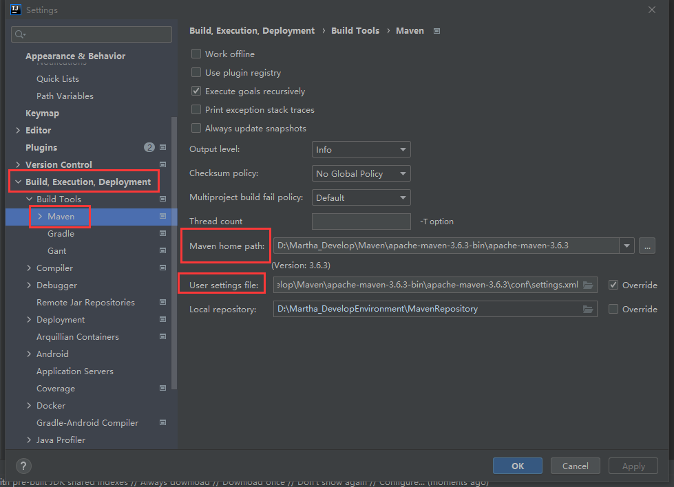

# 自动化构建工具-Maven介绍

## 浅谈目前掌握的技术与问题（Why）


> 目前的技术在开发中存在的问题

+ `一个项目就是一个工程`
  + 如果一个项目非常庞大就不适合使用 package 来划分模块了，最好是每个模块对应一个工程，利于分工协作，但如果没有Maven，一个大的项目各个模块之间是相互依赖的，是不能拆分的
  + **但是如果借助于Maven**，**就可以实现将一个项目拆分成多个工程**
+ 项目中所需要的 jar 包必须手动“复制”、“粘贴”到lib（或WEB-INF/lib）目录下
  + 造成同样的 jar 文件重复出现在不同的项目工程中，一方面`浪费存储空间`，另外也使得`工程比较臃肿、不轻巧`
  + **但是如果借助于Maven**，就可以**将 jar 包保存在“仓库”中**，有需要使用的工程**直接引用这个文件接口**，并不需要真的将这个 jar 复制过来（可联想数据库连接池原理）
+ jar 包需要别人替我们准备好，或者到官网去下载
  + 但不同技术的官网提供 jar 包下载的形式是五花八门的，且如果是以非正规的方式下载的 jar 包，其中的内容也可能是不规范的
  + 有些技术的官网就是通过Maven或SVN等专门的工具来提供下载的，不提供jar包，只提供Maven依赖接口信息，这时候你不会Maven就没辙了
  + **但是如果借助于Maven**，就可以以一种**规范**的方式**下载 jar 包**，因为所有知名框架或第三方工具的 **jar 包已经按照统一的规范存放在了Maven的中央仓库中**，以规范的方式下载的 jar 包，内容也是可靠的
+ 一个 jar 包依赖的其它jar包需要手动加入到项目中
  + 如commons-fileupload-1.3.jar，它要想正常工作就必须依赖于commons-io-2.0.1.jar，如果所有 jar 包之间的依赖关系都需要自己非常清楚地了解，那么就会极大地增加学习成本，有人直接告诉你还好，自己找的呢？万一有依赖其他的，依赖的那个没导入，随后错误一大堆，特别浪费时间
  + **但是如果借助于Maven**，**Maven会自动地将被依赖的 jar 包导入**

> 所以，Maven是相当重要的

## Maven是什么（What）

+ Maven是一款**服务于Java平台**的**自动化构建**工具，Maven本身也是Java写的；自动化构建工具的发展历程（Make→Ant→Maven→Gradle），Gradle挺好的

+ 构建：这里的构建不是创建，而是以“Java源文件、框架配置文件、JSP、HTML、图片等资源”为“原材料”，去生成一个可以运行的项目的过程，俗称**build**，可联想到以下两个概念

  + 编译：如Java源文件→编译→Class字节码文件→交给JVM去执行

  + 部署：一个BS项目最终运行的并不是动态WEB工程本身，而是该工程经过编译后的结果在运行

    ```java
    // 比如Servlet中的请求转发中的路径，其实路径关系就是编译结果中的路径关系，而不是Web工程中的路径关系，因为没有WebContent
    request.getRequestDispatcher("/good/target.jsp").forward(req,resp);
    ```

    > **开发过程中，所有路径或配置文件中配置的类路径等都是以编译结果的目录结构为标准的**

    

## Maven-自动化构建和构建环节

1. 清理：将之前编译得到的class字节码文件删除，为下一次编译做准备
2. 编译：将Java源程序编译成class字节码文件
3. 测试：自动测试，自动调用JUnit程序
4. 报告：即测试程序执行的结果
5. 打包：动态web工程打`war`包，Java工程打`jar`包
6. 安装：是Maven的一种特定的概念，即--将打包得到的文件复制到“仓库”中指定的位置
7. 部署：将动态web工程生成的`war`包复制到`Servlet`容器的指定目录下，使其可以运行

> 以上的环节大部分都是自动化进行的，Maven的自动化构建可以自动地从构建过程的起点一直执行到终点

# 安装Maven核心程序

> 在安装之前，需要走完以下步骤：

1. 检查当前系统中有没有配置`JAVA_HOME`环境变量

   ```shell
   C:\Users\Administrator>echo %JAVA_HOME%
   E:\Develop\Java\jdk1.8.0_291  # 保证这个目录下确实是一个JDK
   ```

   > Maven本身就是Java写的，它本身也要运行在虚拟机上，所以它得知道`JAVA_HOME`所映射的JDK路径在哪儿

2. 解压Maven核心程序压缩包`apache-maven-3.6.3-bin.zip`，放置于一个非中文且无包含空格的目录下

3. 配置`Maven`的环境变量

   1. 配置`MAVEN_HOME`或`M2_HOME`，（配置为M2_HOME可以避免一些莫名其妙的错误，向下兼容一些）值为bin目录的上一级目录：`E:\Develop\apache-maven-3.6.3-bin\apache-maven-3.6.3`
   2. 配置`path`，值为`%M2_HOME%\bin`
   3. 验证：cmd 运行`mvn -v`命令查看当前Maven的版本

# Maven的第一个工程与目录结构说明

1. 创建第一个Maven工程，那么就要创建约定的目录结构

   + 根目录：即工程名，根目录使用当前工程名来命名
   + src目录：用于存放源码
   + main目录：用于存放主程序
   + test目录：用于存放测试程序
   + java目录：用于存放Java源文件
   + resources目录：用于存放框架或其它工具的配置文件，如xml、properties文件
   + pom.xml文件：是Maven工程的核心配置文件

   > 那么，为什么要遵守约定的目录结构呢？

   + Maven要负责我们这个项目的自动化构建，以其中的编译为例，Maven要想自动进行编译，那么它必须知道Java源文件保存在哪里，所以目录的结构必须约定俗成，否则Maven照着这个标准来是找不到Java源文件的，也就完成不了自动化构建操作了

   + 如果我们自己自定义的东西想要让框架或者工具知道，有两种办法：

     1. **以配置的方式明确告诉框架**

        ```xml
        <context>
        	<param-name>contextConfigration</param-name>
            <!-- 以配置的方式明确告诉框架，如告诉框架配置文件在哪里声明的 --> 
            <param-value>classpath:bean.xml</param-value>
        </context>
        ```

     2. **遵守框架内部已经存在的约定标准**，如日志框架Log4j就要求你定义的配置文件名必须为`log4j.xml或log4j.properties`，那么我们就遵守就好了

     > 所以就引申出了：**约定  >  配置  >  编码**
     >
     > 我能够以配置形式解决的我尽量就不编码，我能够以约定形式解决的，我就连配置就省略掉了，即以更高的程度简化开发，所以这就是Maven目录结构的用意，即约定

2. 知晓了目录结构的约定之后，我们开始在磁盘上手动创建Maven工程（目录结构需要遵循Maven的约定，如下）

   + HelloMaven（根目录）
     + src
       + main
         + java
         + resources
       + test
         + java
         + resources
     + pom.xml（pom.xml内容如下：）

   ```xml
   <?xml version="1.0" ?>
   <project xsi:schemaLocation="http://maven.apache.org/POM/4.0.0 http://maven.apache.org/xsd/maven-4.0.0.xsd" xmlns:xsi="http://www.w3.org/2001/XMLSchema-instance" xmlns="http://maven.apache.org/POM/4.0.0">
   	<modelVersion>4.0.0</modelVersion>
       
       <groupId>com.martha.maven</groupId>
       <artifactId>HelloMaven</artifactId>
       <version>0.0.1-SNAPSHOT</version>
   
       <name>HelloMaven</name>
   
       <dependencies>
           <dependency>
               <groupId>junit</groupId>
               <artifactId>junit</artifactId>
               <version>4.0</version>
               <scope>test</scope>
           </dependency>
       </dependencies>
   </project>
   ```

3. 目录结构搭建完毕后，在HelloMaven/src/`main`/java/com/martha/maven目录下新建HelloMaven.java，内容如下：注意还需要再创建com/martha/maven三级目录，然后再建以下Java文件

   ```java
   package com.martha.maven;
   public class HelloMaven{
       public String sayHello(String name){
           return "Hello " + name + "!";
       }
   }
   ```

4. 编写测试代码，在HelloMaven/src/`test`/java/com/martha/maven目录下新建测试文件HelloMavenTest.java，内容如下，注意还需要再创建com/martha/maven三级目录，然后再建以下Java文件

   ```java
   package com.martha.maven;
   import org.junit.Test;
   import static junit.framework.Assert.*;
   public class HelloMavenTest{
      @Test
       public String testHello(){
           HelloMaven maven = new HelloMaven();
           String results = maven.sayHello("Martha");
           assertEquals("Hello Martha!",results);
       }
   }
   ```

# 常用的Maven命令

> 注意：执行与**构建过程**【如编译、测试、打包...】等**相关的Maven命令**，**必须进入pom.xml所在的目录**


+ `mvn clean`【删除target目录】
+ `mvn compile`【编译主程序，即main】
+ `mvn test-compile`【编译测试程序】
+ `mvn test`【执行测试】
+ `mvn package`【打包，<b><span style="color:#ff0000">将主程序打为jar包</span></b>】
+ `mvn install`【安装，将Maven工程部署进仓库中】
+ `mvn site`【生成站点，即Maven工程的文档，跟JavaDoc差不多】
+ `mvn deploy`【将Web工程打包并部署进Tomcat服务器的webapps目录下】

> 我们进入到pom.xml配置文件所在的目录，进行mvn compile编译主程序命令操作
>
> 当我们执行了编译主程序构建的命令，Maven核心程序可能会联网从中央仓库下载插件到本地，如下图，这就涉及到了下面的一章**Maven的联网问题**，但不影响我们执行命令，继续往下走↓


## mvn compile

> 我们在pom.xml文件所在目录，执行mvn compile，即编译主程序命令


> 编译后会生成target目录，我们进入到target目录会发现编译主程序后，`classes`文件夹内就是`包路径 + 编译后的主程序对应的字节码文件`


## mvn test-compile

> 我们在 pom.xml 文件所在目录，执行mvn test-compile命令，编译测试程序


> 在target目录下，我们看到执行完编译测试程序命令后，`test-classes`文件夹内就是`包路径 + 编译后的测试程序对应的字节码文件`


## mvn clean

> 我们在 pom.xml 文件目录下，执行mvn clean清理命令，将会把我们之前编译生成的target目录彻底删除


## mvn install

> 我们在 pom.xml 文件目录下，执行mvn install安装命令，将会把我们的整个Maven工程部署进本地仓库中，执行mvn install命令，会同时编译主程序、测试程序，编译之后进行部署到仓库


# Maven的联网问题

+ Maven的核心程序中仅仅定义了抽象的生命周期，但是具体的工作必须由特定的插件来完成，而插件本身并不包含在Maven的核心程序中

+ 当我们执行的Maven命令需要用到某些插件时，Maven核心程序会**首先到本地仓库中查找**【本地仓库的默认位置为：**系统中当前用户的家目录\.m2\repository**`即C:\Users\Administrator\.m2\repository`】

+ Maven核心程序如果在本地仓库中**找不到**需要的插件，那么它会**自动连接外网到中央仓库去下载**【如果联网失败，则构建失败，构建所需插件完了就不用联网了】

+ 如果实在没网构建，可以修改一个已经构建好了的默认的本地仓库的位置，让Maven核心程序到这个已经事先准备好的目录下查找插件，那么怎么修改指定的仓库的位置呢？

  1. 首先找到Maven解压目录\conf\settings.xml

  2. 打开settings.xml配置文件，找到<localRepository>标签，要注意的是，这个标签目前是处在注释当中的，得**从注释当中取出来**，修改它的路径才能生效

  3. 将<localRepository>标签体内容修改为已经准备好的Maven仓库目录路径，如我在Environment目录下准备了一个MavenRepository，那么我要将这个Maven仓库指定给Maven核心程序

  > 需要注意的是，这**最后一层路径必须是所有插件的上一级路径**

  

  > 配置完后，当Maven核心程序去本地已经准备好了的Maven仓库找寻所需插件，能找到的话，就不会进行联网下载了

# POM的理解

> POM`Project Object Model 项目对象模型`，POM在Maven中主要体现为 **pom.xml**

+ pom.xml 是Maven工程的**核心配置文件**，与**构建过程相关的一切设置都在这个文件中设置**，重要程度相当于 web.xml 对于动态web工程
+ 对于Maven的学习主要是怎么样去配置该 pom.xml 文件，后续所说的一切都是在解释这个 pom.xml，pom本身的概念就不多讲了

# Maven坐标

> 我们常说数学中的坐标，如在一个空间中，使用X  Y  Z三个向量可以唯一地定位空间中的任何一个点
>
> 同样的，**Maven的坐标**也是使用三个“向量”（标签构成的“向量”）来唯一地定位一个Maven工程

1. **g**roupid：group顾名思义就是公司组织的意思，那么它的**值就是**`公司或组织的域名倒序 + 项目名（Project）`，如下例：

   ```xml
   <!--com.martha是一个公司的域名，maven就是项目名-->
   <groupid>com.martha.maven</groupid>
   ```

2. **a**rtifactid：artifact有特征的意思，在这里使用它来指定**模块（Module）的名称**，如下例：

   ```xml
   <artifactid>SpringDemo1</artifactid>
   <!--与上面结合就是maven项目下的一个SpringDemo1模块，可借助IDEA的Module来理解-->
   ```

3. **v**ersion：用于指定当前的版本号，一个模块也会经历很多个版本，如下例：

   ```xml
   <version>1.0.0</version>
   ```

> GAV：以上三个词的首字母组合，其实就是Maven坐标的简称，这三者之间是由大到小的方式来定位一个Maven工程

## Maven工程的坐标与仓库中路径的对应关系

> Maven坐标还有一个特点，Maven工程在仓库中的路径与Maven坐标是一致的且唯一的，如以下

```xml
<groupid>org.springframework</groupid>
<artifactid>srping-core</artifactid>
<version>4.0.0.RELEASE</version>
<!--这三者结合起来对应的仓库路径及工程就是
groupid(.变\) + artifactid + 4.0.0.RELEASE(.不变) + artifactid - version.jar
	org\springframework\srping-core\4.0.0.RELEASE\artifactid - version.jar
即  org\springframework\srping-core\4.0.0.RELEASE\srping-core-4.0.0.RELEASE.jar
-->
```

> Tips：针对Eclipse，在pom.xml文件中，可以点击Dependency Hierarchy，右键jar包--Open Pom获取对应坐标

# Maven仓库

## 仓库的分类

+ 本地仓库：即当前电脑上部署的仓库目录，为电脑上所有的Maven工程服务
+ 远程仓库
  + 局域网（私服）：搭建在局域网环境中，只能为局域网范围内所有Maven工程服务
  + 中央仓库：架设在Internet上，为全世界所有Maven工程服务【负载重】
  + 中央仓库镜像：分担中央仓库流量，提升用户访问速度【可就近访问】

## 仓库中保存的内容

> 仓库中保存的都是什么？全都是**Maven工程**，Maven工程又分以下几类：

+ 一类是Maven工程自身所需要的插件
+ 其次就是第三方框架或工具的jar包【第一方jdk，第二方是我们】
+ 然后就是我们自己开发的Maven工程

# 第二个Maven工程的目录结构和文件内容

> 第二个工程目的是为了在一个Maven工程中引用其它Maven工程的结构

1. 创建同样的目录结构，如下

   + MavenDemo2

     + src

       + main
         + java
         + resources
       + test
         + java
         + resources

     + pom.xml（内容如下，依赖中引用了第一个Maven工程）

       ```xml
       <?xml version="1.0" ?>
       <project xsi:schemaLocation="http://maven.apache.org/POM/4.0.0 http://maven.apache.org/xsd/maven-4.0.0.xsd" xmlns:xsi="http://www.w3.org/2001/XMLSchema-instance" xmlns="http://maven.apache.org/POM/4.0.0">
       	<modelVersion>4.0.0</modelVersion>
           
           <groupId>com.martha.maven</groupId>
           <artifactId>MavenDemo2</artifactId>
           <version>0.0.1-SNAPSHOT</version>
       
           <name>MavenDemo2</name>
       
           <dependencies>
               <dependency>
                   <groupId>junit</groupId>
                   <artifactId>junit</artifactId>
                   <version>4.0</version>
                   <scope>test</scope>
               </dependency>
       		<!--添加了第一个工程的依赖，即坐标-->
               <dependency>
                   <groupId>com.martha.maven</groupId>
                   <artifactId>HelloMaven</artifactId>
                   <version>0.0.1-SNAPSHOT</version>
                   <scope>compile</scope>
               </dependency>
           </dependencies>
       </project>
       ```

2. 目录结构搭建完毕后，在MavenDemo2/src/`main`/java/com/martha/maven目录下新建HelloFriend.java，内容如下：注意还需要再创建com/martha/maven三级目录，然后再建以下Java文件

   ```java
   package com.martha.maven;
   import com.martha.maven.HelloMaven;
   public class HelloFriend{
       public String sayHelloToFriend(String name){
           HelloMaven helloMaven = new HelloMaven(); // 创建第一个工程中的对象
           String str = helloMaven.sayHello(name) + "I AM " + this.getMyName();
           System.out.println(str);
           return str;
       }
       public String getMyName(){
           return "MarthaX";
       }
   }
   ```

3. 编写测试代码，在MavenDemo2/src/`test`/java/com/martha/maven目录下新建测试文件HelloFriendTest.java，内容如下：注意还需要再创建com/martha/maven三级目录，然后再建以下Java文件

   ```java
   package com.martha.maven;
   import org.junit.Test;
   import static junit.framework.Assert.*;
   import com.martha.maven.HelloMaven;
   public class HelloFriendTest{
      @Test
       public String testHello(){
           HelloFriend helloFriend = new HelloFriend();
           String results = helloFriend.sayHelloToFriend("Martha");
           assertEquals("Hello Martha!I AM MarthaX",results);
       }
   }
   ```

4. 开始执行相关命令，**切记一定要进入到pom.xml文件所在目录下执行相关构建命令**

   > 执行mvn compile 后，报错了，信息如下：原因就是找不到所依赖的Maven工程的位置了

   

> Maven解析依赖信息时，会到本地仓库中查找所依赖的jar包，因为我们之前所创建的第一个Maven工程并没有进行build部署，所以它在本地仓库中找不到，所以就报错了
>
> 要解决这个问题就必须将第一个Maven工程部署进本地仓库中即可，所以就要使用到install命令安装后，就可以将该工程部署进仓库中**详见→常用的Maven命令章节之mvn install**，将第一个Maven工程install之后，就可以正常进行构建了

# Maven依赖

## 依赖的范围

> 以下就是对一个Maven工程的依赖，scope标签表示的就是依赖的范围，如果一个依赖没有显式指明scope标签，那么默认就是compile范围的依赖

```xml
<dependency>
    <groupId>com.martha.maven</groupId>
    <artifactId>HelloMaven</artifactId>
    <version>0.0.1-SNAPSHOT</version>
    <scope>compile</scope>
</dependency>
```

**依赖的范围有三种常见的取值：**

+ compile
  + 对主程序是否有效【有效】
  + 对测试程序是否有效【有效】
  + 是否参与打包【参与】
  + 是否参与部署【参与】
  + 典型例子：spring-core
+ test
  + 对主程序是否有效【无效】
  + 对测试程序是否有效【有效】
  + 是否参与打包【不参与】
  + 是否参与部署【不参与】
  + 典型的例子就是：junit
+ provided
  + 对主程序是否有效【有效】
  + 对测试程序是否有效【有效】
  + 是否参与打包【不参与】
  + 是否参与部署【不参与】
  + 典型的例子就是：servelt-api.jar

> 认识依赖的范围要从以下几个方面来认识

+ 对主程序是否有效
+ 对测试程序是否有效
+ 以及是否参与打包

> 将依赖的范围代入，如下图


+ compile：代表我们Maven工程的主程序，如果一个依赖是compile范围的依赖，那么它对主程序和测试程序都是可见的，即可用的，也就是**主程序和测试程序都可以使用到这个依赖**；而且主程序是**参与打包**的

  > 可以参看第二个工程对第一个工程的依赖的引用，scope的值为compile，说明主程序和测试程序都可以导入第一个工程里的结构，如第一个工程中的HelloMaven类

+ test：代表我们Maven工程的测试程序，如果一个依赖是test范围的依赖，那么它只对测试程序可见，也就是**测试程序可以使用到这个依赖**，**主程序不可以使用到这个依赖**；而且测试程序是**不参与打包**的（典型例子就是junit）

  > 可以参看第二个工程对junit依赖的引用，scope的值为test，说明只针对于测试程序有效，本身就是拿来做测试用的，主程序就是主程序，不可以不规范地将测试代码放到主程序中，所以test范围只对测试程序可见

+ provided

  + 对主程序是否有效：有效
  + 对测试程序是否有效：有效
  + 是否参与打包：不参与
  + 是否参与部署：更别提了，打包都没打进去，部署就更没他了，所以是不参与（典型的例子就是servlet-api.jar）

  

  > provided范围的解释就是，我在开发的时候还没运行在Tomcat服务器，所以我需要先使用到外部提供的servlet.jar包暂时支持一下我的程序，到部署的时候，因为Tomcat服务器本身就能够提供ServletAPI了，就不需要继续使用外部的servlet.jar包了，所以可以理解为provided范围就是开发时候使用的暂时的一个依赖引入，到服务器上就不需要这个依赖了，因为服务器能够提供这样的依赖了，所以就没必要部署到服务器上，反观compile范围，如下图

  

> compile范围依赖，可以依赖一些特定的API，比如我们自己写的Maven工程，Tomcat服务器无法提供给我们，它本身并不包含这个API，所以compile范围的依赖从开发到运行都存在，所以部署的时候，必须将compile范围的依赖也一并部署到服务器上去

## 依赖的传递性

### 依赖传递性的体现


> 使用spring测试依赖的传递性，此处的commons-logging.jar包是spring所依赖的包，所以会自动导入

### 依赖传递性的好处

+ 依赖的可传递性意味着，不必在每一个工程模块的pom.xml文件中都去重复声明以依赖信息，只需在“`父类模块`”中导入一次即可，之后的开发中，也是**专门有一个模块专门管理依赖信息的**

> 注意：**非compile范围的依赖不具有传递性，即test、provided范围的依赖不能够传递**，test、provided范围的依赖可以认为是只给当前模块使用的，所以哪个模块中需要就需要重复声明依赖

### 依赖传递性的结构


## 依赖的排除

> 依赖的排除与依赖的传递性是相反的操作，但是实际开发中遇到需要进行排除的依赖很少，但也要了解以下，万一遇到了这种极端的需要排除依赖的情况呢

### 依赖排除的场景


### 依赖排除的方式

> 假设现在spring依赖的commons-loggings.jar包有问题，那么我们需要进行排除，具体步骤如下：

1. 在指定模块的pom.xml文件中，对**直接依赖**的依赖体设置排除，比如我们的commons包是因为spring导入的，spring又是因为第一个工程的pom.xml文件引入的，那么我们在第二个工程中，对引入第一个工程的依赖体进行如下操作，即可将指定的依赖进行排除

   ```xml
   <!--配置在第一个工程的依赖体中，因为commons-logging的源头就是从第一个工程来的-->
   <dependency>
       <groupId>com.martha.maven</groupId>
       <artifactId>HelloMaven</artifactId>
       <version>0.0.1-SNAPSHOT</version>
       <scope>compile</scope>
       <!--进行排除-->
       <exclusions>
           <exclusion>
               <!--只需要指定GA即可，该依赖对应的所有的版本都会被排除掉-->
               <groupId>commons-logging</groupId>
               <artifactId>commons-logging</artifactId>
           </exclusion>
       </exclusions>
   </dependency>
   ```

   > 在这里我们要知道groupId和artifactId的获取有一种比较方便的方式，步骤如下：

   

> 还有一点，我们也要非常清楚，由于依赖具有传递性，A的依赖传递给B，若A的依赖被排除，相应地，B的该依赖也不复存在，即**依赖的排除也具有传递性**

## 依赖的原则说明

> 依赖的原则的**目的就是解决工程模块之间 jar包 冲突的问题**，但是有了Maven依赖的原则，jar包冲突的可能性微乎其微

### 不同路径最短者优先


### 相同路径先声明者优先


# Maven的生命周期以及插件和目标

## Maven的生命周期

> Maven的生命周期其实就是Maven各个环节构建的顺序，Maven的构建环节是环环相扣的，顺序是不能够打乱的，必须按照既定的正确的顺序来执行
>
> Maven的核心程序中定义了抽象的生命周期，生命周期中各个阶段的具体任务是由插件来完成的
>
> Maven程序为了更好地实现自动化构建，按照这一个特点执行生命周期中的各个阶段，**无论现在要执行生命周期中的哪一个阶段**，都是从这个生命周期**最开始最初的位置开始执行**，即如果当前我仅仅执行了打包的命令mvn package，它依然也会从编译主程序开始完后一环一环执行，直到打包执行完，打包后面的命令不会涉及到，因为打包已经就是上限了【就像之前做mvn installd命令一样，会先编译主程序、测试程序、测试、打包、然后再是部署】，所以它这个设计就是为了更好地实现自动化，如下图演示

1. 清理（Clean）：将之前编译得到的class字节码文件删除，为下一次编译做准备
2. 编译（Compile）：将Java源程序编译成class字节码文件
3. 测试（Test）：自动测试，自动调用junit程序
4. 报告（TESTS RESULT）：测试程序执行的结果
5. 打包（Package）：动态web工程打war包，Java工程打jar包
6. 安装（Install）：Maven特定的概念--将打包得到的文件复制到“仓库”指定的位置
7. 部署（Deploy）：将动态web工程生成的war包复制到Servlet容器的指定目录下，使其可以运行

### mvn compile的生命周期

> 执行该命令，生命周期从头开始执行，则从处理资源文件开始，如下图编译主程序的命令执行后，经历了两个步骤
>
> + `maven-resources-plugin:2.6:resources`：复制并处理资源文件，至目标目录，准备后续操作
> + `maven-compiler-plugin:3.1:compile`编译主程序的源代码文件


### mvn test的生命周期

> 执行该命令，依据Maven默认的生命周期执行顺序，即从头开始，经历一下几个步骤，直至执行完该命令
>
> + `maven-resources-plugin:2.6:resources`处理资源文件
> + `maven-compiler-plugin:3.1:compile`编译主程序
> + `maven-resources-plugin:2.6:testResources`处理测试资源文件
> + `maven-compiler-plugin:3.1:testCompile`编译测试程序
> + `maven-surefire-plugin:2.12.4:test`进行对测试程序的测试操作
> + 打印测试报告


### 总结生命周期的规律

> 无论执行哪一条命令，都会从最初**处理资源文件**开始执行操作，直到执行完该命令本身，以下为Maven生命周期对各主要的命令的执行顺序

+ mvn compile：编译主程序Java源文件
+ mvn test-compile：编译测试程序Java源文件
+ mvn package：打包
+ mvn install：安装并部署

## 插件和目标（了解）

> 生命周期的各个阶段仅仅只是定义了要执行的任务是什么，所以各个阶段和插件的目标是一一对应的，相似的目标由特定的插件来完成，以下为两个例子，拆分说明他们的意思

+ maven-compiler-plugin:3.1:compile

+ maven-compiler-plugin:3.1:testCompile

| 生命周期阶段（命令/调用者） | 插件目标（方法名） | 插件（方法体）        |
| --------------------------- | ------------------ | --------------------- |
| mvn  compile                | comiple            | maven-compiler-plugin |
| mvn  test-compile           | testCompile        | maven-compiler-plugin |

> 插件目标就是，比如maven-compiler-plugin:3.1:`compile`，的最后一个单组词，即compile，插件就是maven-`compiler`-plugin，可理解为就是jar包，或方法，因为编译主程序和测试程序都是编译，只是插件目标不同，毕竟方法名要区分开来，使调用者清晰易懂，执行的操作都一样，所以使用的是共同的插件，即“compiler编译器”

# Maven插件的设置

## 针对Eclipse的Maven设置

> Eclipse高版本现在都自带Maven插件了，不需要我们从外部集成

**要注意的是：**

+ Eclipse对Maven的设置仅限当前工作区（`workspace`）有效，更换了工作区，就必须重新进行对Maven的设置

**如何设置Maven：**Eclipse中Maven需要设置的地方以下两个

1. `Installations`：用于指定Maven核心程序的位置，默认也会指定一个，但是默认指定的那个是`Embedded`，就是嵌入的，Eclipse内置的Maven插件就自带一个核心程序，但我们通常认为这个内嵌的Maven核心程序不太稳定，不太好，不建议使用，所以我们**要用我们自己解压的那一个Maven核心程序**，步骤如下：

   

2. `User Settings`：用于指定Maven本地仓库的位置，首先它要知道settings.xml的位置，即`conf/settings.xml`，通过获取该配置文件中配置的仓库路径，进而得知Maven本地仓库的位置，步骤如下：

# Eclipse创建Maven工程

## 创建Maven版的Java工程

1. new一个MavenProject


2. 勾选Simple，下一步
3. 定义GAV，完成创建

4. 发现了一个问题，初次创建的Maven工程，所默认的JDK为1.5版本的，如果我们每次创建都去手动修改的话就会很麻烦

   > 以上问题的解决：设置MavenProject创建时默认JDK版本

   **打开conf/settings.xml文件，找到profiles标签，将以下内容拷贝进标签中即可**

   ```xml
   <profile>
       <!--自定义JDK版本，首先Maven的版本要能支持该JDK版本-->
       <id>jdk-1.8</id>
       <activation>
           <activeByDefault>true</activeByDefault>
           <!--版本号同上-->
           <jdk>1.8</jdk>
       </activation>
       <properties>
           <!--版本号同上-->
           <maven.compiler.source>1.8</maven.compiler.source>
           <maven.compiler.target>1.8</maven.compiler.target>
           <maven.compiler.compilerVersion>1.8</maven.compiler.compilerVersion>
       </properties>
   </profile>
   ```


> 保存之后，再新建一个Maven工程可以发现，默认的JDK版本为1.8

## 创建Maven版的Web工程

1. 前两步与创建Java工程一样，new MavenProject→勾选simple
2. 区别就在于GAV的设置，如下图，走完三个步骤Finish即可

3. 新建完Maven版的Web项目，其实还是有一点不完善，如下图

4. 问题解决如下

> 以上操作走完了之后，点击Apply and close即可


> 当我新建一个JSP文件后，又有错误了


> 出现这个错误我们，可以在pom.xml文件中添加servlet依赖，且我们将该依赖的范围设置为provided，因为，当我们将工程在Tomcat服务器上运行的时候，Tomcat服务器自带servletAPI，这个servlet依赖就不需要打包并部署到Tomcat服务器上了，**这里的部署其实就是会将该依赖的jar包，自动保存到你的工程下的lib目录下**，所以这就是provided范围的意思，引入依赖如下

```xml
<dependencies>
    <dependency>
        <groupId>javax.servlet</groupId>
        <artifactId>servlet-api</artifactId>
        <version>2.5</version>
        <scope>provided</scope>
    </dependency>
</dependencies>
```

> 关于provided范围依赖，还有一个问题需要讲一下，就是当你使用JSP页面中的EL表达式时，EL表达式所依赖的是jsp-api，引入该依赖的话，你写EL表达式就有方法提示，但如果一不小心，你将jsp-api的provided范围设置为了compile，或者你就没设置scope，默认就是compile范围，那么jsp-api的jar包以及它所依赖的其它jar包都会被部署到工程lib目录下，但Tomcat服务器本身就自带这些 jar 包，所以会引发冲突，**造成莫名其妙的空指针异常**，所以在使用范围依赖，**特别是与Tomcat服务器有关的依赖时，要特别注意**

## 执行Maven命令

> 找到pom.xml文件，右键run as，就可以选择需要执行的命令，如下图：


> 但我们又发现，没有compile命令，需要手动指明compile，解决方法如下


# 导入外部Maven工程

1. 选择import
2. 选择现存的Maven工程进行导入，最后Finish即可完成导入

> 其实用Maven方式导入的，不能将工程一并复制到workspace中，因为这是我们手动在磁盘上创建的Maven工程，所以Eclipse无法识别这是一个Eclipse工程，只能通过Maven检测pom.xml文件的方式导入手动创建的Maven工程，**以后用Eclipse生成的Maven工程，可以直接通过Eclipse直接导入，不需要指定Maven方式进行导入，通过Eclipse导入的工程会将被导入工程一并复制进Eclipse工作空间中**，如下图：使用Eclipse导入外部Maven工程


> 开始导入外部Maven工程，并将外部的工程复制进Eclipse的工作空间中


# 		第三个Maven工程的创建以及细节说明


# 统一管理依赖的版本


> 这里对所有的Spring各个jar包的依赖版本都是4.0.0，那么需要统一升级怎么办，毕竟不同版本的jar包相互依赖不能确定会不会有问题，所以这里就引出了统一管理依赖的版本问题：
>
> + 手动逐一修改不可靠
> + 建议的配置方式如下：

1. 使用properties标签**内**使用**自定义标签**统一声明版本号

   ```xml
   <properties>
   	<martha.spring.version>4.0.0.RELEASE</martha.spring.version>
   </properties>
   ```

2. 在需要统一版本的位置，使用**${自定义标签名}**来引用声明的版本号，就可以实现只改一处即可实现统一版本修改

   ```xml
   <dependency>
       <groupId>org.springframework</groupId>
       <artifactId>spring-core</artifactId>
       <!--将version标签内的值替换即可（可联想引用外部属性文件）-->
       <version>${martha.spring.version}</version>
       <scope>compile</scope>
   </dependency>
   ```

> 其实properties标签配置自定义的标签声明数据的配置并不是只能用于声明依赖的版本号，其它可统一的东西都可以声明，如下举个例子：**凡是需要统一声明后再引用的场景都可以使用该标签**

```xml
<properties>
    <!--可统一版本号-->
	<martha.spring.version>4.0.0.RELEASE</martha.spring.version>
    <!--统一字符集编码-->
    <project.build.sourceEncoding>UTF-8</project.build.sourceEncoding>
	<!--统一xxx前缀等等-->
    <martha.prifix>www</martha.prifix>
</properties>
```

# Maven继承

> 问题的引出：
>
> 由于非compile范围的依赖不具有传递性，那么必然就会分散再在各个模块中，很容易造成引入时版本不一致的问题，此时**要统一所有模块中，非传递性依赖的版本，就用到了继承**
>
> 解决思路就是**将JUnit依赖统一提取到“父工程中”**，在**子工程中声明该依赖时不指定版本**，那么这个时候各个子工程中的该依赖的版本就按照父工程中统一设定的为标准，这样就可以统一地管理了，而且下次修改的话，直接修改父工程一个地方即可，各个子工程就统一被修改了，即**便于修改**
>
> 步骤如下：

1. 创建一个Maven工程作为父工程，注意，父工程的**打包方式**既不是jar也不是war，而是 **pom**
2. 在子工程中声明对父工程的依赖引用
3. 将子工程坐标中，与父工程坐标中重复的内容删除，当然不删也可以，就是为了简洁一点，删吧
4. 在父工程中统一管理对JUnit的依赖
5. 在子工程中删除JUnit依赖的版本号

> 继承就是为了**统一管理非compile范围的依赖的版本号**，就是为了起这么个作用
>
> 注意：**配置了继承后，要先执行父工程的install命令**，先将父工程部署进仓库，后续子工程才可以正常部署，安装是层层递进的，**要让被依赖的先安装部署**

# Maven聚合

> 问题的提出：工程模块多了，要部署的话，要一个一个install，很不方便，比如先安装父工程再子工程...，这样很不方便，有没有一键安装所有工程模块呢？这就要用到聚合，即一键安装部署
>
> 聚合的作用就是一键安装各个工程模块，配置方式：**在一个总的聚合工程中，配置各个参与聚合的模块**，可以新建一个工程专门用于聚合工程，但**一般我们也都是将聚合配置在父工程中**，在父工程中配置聚合，即需要关联部署的模块


# Maven查找依赖信息的网站

> https://mvnrepository.com/

# Maven配置阿里云镜像

> 从阿里云镜像下载依赖速度快，在conf/settings.xml文件中配置

```xml
<mirrors>
    <mirror>
    	<id>nexus-aliyun</id>
        <mirrorOf>central</mirrorOf>
        <name>Nexus aliyun</name>
     	 <url>http://maven.aliyun.com/nexus/content/groups/public</url>
    </mirror>
</mirrors>
```

# IDEA配置Maven

