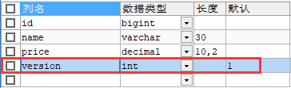

# 插件

## MP分页插件的配置和使用

## 乐观锁

### 场景

一件商品，成本价是80元，售价是100元。老板先是通知小李，说你去把商品价格增加50元。小李正在玩游戏，耽搁了一个小时。正好一个小时后，老板觉得商品价格增加到150元，价格太高，可能会影响销量。又通知小王，你把商品价格降低30元

此时，小李和小王同时操作商品后台系统。小李操作的时候，系统先取出商品价格100元;小王也在操作取出的商品价格也是100元。小李将价格加了50元，并将100+50=150元存入了数据库;小王将商品减了30元，并将100-30=70元存入了数据库。是的，如果没有锁，小李的操作就完全被小王的覆盖了

现在商品价格是70元，比成本价低10元。几分钟后，这个商品很快出售了1千多件商品，老板亏1万多

### 乐观锁与悲观锁

上面的故事

+ 如果是乐观锁，小王保存价格前，会检查下价格是否被人修改过。如果被修改过了，则重新取出的被修改后的价格——150元，这样他会将120元存入数据库

+ 如果是悲观锁，小李取出数据后，小王只能够等小李操作完之后，才能够对价格进行后续操作，也会保证最终的价格是120元，就是小王的操作会被阻塞

  所以乐观锁就是在修改数据时对版本号也进行修改，有了版本号后，小王和小李读取到原有商品价格为100，并且版本号此时也都是1，此时小李操作100+50的同时也会将版本号由1改为2，此时小王来操作时就会带上where版本号=1作为查询条件，此时版本号不对就不会去进行修改，这就是乐观锁，一句话就是乐观锁使得在执行操作前需要增加一个对于版本号的判断条件，每一次在修改数据时，除了要匹配所要操作的数据之外，还要以最初所获得的版本号为条件，只要在操作之前版本号是一致的才可以进行操作，若不一致则意味着已经有其他人对这个数据操作过了，那么此时本次操作则不会执行

### 模拟修改冲突

1. 创建一个商品表（goods），并额外添加一个version字段



表数据如下：


2. 添加实体类

   ```java
   @Data
   @AllArgsConstructor
   @NoArgsConstructor
   public class Goods {
       private Long id;
       private String name;
       private BigDecimal price;
       private Integer version;
   }
   ```

3. 添加mapper

   ```java
   @Repository
   public interface GoodsMapper extends BaseMapper<Goods> {}
   ```

4. 模拟冲突测试

   ```java
   @Test
   public void testVersion() {
       // 小李首先查询出所要操作的记录
       Goods goodsByLi = goodsMapper.selectById(1);
       // 小王同时也查询到该记录
       Goods goodsByWang = goodsMapper.selectById(1);
   
       // 条件构造器
       LambdaUpdateWrapper<Goods> goodsUpdateWrapper = new LambdaUpdateWrapper<>();
   
       // 小李将100元的笔记本 + 50元
       goodsUpdateWrapper.set(Goods::getPrice, goodsByLi.getPrice().add(new BigDecimal("50")));
       // 小李执行更新操作
       goodsMapper.update(goodsByLi, goodsUpdateWrapper);
   
       // 将条件重置
       goodsUpdateWrapper = new LambdaUpdateWrapper<>();
   
       // 小王将100元的笔记本 - 30元
       goodsUpdateWrapper.set(Goods::getPrice, goodsByWang.getPrice().subtract(new BigDecimal("30")));
       // 小王执行更新操作
       goodsMapper.update(goodsByWang, goodsUpdateWrapper);
   
       // 两个人修改后的结果如下
       Goods goodsAfterUpdate = goodsMapper.selectById(1);
       log.info("修改后商品的价格为：{}元", goodsAfterUpdate.getPrice());
       /*
       修改后商品的价格为：70.00元
       */
   }
   ```

> 可以看到结果就是最终老板亏钱，小王的操作将小李的操作直接覆盖掉了，所以这种风险开发中一定要杜绝

### 乐观锁实现流程

1. 数据库表额外添加一个version字段

2. 取出记录时，获取当前记录中的version字段值

   ```mysql
   SELECT id,`name`,price,`version`
   FROM goods
   WHERE id = 1;
   ```

3. 在执行更新操作时，version + 1，若where语句中的version值不匹配则更新失败

   ```mysql
   UPDATE goods
   SET price = price + 50, `version` = `version` + 1
   WHERE id = 1 AND `version` = 1
   ```

### MP实现乐观锁

1. 表还是goods表，见上述

2. 创建商品表对应的实体类对象，在实体类中将version字段对应的属性标识为乐观锁字段

   ```java
   @Data
   @AllArgsConstructor
   @NoArgsConstructor
   public class Goods {
       private Long id;
       private String name;
       private BigDecimal price;
       // 标识当前属性为乐观锁版本号字段
       @Version
       private Integer version;
   }
   ```

3. mapper不变

   ```java
   @Repository
   public interface GoodsMapper extends BaseMapper<Goods> {}
   ```

4. 在配置类中配置乐观锁插件（拦截器）

   ```java
   @Configuration
   public class ConfigCenter {
       @Bean
       public MybatisPlusInterceptor mybatisPlusInterceptor() {
           // 创建MP拦截器对象
           MybatisPlusInterceptor interceptor = new MybatisPlusInterceptor();
           // 添加乐观锁拦截器
           interceptor.addInnerInterceptor(new OptimisticLockerInnerInterceptor());
           return interceptor;
       }
   }
   ```

4. 进行测试：

   ```java
   @Test
   public void testPage() {
       // 小李首先查询出所要操作的记录
       Goods goodsByLi = goodsMapper.selectById(1);
       // 小王同时也查询到该记录
       Goods goodsByWang = goodsMapper.selectById(1);
   
       LambdaUpdateWrapper<Goods> goodsUpdateWrapper = new LambdaUpdateWrapper<>();
   
       // 小李将100元的笔记本 + 50元
       goodsUpdateWrapper.set(Goods::getPrice, goodsByLi.getPrice().add(new BigDecimal("50")));
       // 小李执行更新操作
       goodsMapper.update(goodsByLi, goodsUpdateWrapper);
   
       // 将条件重置
       goodsUpdateWrapper = new LambdaUpdateWrapper<>();
   
       // 小王将100元的笔记本 - 30元
       goodsUpdateWrapper.set(Goods::getPrice, goodsByWang.getPrice().subtract(new BigDecimal("30")));
       // 小王执行更新操作
       goodsMapper.update(goodsByWang, goodsUpdateWrapper);
   
       // 两个人修改后的结果如下
       Goods goodsAfterUpdate = goodsMapper.selectById(1);
       log.info("修改后商品的价格为：{}元", goodsAfterUpdate.getPrice());
       /*
       修改后商品的价格为：150.00元
       */
   }
   ```

> 可见，此时小王的操作并没有执行，因为小李在+50元的时候，就将version+1了，此时version=2，而小王在执行操作时，where version = 1明显不满足条件，所以小王并没有成功执行

### 优化修改流程

> 在添加了乐观锁插件之后，当前的修改操作就没有发生冲突，但是还有一个问题就是小李的操作执行了，小王并没有执行操作，接下来就可以将代码进行一个优化，优化从21行开始

```java
@Test
    public void testPage() {
        // 小李首先查询出所要操作的记录
        Goods goodsByLi = goodsMapper.selectById(1);
        // 小王同时也查询到该记录
        Goods goodsByWang = goodsMapper.selectById(1);

        LambdaUpdateWrapper<Goods> goodsUpdateWrapper = new LambdaUpdateWrapper<>();

        // 小李将100元的笔记本 + 50元
        goodsUpdateWrapper.set(Goods::getPrice, goodsByLi.getPrice().add(new BigDecimal("50")));
        // 小李执行更新操作
        goodsMapper.update(goodsByLi, goodsUpdateWrapper);

        // 将条件重置
        goodsUpdateWrapper = new LambdaUpdateWrapper<>();

        // 小王将100元的笔记本 - 30元
        goodsUpdateWrapper.set(Goods::getPrice, goodsByWang.getPrice().subtract(new BigDecimal("30")));
        // 小王执行更新操作，得到返回值
        int resultByWang = goodsMapper.update(goodsByWang, goodsUpdateWrapper);
        // 判断小王有没有执行操作，若受影响行数为0，则代表小王没有操作成功
        if (resultByWang == 0) {
            log.info("{}", "小王操作失败，重试");
            // 重新查询此商品（重新获取到version版本号）
            Goods goodsNew = goodsMapper.selectById(1);

            goodsUpdateWrapper = new LambdaUpdateWrapper<>();

            // 在这个新记录的基础上重新将price - 30即可
            goodsUpdateWrapper.set(Goods::getPrice, goodsNew.getPrice().subtract(new BigDecimal("30")));
            // 小王再次执行修改操作
            goodsMapper.update(goodsNew, goodsUpdateWrapper);
        }

        // 两个人修改后的结果如下
        Goods goodsAfterUpdate = goodsMapper.selectById(1);
        log.info("修改后商品的价格为：{}元", goodsAfterUpdate.getPrice());
        /*
        	修改后商品的价格为：120.00元
        */
    }
```

> 这时候两个人就都有进行操作，并且老板也不亏

# 通用枚举

> 表中的有些字段值是固定的，例如性别（男或女），此时可以通过MP的通用枚举功能来实现

1. 在数据库user表中添加字段gender，1表示男、2表示女

   

2. 创建enums包，在该包下创建用于表示性别的枚举类，并且使用@EnumValue注解标识属性，被标识的属性的值将会被存储到数据库中

```java
@Getter
public enum GenderEnum {
    MALE(1, "男"),
    FEMALE(2, "女");
	
    // 将注解所标识的属性的值存储到数据库中
    @EnumValue
    private Integer gender;
    private String genderName;

    GenderEnum(Integer gender, String genderName) {
        this.gender = gender;
        this.genderName = genderName;
    }
}
```

3. 此时在实体类中gender属性就需要使用枚举类的类型来表示

```java
@Data
@NoArgsConstructor
@AllArgsConstructor
public class User {
    @TableId(type = IdType.AUTO)
    private Long id;
    private String name;
    private Integer age;
    private GenderEnum gender; // 使用枚举类型来标识gender
    private String email;

    // 标识当前字段为逻辑删除字段
    @TableLogic
    private Integer isDeleted;
}
```

4. 在配置文件中配置MP通用枚举的包扫描

   ```yaml
   mybatis-plus:
     # 配置通用枚举的包扫描
     type-enums-package: com.electronic.mybatisplus.enums
   ```

   > 提示：在MP的3.5.2+版本之后无需配置通用枚举的包扫描

5. 进行插入测试

   ```java
   @Test
   public void testEnum() {
       User user = new User();
       user.setName("electroNic");
       user.setAge(23);
       // 当我们使用@EnumValue标识了枚举类的属性gender，那么存储到数据库中的值就自然是1和2中的一个，也符合gender字段的数据类型int
       user.setGender(GenderEnum.MALE);
       int insert = userMapper.insert(user);
       log.info("插入了{}行", insert);
   }
   ```

6. 结果就是成功插入

   

# 代码生成器

之前Mybatis的逆向工程也是一种代码生成器，但是和MP的代码生成器不同，Mybatis的逆向工程是根据表逆向生成实体类、Mapper接口以及Mapper映射文件

在MP的代码生成器中，同样也是通过表逆向生成，但是MP生成的东西要更多一些，如控制器、业务层、持久层、Mapper接口以及映射文件等都可以生成

1. 引入依赖

   ```xml
   <dependency>
       <groupId>com.baomidou</groupId>
       <artifactId>mybatis-plus-generator</artifactId>
       <version>3.5.1</version>
   </dependency>
   <dependency>
       <groupId>org.freemarker</groupId>
       <artifactId>freemarker</artifactId>
       <version>2.3.31</version>
   </dependency>
   
   <!--MP 3.5.2+版本只需引入如下一个依赖即可-->
   <dependency>
       <groupId>com.baomidou</groupId>
       <artifactId>mybatis-plus-generator</artifactId>
       <version>3.5.2</version>
   </dependency>
   ```

2. 在测试类中直接执行快速生成的代码

   ```java
   @Test
   public void testMPGenerator() {
       FastAutoGenerator.create("jdbc:mysql://localhost:3306/mybatis-plus?serverTimezone=GMT%2B8&characterEncoding=utf-8&useSSL=false", "root", "123456")
           .globalConfig(builder -> {
               builder.author("electroNic") // 设置作者
                   //                            .enableSwagger() // 开启 swagger 模式
                   .fileOverride() // 覆盖已生成文件
                   .outputDir("D:\\Martha_DevelopProjects\\IdeaProjects\\MybatisPlusDemo\\src\\main\\java"); // 指定输出目录
           })
           .packageConfig(builder -> {
               // 换句话说：当前生成的所有内容都会在com.electronic.mybatisplus包下
               builder.parent("com.electronic") // 设置父包名
                   .moduleName("mybatisplus") // 设置父包模块名
                   // 在3.5.2之后OutputFile后缀为.xml，而之前为.mapperXml
                   .pathInfo(Collections.singletonMap(OutputFile.xml, "D:\\Martha_DevelopProjects\\IdeaProjects\\MybatisPlusDemo\\src\\main\\resources\\mapper")); // 设置mapperXml生成路径
           })
           .strategyConfig(builder -> {
               builder.addInclude("user") // 设置需要生成的表名
                   .addTablePrefix("t_", "c_"); // 设置过滤表前缀，可以设置多个
           })
           .templateEngine(new FreemarkerTemplateEngine()) // 使用Freemarker引擎模板，默认的是Velocity引擎模板
           .execute();
   }
   ```

> 执行后就会自动生成你想要的，但是要注意，实体类的逻辑删除啊、乐观锁版本号都不会默认设置上，更多的配置当然参看官网，通过官网的配置，可以配置实体类中的字段哪一个是逻辑删除列，哪一个是版本号列

# 多数据源

多数据源适用场景：

+ 纯粹多库：当前工程中所操作的表分散在不同的数据库中
+ 读写分离：有的数据库多门用于读操作、有的数据库专门用于写操作
+ 一主多从
+ 混合模式

现在来模拟一个纯粹多库的场景，其他场景也类似

场景说明：我们创建两个库，分别为: mybatis_plus(以前的库不动)与mybatis_plus_new (新建)，将mybatis_plus库的goods表移动到mybatis_plus_new库，这样每个库一张表，通过一个测试用例分别获取用户数据与商品数据，如果获取到说明多库模拟成功

1. 创建数据库mybatis_plus_new和表goods，并添加测试数据

   ```mysql
   CREATE DATABASE mybatis_plus_new;
   USE mybatis_plus_new;
   CREATE TABLE goods(
   	id BIGINT NOT NULL COMMENT '主键id',
   	`name` VARCHAR(30) NULL DEFAULT NULL COMMENT '商品名称',
   	price DECIMAL(10,2) DEFAULT 0 COMMENT '价格',
   	`version` INT DEFAULT 1 COMMENT '乐观锁版本号',
   	PRIMARY KEY(id)
   )
   INSERT INTO mybatis_plus_new.goods(id,`name`,price)
   VALUES(1,'联想游戏本',100)
   ```

   > 此时的情况就是mybatis_plus数据库有表user，mybatis_plus_new数据库有表goods

2. 引入多数据源依赖

   ```xml
   <dependency>
       <groupId>com.baomidou</groupId>
       <artifactId>dynamic-datasource-spring-boot-starter</artifactId>
       <version>3.5.2</version>
   </dependency>
   ```

3. 之前单数据源时，我们都是直接配置spring.datasource，而目前是多数据源场景，则新的配置如下：

   ```yml
   spring:
     # 配置数据源信息
     datasource:
       dynamic:
         #设置默认的主数据源或者数据源组,默认值即为master
         primary: master
         #严格匹配数据源,默认false. 为true时未匹配到指定数据源时将直接抛异常,为false时未匹配到指定数据源时将使用默认数据源master
         strict: false
         datasource:
           # 主数据源的名称，与primary指定的数据源名称相对应，当前为数据库mybatis-plus
           master:
             url: jdbc:mysql://localhost:3306/mybatis-plus?serverTimezone=GMT%2B8&characterEncoding=utf-8&useSSL=false
             username: root
             password: 123456
             driver-class-name: com.mysql.cj.jdbc.Driver # MP 3.2.0开始支持SPI可省略此配置
           # 从数据源：为第二个数据库mybatis-plus_new
           slave_1:
             url: jdbc:mysql://localhost:3306/mybatis-plus_new?serverTimezone=GMT%2B8&characterEncoding=utf-8&useSSL=false
             username: root
             password: 123456
             driver-class-name: com.mysql.cj.jdbc.Driver # MP 3.2.0开始支持SPI可省略此配置
   ```

4. 创建UserService层

   ```java
   public interface UserService extends IService<User> {}
   ```

   ```java
   // 指定当前Service要操作的数据源的名称
   @DS("master")
   @Service
   public class UserServiceImpl extends ServiceImpl<UserMapper, User> implements UserService {
   
   }
   ```

5. 创建GoodsService层

   ```java
   public interface GoodsService extends IService<Goods> {}
   ```

   ```java
   // 指定当前Service要操作的数据源的名称，当前goods表在从数据源中
   @DS("slave_1")
   @Service
   public class GoodsServiceImpl extends ServiceImpl<GoodsMapper, Goods> implements GoodsService {
       
   }
   ```

6. 数据表所对应的实体类和mapper接口请自行创建，创建好了就可以进行测试，看看是否能够访问到不同数据源中的表数据，能够访问到数据则说明多数据源场景测试成功

   ```java
   @Slf4j
   @SpringBootTest
   public class MyBatisPlusTest {
       
       @Autowired
       private UserService userService;
       @Autowired
       private GoodsService goodsService;
       
       @Test
       public void testInsert() {
           User user = new User();
           user.setName("electroNic");
           user.setAge(22);
           user.setEmail("904103665@qq.com");
           int insert = userMapper.insert(user);
           log.info("成功插入了{}行", insert);
           /*User(id=1, name=Martha, age=18, email=904103665@qq.com, gender=null, isDeleted=0)*/
           log.info("插入的主键id为{}", user.getId());
           /*Goods(id=1, name=联想游戏本, price=100.00, version=1)*/
       }
   }
   ```

> 可见已经测试成功，如果说我们测试读写分离，则可以将写操作的方法指定为master数据源，将读操作的方法指定为slave数据源，同样的道理

# MybatisX插件

MyBatis-Plus为我们提供了强大的mapper和service模板，能够大大的提高开发效率
但是在真正开发过程中，MyBatis-Plus并不能为我们解决所有问题，例如一些复杂的SQL，多表联查，我们就需要自己去编写代码和SQL语句，我们该如何快速的解决这个问题呢，这个时候可以使用MyBatisX插件

MyBatisX—款基于IDEA的快速开发插件，为效率而生

MybatisX插件的用法：https://baomidou.com/pages/ba5b24/

#### 安装MybatisX插件

在IDEA中安装MybatisX插件


它最基本且最实用的功能就是可以快速定位Mapper接口方法和对应的SQL映射文件位置

#### MybatisX快速代码生成

> 要想使用MybatisX生成SQL语句，我们需要在IDEA中连接到数据库才能使用这个功能

1. IDEA连接到数据库步骤

   

   填写连接信息，若是第一次连接需要下载MySQL驱动

   

   然后点击0 of xx来选择所要操作的数据库

   

   2. 选择好数据库后，右键user表进行操作

      

      填写生成时的基本信息

      

      填写生成的Service、Mapper接口、以及映射文件的配置信息，多选框可以自行选择，不是必须和图中一样

      

      > 若没有生成对应的实体类可能是插件版本与IDEA版本的冲突导致的，更换MyBatisX插件版本即可，于是我将1.5.5版本的MybatisX插件卸载换成了1.5.4，便可以正常生成实体类

#### MybatisX快速生成CRUD

我们在Mapper接口中只需要通过方法名就可以生成对应的SQL语句


这些带了红头鸟的就是MybatisX提供的模板，我们选择其中一个，然后Alt + Enter就可以生成对应的SQL语句

并且可以像条件构造器那样拼接方法名，来自动生成SQL，比如updateGenderAndAgeById这个方法名，意思就是通过id来修改性别和年龄

#### MybatisX插件更换步骤

1. 在IDEA上只有最新的MybatisX插件版本，我们需要到插件市场找历史版本

   

2. 进入versions，找到1.5.4版本的MybatisX插件，进行Download下载

   

3. 下载完后是一个压缩包，点击小齿轮，从磁盘上安装我们下载好的MybatisX 1.5.4版本的插件压缩包

   

4. 安装完后重启IDEA，重启之后应该还需要再install一次然后apply才行（如果重启之后已经有了就不用install了），再次测试发现可以成功生成实体类
