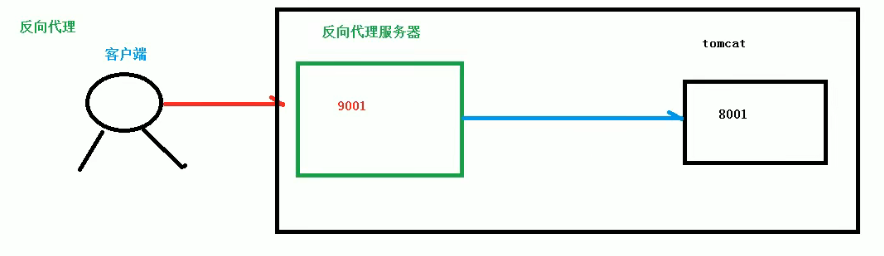
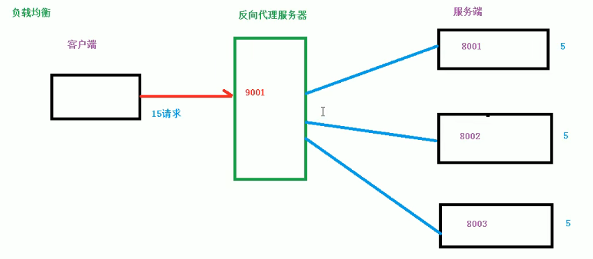
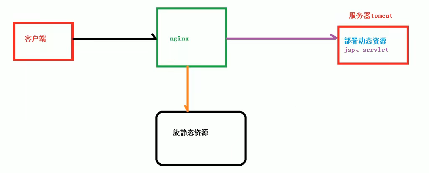
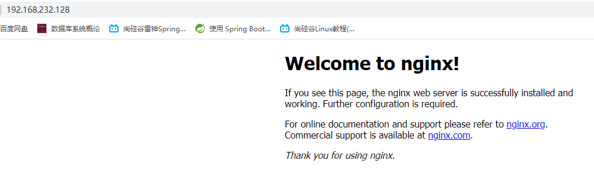
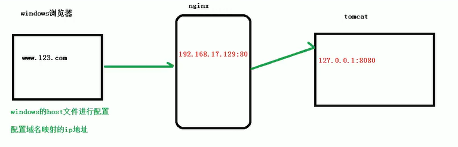
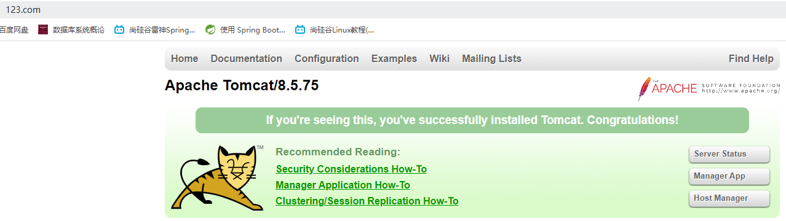
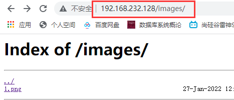
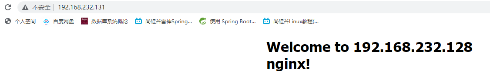

# Nginx基本概念

## 简介

#### 什么是Nginx

+ Nginx是一个高性能的HTTP和反向代理服务器，特点是占有内存少，并发能力强，事实上Nginx的并发能力确实在同类型的网页服务器中表现较好
+ Nginx专门为性能优化而开发，性能是其最重要的考量，实现上非常注重效率，能经受住高负载的考验，能支持高达50000个并发连接数

## 反向代理

**正向代理含义：**在客户端（浏览器）**配置代理服务器**，通过代理服务器进行互联网访问，因为假设我们要访问谷歌网站，是不能直接访问的


**反向代理的描述：**其实客户端对代理是无感知的，即客户端并不知道你有没有做代理操作，因为客户端不需要任何配置就可以访问，这是与正向代理的区别，反向代理不需要客户端做任何的配置，只需要**将请求发送到反向代理服务器**中，**由反向代理服务器去选择目标服务器获取数据**后，再**返回给客户端**，此时反向代理服务器和目标服务器（Tomcat）对外就是一个服务器，暴露的是代理服务器地址（9001），隐藏了真实服务器IP地址（8001）

## 负载均衡

> 客户端发送多个请求到服务器，服务器处理请求，有一些可能要与数据库进行交互，服务器处理完毕后，再将结果返回给客户端，这个过程是一个非常普通的请求响应过程
>
> 这种架构模式对于早期的系统相对单一，并发请求相对较少的情况下是比较适合的，成本也低。但是随着信息数量的不断增长，访问量和数据量的飞速增长，以及业务系统的复杂度增加，这种架构模式会造成服务器响应客户端的请求日益缓慢，并发量特别大的时候，还容易造成服务器直接崩溃。很明显这是由于服务器性能的瓶颈造成的问题，那么如何解决这种情况呢？
>
> ​	单个服务器解决不了，那么我们就增加服务器的数量，然后将请求分发到各个服务器上，将原先请求集中的单个服务器上的情况改为将请求分发到多个服务器上，将负载分发到不同的服务器，这就是负载均衡

## 动静分离

> 起初我们都是将静态资源（HTML、CSS、JS）等和动态资源（Servlet、JSP）等都一并部署在了同一个Tomcat服务器上，这样请求访问的时候，无论是访问静态资源还是动态资源都是会请求同一台Tomcat服务器，这样就会造成服务器压力过大
>
> 动静分离就是将静态资源单独部署到一个静态资源服务器，也就是将静态资源和动态资源分开进行部署，这个过程通过Nginx将动态和静态请求分开，不能理解成只是单纯地将动态资源和静态资源物理分离，严格意义上说应该是动态与静态请求分开，可以理解成使用Nginx处理静态页面，Tomcat处理动态页面

# Nginx的安装

1. 使用远程链接工具链接上Linux操作系统

2. 在Nginx官网下载Nginx软件http://nginx.org/en/download.html，此处下载的是`nginx-1.20.2.tar.gz`

3. 在安装Nginx之前，需要先安装其所需要的依赖

   + https://sourceforge.net/projects/pcre/files/pcre，此处下载的是`pcre-8.45.tar.gz`
     + 将其放到Linux系统的/opt目录下
     + 解压该压缩文件
     + 进入解压后的目录，执行./configure，进行检查操作
     + 使用make && make install将pcre进行编译和安装
     + 使用pcre-config --version查看当前pcre版本号，完成了Nginx需要的第一个pcre依赖
   + 使用yum -y install make zlib zlib-devel gcc-c++ libtool openssl openssl-devel安装其他依赖

4. 安装Nginx

   + 将Nginx压缩文件放到/opt目录中

   + 解压压缩文件

     ```powershell
     [root@localhost opt]# tar -zvxf nginx-1.20.2.tar.gz
     ```

   + 进入解压后的Nginx目录中执行./configure

     ```powershell
     [root@localhost nginx-1.20.2]# ./configure
     ```

   + 使用make && make install编译安装Nginx即可

     ```powershell
     [root@localhost nginx-1.20.2]# make && make install
     ```

   + 安装成功之后，会在/usr/local/nginx/sbin目录下会有Nginx启动脚本

     ```powershell
     [root@localhost sbin]# cd /usr/local/nginx/sbin
     [root@localhost sbin]# ll
     总用量 3796
     -rwxr-xr-x. 1 root root 3884664 1月  27 15:32 nginx
     ```

5. 启动Nginx，/usr/local/nginx/sbin/nginx

   ```powershell
   [root@localhost sbin]# /usr/local/nginx/sbin/nginx
   [root@localhost sbin]# ps -ef | grep nginx 
   root 10689 1  0 15:36 ?  00:00:00 nginx: master process /usr/local/nginx/sbin/ngin
   nobody    10690  10689  0 15:36 ? 00:00:00 nginx: worker process
   ```

6. 通过IP地址和端口号访问Nginx，/usr/local/nginx/conf/nginx.conf配置文件中有一个内容，就是端口号默认为80

   ```properties
   server {
           listen       80; # 默认访问端口为80端口
           server_name  localhost;
   ```

   

   7. 看到该Nginx页面的前提就是Linux防火墙关闭，或者不关闭防火墙，开放访问端口即可

      ```powershell
      # 查看当前防火墙开放的端口号
      [root@localhost conf]# firewall-cmd --list-all
      public (active)
        target: default
        icmp-block-inversion: no
        interfaces: ens33
        sources: 
        services: dhcpv6-client ssh
        ports: # 还没有开放的端口号
        protocols: 
        masquerade: no
        forward-ports: 
        source-ports: 
        icmp-blocks: 
        rich rules:
      # 永久开放80端口
      [root@localhost conf]# firewall-cmd --add-port=80/tcp --permanent
      success
      # 开放端口后需要重启防火墙
      [root@localhost conf]# firewall-cmd --reload
      success
      # 再次查看所开放的端口
      [root@localhost conf]# firewall-cmd --list-all
      public (active)
        target: default
        icmp-block-inversion: no
        interfaces: ens33
        sources: 
        services: dhcpv6-client ssh
        ports: 80/tcp # 就有80端口了
        protocols: 
        masquerade: no
        forward-ports: 
        source-ports: 
        icmp-blocks: 
        rich rules: 
      ```

   8. 如此一来就成功安装了Nginx了

# Nginx常用命令

> 使用Nginx命令的前提条件是进入到Nginx的目录（/usr/local/nginx/sbin）中方可执行相关命令，也就是使用Nginx脚本执行命令

|      命令       |                             描述                             |
| :-------------: | :----------------------------------------------------------: |
|    nginx -v     |                       查看Nginx版本号                        |
|      nginx      |                          启动Nginx                           |
| nginx -c [conf] |                   以指定配置文件启动nginx                    |
|  nginx -s stop  |                          关闭Nginx                           |
| nginx -s reload | 重新加载Nginx<br />当配置文件被修改时，不重启Nginx也会重新加载配置文件中的内容 |

# Nginx配置文件

> Nginx的配置文件位置在`/usr/local/nginx/conf`下名为nginx.conf

#### Nginx配置文件组成

> Nginx配置文件由三部分组成
>
> 1. 全局块
> 2. events块
> 3. http块

##### 全局块

> 从配置文件开始到events块之间的内容，主要设置一些影响Nginx服务器整体运行的配置指令，主要包括Nginx服务器的用户（组），允许生成的worker process数，进程PID存放路径、日志存放路径和类型以及配置文件的引入等

```powershell
# worker_processes值越大，表示支持的并发处理量就越多，但是会受到硬件、软件等设备的制约
worker_processes  1;
```

##### events块

> events块涉及的指令主要是影响Nginx服务器与用户的网络链接，常用的设置包括是否开启多work process下的网络链接进行序列化，是否允许同时接受多个网络链接，选取哪种事件驱动模型来处理链接请求，每个 work process 可以同时支持的最大连接数等

```powershell
events {
	# 表示Nginx支持的最大连接数为1024个链接
    worker_connections  1024;
}
```

##### http块

> 这是Nginx服务器配置中最频繁的部分，代理、缓存和日志定义等绝大多数功能和第三方模块的配置都在这里，需要注意的是：**http块又包含http全局块、server块**
>
> 也就是说我们的反向代理、负载均衡、动静分离、高可用都是在这个块中进行配置

###### http全局块

> 全局块配置的指令包括文件引入、MIME-TYPE定义、日志自定义、链接超时时间、单链接请求数上限等

###### server块

> 这部分与虚拟主机有密切关系，虚拟主机从用户角度看，和一台独立的硬件主机是完全一致的，该技术的产生是为了节省互联网服务器的硬件成本
>
> 每个http块可以包含多个server块，每个server块就相当于一个虚拟主机
>
> 每个server块也分为全局server块，以及可以同时包含多个location块

**server全局块**

```properties
server {
        listen       80; # 监听的端口，访问时访问该端口
        server_name  localhost; # 主机名称
```

**location块**

```properties
# 当请求路径中是一个 /，那么就做一些请求跳转
location / {
            root   html;
            index  index.html index.htm;
        }
```

# Nginx配置实例

## 反向代理

#### 实例一

**实现效果**

> 在浏览器地址栏中输入www.123.com，访问的时候直接跳转到Tomcat的主页面中

**步骤**

1. 在Linux系统中安装Tomcat服务器，使用其默认端口8080启动，Tomcat下载https://tomcat.apache.org/，将Tomcat压缩包放到/opt目录下并解压，解压完后进入其bin目录，`./startup.sh`即可启动Tomcat，因为Centos7自带Java环境所以无需安装，直接启动Tomcat即可，然后开放防火墙8080端口，通过Windows访问Tomcat服务器，测试是否启动成功

2. 访问过程的分析

   > 想要在Windows的浏览器地址栏输入www.123.com能够访问到Nginx的IP，那么就需要在Windows的host文件中进行配置，配置www.123.com映射的IP地址，Nginx的IP是对外暴露的，而Tomcat的IP是隐藏的，Windows不能直接访问到Tomcat，而是经由Nginx代理我们访问

3. 在Window系统的host文件中进行域名和IP的映射关系配置，host文件地址默认在C:\Windows\System32\drivers\etc\hosts文件，在配置文件中加上如下内容保存即可

   ```makefile
   # 前面的为NginxIP，后面的域名为Windows浏览器地址栏中的请求地址
   192.168.232.128 www.123.com
   ```

4. 在Nginx进行请求转发（反向代理）的配置，编辑Nginx配置文件，配置server_name和proxy_pass

   ```properties
   # 如下配置意思就是如果我们访问的是192.168.232.128的80端口，就会给我们转发到127.0.0.1:8080
   server {
           listen       80;
           # 配置主机IP
           server_name  192.168.232.128; 
           location / {
               root   html;
               # 添加代理路径，此处是要映射到Tomcat的IP地址
               proxy_pass http://127.0.0.1:8080;
               index  index.html index.htm;
           }
     }
   ```

5. 到这一步我们反向代理就已经完成了，最终我们就启动Nginx做个测试

#### 实例二

**实现效果**

> 使用Nginx反向代理，根据访问的路径的不同跳转到不同端口的服务器中，其中Nginx监听端口为9001，如下
>
> + Windows访问http://192.168.232.128:9001/edu/ 直接跳转到 127.0.0.1:8080
> + Windows访问http://192.168.232.128:9001/vod/ 直接跳转到 127.0.0.1:8081

**步骤**

1. 准备两个Tomcat服务器，一个8080端口，一个8081端口，若是在同一个Linux系统中，为了模拟效果，则创建两个Tomcat目录tomcat8080和tomcat8081模拟操作，其中一个需要修改conf/server.xml中的端口号，启动两个Tomcat开放两个端口，测试两个Tomcat是否启动成功，然后在两个Tomcat的webapps的目录下分别创建目录edu和vod，在这两个目录下分别创建两个简单HTML页面用于响应测试

2. 在Nginx配置文件中配置反向代理，因为http块中原本就已经存在了1个server块，我们就不去修改它了，直接再添加一个server块然后指定我们的代理规则即可，**注意一定要配置在http块大括号中**

   ```properties
   server {
   		# 监听端口为 9001
           listen       9001;
           server_name  192.168.232.128;
           # 当请求路径包含edu，则转发至http://127.0.0.1:8080
           # ~表示后面使用正则表达式形式
           location ~ /edu/ {
               proxy_pass http://127.0.0.1:8080;
           }
           # 当请求路径包含vod，则转发至http://127.0.0.1:8081
           location ~ /vod/ {
               proxy_pass http://127.0.0.1:8081;
           }
   }
   ```

3. 然后注意开放9001端口，因为配置文件被修改，那么之前启动过Nginx那就重新加载Nginx，否则就启动Nginx，完成测试即可

#### location块说明

> 该区域用于匹配URL，语法如下：

```java
location [= | ~ | ~* | ^~] URI{
    
}
```

+ =：用于不含正则表达式的URI前，要求请求字符串与URI严格匹配，如果匹配成功，就停止继续向下搜索并立即处理该请求（意思就是请求路径为edu，那么直接访问edu，而不会去向下继续请求a.html，除非你的请求路径为edu/a.html这时候才会访问到a.html，所以**等于号相当于请求路径与映射路径精准匹配**）
+ ~：用于表示URL包含正则表达式，并且**区分大小写***（常用）
+ ~*：用于表示URL包含正则表达式，并且**不区分大小写**
+ ^~：用于不含正则表达式的URI前，要求Nginx服务器找到表示URI和请求字符串匹配度最高的location后，立即使用此location处理请求，而且不再使用location块中的正则URI和请求字符串做匹配

**注意：如果URI包含正则表达式，则必须要使用\~或~*标识**

## 负载均衡

**实现效果**

> 浏览器地址栏中输入http://192.168.232.128/edu/a.html，我们将请求分别分摊到8080服务器和8081服务器中

**步骤**

1. 启动8080端口和8081端口的Tomcat服务器，在这两台tomcat的webapps目录下创建edu目录，并且统一是a.html，但是html中的内容不同，8080服务器对应的html内容为8080，另一个同理

2. 找到Nginx的配置文件，配置upstream，和location映射规则

   ```properties
   http {
       # 在http块中通过upstream配置我们的负载均衡服务器的列表，自定义列表名称为myserver
       #gzip  on;
       upstream myserver{
           server 192.168.232.128:8080;
           server 192.168.232.128:8081;
       }
       server {
           listen  80;
           # 依然还是Linux系统ip
           server_name  192.168.232.128;
   
           #charset koi8-r;
   
           #access_log  logs/host.access.log  main;
   
           location / {
               root   html;
               # 指定映射规则，会自动将请求分摊给我们定义的服务器列表的任何服务器
               proxy_pass http://myserver;
               index  index.html index.htm;
           }
   }
   ```

3. 这时候就可以进行测试了，在地址栏中输入http://192.168.232.128/edu/a.html，不断刷新可以看到不同的页面效果

> 这种效果就是负载均衡

#### 负载均衡服务器分配策略

##### 轮询（默认）

> 每个请求按时间顺序逐一分配到不同的后端服务器，若后端服务器挂掉，能自动剔除，也就是不访问该挂掉的服务器

##### weight（权重）

> weight代表权重，默认值为1，权重越高的服务器被分配到请求就越多，演示如下：

```properties
http {
    #gzip  on;
    upstream myserver{
    # 这样一来服务器8081要比8080分到的请求多出一半
        server 192.168.232.128:8080 weight=5;
        server 192.168.232.128:8081 weight=10;
    }
}
```

##### ip_hash

> 每个请求按照ip的hash进行分配，这样每个用户固定访问一个后端服务器，可以解决session共享问题，也就是如果你的IP被hash分配到了8080服务器，只要你的IP地址不变，那么往后你访问的都是8080服务器，演示如下：

```properties
http {
    # 直接在upstream中配置上ip_hash即可
    #gzip  on;
    upstream myserver{
    	ip_hash
        server 192.168.232.128:8080;
        server 192.168.232.128:8081;
    }
}
```

##### fair（第三方）

> 按照后端服务器的响应时间来分配请求，响应时间短的优先分配，演示如下：

```properties
http {
    # 在http块中通过upstream配置我们的负载均衡服务器的列表，自定义列表名称为myserver
    #gzip  on;
    upstream myserver{
        server 192.168.232.128:8080;
        server 192.168.232.128:8081;
        # 写法也是加上一个fair就可以了
        fair;
    }
}
```

## 动静分离

> 动静分离从目前实现角度来看大致分为两种：
>
> + 纯粹将静态文件独立成单独的域名，放在独立的服务器上，通过Nginx将动态请求和静态请求进行分离开来，转发至相应的服务器上，也是目前主流推崇的方案
> + 动态文件和静态文件混合一起发布，通过Nginx来分开
>
> 通过location指定不同的后缀名实现不同的请求转发，通过Expires参数设置：可以**设置浏览器缓存过期时间**，减少与服务器之间的请求和流量。具体Expires定义：是给一个资源设定一个过期时间，在浏览器中产生了缓存，也就是无需去服务端验证，直接通过浏览器自身确认是否过期即可，所以不会产生额外的流量，都是去请求浏览器中的缓存，这种方法**非常适合不经常变动的资源**（如果经常更新的文件不建议使用Expires来缓存），我这里设置3d，表示是在这3天之内访问这个URL，发送一个请求，比对服务器该文件最后更新时间若没有变化，则不会从服务器抓取，返回状态码304，也就是浏览器的缓存中取，如果有修改，则直接从服务器重新下载，返回状态码200

**步骤**

1. 在Linux系统中准备一些静态资源，用于进行访问，在根目录下创建data目录，在data目录创建www目录和images目录，www目录中存放a.html，内容自定义，images目录中放张图片

2. 在Nginx配置文件中配置如下内容，用于访问静态资源

   ```properties
   server {
           listen  80;
           server_name  192.168.232.128;
   		# 配置静态资源的访问
           location /www/ {
               root /data/;
           }
           # 配置静态资源的访问
           location /images/{
               root /data/;
   			# 列出该目录下静态资源列表
               autoindex on;
   		}
   }
   ```

   autoindex on的页面效果

# Nginx高可用集群配置

#### 什么是高可用

> 也就是我们的Nginx宕机了，客户端还能够正常进行请求，假设高可用还未配置，那么我们的Nginx若宕机的话，就无法请求服务器了
>
> 为了实现高可用效果，我们可以准备两台Nginx，一台主Nginx，一台备用Nginx，当主的挂掉了，就自动切换到备份Nginx进行请求的处理与分配，这就是高可用的效果，这时候因为我们两台Nginx的IP地址不同，所以要借助一个软件---keepalived来进行Nginx主从的切换，当然这时候客户端并不是直接访问Nginx的IP地址，而是通过虚拟IP进行绑定访问，当主机正常运行，那么默认keepalived就会将虚拟IP绑定到主Nginx上，当主Nginx挂掉，那么keepalived就会将虚拟IP绑定到我们备用Nginx服务器上，这样就实现了高可用的效果，所以为了实现高可用，需求如下：
>
> + 需要两台Nginx服务器
> + 需要keepalived
> + 需要虚拟IP

**步骤**

1. 安装两套Linux系统，因为要不同IP地址嘛

2. 在这两台Linux系统中安装Nginx

3. 在两台Linux系统中安装keepalived软件，安装之后在etc里面生成目录keepalived，里面有keepalived配置文件keepalived.conf

   ```powershell
   [root@Martha opt]# yum install keepalived -y
   ```

4. 完成高可用的配置，也就是要修改keepalived配置文件

   + Nginx主服务器

     ```powershell
     # 全局定义
     global_defs {
       notification_email {
         acassen@firewall.loc
         failover@firewall.loc
         sysadmin@firewall.loc
       }
       notification_email_from Alexandre.Cassen@firewall.loc
        # Linux系统的IP地址
       smtp_server 192.168.232.128
       smtp_connect_timeout 30
       # 路由id
       router_id LVS_DEVEL
     }
     # 检测Nginx是否还存活的脚本
     vrrp_script check_nginx {
       # 脚本文件的位置，用于检测Nginx是否宕机
       script "/usr/local/src/nginx_check.sh"
       interval 2 # 检测脚本执行的间隔
       weight 2 # 设置当服务器的权重
     }
     # 虚拟IP的配置
     vrrp_instance VI_1 {
       state MASTER # 表示当前服务器是MASTER还是BACKUP，即是主服务器还是备份服务器
       interface ens33 # 虚拟IP所绑定的网卡名称
       virtual_router_id 51 # 主、备机的virtual_router_id必须相同
       priority 100 # 主、备机取不同的优先级，主机值较大，备份机值较小
       advert_int 1 # 每隔多久发送一次心跳，默认是1秒
       # 权限校验
       authentication {
         auth_type PASS
         auth_pass 1111
       }
       # 虚拟IP地址：注意，keepalived虚拟ip尽量和VMwareip地址按顺序排列
       virtual_ipaddress {
         192.168.232.130
       }
     }
     ```

   + Nginx备份服务器

     ```powershell
     # 全局定义
     global_defs {
       notification_email {
         acassen@firewall.loc
         failover@firewall.loc
         sysadmin@firewall.loc
       }
       notification_email_from Alexandre.Cassen@firewall.loc
       # Linux系统的IP地址
       smtp_server 192.168.232.128
       smtp_connect_timeout 30
       # 路由id
       router_id LVS_DEVEL
       # 之前测试时没有添加下面这两个
       #script_user root
       #enable_script_security
     }
     # 检测Nginx是否还存活的脚本
     vrrp_script check_nginx {
       # 脚本文件的位置，用于检测Nginx是否宕机
       script "/usr/local/src/nginx_check.sh"
       interval 2 # 检测脚本执行的间隔
       weight 2 # 设置当服务器的权重
     }
     # 虚拟IP的配置
     vrrp_instance VI_1 {
       state BACKUP # 表示当前服务器是MASTER还是BACKUP，即是主服务器还是备份服务器
       interface ens33 # 虚拟IP所绑定的网卡名称
       virtual_router_id 51 # 主、备机的virtual_router_id必须相同
       priority 90 # 主、备机取不同的优先级，主机值较大，备份机值较小
       advert_int 1 # 每隔多久发送一次心跳，默认是1秒
       # 权限校验
       authentication {
         auth_type PASS
         auth_pass 1111
       }
       # 虚拟IP地址
       virtual_ipaddress {
          192.168.232.130
       }
       # 之前测试时没有添加下面这个也可以用
       #track_script {
       #  #check_nginx
       #}
     }
     ```

5. 检测Nginx的脚本文件内容，名称为`nginx_check.sh`，需与keepalived配置文件中`script`指定的名称相同，然后需要将此文件保存到`/usr/local/src`目录下

   ```sh
   #!/bin/bash
   if [ `ps -C nginx –-no-header |wc -l` -eq 0 ];then
     /usr/local/nginx/sbin/nginx
     sleep 2
     if [ `ps -C nginx –-no-header |wc -l` -eq 0 ];then
       systemctl stop keepalived
     fi
   fi
   ```

6. 将两台Linux系统中的Nginx和keepalived启动，启动keepalived时，可以另外开一个Xshell窗口，执行`tail -f /var/log/messages`命令，查看keepalived的运行过程是否出现啥异常，启动成功的话，可以通过`ip a`查看当前虚拟IP绑定状态

   ```powershell
   [root@Martha opt]# /usr/local/nginx/sbin/nginx
   [root@Martha opt]# systemctl start keepalived.service
   ```

7. 最终通过浏览器访问虚拟IP进行测试，发现Nginx主机在时，就会根据优先级链接到优先级高的主机，主机宕机后，比如我们手动关闭，那么就会切换到我们的备用Nginx

   

   

# Nginx原理