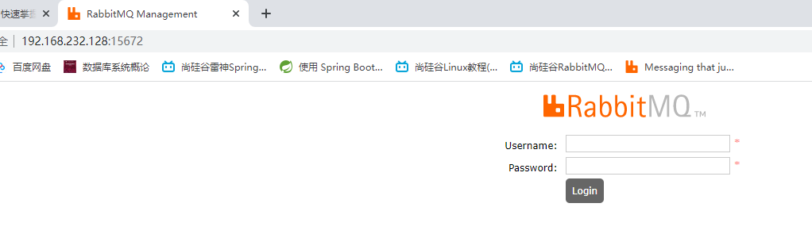
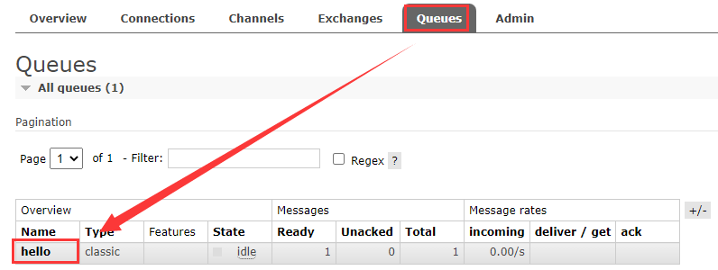
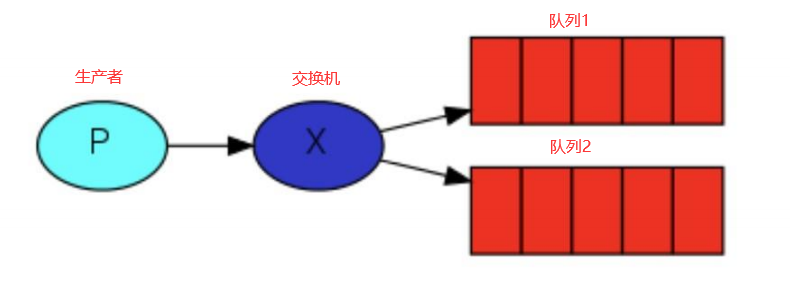
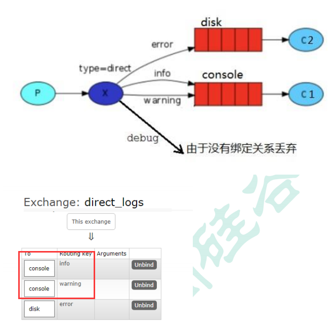
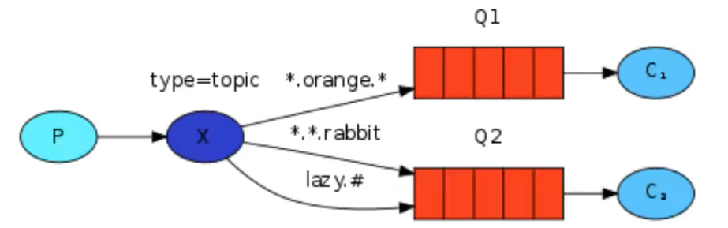
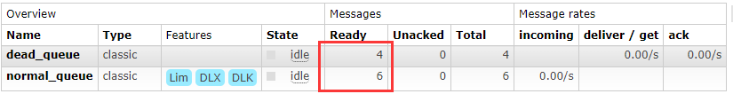
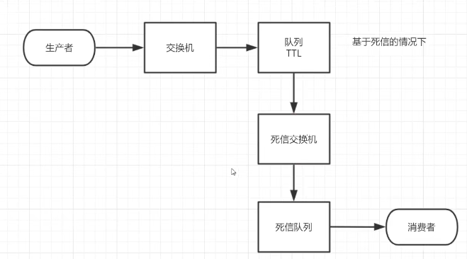
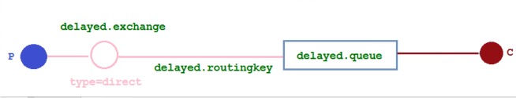

# 消息队列

## MQ的相关概念

### 什么是MQ

MQ（Message Queue），从字面意思上看，本质上是个队列，其遵循FIFO先进先出原则，只不过队列中存放的内容是message而已，这个消息是可以进行通讯的，这是一种跨进程的通信机制，用于上下游传递消息（上下游的意思就是比如A发送消息给B，A就是上游，B就是下游），在互联网架构中，MQ是一种非常常见的上下游“逻辑解耦+物理解耦”的消息通信服务。使用MQ之后，消息发送的上游只需要依赖MQ，不需要要依赖其他服务

### 为何要使用MQ

因为MQ有三大功能：

1. **流量消峰**

   例如，若订单系统最多能处理一万次订单，这个处理能力应付正常时段的下单时绰绰有余，正常时段我们下单一秒后就能返回结果，但是在高峰期，若有两万次下单操作，系统是处理不了的，只能限制订单超过一万后不允许用户下单。那么此时若使用消息队列做缓冲，我们可以就取消这个下单量限制，把一秒内下的订单分散成一段时间来处理，这时有些用户可能在下单十几秒后才能收到下单成功的操作，但是总比不能下单的体验要好

   

   如上图只需要在用户和订单系统之间加上一个消息队列进行流量消峰，也就是不让用户直接访问订单系统，而是加上一个消息队列，让消息队列去访问订单系统，这样就可以达到消峰的效果，因为在MQ的内部可以对流量进行排队，依次访问，来达到消峰的目的，否则，若用户直接访问订单系统，访问量若瞬间超过1万，那么订单系统就会宕机，这时候在二者之间加上MQ，避免瞬间流量过大直冲订单系统，当然此时的缺点也很明显，就是访问速度会下降，但是好处就是订单系统不至于宕机，这就是MQ的流量消峰

2. **应用解耦**

   例如，若一个应用程序中有订单系统、库存系统、物流系统、支付系统。在用户创建完订单后，如果耦合地调用库存系统、物流系统、支付系统，当任何一个系统出现故障，都会造成下单操作异常，如下图，若订单系统直接调取支付系统、库存系统、物流系统，如果被调取的三个系统其中一个出现故障，那么订单系统也会出现故障

   

   而当转变成基于消息队列的方式去调取三个系统后，系统间调用的问题就会减少很多，比如物流系统因为发生故障，需要几分钟来修复。在这几分钟时间里，物流系统要处理的内存被缓存在消息队列中，用户的下单操作就可以正常完成。当物流系统恢复后，继续处理订单信息即可，中单用户感受不到物流系统的故障，提升系统的可用性

   

   订单系统通过队列再去访问支付系统、库存系统和物流系统，就不会出现有一个系统故障，其他都异常的情况，因为订单系统执行完成后才会发消息给队列，后续任务就由队列来完成，此时的订单系统其实早就结束了，而队列会分配消息给库存系统、物流系统、支付系统，直到三大系统执行完成，若在过程中有任何一个系统出现故障，队列会监督它继续完成，直到完成结束，所以不会出现任何一个系统故障后影响所有系统的情况，这就是队列的第二大功能

3. **异步处理**

   有些服务之间调用是异步的，如A调用B，B要花费很长时间执行，但是A需要知道B什么时候可以执行完，以前一般有两种方式，A过一段时间去调用B的查询API进行查询，或者A提供一个callback api，B执行完之后调用api通知A服务。这两种方式都不是很优雅，使用消息总线，可以很方便地解决这个问题，A调用B服务之后，只需要监听B处理完成的消息，当B处理完成后，会发送一条消息给MQ，MQ会将此消息转发给A服务，这样A服务既不用循环调用B的查询api，也不用提供callback api。同样B服务也不用做这些操作，A服务还能及时地得到异步处理成功的消息

   
   
   A通过api调用B，B完成功能需要很长时间，这时候A可以做自己的事情，此时A不用等待B，等到B将事情完成之后发消息给MQ，由MQ发消息通知A，表示B已经完成，A就收到了B已完成的结果，这样A的用户体验也会好，也相对优雅

### MQ的分类

MQ在市面上有如下几个MQ

1. ActiveMQ

> ActiveMQ是一个非常老的MQ了，在所有MQ没出来之前就已经有ActiveMQ了

+ 优点：单机吞吐量是==万==级别的，时效性是==毫秒==级别的，可用性高，基于主从架构实现高可用性，消息可靠性高，丢失消息的概率很低，消息一般是不丢失的
+ 缺点：官方对ActiveMQ 5.x+版本后的维护越来越少，高吞吐量场景也较少使用了

2. Kafka

Kafka目前使用率比较高，号称是大数据的杀手锏，谈到大数据领域内的消息传输，则绕不开 Kafka，这款为**大数据而生**的消息中间件，以其**百万级TPS** 的吞吐量名声大噪，迅速成为大数据领域的宠儿，在数据采集、传输、存储的过程中发挥着举足轻重的作用。目前已经被 LinkedIn，Uber, Twitter, Netflix 等大公司所采用

+ 优点：性能卓越，单机写入 TPS 约在==百万==条/秒，最大的优点，就是**吞吐量高**。时效性 ms 级可用性非常高，kafka 是分布式的，一个数据多个副本，即使少数机器宕机，也不会丢失数据，不会导致不可用，消费者采用 Pull 方式获取消息，消息有序，通过控制能够保证所有消息被消费**且仅被消费一次**;有优秀的第三方KafkaWeb 管理界面 Kafka-Manager；在日志领域比较成熟，被多家公司和多个开源项目使用；功能支持： 功能较为简单，主要支持简单的 MQ 功能，在大数据领域的**实时计算**以及**日志采集**被大规模使用
+ 缺点：Kafka 单机超过 64 个队列/分区，Load（加载时）会发生明显的CPU飙高现象，队列越多，load 越高，发送消息响应时间变长，使用短轮询方式，实时性取决于轮询间隔时间，消费失败不支持重试（也就意味着消息可能会丢失）；支持消息顺序，但是一台代理宕机后，就会产生消息乱序，**社区更新较慢**；所以它的缺点也比较明显

3. RocketMQ

RocketMQ 出自阿里巴巴的开源产品，用 Java 语言实现，在设计时参考了 Kafka，并做出了自己的一些改进。被阿里巴巴广泛应用在订单，交易，充值，流计算，消息推送，日志流式处理，以及 binglog（二进制日志）分发等场景

+ 优点：单机吞吐量==十万==级,可用性非常高，分布式架构,**消息可以做到** **0** **丢失**,**MQ 功能较为完善，还是分布式的，扩展性好,**支持**10** **亿级别的消息堆积**，不会因为堆积导致性能下降,源码是 java，故我们可以自己阅读源码，以定制自己公司的 MQ
+ 缺点：**支持的客户端语言不多**，目前是 java 及 c++，其中 c++不成熟；社区活跃度一般,没有在MQ核心中去实现 JMS 等接口,有些系统要迁移需要修改大量代码，这也是它的使用量没那么高的原因，而绝大部分公司都会采用RabbitMQ

4. RabbitMQ

RabbitMQ 于 2007 年发布，是一个在AMQP(高级消息队列协议)基础上完成的，可复用的企业消息系统，是**当前最主流的消息中间件之一**

+ 优点：由于 erlang 语言的**高并发特性**，性能较好；**吞吐量到万级**，MQ 功能比较完备,健壮、稳定、易用、跨平台、**支持多种语言** 如：Python、Ruby、.NET、Java、JMS、C、PHP、ActionScript、XMPP、STOMP等一大堆语言，支持 AJAX 文档齐全；开源提供的管理界面非常棒，用起来很好用,**社区活跃度高**；更新频率相当高，官网：https://www.rabbitmq.com/news.html
+ 缺点：商业版需要收费，学习成本较高

### MQ的选择

1. Kafka

Kafka 主要特点是基于 Pull 的模式来处理消息消费，追求高吞吐量，一开始的目的就是用于日志收集和传输，适合产生**大量数据**的互联网服务的数据收集业务。**大型公司**建议可以选用，如果有**日志采集**功能，肯定是首选 kafka 了

2. RocketMQ

天生为**金融互联网**领域而生，对于可靠性要求很高的场景，尤其是电商里面的订单扣款，以及业务削峰，在大量交易涌入时，后端可能无法及时处理的情况。RoketMQ 在稳定性上可能更值得信赖，这些业务场景在阿里双 11 已经经历了多次考验，如果你的业务有上述并发场景，建议可以选择 RocketMQ

3. RabbitMQ

结合 erlang 语言本身的并发优势，性能好**时效性微秒级**，**社区活跃度也比较高**，管理界面用起来十分方便，如果你的**数据量没有那么大**，中小型公司优先选择功能比较完备的 RabbitMQ

## RabbitMQ

### RabbitMQ 的概念

RabbitMQ 是一个消息中间件：它用于**接收并转发消息**。你可以把它当做一个快递站点，当你要发送一个包裹时，你把你的包裹放到快递站，快递员最终会把你的快递送到收件人那里，按照这种逻辑来看，RabbitMQ 则是一个快递站，或是一个快递员帮你传递快件。RabbitMQ 与快递站的主要区别在于，它不处理快件而是**接收**，**存储**和**转发**消息数据（相当于打小报告的人，哈哈），RabbitMQ的具体结构如下图：


### RabbitMQ 四大核心概念

1. 生产者：产生数据发送消息的程序就是生产者，对应上图中发包裹的人
2. 交换机：交换机是 RabbitMQ 非常重要的一个部件，一方面它接收来自生产者的消息，另一方面它将消息推送到队列中。交换机必须确切知道如何处理它接收到的消息，是将这些消息推送到特定队列还是推送到多个队列，亦或者是把消息丢弃，这个由交换机类型决定
3. 队列：队列是 RabbitMQ 内部使用的一种数据结构，尽管消息流经 RabbitMQ 和应用程序，但它们只能存储在队列中。队列仅受主机的内存和磁盘限制的约束，本质上是一个大的==消息缓冲区==。许多生产者可以将消息发送到一个队列，许多消费者可以尝试从一个队列接收数据。这就是我们使用队列的方式
4. 消费者：消费与接收具有相似的含义。消费者大多时候是一个等待接收消息的程序。请注意生产者，消费者和消息中间件很多时候并不在同一机器上。同一个应用程序既可以是生产者又是可以是消费者

如上图所示：MQ 内部由两部分组成，就是交换机和队列，交换机与队列之间是一对多的关系，交换机与队列之间又是绑定的关系，即一个交换机可以和N个队列进行绑定

而队列和消费者之间也是一对多的关系，每一个队列可以只对应一个消费者，也可以一个队列对应多个消费者，但是如果是多个消费者对应一个队列的话，那么队列的消息只有一个消费者能够接收到，就和快递的包裹一样，包裹只有一个，你很多人过来拿，最终只有一个人手上有包裹

### RabbitMQ 的核心部分

> RabbitMQ 有6大核心部分，这6大核心部分也有另外的叫法，叫做6大核心模式


+ 简单模式（Hello World!）
+ 工作模式（Work queues）
+ 发布订阅模式（Publish/Subscribe）


+ 路由模式（Routing）
+ 主题模式（Topics）
+ 发布确认模式（Publisher Confirms）

### RabbitMQ 各个名词介绍

下图是 RabbitMQ 的工作原理图


**Producer**：生产者

**Connection**：是生产者和消费者在broker之间的TCP链接，即每一个生产者会与RabbitMQ（Broker）建立一个Connection，每一个消费者也会与RabbitMQ（Broker）建立一个Connection，每一个连接中会有多个信道（信道就是发消息的通道，简称信道）

**Channel**：信道，如果每一次访问RabbitMQ都建立一个Connection，在消息量大的时候建立TCP Connection的开销将是巨大的，效率也较低。Channel就是在Connection内部建立的==逻辑连接==，同时每一个连接中也包含很多个Channel，每次发消息只会占用一个Channel，不会占用整个Connection，而每个连接中有多个Channel就可以发多条消息，这就是Channel与Connection之间的关系。如果应用程序支持多线程，通常每个Thread创建单独的Channel进行通讯，AMQP method包含了channel id帮助客户端和Broker识别 channel，所以channel之间是完全==隔离==的。Channel作为轻量级的Connection极大减少了操作系统建立TCP Connection的开销

**Broker**：Broker 是用于接收和分发消息的应用，又称 RabbitMQ Server（RabbitMQ服务器）、Message Broker（消息实体），每个消息实体中可以有多个交换机

**Exchange**：交换机，一个交换机可以对应多个队列，message 到达 broker的第一站，根据分发规则，匹配查询表中的routing key，分发消息到queue中去。常用的交换机类型有: direct (point-to-point), topic (publish-subscribe) and fanout(multicast)

**Virtual Host**：出于多租户和安全因素设计的，把AMQP 的基本组件划分到一个虚拟的分组中，类似于网络中的namespace概念。当多个不同的用户使用同一个RabbitMQ Server提供的服务时，可以划分出多个vhost，每个用户在自己的vhost创建exchange / queue 等

> 多租户的意思就是消息实体（Broker）中可以有多个Vhost，而每个Vhost可以有多个交换机，他们是包含关系

**Queue**：队列，消息最终被送到这里等待Consumer取走

**Binding**：交换机与队列之间的连线就是Binding，即exchange和queue之间的虚拟连接，binding中可以包含routing key，Binding信息被保存到exchange中的查询表中，用于message的分发依据

**Consumer**：消费者

### RabbitMQ 的安装

1. 官网下载RabbitMQ https://www.rabbitmq.com/download.html

   

   > 我们需要先安装Erlang语言环境，再安装RabbitMQ，当然如果是RabbitMQ 3.9.10+的版本就不需要先安装Erlang了，安装mq时，会自动安装erlang的依赖项，下面以3.8.8的版本进行安装

   在Linux系统中安装，参照以下连接：https://www.rabbitmq.com/install-rpm.html，最新版的RabbitMQ需要Linux的Centos8系统，我们是Centos7，所以选择低版本的进行安装，选择安装3.8.8版本的RabbitMQ，这个el7说明就支持Centos7版本的Linux

   RabbitMQ Server下载地址[rabbitmq-server-3.8.8-1.el7.noarch.rpm](https://github.com/rabbitmq/rabbitmq-server/releases/download/v3.8.8/rabbitmq-server-3.8.8-1.el7.noarch.rpm)，找到相同名称的下载

   erlang下载地址：[erlang-22.3-1.el7.x86_64.rpm](https://packagecloud.io/rabbitmq/erlang/packages/el/7/erlang-22.3-1.el7.x86_64.rpm?distro_version_id=140)点击右上角的download就可以下载erlang的rpm包

   ```powershell
   # 当然也可以不下载erlang的rpm包，直接执行以下两条指定进行安装erlang语言环境，方式二选一
   curl -s https://packagecloud.io/install/repositories/rabbitmq/erlang/script.rpm.sh | sudo bash
   sudo yum install erlang-22.3-1.el7.x86_64
   ```

2. 安装软件：将两个rpm包上传到/opt目录下进行安装

   

   ```powershell
   # rpm安装erlang环境 头V4 RSA/SHA1 Signature, 密钥 ID 6026dfca: NOKEY
   [root@localhost opt]# rpm -ivh erlang-21.3-1.el7.x86_64.rpm
   # yum 安装RabbitMQ所需要的依赖，在安装RabbitMQ Server之前需要安装socat，否则RabbitMQ将安装失败
   [root@localhost opt]# yum install socat -y
   # rpm安装rabbitmq服务
   [root@localhost opt]# rpm -ivh rabbitmq-server-3.8.8-1.el7.noarch.rpm
   ```

3. 按照顺序执行以下命令

   ```powershell
   # 添加开机启动RabbitMQ服务
   [root@localhost opt]# chkconfig rabbitmq-server on
   # 开启RabbitMQ的Web管理插件（前提是RabbitMQ服务处于关闭状态）,安装完插件，RabbitMQ就可以有一个后台管理界面
   [root@localhost opt]# rabbitmq-plugins enable rabbitmq_management
   # 启动当前RabbitMQ服务，我们安装完还未启动呢，现在执行这个命令启动RabbitMQ服务，启动过程可能比较慢
   [root@localhost opt]# /sbin/service rabbitmq-server start
   # 查看RabbitMQ服务状态，绿色的active (running)则说明启动成功
   [root@localhost opt]# /sbin/service rabbitmq-server status
   # 停止RabbitMQ服务（选择执行）
   [root@localhost opt]# /sbin/service rabbitmq-server stop
   ```

4. 安装完Web管理插件后就可以通过浏览器访问RabbitMQ的后台管理界面了，通过Linux系统IP地址+port访问，端口号默认为15672，若无法访问则要么开放端口要么关闭Linux防火墙

   > 安装Web插件失败与解决办法如下，没有失败则可忽略

   ```powershell
   # 若执行Web管理插件命令结果如下，则是失败的：
   [root@rabbitmq ~]# rabbitmq-plugins enable rabbitmq_management
   {:query, :rabbit@rabbitmq, {:badrpc, :timeout}}
   # 解决办法就是修改当前hosts文件
   [root@rabbitmq ~]# vim /etc/hosts
   # 添加内容为当前IP + hostname
   127.0.0.1   localhost localhost.localdomain localhost4 localhost4.localdomain4
   ::1         localhost localhost.localdomain localhost6 localhost6.localdomain6
   # 额外增加如下配置保存并退出，重新执行rabbitmq-plugins enable rabbitmq_management即可成功安装插件
   192.168.206.128 rabbitmq
   ```

   

5. 初始的username为guest，密码也是guest，登录时发现没有权限登录，这个时候我们就需要手动创建一个新的账户，并且为该账户赋予超级管理员权限，赋予之后即可登录

6. 手动创建用户，并且为该用户赋予超级管理员权限

   ```powershell
   # 查看当前用户和角色
   [root@localhost opt]# rabbitmqctl list_users
   Listing users ...
   user	tags # 标题
   guest	[administrator] # 有一个guest账户，无密码
   # 创建自定义账户：rabbitmqctl add_user [用户名] [密码]
   [root@localhost ~]# rabbitmqctl add_user electroNic 123456
   # 设置用户角色：rabbitmqctl set_user_tags [用户名] administrator
   [root@localhost ~]# rabbitmqctl set_user_tags electroNic administrator
   # 设置用户权限，格式set_permissions [-p] [vhostpath] [user] [conf] [write] [read]
   # 以下命令解释：vhostpath路径为根路径，用户对所有配置均可读可写
   [root@localhost ~]# rabbitmqctl set_permissions -p "/" electroNic ".*" ".*" ".*"
   ```

7. 设置完超级管理员用户后，使用刚刚添加的用户再次登录，就可以进入RabbitMQ的后台管理界面，可以在后台管理界面中Admin一栏添加User或者Vhost

> 至此我们的RabbitMQ就安装好了，也就是中间黄色区域的Broker安装好了，现在就差生产者和消费者了

# 核心部分

## RabbitMQ的使用

### 简单队列模式（Hello World!）

> 我们使用JavaAPI实现发送单个消息的生产者和接收消息并打印出来消费者

1. 创建一个Maven工程，在pom.xml文件中引入以下所需依赖

   ```xml
   <!--指定 jdk 编译版本--> 
   <build>
       <plugins>
           <plugin>
               <groupId>org.apache.maven.plugins</groupId>
               <artifactId>maven-compiler-plugin</artifactId>
               <configuration>
               	<source>8</source>
               	<target>8</target>
       		</configuration>
       	</plugin>
       </plugins>
   </build>
   <dependencies>
       <!--rabbitmq 客户端依赖-->
       <dependency>
           <groupId>com.rabbitmq</groupId>
           <artifactId>amqp-client</artifactId>
           <version>5.8.0</version>
       </dependency>
       <!--操作文件流的一个依赖-->
       <dependency>
           <groupId>commons-io</groupId>
           <artifactId>commons-io</artifactId>
           <version>2.6</version>
       </dependency>
   </dependencies>
   ```

2. 生产者代码，结构图大致如下：

> 若连接RabbitMQ超时，只能关闭Linux防火墙

```java
public class Producer {
    // 队列名称
    public static final String QUEUE_NAME = "hello";

    // 发消息
    public static void main(String[] args) throws Exception {
        // 1.创建一个RabbitMQ链接工厂
        ConnectionFactory factory = new ConnectionFactory();
        // IP，连接RabbitMQ队列
        factory.setHost("192.168.206.128");
        // 用户名
        factory.setUsername("electroNic");
        // 密码
        factory.setPassword("123456");
        // 2.通过工厂创建链接
        Connection conn = conn = factory.newConnection();
        // 3.通过链接获取信道channel，因为Connection中的Channel才是真正用于传递消息的
        Channel channel = conn.createChannel();
        /*
           4.通过信道调取队列的一个声明，说白就是创建一个队列,queueDeclare参数如下
            1.队列名称
            2.队列中的消息是否持久化到磁盘，默认为false，即消息存储在内存中（即不持久化）
            3.该队列是否只供一个消费者进行消费，是否进行消息共享，true表示可以允许多个消费者消费（即共享），默认false不允许
            4.是否自动删除，最后一个消费者断开链接后，该队列是否自动删除，true表示自动删除，false不自动删除
            5.队列的其他参数（例如延迟消息、死信消息..）
         */
        channel.queueDeclare(QUEUE_NAME, false, false, false, null);

        // 准备要发送的消息内容
        String message = "Hello electroNic";
        /* 通过信道发送一个消息，basicPublish参数如下：
             1.发送到哪一个交换机,""空串表示没有，我们本次没有考虑交换机，所以它会使用一个默认的交换机，这里可以写一个空串
             2.路由key的值，本次就是队列的名称
             3.其他参数信息，本次也没有直接写null
             4.发送消息的二进制消息体
        */
        channel.basicPublish("", QUEUE_NAME, null, message.getBytes(StandardCharsets.UTF_8));
        System.out.println("消息发送完毕！");
    }
    /*
    准备好之后，就可以运行代码
    SLF4J: Failed to load class "org.slf4j.impl.StaticLoggerBinder".
    SLF4J: Defaulting to no-operation (NOP) logger implementation
    SLF4J: See http://www.slf4j.org/codes.html#StaticLoggerBinder for further details.
    消息发送完毕！
    */
}
```

然后来到RabbitMQ的后台管理界面查看：



可以看到现在已经有hello队列了，点击进入hello队列：


3. 接下来编写消费者的代码

```java
public class Consumer {
    // 队列名称
    public static final String QUEUE_NAME = "hello";

    // 接收消息
    public static void main(String[] args) throws Exception{
        // 1.创建一个RabbitMQ链接工厂
        ConnectionFactory factory = new ConnectionFactory();
        // IP，连接RabbitMQ队列
        factory.setHost("192.168.206.128");
        // 用户名
        factory.setUsername("electroNic");
        // 密码
        factory.setPassword("123456");
        // 2.通过工厂创建链接
        Connection conn = factory.newConnection();
        // 3.通过链接获取信道channel
        Channel channel = conn.createChannel();
        // 接收消息，消息正常被接收时调用该方法
        DeliverCallback deliverCallback = (consumerTag, message) -> {
            // 消息本身有消息头、消息属性和消息体，我们拿到消息体即可
            System.out.println("接收到的消息为：" + new String(message.getBody()));
        };
        // 消费者取消消息时的回调方法
        CancelCallback cancelCallback = consumerTag -> {
            System.out.println("消息消费被中断");
        };
        /*消费消息  basicConsume参数如下：
            1.消费哪一个队列中的消息
            2.消费成功之后是否要自动应答，true代表自动应答，false代表手动应答
            3.消费者成功消费消息的回调方法deliverCallback，即接收到消息之后会调用deliverCallback来打印消息
            4.消费者取消消费的回调cancelCallback
         */
        channel.basicConsume(QUEUE_NAME, true, deliverCallback, cancelCallback);
    }
    /*
    SLF4J: Failed to load class "org.slf4j.impl.StaticLoggerBinder".
    SLF4J: Defaulting to no-operation (NOP) logger implementation
    SLF4J: See http://www.slf4j.org/codes.html#StaticLoggerBinder for further details.
    接收到的消息为：Hello electroNic
    */
}
```

> 至此就实现了最基本的消息的发送和接收

### 工作队列模式（Work Queues）

工作队列（又称任务队列）的主要思想是避免立即执行资源密集型任务，而不得不等待它完成。相反我们安排任务在之后执行。我们把任务封装为消息并将其发送到队列。在后台运行的工作进程将弹出任务并最终执行作业。当有多个**工作线程**时，这些工作线程将一起处理这些任务，通俗解释如下：

生产者发消息会遇到大量发消息，消息非常多，发送给队列hello，此时就造成很多消息停留在队列当中，无法进行及时的处理，而处理消息又是由消费者来处理，而在工作队列中，消费者其实就是工作线程，都是用来接收处理消息，如果是一个工作线程，那么就无法处理大量的消息，若只有一个工作线程一个一个接收和处理，那么效率就太低了，而任务队列的思想就是有多个工作线程去处理消息，从而达到将大量消息处理完成的目的，但是必须遵守一个**原则**，就是生产者发送的消息，只能被处理一次，不能被处理多次，一旦处理了多次就会造成工作内容重复（即==消息的重复消费==），也就是第一个工作线程接收到消息1，第二个工作线程就不能接收消息1了，所以RabbitMQ就有一个特点叫做**轮训分发**消息，轮训的意思就是你（工作线程1）处理了一个消息，下一个就该轮到我（工作线程2）了，再下一个轮到工作线程3，以此循环往复，多个工作线程之间是你一个我一个他一个，从而实现一个消息只能被处理一次，**多个工作线程之间是竞争关系**


#### 轮训分发消息的实现

> 在这个案例中我们会启动三个工作线程（消费者），一个生产者线程发送消息，我们来看看他们是如何工作的

##### 抽取工具类

> 在之前的生产者消费者代码中，每一次都要编写重复的连接代码，现在将连接部分的代码直接抽取为一个工具类，如下：

```java
public class RabbitMQUtils {
    public static Channel getChannel() throws Exception {
        // 1.创建一个RabbitMQ链接工厂
        ConnectionFactory factory = new ConnectionFactory();
        // 工厂IP，链接RabbitMQ队列
        factory.setHost("192.168.206.128");
        // 用户名
        factory.setUsername("electroNic");
        // 密码
        factory.setPassword("123456");
        // 2.通过工厂创建链接
        Connection conn = factory.newConnection();
        // 3.返回通过链接获取的信道channel
        return conn.createChannel();
    }
}
```

##### 工作线程代码

```java
public class ConsumerWorkThread implements Runnable {
    // 定义队列的名称
    public static final String QUEUE_NAME = "hello";

    // 接收消息
    @Override
    public void run() {
        try {
            // 通过工具类拿到信道
            Channel channel = RabbitMQUtils.getChannel();
            //消息接收成功时回调的方法
            DeliverCallback deliverCallback = (consumerTag, message) -> {
                // 以字符串形式输出消息体内容
                log.info("{}接收到消息{}", Thread.currentThread().getName(), new String(message.getBody()));
            };
            //消息接收取消时回调的方法
            CancelCallback cancelCallback = consumerTag -> {
                System.out.println("消息接收被消费者取消" + consumerTag);
            };
            log.info("{}在等待接收消息", Thread.currentThread().getName());
            // 通过信道进行消息的接收
            channel.basicConsume(QUEUE_NAME, true, deliverCallback, cancelCallback);
        } catch (Exception e) {
            e.printStackTrace();
        }
    }
}
```

##### 启动三个工作线程

```java
public class WorkerTest {
    public static void main(String[] args) throws Exception {
        AtomicInteger tag = new AtomicInteger(1);
        // 需要ConsumerWorkThread实现Runnable接口并重写run方法（将原来main方法声明改为run方法即可）
        for (ConsumerWorkThread consumerWorkThread : Arrays.asList(new ConsumerWorkThread(), new ConsumerWorkThread(), new ConsumerWorkThread())) {
            // 执行集合中三个工作线程
            Thread thread = new Thread(consumerWorkThread);
            thread.setName("ConsumerWorkThread-工作线程-" + tag.getAndIncrement());
            thread.start();
        }
    }
}
```

> 在启动消费者线程之前，要先保证队列hello被生产者创建，否则会报错，三个工作线程启动如下：
>
> 

##### 生产者代码

```java
public class Task01 {
    // 指定队列名称
    public static final String QUEUE_NAME = "hello";

    // 循环发送消息
    public static void main(String[] args) {
        Channel channel = null;
        try {
            channel = RabbitMQUtils.getChannel();
            // 通过信道声明一个队列
            channel.queueDeclare(QUEUE_NAME, false, false, false, null);
            // 从控制台输入消息，我们输入啥消息他就发啥消息
            Scanner scanner = new Scanner(System.in);
            while (scanner.hasNext()) {
                String message = scanner.next();
                channel.basicPublish("", QUEUE_NAME, null, message.getBytes(StandardCharsets.UTF_8));
                log.info("发送消息完成：{}", message);
            }
        } catch (Exception e) {
            e.printStackTrace();
        }
    }
}
```

生产者分别发送消息1，2，3，4，5，6，测试后发现默认就是多个工作线程轮训接收并处理消息的


#### 消息应答

在完成了之前的实验之后，虽然多个消费者是轮流接收并消费消息的，但是其中也存在一个问题就是，消费者完成一个任务可能需要一段时间，如果其中一个消费者处理一个长的任务并仅只完成了部分时突然它挂掉了，导致任务并没有完成，会发生什么情况？即RabbitMQ 一旦向消费者传递了一条消息，便会立即将该消息标记为删除。在这种情况下，突然消费此条消息的消费者挂掉了，我们将**丢失**正在处理的消息以及后续发送给该消费者的消息，因为它已经无法接收到了

所以为了保证消息在发送过程中**不丢失**，RabbitMQ 引入消息应答机制，消息应答的意思就是：消费者在接收到消息并且处理完成该消息**之后**，需要通知 RabbitMQ 它已经**处理完毕**该消息了，这时 RabbitMQ 才可以在队列中把该消息删除，这样就不会丢失消息。若消费者没有处理完消息就不可以向队列进行应答，只要消费者不去应答，则队列中的该消息则不会被删除，只要不被删除，消息就不会丢失，这就是所谓的消息应答机制，它保证了消息的不丢失

消息应答又分为两种

+ 自动应答
+ 手动应答

##### 自动应答

自动应答并不完善（并不是很好），设置为自动应答时，消息发送后会立即被认为已经传送并处理成功（实际可能消费者并没有处理完成，即它只是以消费者接收到消息为准），这种模式需要在**高吞吐量和数据传输安全性方面做权衡**，因为这种模式如果消息在被接收到之前，消费者那边出现连接或者 channel 关闭，那么**消息就会丢失**。当然另一方面这种模式的好处就是可以往消费者那边可以传递大量的消息，**没有对传递的消息数量进行限制**，当然这样有可能使得消费者这边由于接收太多还来不及处理的消息，导致这些消息的**积压**，最终使得**内存耗尽**，最终这些消费者线程被操作系统杀死，所以这种模式仅适用在消费者可以高效并以某种速率能够处理这些消息的情况下使用，企业中少用，**一般推荐使用手动应答**

##### 手动应答

手动应答的方法如下：

+ Channel.basicAck（用于肯定确认）：调用该方法后，RabbitMQ就会知道该消息已经被接收并成功处理，随后RabbitMQ就会将此条消息从队列中丢弃（即标记为删除）

+ Channel.basicNack（用于否定确认）

+ Channel.basicReject（用于否定确认）

  > basicReject比basicNack要少一个（Multiple参数），即是否批量处理的参数，批量处理意思见下
  >
  > 不处理该消息直接拒绝，可以将其丢弃了

###### Multiple的解释

手动应答的好处就是可以**批量应答**并且批量应答可以减少网络拥堵，但**不建议批量应答**哦

```java
// 如果是true表示批量应答，false表示不批量应答
channel.basicAck(deliverTag,true);
```

==若Multiple参数为true==，则代表批量应答channel上未应答的所有消息，比如说channel上有传送的消息5，6，7，8，当前消费者处理的消息（tag）是8，那么此时5-8的这些还处理的的消息就都会被确认收到消息应答

当你通过信道接收到消息时，信道中可以只有一个消息，也可以有多个消息，信道中有多少消息取决于队列往信道中放了多少消息，如上图，若队列往信道中放了四条消息分别为5，6，7，8，那么根据先进先出原则，消息8肯定会先被接收到，若批量=true，那么虽然只接收到8，但也会将信道中的其他消息一并应答了，这就是批量应答

==若Multiple参数为false==，则只会应答当前正在处理完毕的消息8，5，6，7这三个消息并不会被确认收到消息应答，所以**强烈建议不批量应答**


若不进行批量应答，那么只会应答消息8，信道内的其他消息就不会进行应答，所以建议不批量应答，当8处理完后再应答，因为批量应答时，若5，6，7有一个处理失败了，而队列中又因为你应答了而删除对应消息，那么就会造成消息丢失，虽然批量应答的速度快，可以减少网络压力，但是确实还是会存在消失丢失的可能

###### 消息自动重新入队

如果消费者由于某些原因失去连接(如通道已关闭，连接已关闭或 TCP 连接丢失)，导致消息未发送 ACK 应答确认给队列，RabbitMQ 将了解到消息未完全处理，并将对此条消息进行重新排队。如果此时其他消费者可以处理，RabbitMQ将很快将此条消息重新分发给另一个消费者进行处理。这样，即使某个消费者偶尔死亡，也可以确保不会丢失任何消息

> 一句话，消息自动重新入队就是RabbitMQ只要发现哪个消费者断开了链接，马上就会将该消费者接收的对应消息重新放到队列中，由下一个消费者进行处理，实现消息不丢失的目的

下面四张图（渐进图）就可以说明消息是如何保证不丢失的，步骤如下：


1. 第一张图中，P表示生产者，它发送的消息排在了队列中，消息1被C1消费者所处理，消息2被C2消费者所处理
2. 第二张图中，此时由于第一条消息已经被C1所接收，但是C1在接收到之后，连接线就断开了，那么C1就无法向队列进行确认应答，而C2由于连接正常，在它处理完毕消息后，它正常应答了队列
3. 第三张图中，当C1断开连接之后，此时MQ必须马上知道C1已经断开链接了，因为C1并没有给予应答，所以此时队列中不会将C1接收走的消息1标记为删除，所以在队列中依然存在消息1
4. 第四章图中，队列会将消息1交由C2消费者进行处理，所以这就保证了消息的不丢失，并且消息也会被成功处理

> 这里就想到一个问题，还是重复消费，正常情况，消费完毕后，消费者会回复一个确认消息给消息队列，消息队列就会把这个消息进行删除，但是因为宕机或者网络导致确认消息没返回成功，消息队列此时就并不知道自己消费过该消息，则会将消息再次分发，其实重复消费不可怕，可怕的是没能考虑到重复消费之后，怎么保证幂等性

###### 消息手动应答的代码

> 消息的应答与消费者有关，与生产者无关，默认消息采用的是自动应答，所以要想实现消息消费过程的不丢失，需要将自动应答改为手动应答

1. 生产者代码

```java
public class Producer {
    // 队列名称
    public static final String QUEUE_NAME = "ack_queue";

    // 发送消息
    public static void main(String[] args) {
        Channel channel = null;
        try{
            Scanner scanner = new Scanner(System.in);
            // 获取信道
            channel = RabbitMQUtils.getChannel();
            // 声明队列
            channel.queueDeclare(QUEUE_NAME,false,false,false,null);
            // 从控制台中输入并发送消息
            while(scanner.hasNext()){
                String message = scanner.next();
                channel.basicPublish("",QUEUE_NAME,null,message.getBytes(StandardCharsets.UTF_8));
                System.out.println("消息发送完毕:" + message);
            }
        }catch(Exception e){
            e.printStackTrace();
        }
    }
}
```

2. 消费者代码

```java
public class Consumer01 {
    // 队列名称
    public static final String QUEUE_NAME = "ack_queue";

    // 接收消息
    public static void main(String[] args) {
        try {
            // 获取信道
            Channel channel = RabbitMQUtils.getChannel();
            System.out.println("Consumer01等待接收消息处理时间较短");
            DeliverCallback deliverCallback = (consumerTag, message) -> {
                try {
                    Thread.sleep(1000); // 睡一秒模拟处理消息时长
                } catch (InterruptedException e) {
                    e.printStackTrace();
                }
                System.out.println("消费者01接收到的消息：" + new String(message.getBody(), StandardCharsets.UTF_8));
                //手动应答
                /*basicAck方法参数如下
                    1.表示消息的标记tag，每一个消息在信道中都有一个标记标识，在应答时，根据标记应答当前消息
                    2.是否批量应答，不批量应答，应该是处理一个应答一个比较好，所以设置为false，不批量应答信道中的消息
                 */
                channel.basicAck(message.getEnvelope().getDeliveryTag(), false);
            };
            CancelCallback cancelCallback = consumerTag -> {
                System.out.println("取消消费");
            };
            // 消费者采用手动应答机制
            boolean autoAck = false;
            channel.basicConsume(QUEUE_NAME, autoAck, deliverCallback, cancelCallback);
        } catch (Exception e) {
            e.printStackTrace();
        }
    }
}
```

```java
public class Consumer02 {
    // 队列名称
    public static final String QUEUE_NAME = "ack_queue";

    // 接收消息
    public static void main(String[] args) {
        try {
            // 获取信道
            Channel channel  = RabbitMQUtils.getChannel();
            System.out.println("Consumer02等待接收消息处理时间较长");
            DeliverCallback deliverCallback = (consumerTag, message) -> {
                try {
                    Thread.sleep(1000*30); // 睡30秒模拟处理消息时长
                } catch (InterruptedException e) {
                    e.printStackTrace();
                }
                System.out.println("消费者02接收到的消息：" + new String(var2.getBody(),StandardCharsets.UTF_8));
                //手动应答
                /*basicAck方法参数如下
                    1.表示消息的标记tag，每一个消息在信道中都有一个标记标识，在应答时，根据标记应答当前消息
                    2.是否批量应答，不批量应答，应该是处理一个应答一个比较好，所以设置为false，不批量应答信道中的消息
                 */
                channel.basicAck(message.getEnvelope().getDeliveryTag(),false);
            };
            CancelCallback cancelCallback = consumerTag -> {
                System.out.println("取消消费");
            };
            // 消费者采用手动应答
            boolean autoAck = false;
            channel.basicConsume(QUEUE_NAME, autoAck, deliverCallback, cancelCallback);
        } catch (Exception e) {
            e.printStackTrace();
        }
    }
}
```

生产者依次发送AA、BB、CC、DD，因为MQ默认轮训分发的机制，消费者01会接收到AA和CC，消费者02会接收到BB和DD，而在消费者02接收到并处理DD消息时，在消费者02线程睡眠的时候终止消费者02程序，会发现DD消息会由队列发送给消费者01进行接收处理，这就是消息的重新入队机制


#### RabbitMQ持久化

##### 概念

刚刚我们已经看到了如何处理任务不丢失的情况，但是如何保障当 RabbitMQ 服务停掉以后消息**生产者**发送过来的消息**不丢失**呢。默认情况下 RabbitMQ 退出或由于某种原因崩溃时，它默认会忽视队列和消息，除非告知它不要这样做。确保消息不会丢失需要做两件事：**我们需要将队列和消息都标记为持久化**

> 之前我们创建的队列都是非持久化的，Features为空则表示两个队列都不能持久化，若此时重启RabbitMQ服务，两个队列都会没掉，若希望重启MQ服务之后，队列依然存在，那么就需要在生产者声明队列的时候将持久化参数durable改为true

##### 队列持久化

> 在生产者声明队列时，显式开启队列持久化，若队列先前就已经声明为了==非持久化==队列，那么就不能再修改该队列为持久化队列，需要先**删除**队列，再重新声明时定义是否为持久化队列

```java
public class Producer {
    // 队列名称
    public static final String QUEUE_NAME = "ack_queue";

    // 发送消息
    public static void main(String[] args) {
        Channel channel = null;
        try {
            Scanner scanner = new Scanner(System.in);
            channel = RabbitMQUtils.getChannel();
            // 声明队列同时开启队列持久化
            boolean durable = true;
            channel.queueDeclare(QUEUE_NAME, durable, false, false, null);
            // 从控制台中输入并发送消息
            while (scanner.hasNext()) {
                String message = scanner.next();
                channel.basicPublish("", QUEUE_NAME, null, message.getBytes(StandardCharsets.UTF_8));
                System.out.println("消息发送完毕:" + message);
            }
        } catch (Exception e) {
            e.printStackTrace();
        }
    }
}
```

因为ack_queue队列，之前已经声明为了非持久化队列，所以需要先删除队列，方可重新将其声明为持久化队列，可以从RabbitMQ后台管理系统中删除队列

这时候执行生产者代码重新声明队列即可发现队列Features出现一个D标识，即durable的首字母大写，说明该队列是一个持久化队列，就算重启RabbitMQ服务，它也依然会存在

##### 消息持久化

队列是队列，是MQ的一个组件，消息是生产者发送的消息，队列能持久化，但是消息不能持久化，还是不能保证消息在RabbitMQ服务宕机或重启后不丢失，消息不持久化，则工作线程一旦执行失败，消息还是会丢失，虽然队列不丢失，但是队列中的消息还是会丢失，所以我们生产者在发消息的时候，一定要通知队列这个消息是需要持久化的，所以还是需要修改生产者代码，在basicPublish的第三个参数中添加MessageProperties.PERSISTENT_TEXT_PLAIN即可，但是将消息标记为持久化**并不能完全保证**不会丢失消息尽管它告诉 RabbitMQ 将消息保存到磁盘，但是这里依然存在当消息刚准备存储在磁盘的时候，但是还没有存储完，消息还在缓存的一个间隔点，此时并没有真正写入磁盘。持久性保证并不强，但是对于我们的简单任务队列而言，这已经绰绰有余了。如果需要更强有力的持久化策略，参考后边课件发布确认章节

```java
public class Producer {
    // 队列名称
    public static final String QUEUE_NAME = "ack_queue";

    // 发送消息
    public static void main(String[] args) {
        Channel channel = null;
        try {
            Scanner scanner = new Scanner(System.in);
            channel = RabbitMQUtils.getChannel();
            // 声明队列同时开启队列持久化
            boolean durable = true;
            channel.queueDeclare(QUEUE_NAME, durable, false, false, null);
            // 从控制台中输入并发送消息
            while (scanner.hasNext()) {
                String message = scanner.next();
                // 设置发送的消息为持久化消息（要求将消息保存在磁盘中，默认队列中的消息会保存在内存中）
                channel.basicPublish("", QUEUE_NAME, MessageProperties.PERSISTENT_TEXT_PLAIN, message.getBytes(StandardCharsets.UTF_8));
                System.out.println("消息发送完毕:" + message);
            }
        } catch (Exception e) {
            e.printStackTrace();
        }
    }
}
```

##### 不公平分发

默认情况下，RabbitMQ是采用的是轮训分发机制，但是在某种场景下但是在某种场景下这种策略并不是很好，比方说有两个消费者在处理任务，其中有个消费者 1 处理任务的速度非常快，而另外一个消费者2处理速度却很慢，这个时候我们还是采用轮训分发的化就会到这处理速度快的这个消费者很大一部分时间处于空闲状态，而处理慢的那个消费者一直在干活，这种分配方式在这种情况下其实就不太好，但是RabbitMQ 并不知道这种情况它依然很公平的进行分发，所以我们强烈建议使用不公平分发，能者多劳

为了避免轮训分发，我们在消费者**接收消息前**设置参数channel.basicQos(1)；，轮训分发默认是0，不公平分发则为1，代码如下：不公平分发要注意并不是只设置给一个消费者

```java
public class Consumer01 {
    // 队列名称
    public static final String QUEUE_NAME = "ack_queue";

    // 接收消息
    public static void main(String[] args) {
        try {
            Channel channel = RabbitMQUtils.getChannel();
            System.out.println("Consumer01等待接收消息处理时间较短");
            DeliverCallback deliverCallback = (var1, var2) -> {
                try {
                    Thread.sleep(1000); // 睡一秒模拟处理消息时长
                } catch (InterruptedException e) {
                    e.printStackTrace();
                }
                System.out.println("消费者01接收到的消息：" + new String(var2.getBody(), StandardCharsets.UTF_8));
                //手动应答
                /*basicAck方法参数如下
                    1.表示消息的标记tag，每一个消息在信道中都有一个标记标识
                    2.是否批量处理，不批量应答，应该是处理一个应答一个比较好
                 */
                channel.basicAck(var2.getEnvelope().getDeliveryTag(), false);
            };
            CancelCallback cancelCallback = var1 -> {
                System.out.println("取消消费");
            };
            //采用不公平分发方式
            channel.basicQos(1);
            //采用手动应答
            boolean autoAck = false;
            channel.basicConsume(QUEUE_NAME, autoAck, deliverCallback, cancelCallback);
        } catch (Exception e) {
            e.printStackTrace();
        }
    }
}
```

##### 预取值

> 本身消息的发送就是异步发送的，所以在任何时候，channel 上肯定不止只有一个消息另外来自消费者的手动确认本质上也是异步的。因此这里就存在一个未确认的消息缓冲区，因此希望开发人员能**限制此缓冲区的大小，以避免缓冲区里面无限制的未确认消息问题**。这个时候就可以通过使用 basic.qos 方法设置“预取计数”值来完成的。**该值定义通道上允许的未确认消息的最大数量**。一旦数量达到配置的数量，RabbitMQ 将停止在通道上传递更多消息，除非至少有一个未处理的消息被确认，例如，假设在通道上有未确认的消息 5、6、7，8，并且通道的预取计数设置为 4，此时RabbitMQ 将不会在该通道上再传递任何消息，除非至少有一个未应答的消息被 ack。比方说 tag=6 这个消息刚刚被确认 ACK，RabbitMQ 将会感知这个情况到并再发送一条消息。消息应答和 QoS 预取值对用户吞吐量有重大影响。通常，增加预取将提高向消费者传递消息的速度。**虽然自动应答传输消息速率是最佳的，但是，在这种情况下已传递但尚未处理****的消息的数量也会增加，从而增加了消费者的** **RAM** **消耗**(随机存取存储器)应该小心使用具有无限预处理的自动确认模式或手动确认模式，消费者消费了大量的消息如果没有确认的话，会导致消费者连接节点的内存消耗变大，所以找到合适的预取值是一个反复试验的过程，不同的负载该值取值也不同 100 到 300 范围内的值通常可提供最佳的吞吐量，并且不会给消费者带来太大的风险。预取值为 1 是最保守的。当然这将使吞吐量变得很低，特别是消费者连接延迟很严重的情况下，特别是在消费者连接等待时间较长的环境中。对于大多数应用来说，稍微高一点的值将是最佳的
>
> 也就是固定给消费者多少消息去消费，channel.basicQos(2)，0是轮训，1是能者多劳，>1就是预取值了，就是预先给该消费者分配多少消息

#### 发布确认

> 
>
> 我们之前设置的队列持久化和消息持久化还不足以确保消息真的持久化，我们再加上发布确认，意思就是生产者发送消息给队列，队列将消息保存到了磁盘上之后，通知生产者我已经保存消息到磁盘上了，请你确认，那么该消息才真正做到了绝对没有丢失的风险，代码如下：

##### 开启发布确认的方法

> 发布确认默认是不开启的，要开启则需要调用方法confirmSelect，每当要想使用发布确认都需要在channel上调用该方法

```java
public class Producer {
    // 队列名称
    public static final String QUEUE_NAME = "ack_queue";

    // 发送消息
    public static void main(String[] args) {
        Channel channel = null;
        try {
            Scanner scanner = new Scanner(System.in);
            channel = RabbitMQUtils.getChannel();
            // 信道开启发布确认模式
            channel.confirmSelect();
            // 声明队列同时开启队列持久化
            boolean durable = true;
            channel.queueDeclare(QUEUE_NAME, durable, false, false, null);
            // 从控制台中输入并发送消息
            while (scanner.hasNext()) {
                String message = scanner.next();
                channel.basicPublish("", QUEUE_NAME, MessageProperties.PERSISTENT_TEXT_PLAIN, message.getBytes(StandardCharsets.UTF_8));
                System.out.println("消息发送完毕:" + message);
            }
        } catch (Exception e) {
            e.printStackTrace();
        }
    }
}
```

> 发布确认到底是发送一个确认一个，还是发布一堆，然后统一确认，还是怎么样，其实发布确认有三种模式
>
> + 单个确认发布
> + 批量确认发布
> + 异步确认发布

##### 单个确认发布

> 通俗地说，就是发送一条消息，就给我确认一条消息，它是一种**同步确认发布**的方式，就是发送一条，我就等你的确认信息，你不确认我后续就不发给你（一手交钱一手交货），当然这样的方式的缺点就是**发布速度特别慢**

##### 批量确认发布

##### 异步确认发布

> 异步确认虽然编程逻辑比上两个要复杂，但是性价比最高，无论是可靠性还是效率都没得说，他是利用回调函数来达到消息可靠性传递的，这个中间件也是通过函数回调来保证是否投递成功，下面就让我们来详细讲解异步确认是怎么实现的
>
> 生产者向信道中发送消息，消息会被一个一个的消息序号所标记，而生产者只需要不断发送消息即可，不需要等待确认，由消息实体通知生产者哪一个序号的消息确认收到，哪一个没收到，这样异步的方式既不会影响效率也不会丢失消息
>
> 代码如下：

```java
public static void publishMessageAsync() throws Exception {
    final int MESSAGE_COUNT = 1000;
    try (Channel channel = RabbitMQUtils.getChannel()) {
        String queueName = UUID.randomUUID().toString();
        channel.queueDeclare(queueName, false, false, false, null);
        //开启发布确认
        channel.confirmSelect();
        /**
             * 线程安全有序的一个哈希表，适用于高并发的情况
             * 1.轻松的将序号与消息进行关联
             * 2.轻松批量删除条目 只要给到序列号
             * 3.支持并发访问
             */
        ConcurrentSkipListMap<Long, String> outstandingConfirms = new
            ConcurrentSkipListMap<>();
        /**
             * 确认收到消息的一个回调
             * 1.消息序列号
             * 2.true 可以确认小于等于当前序列号的消息
             * false 确认当前序列号消息
             */
        ConfirmCallback ackCallback = (sequenceNumber, multiple) -> {
            if (multiple) {
                //返回的是小于等于当前序列号的未确认消息 是一个 map
                ConcurrentNavigableMap<Long, String> confirmed =
                    outstandingConfirms.headMap(sequenceNumber, true);
                //清除该部分未确认消息
                confirmed.clear();
            } else {
                //只清除当前序列号的消息
                outstandingConfirms.remove(sequenceNumber);
            }
        };
        ConfirmCallback nackCallback = (sequenceNumber, multiple) -> {
            String message = outstandingConfirms.get(sequenceNumber);
            System.out.println("发布的消息" + message + "未被确认，序列号" + sequenceNumber);
        };
        /**
             * 添加一个异步确认的监听器
             * 1.确认收到消息的回调
             * 2.未收到消息的回调
             */
        channel.addConfirmListener(ackCallback, null);
        long begin = System.currentTimeMillis();
        for (int i = 0; i < MESSAGE_COUNT; i++) {
            String message = "消息" + i;
            /**
                 * channel.getNextPublishSeqNo()获取下一个消息的序列号
                 * 通过序列号与消息体进行一个关联
                 * 全部都是未确认的消息体
                 */
            outstandingConfirms.put(channel.getNextPublishSeqNo(), message);
            channel.basicPublish("", queueName, null, message.getBytes());
        }
    }
    long end = System.currentTimeMillis();
    System.out.println("发布" + MESSAGE_COUNT + "个异步确认消息,耗时" + (end - begin) + "ms");
}
```

#### 交换机

>  **生产者生产的消息从不会直接发送到队列**，实际上，通常生产者甚至都不知道这些消息传递到了哪些队列中，**生产者只能将消息发送到交换机(exchange)**，交换机工作的内容非常简单，一方面它接收来自生产者的消息，另一方面将它们推入队列。交换机必须确切知道如何处理收到的消息。是应该把这些消息放到特定队列还是说把他们到许多队列中还是说应该丢弃它们。这就的由交换机的类型来决定



##### 交换机的工作内容

+ 接受来自生产者的消息
+ 决定如何推送消息到队列

##### 交换机的类型

+ 直接（direct）：又称路由类型

+ 主题（topic）

+ 标题（headers）：在企业中不常用

+ 扇出（fanout）：扇出类型就是发布订阅模式

+ 无名（AMQP default）：也就是默认交换机类型，之前我们没有指定交换机但仍然能够将消息发送到队列，就是因为我们使用的是默认交换，我们通过空字符串("")进行标识

  ```java
  // 空串进行标识，空串就表示默认交换机，即无名交换机
  channel.basicPublish("",QUEUE_NAME,null,message.getBytes());
  /*
  	消息能路由发送到队列其实是由routingKey(bindingKey)绑定的key指定的，当时我们没有指定交换机，routingKey默认就是队列的名称(QUEUE_NAME)，若我们指定了交换机，那么第二个参数就不能写队列的名称了，只能是routingKey的名称
  */
  ```

##### 临时队列

> 临时队列其实就是非持久化队列，一旦断开了消费者的链接，队列就会被自动删除
>
> 创建临时队列的方式:在声明队列时不要给队列起名字，直接获取队列返回的队列名称，且创建出来的临时队列名称是随机的，并且Features标识为AD Excel，表示是临时队列的意思
>
> + AD（auto delete）自动删除的意思
> + Excl（exclude）排他的意思


```java
String queueName = channel.queueDeclare().getQueue();
```

##### 绑定（Bindings）

+ 绑定就是交换机与队列之间的一个捆绑关系，即exchange 和 queue 之间的桥梁，它告诉我们 exchange 和那个队列进行了绑定关系。比如说下面这张图告诉我们的就是 X 与 Q1 和 Q2 进行了绑定
+ 绑定时指定routingKey，交换机就可以根据routingKey将消息推送给与该routingKey相关联的队列，从而达到消息的针对性推送

**绑定演示**

1. 添加队列
2. 添加交换机
3. 进行交换机与队列之间的绑定
   1. 进入交换机
   2. 
   3. 然后就绑定好了

##### Fanout

> Fanout扇出类型其实就是发布订阅模式，生产者发送一条消息，通过交换机推送到多个队列，队列对应的多个消费者一起消费同一条消息，从而实现一条消息百人知的效果

RabbitMQ对于交换机都有默认的交换机类型，若不想使用默认的也可以自定义交换机类型，比如下面自带的扇出交换机类型

下面进入fanout实战，logs交换机和两个队列的绑定关系一样，这样当生产者发消息，交换机就可以将消息路由给两个队列，这样就实现了发布订阅模式

###### fanout交换机（消费者）

```java
public class Consumer01 {
    public static final String EXCHANGE_NAME = "logs";// 交换机的名称

    public static void main(String[] args) throws Exception {
        // 一如既往地拿到信道
        Channel channel = RabbitMQUtils.getChannel();
        // 指定交换机名称与交换机类型声明（创建）一个交换机，
        channel.exchangeDeclare(EXCHANGE_NAME, "fanout");
        // 声明（创建）一个临时队列，临时队列的名称是随机的，当消费者断开与临时队列的连接后，队列会自动删除
        String queueName = channel.queueDeclare().getQueue();
        // 绑定交换机与队列[队列名称，交换机名称，路由key]，这里我们将路由key指定为空串
        channel.queueBind(queueName, EXCHANGE_NAME, "");
        System.out.println("消费者01等待消费者接收消息...");
        DeliverCallback deliverCallback = (var1, var2) -> {
            System.out.println("消费者01接收到来自生产者的消息：" + new String(var2.getBody(), StandardCharsets.UTF_8));
        };
        channel.basicConsume(queueName, true, deliverCallback, var1 -> {
        });
    }
}
```

```java
public class Consumer02 {
    public static final String EXCHANGE_NAME = "logs";// 交换机的名称

    public static void main(String[] args) throws Exception {
        // 一如既往地拿到信道
        Channel channel = RabbitMQUtils.getChannel();
        // 指定交换机名称与交换机类型声明（创建）一个交换机，
        channel.exchangeDeclare(EXCHANGE_NAME, "fanout");
        // 声明（创建）一个临时队列，临时队列的名称是随机的，当消费者断开与临时队列的连接后，队列会自动删除
        String queueName = channel.queueDeclare().getQueue();
        // 绑定交换机与队列[队列名称，交换机名称，路由key]，这里我们将路由key指定为空串
        channel.queueBind(queueName, EXCHANGE_NAME, "");
        System.out.println("消费者02等待消费者接收消息...");
        DeliverCallback deliverCallback = (var1, var2) -> {
            System.out.println("消费者02接收到来自生产者的消息：" + new String(var2.getBody(), StandardCharsets.UTF_8));
        };
        channel.basicConsume(queueName, true, deliverCallback, var1 -> {
        });
    }
}
```

###### fanout交换机（生产者）

```java
public class Producer {
    public static final String EXCHANGE_NAME = "logs";// 交换机的名称

    public static void main(String[] args) throws Exception {
        Channel channel = RabbitMQUtils.getChannel();
        // 声明交换机
        channel.exchangeDeclare(EXCHANGE_NAME, "fanout");

        Scanner scanner = new Scanner(System.in);
        while (scanner.hasNext()) {
            String message = scanner.next();
            channel.basicPublish(EXCHANGE_NAME, "", null, message.getBytes(StandardCharsets.UTF_8));
            System.out.println("生产者发出消息：" + message);
        }
    }
}
```

##### Direct

> 直接交换机就是路由模式，直接交换机与扇出交换机的区别就在于RoutingKey
>
> + 若RoutingKey相同，那么每个队列都会收到来自生产者的消息，这种就是扇出交换机，也就是发布订阅模式
> + 若RoutingKey不相同，就是直接交换机，也就是路由交换机，比如下图，交换机与每个队列的绑定关系都不一样，那么生产者只想给队列Q1发消息，那么直接在basicPublish的时候指定routingkey即可实现单独给一个队列发消息的功能，即**区别对待**

###### 多重绑定

> 交换机与每个队列的绑定关系可以不同，这也称为多重绑定，但是若交换机的类型为direct，而**它绑定的多个队列的routingKey如果都相同**，那么direct交换机 **表现的就和fanout一样了**

###### direct实战



> 交换机的名称为direct_logs，有两个队列console和disk，交换机和console队列之间的RoutingKey不一样，一个是warning一个是info，routingkey不一样以为绑定了两遍，但其实是同一个console队列

**消费者**

```java
public class Consumer01 {
    public static final String EXCHANGE_NAME = "direct_logs"; // 依然还是声明交换机名称

    public static void main(String[] args) throws Exception {
        // 获取信道
        Channel channel = RabbitMQUtils.getChannel();
        // 指定交换机名称和类型声明（创建）交换机
        channel.exchangeDeclare(EXCHANGE_NAME, BuiltinExchangeType.DIRECT);
        // 声明（创建）队列
        channel.queueDeclare("console",false,false,false,null);
        // 绑定交换机与队列
        channel.queueBind("console",EXCHANGE_NAME,"info");
        // 进行多重绑定，因为同一个队列console，与交换机的绑定关系有info和warning
        channel.queueBind("console", EXCHANGE_NAME, "warning");
        // 等待接收消息
        System.out.println("消费者01监听console队列等待info和warning消息...");
        channel.basicConsume("console",false,(var1,var2)->{
            System.out.println("消费者接收到console队列中[info]消息：" + new String(var2.getBody()));
            // 通过消息标记号手动应答该消息，并且不进行批量应答
            channel.basicAck(var2.getEnvelope().getDeliveryTag(),false);
        },var1->{
            System.out.println("消息被取消消费");
        });
    }
}
```

```java
public class Consumer02 {
    public static final String EXCHANGE_NAME = "direct_logs"; // 依然还是声明交换机名称

    public static void main(String[] args) throws Exception {
        // 获取信道
        Channel channel = RabbitMQUtils.getChannel();
        // 指定交换机名称和类型声明（创建）交换机
        channel.exchangeDeclare(EXCHANGE_NAME, BuiltinExchangeType.DIRECT);
        // 声明（创建）队列disk
        channel.queueDeclare("disk", false, false, false, null);
        // 绑定交换机与队列，交换机与disk队列之间的绑定关系为error
        channel.queueBind("disk", EXCHANGE_NAME, "error");
        // 等待接收消息
        System.out.println("消费者02监听disk队列等待error消息...");
        channel.basicConsume("disk", false, (var1, var2) -> {
            System.out.println("消费者接收到disk队列中[error]消息：" + new String(var2.getBody()));
            // 通过消息标记号手动应答该消息，并且不进行批量应答
            channel.basicAck(var2.getEnvelope().getDeliveryTag(), false);
        }, var1 -> {
            System.out.println("消息被取消消费");
        });
    }
}
```

**生产者**

```java
public class Producer {
    public static final String EXCHANGE_NAME = "direct_logs";

    public static void main(String[] args) {
        try {
            Channel channel = RabbitMQUtils.getChannel();
            // 声明交换机
            channel.exchangeDeclare(EXCHANGE_NAME, BuiltinExchangeType.DIRECT);
            Scanner scanner = new Scanner(System.in);
            while (scanner.hasNext()) {
                String message = scanner.next();
                // 通过info路由发送消息，那么只有console队列会接收到消息
                channel.basicPublish(EXCHANGE_NAME, "info", null, message.getBytes(StandardCharsets.UTF_8));
                System.out.println("生产者发送消息" + message);
            }
        } catch (Exception e) {
            e.printStackTrace();
        }
    }
}
```

##### Topic

> 主题交换机比直接交换机和扇出交换机更加完美，在交换机和队列之间绑定的key不相同时，如果还是希望将消息同时发送给多个队列，那么就需要使用Topic交换机，因为扇出交换机想要将消息发送给多个队列，那么就需要绑定相同的key，而直接交换机要想将消息发送给多个队列，也需要相同的key
>
> 而Topic交换机比较灵活，即使是不同的key绑定，也可以将消息同时发送给多个队列，但是有几个要求
>
> + 主题交换机的RoutingKey不能随意声明，必须满足一定的要求，它**必须是一个单词列表，以点号分隔**，比如“unit.fourth.floor”，每个单词列表最长不能够超过255个字节
> + *号可以代替一个单词，比如（\*.unit.\*），意思就是RoutingKey由三个单词组成，并且中间单词为unit的RoutingKey，若生产者发送消息时，满足该条件的RoutingKey所对应的队列将会接收到交换机传递过来的消息
> + \#号可以代替零个或者多个单词，比如（lazy.#），意思就是以lazy.开头的所有RoutingKey都会接收到来自生产者的消息
>
> 如下RoutingKey可使用示例：



+ 若生产者想要同时将消息发送给Q1和Q2，那么RoutingKey可以是：any代表任何

  + any.orange.rabbit
  + lazy.orange.any

  > 这就是Topic交换机的灵活之处，还有如下几种情况

  + lazy.any.rabbit：虽然满足了Q2的两个绑定关系，但是消息只会被队列Q2接收一次
  + any.any.any：不用说，啥都不匹配
  + any.orange.rabbit.any：虽然包含了RoutingKey关键词，但是人家要求是三个单词，所以不满足任何绑定，会被丢弃
  + lazy.orange.any.rabbit：首先四个单词排除Q1，满足第三个绑定关系，所以消息走Q2

> 当队列绑定关系是下列情况时需要注意：

+ 当队列的RoutingKey为#，则意味着该队列接收任何消息，有些类似fanout
+ 若队列的RoutingKey中没有#和*的出现，那么该队列的绑定类型就类似于direct

###### Topic实战

**消费者**

```java
public class Consumer01 {
    public static final String EXCHANGE_NAME = "topic_logs"; // 指定交换机名称
    public static final String QUEUE_NAME = "Q1";

    public static void main(String[] args) {

        try {
            // 获取信道
            Channel channel = RabbitMQUtils.getChannel();
            // 声明交换机
            channel.exchangeDeclare(EXCHANGE_NAME, BuiltinExchangeType.TOPIC);
            // 声明队列
            channel.queueDeclare(QUEUE_NAME, false, false, false, null);
            // 绑定交换机与队列
            channel.queueBind(QUEUE_NAME, EXCHANGE_NAME, "*.orange.*");
            // 等待消息
            System.out.println("消费者01等待消费消息[*.orange.*]..");
            DeliverCallback deliverCallback = (consumerTag, delivery) ->
            {
                String message = new String(delivery.getBody(), "UTF-8");
                System.out.println(" 接 收 队 列 :" + QUEUE_NAME + " 绑 定 键:" + delivery.getEnvelope().getRoutingKey() + ",消息:" + message);
            };
            channel.basicConsume(QUEUE_NAME, true, deliverCallback, consumerTag -> {
            });
        } catch (Exception e) {
            e.printStackTrace();
        }
    }
}
```

```java
public class Consumer02 {
    public static final String EXCHANGE_NAME = "topic_logs";
    public static final String QUEUE_NAME = "Q2";

    public static void main(String[] args) {
        try {
            Channel channel = RabbitMQUtils.getChannel();
            channel.exchangeDeclare(EXCHANGE_NAME, BuiltinExchangeType.TOPIC);
            channel.queueDeclare(QUEUE_NAME, false, false, false, null);
            channel.queueBind(QUEUE_NAME, EXCHANGE_NAME, "*.*.rabbit");
            channel.queueBind(QUEUE_NAME, EXCHANGE_NAME, "lazy.#");
            System.out.println("消费者02等待消息[*.*.rabbit/lazy.#]...");
            channel.basicConsume(QUEUE_NAME, false, (var1, var2) -> {
                System.out.println("消费者02接收到消息：" + new String(var2.getBody()));
                // 手动应答消息
                channel.basicAck(var2.getEnvelope().getDeliveryTag(), false);
            }, var1 -> {
                System.out.println("消费者02取消接收消息");
            });
        } catch (Exception e) {
            e.printStackTrace();
        }
    }
}
```

**生产者**

```java
public class Producer {
    public static final String EXCHANGE_NAME = "topic_logs";

    public static void main(String[] args) {
        try (Channel channel = RabbitMQUtils.getChannel();
             Scanner scanner = new Scanner(System.in)) {
            channel.exchangeDeclare(EXCHANGE_NAME, BuiltinExchangeType.TOPIC);
            while (scanner.hasNext()) {
                String message = scanner.next();
                channel.basicPublish(EXCHANGE_NAME, "a.orange.rabbit", null, message.getBytes(StandardCharsets.UTF_8));
                System.out.println("生产者发送消息：" + message);
            }
        } catch (Exception e) {
            e.printStackTrace();
        }
    }
}
```

### 死信队列

> 先从概念解释上搞清楚这个定义，死信，顾名思义就是无法被消费的消息，字面意思可以这样理解，一般来说，producer 将消息投递到 broker 或者直接到queue 里了，consumer 从 queue 取出消息进行消费，但某些时候由于特定的**原因导致** **queue** **中的某些消息无法被消费**，这样的消息如果没有后续的处理，就变成了死信，有死信自然就有了死信队列
>
> 应用场景:为了保证订单业务的消息数据不丢失，需要使用到 RabbitMQ 的死信队列机制，当消息消费发生异常时，将消息投入死信队列中.还有比如说: 用户在商城下单成功并点击去支付后在指定时间未支付时自动失效
>
> 死信队列就是当消息不能被消费时，将消息暂放到死信队列中，目的就是等待后续环境好了之后再将死信队列中的消息取出进行消费，同时死信也存在一定的**延迟性**，也就是它可以作为延迟消息来处理，例如用户下单，过了一定的支付时间后，此订单就会被取消，那么被取消掉的订单就是由死信队列来做记录，死信可以在指定的时间内去做一些事情，或者在指定的时间之内被消费者消费，所以死信的作用很大，**最主要的作用就是当消息消费发生异常时，将消息放到死信队列中，防止消息丢失**

#### 死信的来源

> 死信主要怎么产生的，有以下三大来源

+ **消息TTL过期**

  > 消息有一定的存活时间，例如消息只能存活10秒钟，若在10秒钟之内，不进行消费，那么就认为此消息就已经过期了，既然已经过期，那么就不能再消费了

+ **队列达到最大长度**（如队列满了，无法再将消息添加到队列中），这种情况下也会产生死信

+ **消息被拒绝（basic.reject或basic.nack）并且requeue=false（不放回队列中）**，这种情况下也会产生死信，那么这种消息就会转移到死信队列中，方便后续处理，被拒绝可能就是处理不了，处理不了就先拒绝掉并且不放回队列中，然后等到后期有时间了有条件了再处理这个消息

#### 死信实战

##### 消息过期

消息过期问题产生死信消息演示


> 消息走normal-queue，正常的话会被消费者C1所消费，但是若出现了以下三种问题之一，那么对应消息就会称为死信
>
> + 消息过期
> + 消息被拒
> + 队列已满
>
> 死信必须保存，不能丢失，所以马上消息就会被转发到dead_exchange死信交换机， 消息进入了死信队列后就由C2所消费，这就是死信的流程，而成为死信是由**普通队列将消息转发给死信交换机**，也就是**普通队列在声明的时候需要指定一些参数，才能将消息转发给死信交换机**

**生产者**

```java
public class Producer {
    public static final String NORMAL_EXCHANGE_NAME = "normal_exchange";
    public static final String NORMAL_QUEUE_NAME = "normal_queue";

    public static void main(String[] args) {
        try {
            Channel channel = RabbitMQUtils.getChannel();
            // 设置发送消息时的消息参数，构建消息过期时间参数
            AMQP.BasicProperties basicProperties =
                    new AMQP.BasicProperties()
                            .builder().expiration(String.valueOf(1000 * 10)).build(); // 设置所发送消息的过期时间为10s
            // 发送十条消息
            for (int i = 0; i < 10; i++) {
                String message = "info" + i;
                channel.basicPublish(NORMAL_EXCHANGE_NAME, "zhangsan", basicProperties, message.getBytes());
                System.out.println("生产者发送消息：" + message);
            }
        } catch (Exception e) {
            e.printStackTrace();
        }
    }
}
```

**消费者**

```java
public class Consumer01 {
    // 普通交换机与队列名称声明
    public static final String NORMAL_EXCHANGE_NAME = "normal_exchange";
    public static final String NORMAL_QUEUE_NAME = "normal_queue";
    // 死信交换机与队列名称声明
    public static final String DEAD_EXCHANGE_NAME = "dead_exchange";
    public static final String DEAD_QUEUE_NAME = "dead_queue";

    public static void main(String[] args) {
        try {
            // 获取信道
            Channel channel = RabbitMQUtils.getChannel();
            // 声明普通交换机与队列，由于死信消息需要从普通队列转发到死信交换机，所以此时我们就需要指定队列声明时的参数
            /*这些参数指定消息会因为什么而成为死信消息，只要满足了这些参数之一，普通队列就会转发该消息给死信交换机
                1.首先指定当消息成为死信消息时需要将死信消息转发给的死信交换机名称
                2.设置死信交换机路由消息给死信队列的RoutingKey
             */
            Map<String, Object> arguments = new HashMap<>();
            arguments.put("x-dead-letter-exchange", DEAD_EXCHANGE_NAME); // 指定死信交换机对象名称
            arguments.put("x-dead-letter-routing-key", "lisi"); // 指定死信交换机与死信队列之间绑定的RoutingKey
            //arguments.put("x-message-ttl",1000*10); // 指定普通队列中消息的过期时间为10s（单位毫秒），逾越该时间则将该消息转发至死信交换机，但通常我们都是在生产者发送消息时指定消息的过期时间，比较灵活，若在队列中设置消息的过期时间那就默认所有消息的过期时间都跟随队列参数设置了
            channel.exchangeDeclare(NORMAL_EXCHANGE_NAME, BuiltinExchangeType.DIRECT);
            channel.queueDeclare(NORMAL_QUEUE_NAME, false, false, false, arguments);
            // 声明死信交换机与队列
            channel.exchangeDeclare(DEAD_EXCHANGE_NAME, BuiltinExchangeType.DIRECT);
            channel.queueDeclare(DEAD_QUEUE_NAME, false, false, false, null);
            // 绑定普通交换机与队列
            channel.queueBind(NORMAL_QUEUE_NAME, NORMAL_EXCHANGE_NAME, "zhangsan");
            // 绑定死信队列与交换机
            channel.queueBind(DEAD_QUEUE_NAME, DEAD_EXCHANGE_NAME, "lisi");
            System.out.println("消费者01等待接收消息...");
            channel.basicConsume(NORMAL_QUEUE_NAME, false, (var1, var2) -> {
                System.out.println("消费者01接收到消息：" + new String(var2.getBody(), StandardCharsets.UTF_8));
                // 手动应答
                channel.basicAck(var2.getEnvelope().getDeliveryTag(), false);
            }, var1 -> {
                System.out.println("消费者01取消消费消息");
            });
        } catch (Exception e) {
            e.printStackTrace();
        }
    }
}
```

> 写到这，我们启动消费者01，使其构建出普通与死信的交换机和队列，然后终止消费者01，营造消费者01的假死状态，使消息在普通队列中10s内不能够被消费，观察死信队列，可以发现消息已经全部转发到了死信队列中

```java
public class Consumer02 {
    public static final String QUEUE_NAME = "dead_queue";

    public static void main(String[] args) {
        try {
            Channel channel = RabbitMQUtils.getChannel();
            System.out.println("消费者02等待接收消息...");
            channel.basicConsume(QUEUE_NAME, false, (var1, var2) -> {
                System.out.println("消费者02接收到消息：" + new String(var2.getBody(), StandardCharsets.UTF_8));
                // 手动应答
                channel.basicAck(var2.getEnvelope().getDeliveryTag(), false);
            }, var1 -> {
                System.out.println("消费者02取消消费消息");
            });
        } catch (Exception e) {
            e.printStackTrace();
        }
    }
}
```

##### 队满

普通队列达到最大长度产生死信消息演示

**生产者**

```java
 public class Producer {
    public static final String NORMAL_EXCHANGE_NAME = "normal_exchange";
    public static void main(String[] args) {
        try {
            Channel channel = RabbitMQUtils.getChannel();
            // 发送十条消息
            for (int i = 0; i < 10; i++) {
                String message = "info" + i;
                // 现在模拟的是队列超出队列最大长度造成死信，所以没必要设置消息参数
                channel.basicPublish(NORMAL_EXCHANGE_NAME, "zhangsan", null, message.getBytes());
                System.out.println("生产者发送消息：" + message);
            }
        } catch (Exception e) {
            e.printStackTrace();
        }
    }
}
```

**消费者**

```java
public class Consumer01 {
    // 普通交换机与队列名称声明
    public static final String NORMAL_EXCHANGE_NAME = "normal_exchange";
    public static final String NORMAL_QUEUE_NAME = "normal_queue";
    // 死信交换机与队列名称声明
    public static final String DEAD_EXCHANGE_NAME = "dead_exchange";
    public static final String DEAD_QUEUE_NAME = "dead_queue";

    public static void main(String[] args) {
        try {
            // 获取信道
            Channel channel = RabbitMQUtils.getChannel();
            // 声明普通交换机与队列，由于死信消息需要从普通队列转发到死信交换机，所以此时我们就需要指定队列声明时的参数
            /*这些参数指定消息会因为什么而成为死信消息，只要满足了这些参数之一，普通队列就会转发该消息给死信交换机
                1.首先指定当消息成为死信消息时需要将死信消息转发给的死信交换机名称
                2.设置死信交换机路由消息给死信队列的RoutingKey
                3.设置普通队列消息最大长度
             */
            Map<String, Object> arguments = new HashMap<>();
            arguments.put("x-dead-letter-exchange", DEAD_EXCHANGE_NAME); // 指定死信交换机对象名称
            arguments.put("x-dead-letter-routing-key", "lisi"); // 指定死信交换机与死信队列之间绑定的RoutingKey
            arguments.put("x-max-length",6); // 指定普通队列中最多存储6个消息，其余的只会转发到死信消息队列中
            channel.exchangeDeclare(NORMAL_EXCHANGE_NAME, BuiltinExchangeType.DIRECT);
            channel.queueDeclare(NORMAL_QUEUE_NAME, false, false, false, arguments);
            // 声明死信交换机与队列
            channel.exchangeDeclare(DEAD_EXCHANGE_NAME, BuiltinExchangeType.DIRECT);
            channel.queueDeclare(DEAD_QUEUE_NAME, false, false, false, null);
            // 绑定普通交换机与队列
            channel.queueBind(NORMAL_QUEUE_NAME, NORMAL_EXCHANGE_NAME, "zhangsan");
            // 绑定死信队列与交换机
            channel.queueBind(DEAD_QUEUE_NAME, DEAD_EXCHANGE_NAME, "lisi");
            System.out.println("消费者01等待接收消息...");
            channel.basicConsume(NORMAL_QUEUE_NAME, false, (var1, var2) -> {
                System.out.println("消费者01接收到消息：" + new String(var2.getBody(), StandardCharsets.UTF_8));
                // 手动应答
                channel.basicAck(var2.getEnvelope().getDeliveryTag(), false);
            }, var1 -> {
                System.out.println("消费者01取消消费消息");
            });
        } catch (Exception e) {
            e.printStackTrace();
        }
    }
}
```

```java
// 消费者02只需要关注消费死信队列中的消息即可
public class Consumer02 {
    public static final String QUEUE_NAME = "dead_queue";

    public static void main(String[] args) {
        try {
            Channel channel = RabbitMQUtils.getChannel();
            System.out.println("消费者02等待接收消息...");
            channel.basicConsume(QUEUE_NAME, false, (var1, var2) -> {
                System.out.println("消费者02接收到消息：" + new String(var2.getBody(), StandardCharsets.UTF_8));
                // 手动应答
                channel.basicAck(var2.getEnvelope().getDeliveryTag(), false);
            }, var1 -> {
                System.out.println("消费者02取消消费消息");
            });
        } catch (Exception e) {
            e.printStackTrace();
        }
    }
}
```

> 当生产者发送10条消息，普通队列最多只能接纳6条 消息，那么队列前4条消息会被转发到死信队列中（**根据先进先出规则**）

##### 消息被拒

消费者拒绝消费消息，该消息被转发到死信队列演示

**消费者**

```java
public class Consumer01 {
    // 普通交换机与队列名称声明
    public static final String NORMAL_EXCHANGE_NAME = "normal_exchange";
    public static final String NORMAL_QUEUE_NAME = "normal_queue";
    // 死信交换机与队列名称声明
    public static final String DEAD_EXCHANGE_NAME = "dead_exchange";
    public static final String DEAD_QUEUE_NAME = "dead_queue";

    public static void main(String[] args) {
        try {
            // 获取信道
            Channel channel = RabbitMQUtils.getChannel();
            Map<String, Object> arguments = new HashMap<>();
            arguments.put("x-dead-letter-exchange", DEAD_EXCHANGE_NAME); // 指定死信交换机对象名称
            arguments.put("x-dead-letter-routing-key", "lisi"); // 指定死信交换机与死信队列之间绑定的RoutingKey
            // 声明普通交换机与队列
            channel.exchangeDeclare(NORMAL_EXCHANGE_NAME, BuiltinExchangeType.DIRECT);
            channel.queueDeclare(NORMAL_QUEUE_NAME, false, false, false, arguments);
            // 声明死信交换机与队列
            channel.exchangeDeclare(DEAD_EXCHANGE_NAME, BuiltinExchangeType.DIRECT);
            channel.queueDeclare(DEAD_QUEUE_NAME, false, false, false, null);
            // 绑定普通交换机与队列
            channel.queueBind(NORMAL_QUEUE_NAME, NORMAL_EXCHANGE_NAME, "zhangsan");
            // 绑定死信队列与交换机
            channel.queueBind(DEAD_QUEUE_NAME, DEAD_EXCHANGE_NAME, "lisi");
            System.out.println("消费者01等待接收消息...");
            channel.basicConsume(NORMAL_QUEUE_NAME, false, (var1, var2) -> {
                // 获取消息
                String message = new String(var2.getBody(), StandardCharsets.UTF_8);
                if (message.equals("info5")) {
                    System.out.println("消费者01将拒绝接收该消息:" + message);
                    // 拒绝消息，第一个参数为消息的标记号，第二个是否让消息重返普通队列，我们为了让其去死信队列，就不让他重返普通队列了
                    channel.basicReject(var2.getEnvelope().getDeliveryTag(), false);
                } else {
                    // 手动应答
                    System.out.println("消费者01接收到消息：" + message);
                    channel.basicAck(var2.getEnvelope().getDeliveryTag(), false);
                }
            }, var1 -> {
                System.out.println("消费者01取消消费消息");
            });
        } catch (Exception e) {
            e.printStackTrace();
        }
    }
}
```

```java
public class Consumer02 {
    public static final String EXCHANGE_NAME = "dead_exchange";
    public static final String QUEUE_NAME = "dead_queue";

    public static void main(String[] args) {
        try {
            Channel channel = RabbitMQUtils.getChannel();
            channel.exchangeDeclare(EXCHANGE_NAME, BuiltinExchangeType.DIRECT);
            channel.queueDeclare(QUEUE_NAME, false, false, false, null);
            channel.queueBind(QUEUE_NAME, EXCHANGE_NAME, "lisi");
            System.out.println("消费者02等待接收消息...");
            channel.basicConsume(QUEUE_NAME, false, (var1, var2) -> {
                System.out.println("消费者02接收到消息：" + new String(var2.getBody(), StandardCharsets.UTF_8));
                // 手动应答
                channel.basicAck(var2.getEnvelope().getDeliveryTag(), false);
            }, var1 -> {
                System.out.println("消费者02取消消费消息");
            });
        } catch (Exception e) {
            e.printStackTrace();
        }
    }
}
```

**生产者**

```java
public class Producer {
    public static final String NORMAL_EXCHANGE_NAME = "normal_exchange";
    public static void main(String[] args) {
        try {
            Channel channel = RabbitMQUtils.getChannel();
            // 发送十条消息
            for (int i = 0; i < 10; i++) {
                String message = "info" + i;
                // 现在模拟的是队列超出队列最大长度造成死信，所以没必要设置消息参数
                channel.basicPublish(NORMAL_EXCHANGE_NAME, "zhangsan", null, message.getBytes());
                System.out.println("生产者发送消息：" + message);
            }
        } catch (Exception e) {
            e.printStackTrace();
        }
    }
}
```

> 当消费者01接收到info5消息时，拒绝该消息，其余消息都消费，那么info5消息 将被转发至死信队列中
>
> 点进去死信队列查看消息

### 延迟队列

> 延迟队列其实就是死信队列的一种，死信队列的三个来源之一，消息TTL过期，就是延迟队列
>
> 就比如上图，假设消费者C1完全消失了，且生产者发送的消息过期时间为10s，那么生产者与消费者C2的关系就是延迟消息，就相当于是一个延迟队列
>
> 延迟队列的队列内部是**有序的**，最主要的特点就是它的**延迟属性**，延迟队列中的元素是希望在指定时间到了以后或者之前取出或处理，简单说延迟队列就是用来存放需要在指定时间被处理的消息的队列，**延迟队列存储的就是延迟消息**，延迟消息的过期时间取决于生产者

#### 延迟队列的使用场景

+ 订单在十分钟之内未支付则自动取消
+ 新创建的店铺，若在十天之内没有上传商品，则自动发消息提醒
+ 用户注册成功后，若三天没有登录则进行短信提醒
+ 用户发起退款，若三天内没有人处理则通知相关运营人员
+ 预定会议后，需要在预定的时间点前十分钟通知各个与会人员参加会议

> 这些场景都有一个特点，需要在某个事件发生之后或者之前的指定时间点完成某一项任务，如：发生订单生成事件，在十分钟之后检查该订单支付状态，然后将未支付的订单进行关闭；看起来似乎使用定时任务，一直轮询数据，每秒查一次，取出需要被处理的数据，然后处理不就完事了吗？如果数据量比较少，确实可以这样做，比如：对于“如果账单一周内未支付则进行自动结算”这样的需求，如果对于时间不是严格限制，而是宽松意义上的一周，那么每天晚上跑个定时任务检查一下所有未支付的账单，确实也是一个可行的方案。但对于数据量比较大，并且时效性较强的场景，如：“订单十分钟内未支付则关闭“，短期内未支付的订单数据可能会有很多，活动期间甚至会达到百万甚至千万级别，对这么庞大的数据量仍旧使用轮询的方式显然是不可取的，很可能在一秒内无法完成所有订单的检查，同时会给数据库带来很大压力，无法满足业务要求而且性能低下，所以使用延迟队列是最佳选择

#### 整合SpringBoot

> RabbitMQ环境准备

1. 创建SpringBoot工程，添加如下依赖

   ```xml
   <!--RabbitMQ 依赖-->
   <dependency>
       <groupId>org.springframework.boot</groupId>
       <artifactId>spring-boot-starter-amqp</artifactId>
   </dependency>
   <dependency>
       <groupId>org.springframework.boot</groupId>
       <artifactId>spring-boot-starter-web</artifactId>
   </dependency>
   <dependency>
       <groupId>org.springframework.boot</groupId>
       <artifactId>spring-boot-starter-test</artifactId>
       <scope>test</scope>
   </dependency>
   <dependency>
       <groupId>com.alibaba</groupId>
       <artifactId>fastjson</artifactId>
       <version>1.2.47</version>
   </dependency>
   <dependency>
       <groupId>org.projectlombok</groupId>
       <artifactId>lombok</artifactId>
   </dependency>
   <!--swagger-->
   <dependency>
       <groupId>io.springfox</groupId>
       <artifactId>springfox-swagger2</artifactId>
       <version>2.9.2</version>
   </dependency>
   <dependency>
       <groupId>io.springfox</groupId>
       <artifactId>springfox-swagger-ui</artifactId>
       <version>2.9.2</version>
   </dependency>
   <!--RabbitMQ 测试依赖-->
   <dependency>
       <groupId>org.springframework.amqp</groupId>
       <artifactId>spring-rabbit-test</artifactId>
       <scope>test</scope>
   </dependency>
   ```

2. 在配置文件中定义RabbitMQ的连接信息

   ```properties
   spring.rabbitmq.host=192.168.232.128
   spring.rabbitmq.port=15672
   spring.rabbitmq.username=Martha
   spring.rabbitmq.password=gjgjhd2zc
   ```

3. 添加Swagger 配置类，主要是为了看界面的，原封不动复制即可

   ```java
   import org.springframework.context.annotation.Bean;
   import org.springframework.context.annotation.Configuration;
   import springfox.documentation.builders.ApiInfoBuilder;
   import springfox.documentation.service.ApiInfo;
   import springfox.documentation.service.Contact;
   import springfox.documentation.spi.DocumentationType;
   import springfox.documentation.spring.web.plugins.Docket;
   import springfox.documentation.swagger2.annotations.EnableSwagger2;
   
   @Configuration
   @EnableSwagger2
   public class SwaggerConfig {
       @Bean
       public Docket webApiConfig() {
           return new Docket(DocumentationType.SWAGGER_2)
                   .groupName("webApi")
                   .apiInfo(webApiInfo())
                   .select().build();
       }
   
       private ApiInfo webApiInfo() {
           return new ApiInfoBuilder()
                   .title("rabbitmq 接口文档")
                   .description("本文档描述了 rabbitmq 微服务接口定义")
                   .version("1.0")
                   .contact(new Contact("enjoy6288", "http://atguigu.com",
                           "1551388580@qq.com")).build();
       }
   }
   ```

#### 延迟队列的应用

> 创建两个队列 QA 和 QB，两者队列 TTL 分别设置为 10S 和 40S，然后在创建一个交换机 X 和死信交换机 Y，它们的类型都是direct，创建一个死信队列 QD，它们的绑定关系如下
>
> + X为普通交换机
> + Y为死信交换机
>
> 在整合SpringBoot之前，我们都是将所有的交换机、队列等都放在消费者当中进行声明，但是整合了SpringBoot之后，这些东西的声明全部都可以交给配置文件类代码进行管理，必须要生产者和 消费者再负担这一方面的业务，生产者只负责发消息，消费者消费消息即可
**配置文件类代码**

```java
@Configuration
public class TtlQueueConfig {
    // 声明普通交换机和死信交换机名称
    public static final String EXCHANGE_X = "X";// 普通交换机名称
    public static final String DEAD_EXCHANGE_Y = "Y";// 死信交换机名称
    // 声明普通队列和死信队列名称
    public static final String QUEUE_QA = "QA";// 普通队列名称QA
    public static final String QUEUE_QB = "QB";// 普通队列名称QB
    public static final String DEAD_QUEUE_QD = "QD";// 死信队列名称QD

    // 声明（创建）普通交换机X，类型为直接交换机
    @Bean("exchangeX")
    public DirectExchange exchangeX() {
        return new DirectExchange(EXCHANGE_X);
    }

    // 声明（创建） 死信交换机Y，类型为直接交换机
    @Bean("dead_exchangeY")
    public DirectExchange dead_exchangeY() {
        return new DirectExchange(DEAD_EXCHANGE_Y);
    }

    // 声明队列QA、QB、QD
    @Bean("queueA")
    public Queue queueA() {
        Map<String, Object> arguments = new HashMap<>();
        // 指定死信交换机
        arguments.put("x-dead-letter-exchange", DEAD_EXCHANGE_Y);
        // 指定死信RoutingKey
        arguments.put("x-dead-letter-routing-key", "YD");
        // 设置队列中消息过期时间10s
        arguments.put("x-message-ttl", 1000 * 10);
        // 返回构建的队列A
        return QueueBuilder.durable(QUEUE_QA).withArguments(arguments).build();
    }

    @Bean("queueB")
    public Queue queueB() {
        Map<String, Object> arguments = new HashMap<>();
        // 指定死信交换机
        arguments.put("x-dead-letter-exchange", DEAD_EXCHANGE_Y);
        // 指定死信RoutingKey
        arguments.put("x-dead-letter-routing-key", "YD");
        // 设置队列中消息过期时间40s
        arguments.put("x-message-ttl", 1000 * 40);
        // 返回构建的队列B
        return QueueBuilder.durable(QUEUE_QB).withArguments(arguments).build();
    }

    @Bean("dead_queueD")
    public Queue dead_queueD() {
        // 返回构建的死信队列D，不需要任何参数
        return QueueBuilder.durable(DEAD_QUEUE_QD).build();
    }

    //绑定普通队列QA给X交换机，RoutingKey为XA
    @Bean
    public Binding queueABindingX(@Qualifier("queueA") Queue queue,
                                  @Qualifier("exchangeX") DirectExchange exchange) {
        return BindingBuilder.bind(queue).to(exchange).with("XA");
    }

    //绑定普通队列QB给X交换机，RoutingKey为XB
    @Bean
    public Binding queueBBindingExchangeX(@Qualifier("queueB") Queue queue,
                                          @Qualifier("exchangeX") DirectExchange exchange) {
        return BindingBuilder.bind(queue).to(exchange).with("XB");
    }

    // 绑定死信队列QD给Y交换机，RoutingKey为YD
    @Bean
    public Binding queueDBindingDeadExchangeY(@Qualifier("dead_queueD") Queue queue,
                                              @Qualifier("dead_exchangeY") DirectExchange exchange) {
        return BindingBuilder.bind(queue).to(exchange).with("YD");
    }
}
```

#### 生产者

```java
@Slf4j
@RestController
@RequestMapping("/ttl")
public class ProducerController {
    @Autowired
    private RabbitTemplate rabbitTemplate; // 引入RabbitMQ

    @RequestMapping(value = "/sendMsg/{msg}", method = RequestMethod.GET)
    public void sendMsg(@PathVariable String message) {
        log.info("当前时间{}，发送了一条信息给两个TTL队列", new Date().toString(), message);
        // 发送消息
        rabbitTemplate.convertAndSend("X", "XA", "消息来自ttl为10s的队列" + message);
        rabbitTemplate.convertAndSend("X", "XB", "消息来自ttl为40s的队列" + message);
    }
}
```

#### 消费者

```java
@Slf4j
@Component
public class DeadLetterConsumer {
    //接收死信队列QD中的消息
    @RabbitListener(queues = "QD")
    public void receiveFromDeadQueueD(Message message, Channel channel) throws Exception {
        String msg = new String(message.getBody());
        log.info("当前时间：{}，收到死信队列中的消息为：{}", new Date().toString(), msg);
    }
}
```

#### 延迟队列优化

> 如上面我们构建的延迟队列，若需要增加一个新的时间需求，那么我们就需要再重新创建一个延迟队列，显然我们不能因为很多延时需求而增加队列，我们应该写一个适合于所有需求的队列，如下图：
>
> 我们增加一个QC队列，该队列不再设置消息延时时间，而**将消息的延时时间交由生产者来决定**，生产者决定每个消息延迟多久，那么QC队列就延迟多久，就不用再创建新的队列了

##### 延迟队列优化后的配置类

```java
// 在原有基础上添加QC队列
public static final String QUEUE_C = "QC"; // 普通队列名称QC

@Bean("queueC")
public Queue queueC() {
    Map<String, Object> arguments = new HashMap<>();
    arguments.put("x-dead-letter-exchange", DEAD_EXCHANGE_Y);
    arguments.put("x-dead-letter-routing-key", "YD");
    return QueueBuilder.durable(QUEUE_C).withArguments(arguments).build();
}

//绑定普通队列QC给X交换机，RoutingKey为XC
@Bean
public Binding queueCBindingExchangeX(@Qualifier("queueC") Queue queue,
                                      @Qualifier("exchangeX") DirectExchange exchange) {
    return BindingBuilder.bind(queue).to(exchange).with("XC");
}
```

##### 生产者

```java
@GetMapping("/sendMsg/{message}/{ttlTime}")
public void sendMsg(@PathVariable String message, @PathVariable String ttlTime) {
    log.info("当前时间{}，发送了一条信息{}给两个TTL队列,过期时间为{}", new Date().toString(), message, ttlTime);
    rabbitTemplate.convertAndSend("X", "XC", message, prop -> {
        // 设置该消息的过期时长（单位毫秒）
        prop.getMessageProperties().setExpiration(ttlTime);
        return prop;
    });
}
```

##### 消费者

```java
// 消费者不变
@Slf4j
@Component
public class DeadLetterConsumer {
    //接收死信队列QD中的消息
    @RabbitListener(queues = "QD")
    public void receiveFromDeadQueueD(Message message, Channel channel) throws Exception {
        String msg = new String(message.getBody());
        log.info("当前时间：{}，收到死信队列中的消息为：{}", new Date().toString(), msg);
    }
}
```

> 当地址栏中先输入执行http://localhost:8080/ttl/sendMsg/a/15000，后执行http://localhost:8080/ttl/sendMsg/b/2000，即消息a的过期时间为15s，消息b的过期时间为2s
>
> 运行结果如下
>
> 虽然b的过期时间很短，但是还是被a消息挤在了后面，这就是基于死信实现延迟队列的一个缺陷，RabbitMQ只会检查队列中第一个消息是否过期，若过期则丢到死信队列，**若第一个消息的过期时间长，第二个消息的过期时间短，那么第二个消息并不会优先得到执行，这就是其弊端，后续我们将使用基于插件的方式实现延迟队列**

#### 基于RabbitMQ延迟插件实现延迟队列

1. 下载延迟插件并放到Linux系统的/opt目录下，**插件只有3.8.0版本兼容**https://github.com/rabbitmq/rabbitmq-delayed-message-exchange/releases

2. 复制该插件到/usr/lib/rabbitmq/lib/rabbitmq_server-3.8.8/plugins/目录下

3. 在plugins目录下执行如下命令进行安装

   ```powershell
   [root@localhost plugins]# rabbitmq-plugins enable rabbitmq_delayed_message_exchange
   ```

4. 安装完插件后需要重启RabbitMQ服务

5. 查看插件是否安装成功，就看交换机类型有没有多出一个延迟队列类型

> 基于插件实现延迟队列与基于死信实现延迟队列相比，更为简单
>
> + 基于死信实现延迟队列，是由队列来负责消息的延时
> + 基于插件实现延迟队列，消息会在交换机中进行延时操作，过期时间到了，交换机就会将该消息发送给队列进行后续消费，所以基于插件实现延迟队列只需要有一个延迟交换机和队列即可
>
> 如图创建延迟队列

##### 配置类

```java
@Configuration
public class TtlQueueConfig {
    public static final String DELAY_EXCHANGE = "delayed.exchange";// 延迟交换机名称
    public static final String DELAY_QUEUE = "delayed.queue"; // 延迟队列名称
    public static final String DELAY_ROUTINGKEY = "delayed.routingkey"; // RoutingKey

    @Bean("delayedQueue")
    public Queue delayedQueue() {
        return new Queue(DELAY_QUEUE);
    }

    // 声明基于插件的交换机
    @Bean("delayedExchange")
    public CustomExchange delayedExchange() {
        /*由于我们的交换机默认没有延迟类型，所以需要自定义一个延迟类型的交换机
            1.指定交换机的名称
            2.交换机的类型
            3.交换机是否需要持久化
            4.交换机是否需要自动删除
            5.其他参数
         */
        Map<String, Object> arguments = new HashMap<>();
        arguments.put("x-delayed-type", "direct"); // 延迟类型为直接类型,因为routingkey是一个固定值，所以这里指定为直接交换机
        return new CustomExchange(DELAY_EXCHANGE, "x-delayed-message", true, false, arguments);
    }

    // 绑定延迟交换机与队列
    @Bean
    public Binding delayedQueueBindingDelayedExchange(@Qualifier("delayedQueue") Queue queue,
                                                      @Qualifier("delayedExchange") CustomExchange exchange) {
        return BindingBuilder.bind(queue).to(exchange).with(DELAY_ROUTINGKEY).noargs();
    }
```

##### 生产者

```java
@GetMapping("/sendMsg/{message}/{delayTime}")
public void sendMsg(@PathVariable String message, @PathVariable Integer delayTime) {
    log.info("当前时间{}，发送了一条信息{}给两个TTL队列,过期时间为{}", new Date().toString(), message, delayTime);
    rabbitTemplate.convertAndSend(TtlQueueConfig.DELAY_EXCHANGE, TtlQueueConfig.DELAY_ROUTINGKEY, message, prop -> {
        // 设置该消息的延迟时长（单位毫秒）
        prop.getMessageProperties().setDelay(delayTime);
        return prop;
    });
}
```

##### 消费者

```java
@Slf4j
@Component
public class DelayQueueConsumer {
    @RabbitListener(queues = TtlQueueConfig.DELAY_QUEUE)
    public void receiveFromDeadQueueD(Message message, Channel channel) throws Exception {
        String msg = new String(message.getBody());
        log.info("当前时间：{}，收到死信队列中的消息为：{}", new Date().toString(), msg);
    }
}
```

> 当地址栏中先输入执行http://localhost:8080/ttl/sendMsg/a/15000，后执行http://localhost:8080/ttl/sendMsg/b/2000，即消息a的过期时间为15s，消息b的过期时间为2s
>
> 经过测试，发现已经没有任何问题了，基于延迟插件实现的延迟队列非常符合我们的预期

#### 总结

> 延时队列在需要延时处理的场景下非常有用，使用 RabbitMQ 来实现延时队列可以很好的利用RabbitMQ 的特性，如：消息可靠发送、消息可靠投递、死信队列来保障消息至少被消费一次以及未被正确处理的消息不会被丢弃。另外，通过 RabbitMQ 集群的特性，可以很好的解决单点故障问题，不会因为单个节点挂掉导致延时队列不可用或者消息丢失
>
> 所以我们可以不使用死信队列来做延迟队列，死信队列有它自己的用处

# 高级部分

## 发布确认高级

> 我们在实际企业生产环境中，由于一些不明原因，导致**RabbitMQ服务重启或RabbitMQ服务器宕机了**，在RabbitMQ重启期间生产者消息发送失败，导致消息丢失，需要手动处理（比如手动启动RabbitMQ服务）和恢复，那么如何进行消息的可靠发送呢，比如就是很极端的情况下，RabbitMQ集群都不能用了，那么无法发送的消息该怎么处理？
>
> 因为RabbitMQ宕机了，相当于交换机和队列都没了，就是一旦生产者发送消息给交换机
>
> + 发现交换机不存在，那么消息就丢失了
> + 若交换机，队列不存在，那么消息也会丢失
>
> **就是只要交换机和队列有一个不存在了，那么消息就会丢失**，所以我们就要推出一个 确认机制方案，如下，生产者发消息给RabbitMQ，若消息MQ收不到，我们就要使用缓存进行处理消息，缓存将定时对未成功发送的消息进行重新发送

### 配置类

> 先构造实现下图的生产者消费者及RabbtiMQ

```java
@Configuration
public class PublishConfirmAdvancedConfig {
    public static final String EXCHANGE = "confirm.exchange"; // 声明交换机名称
    public static final String QUEUE = "confirm.queue"; // 声明队列名称
    public static final String ROUTINGKEY = "key1"; // 声明绑定关系

    // 声明（创建）交换机
    @Bean("exchange")
    public DirectExchange exchange() {
        return new DirectExchange(EXCHANGE);
    }

    // 声明（创建）队列
    @Bean("queue")
    public Queue queue() {
        return new Queue(QUEUE);
    }

    // 绑定队列与交换机
    @Bean
    public Binding queueBindingExchange(@Qualifier("queue") Queue queue,
                                        @Qualifier("exchange") DirectExchange exchange) {
        return BindingBuilder.bind(queue).to(exchange).with(ROUTINGKEY);
    }
}
```

### 生产者

```java
@RequestMapping("/sendMsg/{message}")
    public void sendMsg(@PathVariable String message) {
        rabbitTemplate.convertAndSend(PublishConfirmAdvancedConfig.EXCHANGE, PublishConfirmAdvancedConfig.ROUTINGKEY, message);
        log.info("生产者发送了一条消息：" + message);
    }
}
```

### 消费者

```java
@Slf4j
@Component
public class PublishConfirmConsumer {
    @RabbitListener(queues = PublishConfirmAdvancedConfig.QUEUE)
    public void receive(Message message) {
        log.info("消息接收：" + new String(message.getBody()));
    }
}
```

> 正常情况下，发消息是一点问题都没有，但是万一交换机出问题，我们的消息就会丢失

### 回调接口（针对交换机）

> 发布确认高级主要就是回调，就是当消息发送到交换机，发现交换机不在了，那么就将消息返回并保存下来，后续就可以再次发送，所以大致流程就是生产者发送消息给交换机，交换机没有回应，那么作为生产者就应该**感知**到，这个感知就是**通过回调接口来完成**，这个回调接口是RabbitTemplate内部的一个接口`ConfirmCallBack`，它是一个函数式接口，里面有一个方法confirm，这个方法就是交换机确认回调方法，回调具体流程如下：

1. 我们创建一个该回调接口的实现类，实现回调确认方法

```java
public class ExchangeCallBack implements RabbitTemplate.ConfirmCallback {
    @Autowired
    private RabbitTemplate rabbitTemplate;

    @PostConstruct
    public void init() {
        // 因为实现的是内部接口，为了在Controller层能够使用rabbitTemplate发送后调用该实现类，所以要将该实现类本身注入到rabbitTemplate中
        rabbitTemplate.setConfirmCallback(this);
    }
    /**
     * @param correlationData 保存回调消息的ID及相关信息
     * @param b 交换机是否收到消息
     * @param s 交换机是何原因导致未收到消息
     * 执行该回调确认方法的情况有两种
     	1.生产者发消息，交换机正常收到消息，执行该回调方法
     		①correlationData保存回调消息的ID及相关信息
     		②ack=true，因为交换机正常收到消息
     		③reason=null，没有任何原因导致无法收到消息
     	2.生产者发消息，交换机无法收到消息，执行该回调方法
     		①correlationData保存回调消息的ID及相关信息
     		②ack=false，因为交换机无法正常收到消息
     		③reason=失败原因，指明是何原因导致交换机无法接收消息
     *
     */
    @Override
    public void confirm(CorrelationData correlationData, boolean ack, String reason) {
		String messageId = correlationData != null ? correlationData.getId() : null;
        if (ack)
            log.info("交换机正常收到消息Id为{}的消息", messageId);
        else
            log.info("交换机没有收到Id为{}的消息，是因为{}原因", messageId, reason);
    }
}
```

2. 在配置文件中配置如下内容

   ```properties
   spring.rabbitmq.publisher-confirm-type=correlated
   # 有三个值
   NONE 表示禁用发布确认模式，是默认值
   CORRELATED 发布消息成功后到交换机后会出发回调方法
   SIMPLE 有两种效果，一种是CORRELATED的效果，一种是发布消息成功后使用 rabbitTemplate 调用 waitForConfirms 或 waitForConfirmsOrDie 方法
   等待 broker 节点返回发送结果，根据返回结果来判定下一步的逻辑，要注意的点是
   waitForConfirmsOrDie 方法如果返回 false 则会关闭 channel，则接下来无法发送消息到 broker，也就是同步确认方式，你能收我给你发，收不到消息我就关闭信道不发消息了，效率很低所以就不使用
   ```

3. 生产者

   ```java
   @RequestMapping("/sendMsg/{message}")
   public void sendMsg(@PathVariable String message) {
       // 交换机回调确认方法的第一个参数就是CorrelationData类型，这个类型其实就是生产者构建发过去的
       CorrelationData correlationData = new CorrelationData();
       correlationData.setId("1");
       rabbitTemplate.convertAndSend(PublishConfirmAdvancedConfig.EXCHANGE, PublishConfirmAdvancedConfig.ROUTINGKEY, message, correlationData);
       log.info("生产者发送了一条消息：" + message);
   }
   ```

4. 消费者

   ```java
   @Slf4j
   @Component
   public class PublishConfirmConsumer {
       @RabbitListener(queues = PublishConfirmAdvancedConfig.QUEUE)
       public void receive(Message message) {
           log.info("消息接收：" + new String(message.getBody()));
       }
   }
   ```

5. 启动测试

6. 为了演示交换机宕机的情况，我们修改交换机名称即可模拟交换机不存在的情况

   ```java
   @RequestMapping("/sendMsg/{message}")
   public void sendMsg(@PathVariable String message) {
       CorrelationData correlationData = new CorrelationData();
       correlationData.setId("1");
       rabbitTemplate.convertAndSend("模拟交换机", PublishConfirmAdvancedConfig.ROUTINGKEY, message, correlationData);
       log.info("生产者发送了一条消息：" + message);
   }
   ```

   > 此时就会发现调用了回调确认接口中的方法，并打印了错误原因
   >
   > 这时候我们就知道消息发送失败了，这时候就可以使用缓存将该消息暂时保存等待后续重新发送
   >
   > 我们的回调接口是演示若交换机不在的情况，如何进行处理，接下来我们就要演示当队列不存在的话，如何处理？

### 回退消息（针对队列）

> 如果RoutingKey不正确或出了问题，或者队列不存在了，导致队列收不到消息，也需要进行回调处理，否则消息也会丢失
>
> **在仅开启了生产者确认机制的情况下，交换机接收到消息后，会直接给消息生产者发送确认消息，如果发现该消息不可路由（就是消息传递不到队列中），那么消息会被直接丢弃，此时生产者是不知道消息被丢弃这个事件的**，所以我们需要通过设置 `mandatory` 参数可以在当消息传递过程中不可达目的地时将消息**返回给生产者**，步骤如下：

1. 还是在配置文件中配置当消息无法送达队列，则回退消息为true

   ```java
   spring.rabbitmq.publisher-returns=true
   ```

2. 打开回退消息功能之后，还是需要写回退接口实现，过程和交换机一样，可以和交换机的实现类整合在一起

   ```java
   @Slf4j
   @Component
   public class ExchangeCallBack implements RabbitTemplate.ConfirmCallback, RabbitTemplate.ReturnCallback {@Autowired
       private RabbitTemplate rabbitTemplate;
   
       @PostConstruct
       public void init() {
           // 因为实现的是内部接口，为了在Controller层能够使用rabbitTemplate发送后调用该实现类，所以要将该实现类本身注入到rabbitTemplate中
           rabbitTemplate.setConfirmCallback(this);
           rabbitTemplate.setReturnCallback(this);
       }
       @Override
       public void confirm(CorrelationData correlationData, boolean ack, String reason) {
           String messageId = correlationData != null ? correlationData.getId() : null;
           if (ack)
               log.info("交换机正常收到消息Id为{}的消息", messageId);
           else
               log.info("交换机没有收到Id为{}的消息，是因为{}原因", messageId, reason);
       }
   
       /**
        * @param message    指代消息
        * @param replyCode  响应码
        * @param replyText  失败原因
        * @param exchange   交换机
        * @param routingKey 绑定关系
        * @Description 可以在消息送达不到队列中时将消息返回给生产者，该方法只有在消息不可达时才进行回退（即能执行该方法那就只有失败，没有成功）
        */
       @Override
       public void returnedMessage(Message message, int replyCode, String replyText, String exchange, String routingKey) {
           log.info("消息:{}被服务器退回，退回原因:{}, 交换机是:{}, 路由 key:{}",
                    new String(message.getBody()), replyText, exchange, routingKey);
       }
   ```

3. 生产者，我们为了消息非正常达到队列，我们将RoutinKey指定为错误的，以此来模拟消息发送能进入交换机但是进入不了队列的情况

   ```java
   @RequestMapping("/sendMsg/{message}")
   public void sendMsg(@PathVariable String message) {
       // 交换机回调确认方法的第一个参数就是CorrelationData类型，这个类型其实就是生产者构建发过去的
       CorrelationData correlationData = new CorrelationData();
       correlationData.setId("1");
       rabbitTemplate.convertAndSend(PublishConfirmAdvancedConfig.EXCHANGE,"模拟RoutingKey", message, correlationData);
       log.info("生产者发送了一条消息：" + message);
   }
   ```

4. 消费者不变

   ```java
   @Slf4j
   @Component
   public class PublishConfirmConsumer {
       @RabbitListener(queues = PublishConfirmAdvancedConfig.QUEUE)
       public void receive(Message message) {
           log.info("消息接收：" + new String(message.getBody()));
       }
   }
   ```

5. 启动测试，就可以发现消息发送不到队列，被交换机做退回处理

> 在这些回调接口中我们就可以做一些事情，比如将消息暂存起来等等

## 备份交换机

> 有了 mandatory 参数和回退消息，我们获得了对无法投递消息的感知能力，有机会在生产者的消息无法被投递时发现并处理。但有时候，我们并不知道该如何处理这些无法路由的消息，最多打个日志，然后触发报警，再来手动处理。而通过日志来处理这些无法路由的消息是很不优雅的做法，特别是当生产者所在的服务有多台机器的时候，手动复制日志会更加麻烦而且容易出错。而且设置 mandatory 参数会增加生产者的复杂性，需要添加处理这些被退回的消息的逻辑。如果**既不想丢失消息，又不想增加生产者的复杂性**，该怎么做呢？前面在设置死信队列的文章中，我们提到，可以为队列设置死信交换机来存储那些处理失败的消息，可是这些不可路由消息根本没有机会进入到队列，因此无法使用死信队列来保存消息。在 RabbitMQ 中，有一种备份交换机的机制存在，可以很好的应对这个问题。什么是备份交换机呢？备份交换机可以理解为 RabbitMQ 中交换机的“备胎”，当我们为某一个交换机声明一个对应的备份交换机时，就是为它创建一个备胎，**当交换机接收到一条不可路由消息时，将会把这条消息转发到备份交换机中，由备份交换机来进行转发和处理，通常备份交换机的类型为 Fanout** ，这样就能把所有消息都投递到与其绑定的队列中，然后我们在备份交换机下绑定一个队列，这样所有那些原交换机无法被路由的消息，就会都进入这个队列了。当然，我们还可以建立一个报警队列，用独立的消费者来进行监测和报警
>
> 有了备份交换机之后，原来的交换机就不用将消息回退给生产者，如果消息无法投递给正常的交换机，那么就让该交换机将消息发送给备份交换机，让备份交换机通过自己的路由以及自己的队列将消息发送给消费者，也能达到一个消息不丢失的目的，并且备份交换机的好处就是可以进行消息的监测和报警，也就是一旦生产者发送消息到普通交换机或普通队列出了问题，可以让消息走备份交换机，备份交换机一个队列用于备份，一个队列为了报警，所以就具有这两个作用，也就不用在生产者那边进行消息的重新发送了，代码如下：

### 配置类

```java
@Configuration
public class PublishConfirmAdvancedConfig {
    public static final String EXCHANGE = "confirm.exchange"; // 声明主交换机名称
    public static final String QUEUE = "confirm.queue"; // 声明主队列名称
    public static final String ROUTINGKEY = "key1"; // 声明主交换机和主队列间的绑定关系

    public static final String BACKUP_EXCHANGE = "backup.exchange";//声明备份交换机名称
    public static final String BACKUP_QUEUE = "backup_queue";//声明备份队列名称
    public static final String WARNING_QUEUE = "warning_queue";//声明报警队列名称

    // 声明（创建）主交换机，并配置指定备份交换机
    @Bean("exchange")
    public DirectExchange exchange() {
        return ExchangeBuilder.directExchange(EXCHANGE).alternate(BACKUP_EXCHANGE).build();
    }

    // 声明（创建）主队列
    @Bean("queue")
    public Queue queue() {
        return new Queue(QUEUE);
    }

    // 绑定主队列与主交换机
    @Bean
    public Binding queueBindingExchange(@Qualifier("queue") Queue queue,
                                        @Qualifier("exchange") DirectExchange exchange) {
        return BindingBuilder.bind(queue).to(exchange).with(ROUTINGKEY);
    }

    //声明备份交换机
    @Bean("backupExchange")
    public FanoutExchange backupExchange() {
        return new FanoutExchange(BACKUP_EXCHANGE);
    }

    //声明备份队列
    @Bean("backupQueue")
    public Queue backupQueue() {
        return new Queue(BACKUP_QUEUE);
    }

    // 声明报警队列
    @Bean("warningQueue")
    public Queue warningQueue() {
        return new Queue(WARNING_QUEUE);
    }

    // 绑定备份队列、报警队列和备份交换机
    @Bean
    public Binding backupQueueBindingBackupExchange(@Qualifier("backupQueue") Queue backupQueue,
                                                    @Qualifier("backupExchange") FanoutExchange exchange) {
        // 扇出类型的交换机就不用声明routingkey了
        return BindingBuilder.bind(backupQueue).to(exchange);
    }

    @Bean
    public Binding warningQueueBindingBackupExchange(@Qualifier("warningQueue") Queue warningQueue,
                                                     @Qualifier("backupExchange") FanoutExchange exchange) {
        return BindingBuilder.bind(warningQueue).to(exchange);
    }
}
```

### 生产者

```java
@RequestMapping("/sendMsg/{message}")
public void sendMsg(@PathVariable String message) {
    // 交换机回调确认方法的第一个参数就是CorrelationData类型，这个类型其实就是生产者构建发过去的
    CorrelationData correlationData = new CorrelationData();
    correlationData.setId("1");
    rabbitTemplate.convertAndSend(PublishConfirmAdvancedConfig.EXCHANGE,"模拟RoutingKey", message, correlationData);
    log.info("生产者发送了一条消息：" + message);
}
```

### 消费者

```java
@Slf4j
@Component
public class WarningConsumer {
    @RabbitListener(queues = PublishConfirmAdvancedConfig.WARNING_QUEUE)
    public void warningMessageReceive(Message message) {
        log.info("接收到报警消息（不可路由消息）{}", new String(message.getBody()));
    }
}
```

> 我们当时配置了交换机确认和队列回退的回调接口，当他们和备份交换机同时存在时，若普通交换机能正常接收到消息，队列不能接收到消息，那么消息**会优先走备份交换机**，若普通交换机宕机了，那么自然也就只有交换机回调接口发挥作用，告诉生产者交换机没了，这时候可以在回调方法中保存消息等操作，备份交换机自然也不用说了，备份交换机主要还是作用在队列接收不到消息的时候，**只要队列接收不到消息，且有备份交换机的存在，那么消息就不会被回退，而是走备份交换机**，有了备份交换机，效果如下

## RabbitMQ幂等性

> 在使用RabbitMQ时，会出现幂等性问题，即用户对同一个操作发起的一次请求或者多次请求的结果是一致的，不会因为多次点击而产生副作用，举个最简单的例子，那就是支付，用户购买商品后支付，支付扣款成功，但是返回结果的时候网络异常，此时钱已经扣了，用户再次点击按钮，此时会进行第二次扣款，返回结果成功，用户查询余额发现多扣钱了，流水记录也变成了两条。在以前的单应用系统中，我们只需要把数据操作放入事务中即可，发生错误立即回滚，但是再响应客户端的时候也有可能出现网络中断或者异常等等
>
> 幂等性简单来说就是重复提交，或者就是支付的时候，多点了下支付就重复扣了用户的钱，所以说这种情况就是**消息的重复消费**，即消费者在消费MQ中的消息时，MQ已经将消息发送给了消费者，消费者在给MQ返回ACK应答时网络中断，所以导致MQ并未收到ACK确认信息，所以该条消息会重新发送给其他消费者，或者是在网络重连后将消息再次发送给消费者，但实际上该消费者已经成功消费过该消息了，造成了消费者重复消费了重复的消息

### 解决幂等性

> MQ消费者的幂等性问题的解决我们一般使用全局ID，或者写一个标识比如时间戳或者UUID或者订单消费者消费MQ中的消息也可以利用MQ的该id来判断，或者可以按照自己的规则生成一个全局唯一ID，每次消费消息时使用该id判断是否已经消费过该消息
>
> 说白就是消费消息时加个判断

### 消费端的幂等性保障

> 在海量订单生成的业务高峰期，生产端有可能就会重复发送了消息，这时候消费端就要实现幂等性，这就意味着我们的消息永远不会被消费多次，即使我们收到了一样的消息。业界主流的幂等性有两种操作:
>
> + 唯一 ID+指纹码机制,利用数据库主键去重
> + 利用 redis 的原子性去实现（推荐）：利用 redis 执行 setnx 命令，天然具有幂等性。从而实现不重复消费

## 优先级队列

> 什么情况下会使用到优先级队列呢？在我们系统中有一个**订单催付**的场景，我们的客户在天猫下的订单,淘宝会及时将订单推送给我们，如果在用户设定的时间内未付款那么就会给用户推送一条短信提醒，很简单的一个功能对吧，但是，tmall商家对我们来说，肯定是要分大客户和小客户的对吧，比如像苹果，小米这样大商家一年起码能给我们创造很大的利润，所以理应当然，他们的订单必须得到优先处理，而曾经我们的后端系统是使用 redis 来存放的定时轮询，大家都知道 redis 只能用 List 做一个简简单单的消息队列，并不能实现一个优先级的场景
>
> 将大客户的消息优先级设置大一点由此来实现优先

### 优先级队列的实现

> 首先我们先要明白
>
> + 创建的队列需要设置为优先级队列
> + 发送的消息需要设置消息的优先级
> + 生产者要先发送消息，消费者需要等待消息已经发送到队列中才去消费，这样才有机会对消息进行优先级排序，不然发送一条消费一条就不能按照优先级来消费了（先由生产者将消息发送到队列中，再由消费者去消费）
>
> 实现代码如下：

```java
public class Consumer {
    public static final String QUEUE = "pri.queue";
    public static final String EXCHANGE = "pri.exchange";

    public static void main(String[] args) {
        try {
            // 获取信道
            Channel channel = RabbitMQUtils.getChannel();
            Map<String, Object> arguments = new HashMap<>();
                    // 创建队列并指定队列中消息最高优先级为10，即生产者发送消息时，发送的消息的优先级范围只能是0-10，标准是0-255，设置过大的话会浪费CPU和内存，指定了优先级参数，那么该队列就是优先级队列
            arguments.put("x-max-priority", 10);
            channel.exchangeDeclare(EXCHANGE, BuiltinExchangeType.DIRECT);
            channel.queueDeclare(QUEUE, false, false, false, arguments);
            channel.queueBind(QUEUE, EXCHANGE, "");
            channel.basicConsume(QUEUE, false, (var1, var2) -> {
                // 获取消息
                String message = new String(var2.getBody(), StandardCharsets.UTF_8);
                // 手动应答
                System.out.println("消费者01接收到消息：" + message);
                channel.basicAck(var2.getEnvelope().getDeliveryTag(), false);
            }, var1 -> {
                System.out.println("消费者01取消消费消息");
            });
        } catch (Exception e) {
            e.printStackTrace();
        }
    }
}
```

```java
public class Producer {
    public static void main(String[] args) {
        try {
            Channel channel = RabbitMQUtils.getChannel();
            // 发送十条消息
            for (int i = 0; i < 10; i++) {
                String message = "info" + i;
                if (i == 5)
                    // 给消息5的优先级为9
                    channel.basicPublish(Consumer.EXCHANGE, "", new AMQP.BasicProperties().builder().priority(9).build(), message.getBytes());
                else
                    // 其他就不给优先级，默认就是0了
                    channel.basicPublish(Consumer.EXCHANGE, "", null, message.getBytes());
                System.out.println("生产者发送消息：" + message);
            }
        } catch (Exception e) {
            e.printStackTrace();
        }
    }
}
```

> 先执行消费者创建出交换机和队列，然后关闭，然后执行生产者发送消息到队列中，当消息都发送完毕之后，启动消费者，就可以看见，优先级高的消息优先被消费了

## 惰性队列

> 惰性队列其实就是消息保存的位置问题，正常情况下队列的消息是保存在内存中的，这样就可以消费得快一些，而惰性队列情况下消息是保存在磁盘上的，也就是当生产者将消息发送到了一个惰性队列中，那么惰性队列会马上将消息存放在磁盘上，而消费者消费时需要从磁盘读取到内存中然后进行消费，所以这个消费过程会很慢，所以一般情况下我们不采用惰性队列，有一种情况下我们使用惰性队列，就是消息发送过来积压了100w条，这时候消费者宕机了或者关闭了，就会造成MQ中堆积大量消息没人消费，这时候采用惰性队列就非常适合，因为他会把消息存放在磁盘上，就不会浪费 MQ的内存了，所以**惰性队列适合使用在消费者宕机不存在**的情况下
>
> 所以我们的队列存在两种模式
>
> + default：默认模式，即将消息存放在内存中的
> + lazy：惰性模式：可以在queueDelcare时在参数中设置，也可以通过Policy策略方式设置，不管哪种方式都是可以的，只是当两种方式都设置了的话，Policy策略方式具有更高优先级

```java
// 惰性队列声明参数如下
Map<String, Object> args = new HashMap<String, Object>();
args.put("x-queue-mode", "lazy");
channel.queueDeclare("myqueue", false, false, false, args);
```

> 在发送 1 百万条消息，每条消息大概占 1KB 的情况下，普通队列占用内存是 1.2GB，而惰性队列仅仅占用 1.5MB

# 集群部分

> 最开始我们介绍了如何安装及运行 RabbitMQ 服务，不过这些是单机版的，无法满足目前真实应用的要求。如果 RabbitMQ 服务器遇到内存崩溃、机器掉电或者主板故障等情况，该怎么办？单台 RabbitMQ服务器可以满足每秒 1000 条消息的吞吐量，那么如果应用需要 RabbitMQ 服务满足每秒 10 万条消息的吞吐量呢？购买昂贵的服务器来增强单机 RabbitMQ 务的性能显得捉襟见肘，搭建一个 RabbitMQ 集群才是解决实际问题的关键

## 集群搭建步骤

> 由于我们没买服务器，所以在本地使用克隆的方式模拟多台Linux服务器

1. 克隆虚拟机

   > 下一页创建完整克隆
   >
   > 指定名称和路径开始克隆

2. 启动三台服务器，使用Xshell链接三台Linux服务器，修改三台Linux的主机名称，第一台是node1，修改完要重启Linux服务器，主机名才会及时变更

   ```powershell
   # 修改主机名称
   vim /etc/hostname
   # 内容如下，第一台就是node1，第二台就是node2
   node1
   # 重启
   reboot
   ```

3. 为了搭建三台机器，我们要在每一个Linux服务器上都配置host，使得服务器之间能够互相识别对方，即在每个服务器（节点）中配置各个服务器的ip地址与主机名称

   ```powershell
   # 配置hosts文件
   vim /etc/hosts
   # 配置内容如下
   192.168.232.128 node1
   192.168.232.130 node2
   192.168.232.131 node3
   ```

4. 为了确保各个服务器的cookie文件使用的是同一个值，因为我们将来搭建的集群要求底层erlang语言的cookie必须一模一样，所以需要使用远程复制命令将第一台即node1上的cookie值复制到第二台和第三台..

   ```powershell
   # 复制给第二个服务器节点
   scp /var/lib/rabbitmq/.erlang.cookie root@node2:/var/lib/rabbitmq/.erlang.cookie
   
   [root@node1 ~]# scp /var/lib/rabbitmq/.erlang.cookie root@node2:/var/lib/rabbitmq/.erlang.cookie
   The authenticity of host 'node2 (192.168.232.131)' can't be established.
   ECDSA key fingerprint is SHA256:xMOWvNJgtX/nXuIGXI/BtGIocRpV4Sp/CAk9kaOB0kg.
   ECDSA key fingerprint is MD5:4e:25:df:0e:07:67:25:ff:60:b2:6e:7c:c7:64:d7:5b.
   Are you sure you want to continue connecting (yes/no)? yes
   Warning: Permanently added 'node2,192.168.232.131' (ECDSA) to the list of known hosts.
   # 复制给第三个服务器节点
   scp /var/lib/rabbitmq/.erlang.cookie root@node3:/var/lib/rabbitmq/.erlang.cookie
   ```

5. 重新启动 RabbitMQ 服务,顺带启动 Erlang 虚拟机和 RbbitMQ 应用服务(在每台节点上分别执行以下命令)

   ```powershell
   # 一条命令带过
   [root@node1 ~]# rabbitmq-server -detached
   ```

6. 将node2节点加入到node1节点，若还有其他节点，也是同理操作

   ```powershell
   # 先关闭RabbitMQ服务
   rabbitmqctl stop_app
   # 然后重置
   rabbitmqctl reset
   # 将node2节点加入到node1节点中
   rabbitmqctl join_cluster rabbit@node1
   # 只启动RabbtiMQ应用服务
   rabbitmqctl start_app
   # 查看集群状态（选）
   rabbitmqctl cluster_status
   ```

7. 为node2及其其他节点创建账户方便登录后台管理界面，由于已经是一个集群了，所以在哪儿设置都一样，当然后台界面访问使用哪一个节点的IP地址也都一样

   ```powershell
   创建账号
   rabbitmqctl add_user Martha gjgjhd2zc
   设置用户角色
   rabbitmqctl set_user_tags Martha administrator
   设置用户权限
   rabbitmqctl set_permissions -p "/" Martha ".*" ".*" ".*"
   ```

8. 访问后台管理界面，可以发现集群，绿色就代表很健康

> 另外，脱离集群的命令也在下面，顺序执行即可，谁要脱离就在谁上面执行

```powershell
rabbitmqctl stop_app
rabbitmqctl reset
rabbitmqctl start_app
rabbitmqctl cluster_status
# 让node1节点服务器忘记node2节点
rabbitmqctl forget_cluster_node rabbit@node2(node1 机器上执行)
```

> 到此集群就搭建好了

## 镜像队列

> 我们刚刚搭建的MQ集群根本就不可复用，即我们在node1节点上创建的队列，在node2节点上根本就没有，就是一旦node1宕机了，队列就消失了，不会因为有三个服务器就给我们复制三个队列，队列还是一个，哪台服务器上创建的就在哪台机器上，虽然是集群，但是其他服务器上根本就没有，所以一旦node1宕机掉，那么消息就会丢失，所以我们需要使用镜像队列来备份，即只要一台节点发消息不应该只在自己节点存在，而是大家共同保存，一般备份消息我们只备份到另一台机器上，若觉得不踏实就所有机器备份也可以，就是很浪费空间

### 镜像队列搭建步骤

> 在任何一个服务器节点中添加一个策略就可以

1. 进入Admin的policies

2. 添加策略
3. 这个时候我们如果在代码中声明了一个名称以mirror开头的队列，他就会被系统随机备份到某一个节点中，倘若节点1宕机了，他还是会再备份一份，始终保持两份消息数据存在，这就是镜像队列的强大之处

## 实现高可用负载均衡

> 我们之前在生产者代码中声明的MQ的IP地址都是写死一台MQ的IP，在集群中其实有很多台MQ，倘若刚好链接的这台宕机了，那么再次执行代码还是会去请求该IP地址对应的MQ服务，**所以我们想要实现的是，当node1宕机了，生产者自动切换链接另一台可用的MQ服务**，所以我们可以借助Nginx+KeepAlive实现负载均衡

## FederationExchange

> 使用联合交换机的原因就是，比如(broker 北京)，(broker 深圳)彼此之间相距甚远，**网络延迟**是一个不得不面对的问题有一个在北京的业务(Client 北京) 需要连接(broker 北京)，向其中的交换器 exchangeA 发送消息，此时的网络延迟很小，(Client 北京)可以迅速将消息发送至 exchangeA 中，就算在开启了 publisherconfirm 机制或者事务机制的情况下，也可以迅速收到确认信息。此时又有个在深圳的业务(Client 深圳)需要向 exchangeA 发送消息， 那 么(Client 深圳) (broker 北京)之间有很大的网络延迟，(Client 深圳) 将发送消息至 exchangeA 会经历一定的延迟，尤其是在开启了 publisherconfirm 机制或者事务机制的情况下，(Client 深圳) 会等待很长的延迟时间来接收(broker 北京)的确认信息，进而必然造成这条发送线程的性能降低，甚至造成一定程度上的阻塞
>
> 为了避免网络延迟，最好情况就是北京的用户访问北京的Broker，深圳的用户访问深圳的Broker，但是当北京用户要访问深圳Broker时还是会出现网络延迟问题，所以我们只需要**同步两个Broker的数据**即可，这时候我们就需要使用联合交换机解决Broker中数据不一致的问题

**解决步骤**

1. 需要保证每台节点单独运行

2. 在每台节点上开启federation相关插件

   ```powershell
   [root@node1 ~]# rabbitmq-plugins enable rabbitmq_federation
   [root@node1 ~]# rabbitmq-plugins enable rabbitmq_federation_management
   ```

   