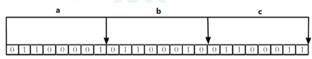
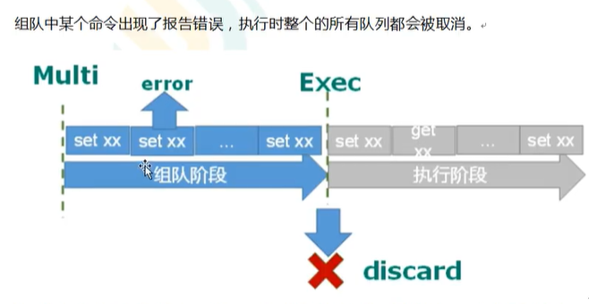

# NoSQL数据库概述

> NoSQL(NoSQL = **Not Only SQL** )，意即“不仅仅是SQL”，泛指**非关系型的数据库**
>
> NoSQL 不像MySQL、Oracle等关系数据库依赖业务逻辑方式存储，而是以简单的key-value模式存储数据，因此大大的增加了数据库的扩展能力
>
> + Redis是一个**开源的key-value存储系统**
> + 和Memcache类似，它支持存储的value类型相对更多，包括**string字符串、list链表、set集合、zset有序集合和hash哈希类型**
> + 这些数据类型都支持push/pop、add/remove及取交集并集和差集及更丰富的操作，而且这些操作都是**原子性**的
> + 在此基础上，Redis支持各种不同方式的**排序**
> + 与Memcache一样，为保证效率，数据都是**缓存在内存中**
> + 区别的是Redis会**周期性**地把更新的**数据写入磁盘**或者把修改操作写入追加的记录文件
> + 并且在此基础上实现了**master-slave(主从同步)**

#### 特点

+ 不遵循SQL标准
+ 不支持ACID（注意**不是说NoSQL不支持事务**）
+ 性能远超SQL

#### 优点

+ NoSQL能减少CPU与IO的压力，它直接通过内存进行读取
+ NoSQL可以作为缓存使用，提高我们的访问速度，减小数据库IO的读操作

#### NoSQL适用场景

+ 对数据高并发的读写（比如秒杀功能）

+ 海量数据的读写

+ 对数据的高可扩展性

+ 配合关系型数据库做高速缓存（高频次，热门访问的数据，降低数据库IO）

+ 分布式架构中做session共享，或以下操作

  

#### NoSQL不适用的场景

+ 需要事务的支持
+ 基于SQL的结构化查询存储，处理复杂的关系
+ 一句话就是**用不着SQL或者用了SQL也不行的情况，请考虑使用NoSQL**

#### NoSQL数据库举例

##### Memcache

+ 很早出现的NoSQL数据库
+ 数据都在内存中且一般**不能持久化**
+ 支持简单的key-value模式，**支持类型单一**，只支持字符串别的不支持
+ 一般是作为**缓存数据库**辅助持久化的数据库

##### Redis

+ 几乎覆盖了Memcache的绝大部分功能
+ 数据都在内存中，**支持持久化**，主要用作备份恢复
+ 除了支持简单的key-value模式，还支持多种数据结构的存储，比如list、set、hash、zset等
+ 一般是作为**缓存数据库**辅助持久化的数据库

##### MongoDB

+ 高性能、开源、模式自由的**文档型数据库**
+ 数据都在内存中，若内存不足则将不常用的数据保存到硬盘
+ 虽然是key-value模式，但是对value（尤其是json）提供了丰富的查询功能
+ 支持二进制数据及大型对象
+ 可以根据数据的特点替代RDBMS，成为独立的数据库，或者配合RDBMS存储特定的数据

# Redis6安装与启动及关闭

#### 安装

> 我们目前装的Redis都是装在Linux系统中

+ https://redis.io/官网下载Redis

+ 将下载的tar.gz包通过Xftp上传到Linux的/opt目录下

+ 安装Redis时，要求Linux系统中有C语言的**gcc编译环境**，安装gcc编译环境如下

  ```shell
  # 本地有没有gcc编译环境
  [root@JavaEE ~] gcc --version
  -bash: gcc: command not found
  yum install centos-release-scl scl-utils-build
yum install -y devtoolset-8-toolchain
  scl enable devtoolset-8 bash
  # 或
  yum install gcc
  ```
  
+ 因为centos7.6自带gcc编译环境，所以下一步来到opt目录下解压redis

  ```powershell
  [root@localhost opt]# tar -zxvf redis-6.2.6.tar.gz
  ```

+ 进入解压后的redis目录

  ```powershell
  [root@localhost opt]# cd redis-6.2.6/
  ```

+ 使用make命令将redis进行编译成C文件

  ```powershell
  [root@localhost redis-6.2.6]# make
  ```

+ 使用make install进行安装，默认会安装到/usr/local/bin目录

  ```powershell
  [root@localhost redis-6.2.6]# make install
  ```

+ 进入并查看/usr/local/bin目录，有六个Redis的文件目录则安装成功

  + redis-benchmark：它是一个性能测试工具，可在自己本机运行，看看性能如何
  + redis-check-aof：修复有问题的AOF文件
  + redis-check-rdb：修复有问题的rdb文件
  + redis-sentinel：Redis集群会使用到
  + **redis-server**：Redis服务器启动命令
  + **redis-cli**：客户端，操作入口

#### 启动

Redis的两种启动方式：

1. 前台启动（不推荐），通过redis-server命令即可前台启动，Ctrl+c停止

   ```powershell
   [root@localhost bin]# redis-server
   ```

2. **后台启动（推荐）**：

   1. 先进入Redis的目录，在原opt目录下

      ```powershell
      [root@localhost bin]# cd /opt/redis-6.2.6/
      ```

   2. 在Redis目录下有一个redis.conf配置文件，将该文件复制到/etc/redis.conf

      ```powershell
      [root@localhost redis-6.2.6]# cp redis.conf /etc/redis.conf
      ```

   3. 修改etc目录下的这个redis.conf文件的daemonize属性的值为yes，表示支持后台启动

   4. 通过etc目录下的这个配置文件以后台启动的方式启动Redis，首先还是进入到Redis的安装目录下

      ```powershell
      [root@localhost etc]# cd /usr/local/bin
      ```

   5. 后台启动Redis，通过redis-server + 我们配置好的文件就可以后台启动Redis

      ```powershell
      [root@localhost bin]# redis-server /etc/redis.conf
      ```

   6. 查看redis进程，判断是否启动，占用6379端口则说明启动成功

      ```powershell
      [root@localhost bin]# ps -ef | grep redis
      ```

   > 使用后台启动的好处就是我们即使关闭了Xshell链接窗口，Redis依然在运行，而前台启动就不会运行

   7. 后台启动之后，我们还可以通过redis-cli客户端来链接运行中的Redis，然后输入ping命令返回pong，说明是一个正常的连通状态

      ```powershell
      [root@localhost bin]# redis-cli
      127.0.0.1:6379> ping
      PONG
      ```

#### 关闭

1. 在客户端中进行Redis运行的终止

   ```powershell
   127.0.0.1:6379> shutdown
   not connected> exit
   ```

2. 在客户端外进行shutdown关闭操作

   ```powershell
   [root@localhost bin]# redis-cli shutdown
   ```

3. 通过结束进程的方式，终止Redis的运行

   ```powershell
   $ 查看redis正在运行的进程号
   [root@localhost bin]# ps -ef | grep redis
   root       8206      1  0 17:56 ?        00:00:00 redis-server 127.0.0.1:6379
   root       8230   3110  0 17:58 pts/1    00:00:00 grep --color=auto redis
   # 通过杀掉指定进程号，终止redis的运行
   [root@localhost bin]# kill -9 8206
   ```

> 关闭后统一都可以通过查看进程来判断是否关闭

# Redis介绍相关知识【Redis库切换、Redis底层机制】

1. 6379端口号的由来

   > 有一个女演员的名称叫做Alessia Merz，而Merz这四个字母就对应这个老款按键手机上的拼音，M对应按键6，这下懂了吧

2. 在Redis中，默认提供了16个数据库，而默认的数据库下标从0开始(0-15)，初始时**默认使用0号库**，其他库基本上用不到，而这些数据库的密码都是相同的，可以使用select 索引来切换数据库

   ```powershell
   [root@localhost bin]# redis-server /etc/redis.conf 
   [root@localhost bin]# redis-cli
   # 切换到1号库
   127.0.0.1:6379> select 1
   OK
   # 切换到15号库
   127.0.0.1:6379[1]> select 15
   OK
   # 切换到0号库，即默认库
   127.0.0.1:6379[15]> select 0
   OK
   127.0.0.1:6379>
   ```

3. Redis与Memcache相比

   + Redis支持更多数据类型；Memcache只支持单一字符串类型

   + Redis支持持久化；Memcache不支持持久化

   + Redis底层使用单线程 + 多路IO复用机制；Memcache底层使用多线程 + 锁的机制

     > 123都要买票，都会交待给黄牛去买，黄牛一个人带着他们的诉求去火车站买，这就是一个**单线程的操作**
     >
     > 而黄牛可能买到也可能暂时买不到，买到了则通知指定需要的人过来取，没通知的那些人不会傻傻原地等，而是去做自己的事情，这样充分利用了CPU，效能就大大提升了，而多个人找黄牛买票的情况就是**多路IO复用**

# Redis6常用五大数据类型

## Redis key操作

> 在学习数据类型之前，先了解以下key操作，首先Redis是基于key-value进行存储的，所以先了解在Redis中针对它的key(键)的一些操作

|          命令          |                             描述                             |
| :--------------------: | :----------------------------------------------------------: |
|   set [key] [value]    | 向当前库添加key-value数据<br />若key存在则为修改指定key的值  |
|         keys *         |                    查看当前库中所有的key                     |
|      exists [key]      |     判断某个key是否存在<br />1表示存在<br />0表示不存在      |
|       type [key]       |                      查看当前key的类型                       |
|       del [key]        |                 直接删除指定的key-value数据                  |
|      unlink [key]      |                 **根据value选择非阻塞删除**                  |
| expire [key] [seconds] |                     设置指定key过期时间                      |
|       ttl [key]        | 查看key还有多少秒过期<br />-1 表示永不过期<br />-2 表示已过期 |
|         dbsize         |                  查看当前数据库的key的数量                   |
|        flushdb         |                    清空当前库（使用较少）                    |
|        flushall        |                    通杀全部库（使用较少）                    |

1. 在默认库中设置三个键值对

   ```powershell
   # 设置了三个key-value
   127.0.0.1:6379> set key1 Lucy
   OK
   127.0.0.1:6379> set key2 Martha
   OK
   127.0.0.1:6379> set key3 Jack
   OK
   ```

2. 查看当前库中所有的key

   ```powershell
   127.0.0.1:6379> keys *
   1) "key1"
   2) "key2"
   3) "key3"
   ```

3. 判断指定名称的key是否存在

   ```powershell
   # 存在key1
   127.0.0.1:6379> exists key1
   (integer) 1
   # 不存在key6
   127.0.0.1:6379> exists key6
   (integer) 0
   ```

4. 查看指定的key是什么类型

   ```powershell
   127.0.0.1:6379> type key1
   string
   127.0.0.1:6379> type key2
   string
   ```

5. 删除指定key-value键值对，del删除和unlink删除结果都一样，过程不一样

   ```powershell
   127.0.0.1:6379> del key3
   (integer) 1
   127.0.0.1:6379> keys *
   1) "key1"
   2) "key2"
   ```

6. 给指定的key设置上过期时间，过期之后key-value就不存在了

   ```powershell
   # 设置key1的过期时间为10
   127.0.0.1:6379> expire key1 10
   (integer) 1
   # 还剩6秒过期
   127.0.0.1:6379> ttl key1
   (integer) 6
   # -2表示已经过期
   127.0.0.1:6379> ttl key1
   (integer) -2
   # 查看当前库中所有key，发现只剩下key2了，key3被del直接删除，key1过期
   127.0.0.1:6379> keys *
   1) "key2"
   # -1表示永不过期
   127.0.0.1:6379> ttl key2
   (integer) -1
   ```

7. 查看当前库中有多少个数量的key

   ```powershell
   127.0.0.1:6379> keys *
   1) "key1"
   2) "key2"
   3) "key3"
   # 有三个键值对，那么dbsize就为3
   127.0.0.1:6379> dbsize
   (integer) 3
   ```

## Redis字符串(String)

#### 简介

+ String是Redis中最基本的数据类型，可以理解为与Memcache一模一样的类型，一个key对应一个value，是很常用的数据类型
+ String类型是**二进制安全的(只要内容可以使用字符串表示，那就都可以存储到里边去)**，意味着Redis的String**可以包含任何数据**，比如jpg或者序列化的对象
+ 一个Redis中字符串的value最多可以是512MB

#### 常用命令

|              命令               |                             描述                             |
| :-----------------------------: | :----------------------------------------------------------: |
|        set [key] [value]        | 向当前库添加key-value数据<br />若key存在则为修改指定key的值  |
|            get [key]            |                   获取当前库中指定key的值                    |
|      append [key] [value]       | 将指定的value追加到指定key对应的value末尾<br />返回值为字符串追加后字符串的总长度 |
|          strlen [key]           |                获取指定key对应的value值的长度                |
|       setnx [key] [value]       |          若指定key不存在，才向当前库中添加key-value          |
|           incr [key]            |       使指定key的value + 1<br />仅当value为数值型才可        |
|           decr [key]            |       使指定key的value - 1<br />仅当value为数值型才可        |
|    incrby [key] [increment]     | 使指定的key对应的value + increment<br />仅当value为数值型才可 |
|    decrby [key] [increment]     | 使指定的key对应的value - increment<br />仅当value为数值型才可 |
|      mset [key] [value]..       |        同时设置key-value对或修改多个key对应的value对         |
|          mget [key] ..          |                 同时获取多个key对应的value值                 |
|     msetnx [key] [value]..      | 设置一个或多个key-value对<br />当且仅当所有的指定key都不存在时<br />若设置的key中有一个存在则无法都设置 |
|  getrange [key] [start] [end]   |         相当于substring操作，但是包含start也包含end          |
| setrange [key] [offset] [value] |         相当于覆盖操作，在指定索引处替换一定长度的值         |
|  setex [key] [seconds] [value]  |          在设置key-value对的时候直接设置其过期时间           |
|      getset [key] [value]       |               设置新值同时会返回旧值，以新换旧               |

> incrby 和 decrby操作具有原子性，该原子性不是事务所谓的原子性，该原子性指的是Redis中的原子操作，也就是**不会被线程调度机制打断的操作**，这种操作**一旦开始就会一直运行到结束**，因为Redis是一个单线程的操作，每个操作都是一个独立的线程，并不是多线程的，简单解释就是你的服务即使是多机器多进程的，incr也能保证每次返回的结果不会出现相同的值
>
> 所以Java中的i++操作并不是原子操作，非原子操作的话值是不固定的

1. 向当前库中添加键值对

   ```powershell
   127.0.0.1:6379> set key1 value1
   OK
   127.0.0.1:6379> set key2 value2
   OK
   127.0.0.1:6379> keys *
   1) "key1"
   2) "key2"
   ```

2. 获取指定key的值

   ```powershell
   127.0.0.1:6379> get key1
   "value1"
   127.0.0.1:6379> get key2
   "value2"
   ```

3. 向指定key对应的value值后面追加内容

   ```powershell
   # 追加内容 “001”
   127.0.0.1:6379> append key1 001
   (integer) 9
   127.0.0.1:6379> get key1
   "value1001"
   ```

4. 求指定key对应的value值的长度

   ```powershell
   127.0.0.1:6379> get key2
   "value2"
   # 字符串长度为6
   127.0.0.1:6379> strlen key2
   (integer) 6
   ```

5. 若指定的key不存在，才向当前库添加key-value数据

   ```powershell
   127.0.0.1:6379> keys *
   1) "key1"
   2) "key2"
   # 在key2存在的情况下，还想添加，那么就返回0，即false，表示不能设置成功
   127.0.0.1:6379> setnx key2 Maria
   (integer) 0
   # 设置不存在的key才能成功
   127.0.0.1:6379> setnx key3 value3
   (integer) 1
   ```

6. value值的 ++ 操作

   ```powershell
   127.0.0.1:6379> set key1 100
   OK
   127.0.0.1:6379> incr key1
   (integer) 101
   127.0.0.1:6379> get key1
   "101"
   ```

7. value值的 -- 操作

   ```powershell
   127.0.0.1:6379> decr key1
   (integer) 100
   127.0.0.1:6379> get key1
   "100"
   ```

8. value值自定义增加数值

   ```powershell
   127.0.0.1:6379> get key1
   "100"
   # 加10操作
   127.0.0.1:6379> incrby key1 10
   (integer) 110
   127.0.0.1:6379> get key1
   "110"
   ```

9. value值自定义递减数值

   ```powershell
   127.0.0.1:6379> get key1
   "110"
   # 减10操作
   127.0.0.1:6379> decrby key1 10
   (integer) 100
   127.0.0.1:6379> get key1
   "100"
   ```

10. 同时**设置**并**获取**或**修改**一个或多个key-value对

    ```powershell
    # 同时设置一个或多个key-value对
    127.0.0.1:6379> mset username Martha password 123456
    OK
    # 同时获取一个或多个key对应的value
    127.0.0.1:6379> mget username password
    1) "Martha"
    2) "123456"
    # 同时修改一个或多个指定key对应的value（当key已经存在时）
    127.0.0.1:6379> mset username Lucy password 654321
    OK
    127.0.0.1:6379> mget username password
    1) "Lucy"
    2) "654321"
    ```

11. 获取一个value值的范围，相当于取子串操作

    ```powershell
    127.0.0.1:6379> get key1
    "username"
    # 索引从0开始，一直取到3位置上的元素，包括 3
    127.0.0.1:6379> getrange key1 0 3
    "user"
    ```

12. 在指定索引插入串操作

    ```powershell
    127.0.0.1:6379> get key1
    "username"
    # 在末尾覆盖相当于append
    127.0.0.1:6379> setrange key1 8 =Martha
    (integer) 15
    127.0.0.1:6379> get key1
    "username=Martha"
    # 从索引2的位置上开始覆盖内容
    127.0.0.1:6379> setrange key1 2 =Martha
    (integer) 15
    127.0.0.1:6379> get key1
    "us=MarthaMartha"
    ```

13. 在设置key-value对的同时设置其过期时间

    ```powershell
    127.0.0.1:6379> setex age 10 30
    OK
    127.0.0.1:6379> ttl age
    (integer) -2
    # 过期后就不存在age键值对了
    127.0.0.1:6379> keys *
    1) "username"
    2) "key1"
    3) "password"
    ```

14. 以新换旧

    ```powershell
    # 旧值（未修改前）为lucy
    127.0.0.1:6379> get username
    "Lucy"
    # 修改时返回旧值，并设置上新值
    127.0.0.1:6379> getset username Alex
    "Lucy"
    # 获取新值
    127.0.0.1:6379> get username
    "Alex"
    ```

#### String类型底层数据结构

> Redis中Sting类型的底层数据结构为简单动态字符串（Simple Dynamic String,缩写SDS），是可以修改的字符串，内部结构实现上类似于Java的ArrayList，采用预分配冗余空间的方式减少内存的频繁分配

## Redis列表(List)

#### 简介

+ Redis中的List列表是**单键多值**的
+ Redis中的List列表是简单的字符串列表，按照插入顺序进行排序，可以添加一个元素到列表的头部或者尾部
+ Redis中的List列表底层其实是一个**双向链表**，对两端的操作性能很高，通过索引下标操作中间的结点的性能会较差，即查询中间的结点效率比较低

#### 常用命令

|                     命令                     |                             描述                             |
| :------------------------------------------: | :----------------------------------------------------------: |
|            lpush [key] [value..]             |       从双向链表左边插入一个或多个值<br />相当于头插法       |
|            rpush [key] [value..]             |       从双向链表右边插入一个或多个值<br />相当于尾插法       |
|         lrange [key] [start] [stop]          | 从左到右获取双向链表中指定范围的值<br />start:0 stop:-1表示取所有的值<br />0表示头元素，-1表示尾元素 |
|              lpop [key] [count]              | 从左边`取出`count个值<br />**值在键在，值光键亡**<br />出几个少几个 |
|              rpop [key] [count]              | 从右边`取出`count个值<br />**值在键在，值光键亡**<br />出几个少几个 |
|           rpoplpush [key1] [key2]            |      从key1链表右边`取出`一个值<br />插入到key2链表左边      |
|             lindex [key] [index]             |                 按照索引获取元素（从左到右）                 |
|                  llen [key]                  |                         获取链表长度                         |
| linset [key] before/after [value] [newValue] |           在链表指定的值的**前面/后面插入新的值**            |
|          lrem [key] [count] [value]          |         删除链表中count个数的**指定值**（从左到右）          |
|        lset [key] [index] [newValue]         |               将链表中指定索引的值替换为新的值               |

1. 从双向链表左边添加一个或多个值

   ```powershell
   # key为：hobby，值为：baseball basketball soccer
   127.0.0.1:6379> lpush hobby baseball basketball soccer
   (integer) 3
   # 左边插入的特点就是头插法，底层存储就是：soccer basketball baseball
   127.0.0.1:6379> lrange hobby 0 -1
   1) "soccer"
   2) "basketball"
   3) "baseball"
   ```

2. 从双向链表右边添加一个或多个值

   ```powershell
   # key为：subjects，值为：English Chinese Java
   127.0.0.1:6379> rpush subjects English Chinese Java
   (integer) 3
   # 左边插入的特点就是尾插法，底层存储就是：English Chinese Java，取出：
   127.0.0.1:6379> lrange subjects 0 -1
   1) "English"
   2) "Chinese"
   3) "Java"
   ```

3. 从左边吐出一个值

   ```powershell
   127.0.0.1:6379> lrange subjects 0 -1
   1) "English"
   2) "Chinese"
   3) "Java"
   # 从左边吐出一个值
   127.0.0.1:6379> lpop subjects 1
   1) "English"
   # 吐出后，该值就不存在于链表中了
   127.0.0.1:6379> lrange subjects 0 -1
   1) "Chinese"
   2) "Java"
   ```

4. 从右边取出两个值

   ```powershell
   127.0.0.1:6379> lrange subjects 0 -1
   1) "Chinese"
   2) "Java"
   # 取出的时候也是按顺序取出的
   127.0.0.1:6379> rpop subjects 2
   1) "Java"
   2) "Chinese"
   # 当链表中没有值之后，键也就不存在了	
   127.0.0.1:6379> lrange subjects 0 -1
   (empty array)
   # 没有key为subjects的了
   127.0.0.1:6379> keys *
   1) "hobby"
   ```

5. 取右插左

   ```powershell
   # key：scores value：30 20 10
   127.0.0.1:6379> lpush scores 10 20 30
   (integer) 3
   127.0.0.1:6379> lrange scores 0 -1
   1) "30"
   2) "20"
   3) "10"
   # key：weight value：60 50 40
   127.0.0.1:6379> lpush weight 40 50 60
   (integer) 3
   127.0.0.1:6379> lrange weight 0 -1
   1) "60"
   2) "50"
   3) "40"
   # 取weight右插scores左
   127.0.0.1:6379> rpoplpush weight scores
   "40"
   # key：weight value：60 50
   127.0.0.1:6379> lrange weight 0 -1
   1) "60"
   2) "50"
   # key：scores value：40 30 20 10
   127.0.0.1:6379> lrange scores 0 -1
   1) "40"
   2) "30"
   3) "20"
   4) "10"
   ```

6. 获取链表中指定索引的元素

   ```powershell
   127.0.0.1:6379> rpush names Martha Lucy Micheal
   (integer) 3
   127.0.0.1:6379> lrange names 0 -1
   1) "Martha"
   2) "Lucy"
   3) "Micheal"
   # 获取索引为 0 的元素
   127.0.0.1:6379> lindex names 0
   "Martha"
   ```

7. 获取链表的长度

   ```powershell
   127.0.0.1:6379> lrange names 0 -1
   1) "Martha"
   2) "Lucy"
   3) "Micheal"
   # 长度为 3
   127.0.0.1:6379> llen names
   (integer) 3
   ```

8. 在链表中指定的值前或后插入一个新的值

   ```powershell
   # 原链表
   127.0.0.1:6379> lrange names 0 -1
   1) "Martha"
   2) "Lucy"
   3) "Micheal"
   # 在 Lucy 前插入 Alex
   127.0.0.1:6379> linsert names before Lucy Alex
   (integer) 4
   127.0.0.1:6379> lrange names 0 -1
   1) "Martha"
   2) "Alex"
   3) "Lucy"
   4) "Micheal"
   # 在 Lucy 后插入 Maria
   127.0.0.1:6379> linsert names after Lucy Maria
   (integer) 5
   127.0.0.1:6379> lrange names 0 -1
   1) "Martha"
   2) "Alex"
   3) "Lucy"
   4) "Maria"
   5) "Micheal"
   ```

9. 删除指定个数的指定值

   ```powershell
   # 原链表
   127.0.0.1:6379> lrange names 0 -1
   1) "Martha"
   2) "Alex"
   3) "Alex"
   4) "Alex"
   5) "Lucy"
   6) "Maria"
   7) "Micheal"
   # 删除两个值为Alex
   127.0.0.1:6379> lrem names 2 Alex
   (integer) 2
   # 结果
   127.0.0.1:6379> lrange names 0 -1
   1) "Martha"
   2) "Alex"
   3) "Lucy"
   4) "Maria"
   5) "Micheal"
   
   ```

10. 替换指定索引位置上的值

    ```powershell
    127.0.0.1:6379> lrange names 0 -1
    1) "Martha"
    2) "Alex"
    3) "Lucy"
    4) "Maria"
    5) "Micheal"
    # 替换索引为4的值为Martha-X
    127.0.0.1:6379> lset names 4 Martha-X
    OK
    127.0.0.1:6379> lrange names 0 -1
    1) "Martha"
    2) "Alex"
    3) "Lucy"
    4) "Maria"
    5) "Martha-X"
    ```

#### List类型底层数据结构

> Redis中的List的数据结构为快速链表结构（quickList），特点如下：
>
> **在链表元素较少的情况下**会使用一块连续的内存存储，这个结构是ziplist，即**压缩链表**，它将所有的元素紧挨着一起存储，分配的是一块连续的内存，**当数据量多的时候才会改用quicklist**，即会将多个ziplist相互链在一起，就构成了quicklist，Redis将链表和ziplist结合起来组成了quicklist，也就是**将多个ziplist使用双向指针串起来使用**，这样既满足了快速的插入删除性能，又不会出现太大的空间冗余

## Redis集合(Set)

#### 简介

+ Redis中的Set集合对外提供的功能与List链表类似，都是一个链表的功能，特殊之处就是**Set集合可以自动去重复且元素是无序的**，当你只需要存储一个链表数据和，又不希望出现重复数据时，Set集合是一个很好的选择
+ Redis中的Set集合是String类型中的无序集合，底层其实是一个value为null的hash表，所以添加、删除、查找的复杂度都是O(1)

#### 常用命令

|            命令             |                             描述                             |
| :-------------------------: | :----------------------------------------------------------: |
|    sadd [key] [value..]     | 将一个或多个member成员(值)加入到集合key中<br />已经存在的元素将被忽略 |
|       smembers [key]        |                      获取该集合的所有值                      |
|   sismember [key] [value]   |             判断集合中是否含有该value值，有1没0              |
|         scard [key]         |                     返回该集合的元素个数                     |
|    srem [key] [value..]     |  删除集合中一个或多个指定的元素<br />**值在键在，值光键亡**  |
|     spop [key] [count]      | **随机取出**该集合中的一个或多个值<br />**会从集合中删除**<br />**值在键在，值光键亡** |
|  srandmember [key] [count]  |  **随机获取**该集合中的count个值<br />**不会从集合中删除**   |
| smove [key1] [key2] [value] |              将指定的值从key1集合移动到key2集合              |
|    sinter [key [key..]]     |               返回一个集合与多个集合的元素交集               |
|    sunion [key [key..]]     |               返回一个集合与多个集合的元素并集               |
|     sdiff [key [key..]]     |               返回一个集合与多个集合的元素差集               |

1. 添加一个或多个元素到集合中，并获取该集合的所有值

   ```powershell
   127.0.0.1:6379> sadd names Martha Lucy Alex
   (integer) 3
   127.0.0.1:6379> smembers names
   1) "Lucy"
   2) "Martha"
   3) "Alex"
   ```

2. 判断集合中是否含有该value值，有1没0

   ```powershell
   127.0.0.1:6379> smembers names
   1) "Lucy"
   2) "Martha"
   3) "Alex"
   127.0.0.1:6379> sismember names Martha
   (integer) 1
   127.0.0.1:6379> sismember names Martha-X
   (integer) 0
   ```

3. 返回该集合的元素个数

   ```powershell
   127.0.0.1:6379> smembers names
   1) "Lucy"
   2) "Martha"
   3) "Alex"
   127.0.0.1:6379> scard names
   (integer) 3
   ```

4. 删除集合中一个或多个指定的元素

   ```powershell
   127.0.0.1:6379> smembers names
   1) "Lucy"
   2) "Martha"
   3) "Alex"
   127.0.0.1:6379> srem names Lucy Alex
   (integer) 2
   127.0.0.1:6379> smembers names
   1) "Martha"
   ```

5. **随机取出**该集合中的一个或多个值

   ```powershell
   127.0.0.1:6379> smembers names
   1) "Lucy"
   2) "Martha"
   3) "Alex"
   # 随机取出两个
   127.0.0.1:6379> spop names 2
   1) "Martha"
   2) "Lucy"
   # 还剩一个
   127.0.0.1:6379> smembers names
   1) "Alex"
   ```

6. **随机获取**该集合中的一个或多个值

   ```powershell
   127.0.0.1:6379> smembers names
   1) "Lucy"
   2) "Martha"
   3) "Alex"
   # 随机获取两个
   127.0.0.1:6379> srandmember names 2
   1) "Lucy"
   2) "Alex"
   127.0.0.1:6379> smembers names
   1) "Lucy"
   2) "Martha"
   3) "Alex"
   ```

7. 将指定的值从key1集合移动到key2集合

   ```powershell
   127.0.0.1:6379> smembers names
   1) "Lucy"
   2) "Martha"
   3) "Alex"
   # 将Alex移动到dropout集合中
   127.0.0.1:6379> smove names dropout Alex
   (integer) 1
   127.0.0.1:6379> smembers names
   1) "Lucy"
   2) "Martha"
   127.0.0.1:6379> smembers dropout
   1) "Micheal"
   2) "Alex"
   ```

#### Set底层数据结构

> Set数据结构是dict字典，字典是使用哈希表实现的，通过哈希表可以快速找内容
>
> Java中的HashSet的内部实现使用的是HashMap，只不过所有的value都指向同一个对象，Redis的Set结构也是一样，它的内部也是用Hash结构，所有的value都指向同一个内部值

## Redis哈希(Hash)

#### 简介

+ Redis中的Hash是一个键值对集合
+ Redis中的Hash是一个String类型的**field和value的映射表**，hash特别适合用于存储对象，类似于Java中的Map<String,Object>，即key就是键，value就是一个对象值，对象中每一个元素都是field和value，这样的好处就是存储更加方便，取值与改值也方便

#### 常用命令

|               命令                |                     描述                     |
| :-------------------------------: | :------------------------------------------: |
|    hset [key] [field] [value]     |        给集合key中的field键赋值value         |
|        hget [key] [field]         |      从集合key中取出field对应的value值       |
|  hmset [key] [[field] [value]..]  |                批量设置hash值                |
|       hexists [key] [field]       |     查看指定集合key中给定域field是否存在     |
|            hkeys [key]            |           列出该key集合的所有field           |
|            hvals [key]            |           列出该key集合的所有value           |
| hincrby [key] [filed] [increment] |   为集合key中的指定field的值增加increment    |
|   hsetnx [key] [field] [value]    | 设置集合中field域的值，当且仅当field域不存在 |

**部分命令测试**

```powershell
# key为 Person，field：id name，值分别为 1001 Martha
127.0.0.1:6379> hset Person id 1001 name Martha
(integer) 2
# 获取Person哈希表中的name字段的值
127.0.0.1:6379> hget Person name
"Martha"
# 在Person集合中是否存在age字段
127.0.0.1:6379> hexists Person age
(integer) 0
# 列出Person集合的所有字段名称
127.0.0.1:6379> hkeys Person
1) "id"
2) "name"
# 列出Person集合中所有字段对应的值
127.0.0.1:6379> hvals Person
1) "1001"
2) "Martha"
# 添加 age 字段及其对应的值
127.0.0.1:6379> hset Person age 20
(integer) 1
# 使age字段的值 + 1
127.0.0.1:6379> hincrby Person age 1
(integer) 21
127.0.0.1:6379> hget Person age
"21"
```

#### Hash底层数据结构

> Hash类型对应的数据结构是两种：ziplist（压缩链表）、hashtable（哈希表），当field-value长度较短且个数较少时，使用ziplist，否则使用hashtable

## Redis有序集合(Zset)

#### 简介

+ Zset有序集合和普通集合Set非常相似，是一个没有重复元素的字符串集合
+ 不同指出就是有序集合的每个成员都关联了一个**评分(score)**，这个评分(score)是用来按照从最低分到最高分的方式排序集合中的成员，**集合的成员是唯一的，但是评分是可以重复的**
+ 因为元素是有序的，所以可以很快地根据评分(score)或者次序(position)来获取一个范围内的元素
+ **访问有序集合的中间元素也是非常快的**，因此可以使用有序集合Zset作为一个没有重复成员的智能列表

#### 常用命令

|                      命令                       |                             描述                             |
| :---------------------------------------------: | :----------------------------------------------------------: |
|         zadd [key] [[score] [value]..]          |        将一个或多个元素及其score值加入到有序集合key中        |
|    zrange [key] [start] [stop] [WITHSCORES]     | 返回有序集合key中，索引在start和stop之间的元素<br />带上WITHSCORES可以让分数一起和值返回到结果集 |
|  zrangebyscore [key] [min] [max] [WITHSCORES]   | 返回指定评分范围内的元素<br />带上WITHSCORES可以让分数一起和值返回到结果集 |
| zrevrangebyscore [key] [max] [min] [WITHSCORES] | 将指定评分范围内的元素从大到小排序<br />带上WITHSCORES可以让分数一起和值返回到结果集 |
|        zincrby [key] [increment] [value]        |                  为元素的score评分加上增量                   |
|               zrem [key] [value]                |                      删除集合中指定的值                      |
|            zcount [key] [min] [max]             |                 统计集合中评分区间的元素个数                 |
|               zrank [key] [value]               |      返回元素在集合中的排名(**就是索引**)，默认从0开始       |

1. 将一个或多个元素及其score值加入到有序集合key中，并返回索引范围中的元素

   ```powershell
   127.0.0.1:6379> zadd subjects 10 Java 6 HTML 8 C++
   (integer) 3
   # 返回所有有序集合中的元素【元素按照评分从小到大排序】
   127.0.0.1:6379> zrange subjects 0 -1
   1) "HTML"
   2) "C++"
   3) "Java"
   # 返回所有有序集合中的元素及其评分【元素按照评分从小到大排序】
   127.0.0.1:6379> zrange subjects 0 -1 withscores
   1) "HTML"
   2) "6"
   3) "C++"
   4) "8"
   5) "Java"
   6) "10"
   ```

2. 返回指定评分范围内的元素

   ```powershell
   # 返回评分在8~10之间（包括8和10）
   127.0.0.1:6379> zrangebyscore subjects 8 10
   1) "C++"
   2) "Java"
   # 返回评分在8~10之间的元素及其评分
   127.0.0.1:6379> zrangebyscore subjects 8 10 WITHSCORES
   1) "C++"
   2) "8"
   3) "Java"
   4) "10"
   ```

3. 将指定评分范围内的元素从大到小排序

   ```powershell
   # 从10分到0分排序
   127.0.0.1:6379> zrevrangebyscore subjects 10 0 
   1) "Java"
   2) "C++"
   3) "HTML"
   127.0.0.1:6379> zrevrangebyscore subjects 10 0 WITHSCORES
   1) "Java"
   2) "10"
   3) "C++"
   4) "8"
   5) "HTML"
   6) "6"
   ```

4. 为元素的score评分加上增量

   ```powershell
   127.0.0.1:6379> zincrby subjects 2 Java
   "12"
   127.0.0.1:6379> zrange subjects 0 10 withscores
   1) "HTML"
   2) "6"
   3) "C++"
   4) "8"
   5) "Java"
   6) "12"
   ```

5. 删除集合中指定元素

   ```powershell
   127.0.0.1:6379> zrange subjects 0 10 withscores
   1) "java"
   2) "2"
   3) "HTML"
   4) "6"
   5) "C++"
   6) "8"
   7) "Java"
   8) "12"
   127.0.0.1:6379> zrem subjects java
   (integer) 1
   127.0.0.1:6379> zrange subjects 0 10 withscores
   1) "HTML"
   2) "6"
   3) "C++"
   4) "8"
   5) "Java"
   6) "12"
   ```

6. 统计集合中评分区间的元素个数

   ```powershell
   127.0.0.1:6379> zrange subjects 0 10 withscores
   1) "HTML"
   2) "6"
   3) "C++"
   4) "8"
   5) "Java"
   6) "12"
   # 0 - 10 区间的元素个数就两个 HTML 和 C++
   127.0.0.1:6379> zcount subjects 0 10
   (integer) 2
   ```

7. 返回元素在集合中的排名，也就是索引，默认从0开始

   ```powershell
   127.0.0.1:6379> zrange subjects 0 10 withscores
   1) "HTML"
   2) "6"
   3) "C++"
   4) "8"
   5) "Java"
   6) "12"
   127.0.0.1:6379> zrank subjects HTML
   (integer) 0
   127.0.0.1:6379> zrank subjects Java
   (integer) 2
   ```

#### Zset底层数据结构

> SortedSet（Zset）是Redis提供的一个非常特别的数据结构，一方面它等价于Java的数据结构Map<String,Double>，可以给每一个元素赋予一个权重score，另一方面它又类似于TreeSet，内部元素会按照权重score进行排序，可以得到每个元素的名次，还可以通过score的范围来获取元素的列表
>
> Zset底层使用了两个数据结构
>
> + hash：hash的作用就是关联元素dvalue和权重score，保障元素value的唯一性，可以通过元素value找到相应的score值
> + 跳跃表：跳跃表的目的在于给元素value排序，根据score的范围获取元素列表
>
> **跳跃表（跳表）**
>
> ​	有序集合在生活中比较常见，例如根据成绩对学生进行排名、根据得分对玩家排名等；对于有序集合的底层实现，可以使用数组、平衡树、链表等；数组不便元素的插入、删除；平衡数或红黑树虽然效率高但结构复杂；链表查询需要遍历所以效率低；**Redis采用的是跳跃表，跳跃表效率堪比红黑树，实现远比红黑树简单**

# Redis6配置文件详解

+ Redis中大小单位**只支持字节(byte)类型**，不支持其他类型，且大小写不敏感

  ```properties
  # 1k => 1000 bytes
  # 1kb => 1024 bytes
  # 1m => 1000000 bytes
  # 1mb => 1024*1024 bytes
  # 1g => 1000000000 bytes
  # 1gb => 1024*1024*1024 bytes
  ```

+ INCLUDES区域，在redis.conf文件中也可以包含其他文件中的内容，类似于jsp中的include标签，一个页面中包含另一个页面中的内容，比如一些公共部分就可以使用这个包含，使用include做个实现

  ```properties
  ################################## INCLUDES ###################################
  
  # Include one or more other config files here.  This is useful if you
  # have a standard template that goes to all Redis servers but also need
  # to customize a few per-server settings.  Include files can include
  # other files, so use this wisely.
  ```

+ NETWORK配置

  ```properties
  # 目前访问只能通过本地进行访问Redis，即在Linux系统中通过本地链接Redis，若想通过其他电脑远程连接是不可以的，所以这个bind的值是限制你只能本地链接，所以可以将这个限制在配置文件中给注释掉，注释掉之后，就可以支持远程连接了
  bind 127.0.0.1 -::1
  
  # 这表示开启Redis的保护模式，即它只能本机访问，远程不能访问，默认是yes，所以我们要想远程链接，也要将其改为 no
  protected-mode yes
  
  # 设置tcp的backlog，backlog其实是一个链接队列，backlog队列总和=未完成三次握手 + 已完成三次握手队列，在高并发环境下需要设置一个高的tcp-backlog的值来避免客户端链接慢的问题
  tcp-backlog 511
  
  # Redis客户端的超时时间（单位秒），当链接上Redis后，若在指定的timeout时间中没有操作Redis，那么链接就会超时，需要再次链接Redis方可使用，默认为0，即永不超时
  timeout 0
  
  # “心跳时间”，例如我连接上Redis之后，很长时间没有操作，那么Redis机制会检测当前你是否还在操作，若没有操作就会结束链接，还在操作就继续提供服务，即每隔300s就检测一次，链接是否还活着，活着就继续提供服务，不活着就释放链接
  tcp-keepalive 300
  ```

+ GENERAL通用配置

  ```properties
  # 支持Redis后台启动，默认为no，改为yes
  daemonize yes
  
  # Redis每次运行都有一个进程号，他将这个进程号设置进了以下路径的文件中了，在里面保存进程号
  pidfile /var/run/redis_6379.pid
  
  # 表示Redis中的日志级别，有四个级别：DEBUG VERBOSE NOTICE WARNING
  loglevel notice
  
  # 表示设置日志的输出文件路径，默认为空，当然也可以自定路径
  logfile ""
  
  # Redis默认有16个数据库，我们默认使用的是0号库
  databases 16
  ```

+ SECURITY安全配置

  ```properties
  # Redis的密码设置，默认是没有密码的，打开注释，然后将foobared替换为我们的密码即可，当然也可以在Redis客户端中设置密码
  # requirepass foobared
  ```

  > 通过命令设置密码

+ LIMITS限制配置

  ```properties
  # 设置Redis客户端的最大连接数，默认为10000个客户端，若达到了最大连接数，Redis会拒绝新的链接请求，并向这些请求响应“max number of clients reached”
  # maxclients 10000
  
  # 设置Redis可以使用的内存容量，一旦达到上限，Redis将视图移除内部数据，移除规则可以通过maxmemory-policy来指定，默认为0，即不做限制，建议必须设置，否则，将内存占满，会造成服务器宕机（如果使用Redis做数据库的话，设置到物理内存的1/2到3/4左右都可以）
  maxmemory 0
  ```

# Redis6的发布和订阅

## 什么是发布和订阅

+ Redis的发布(pub)订阅(sub)其实就**是一种消息通信模式**，**发送者(pub)发送消息，订阅者(sub)接收消息**，如发布者p1和订阅者s1，只要p1发布了内容，s1就能获取到
+ Redis客户端可以订阅任意数量的频道，如下图，假设s1只订阅了p1的1频道，那么只能获取到p1通过1频道发布的消息内容，若s1把这三个频道都订阅了，那么无论p1通过哪个频道发布内容，s1总能获取到
+ 如以下贴切一点，有三个客户端都订阅了channel1频道，那么发布者通过该频道发布了hello字符串内容，那么这个hello消息就会发送给三个客户端

## 发布订阅命令行实现

1. 打开一个Redis客户端订阅频道channel01

   ```powershell
   127.0.0.1:6379> subscribe channel01
   Reading messages... (press Ctrl-C to quit)
   1) "subscribe"
   2) "channel01"
   3) (integer) 1 # 此处的1意思是订阅了一个频道
   ```

2. 打开另一个客户端在频道channel01发布消息hello

   ```powershell
   127.0.0.1:6379> publish channel01 hello
   (integer) 1
   ```

3. 打开第一个客户端可以看到发送的消息

   ```powershell
   127.0.0.1:6379> subscribe channel01
   Reading messages... (press Ctrl-C to quit)
   1) "subscribe"
   2) "channel01"
   3) (integer) 1
   1) "message"
   2) "channel01"
   3) "hello"
   ```

   

> 只有订阅了的频道，才能接收到该频道中发布的消息，所以接收不到没有订阅频道中发布的消息内容，注意：**发布的消息或内容并没有持久化**

# Redis6新数据类型

## Bitmaps

#### 简介

> 这个数据类型就是用来进行**位操作**的，现代计算机使用二进制位来作为信息的基础单位，1 个字节等于8位，例如 “abc”字符串是由三个字节组成，但实际上计算机存储时是将其使用二进制表示的，"abc"分别对应的ASCII码分别位97 98 99，对应的二进制分别位01100001 01100010 01100011，如下图：
>
> 合理地使用位操作能够**有效提高内存使用率和开发效率**
>
> Redis提供了Bitmaps这个数据类型可以实现对位的操作
>
> + Bitmaps本身不是一种数据类型，实际上他就**是字符串**（key-value对），但是它可以对字符串的位进行操作，里边就是以0和1进行存储
> + Bitmaps单独提供了一套命令，所以在Redis中使用Bitmaps和使用字符串的方法不太相同，可以把Bitmaps想象成一个以位单位的数组，**数组的每个单元只能存储0和1，数组的下标在Bitmaps中叫做偏移量**，如下图

#### 常用命令

|                   命令                   |                             描述                             |
| :--------------------------------------: | :----------------------------------------------------------: |
|        setbit [key] [offset] 0/1         |     设置Bitmaps中某个偏移量的值为0或1<br />偏移量从0开始     |
|          getbit [key] [offset]           |                  获取Bimaps中某个偏移量的值                  |
|       bitcount [key] [start] [end]       | 统计从start到end结束位字符串中被设置为1的bit数量<br />start和end表示从第几个字节到第几个字节有多少1 |
| bitop [and/or/not/xor] [destkey] [key..] | bitop是一个复合操作，它可以做多个Bitmaps的and（交集）、or（并集）、not（非）、xor（异或）操作<br />并将结果保存在destkey中 |

> 例子：我们想统计每一个独立的用户是否访问过网站，将这些访问次数存放在Bitmaps中，将访问过的用户记作1，没有访问过的用户记作0，将偏移量就作为用户的唯一标识id
>
> 注意：很多应用的用户id大部分都是以一个指定的数字（如：100000）开头，直接将用户id和Bitmaps的偏移量对应起来势必会造成一定的浪费，通常的做法就是每次做setbit操作时将用户id减去这个指定的数字
>
> 在第一次初始化Bitmaps时，若**偏移量过大**，那么整个初始化的过程将会比较慢，可能**会造成Redis阻塞**

> bitop例子：

```powershell
# 2022-01-19号用户1访问过，以下类似
127.0.0.1:6379> setbit users:20220119 1 1
(integer) 0
127.0.0.1:6379> setbit users:20220119 6 1
(integer) 0
127.0.0.1:6379> setbit users:20220119 11 1
(integer) 0
127.0.0.1:6379> setbit users:20220119 15 1
(integer) 0
127.0.0.1:6379> setbit users:20220119 19 1
(integer) 0
# 获取指定用户是否访问过，11号用户访问过，10号没有
127.0.0.1:6379> getbit users:20220119 11
(integer) 1
127.0.0.1:6379> getbit users:20220119 10
(integer) 0
# 有五个用户访问过，有5个1的数量
127.0.0.1:6379> bitcount users:20220119
(integer) 5
# 从第一个字节到第二个字节，总共有多少个1，到第二个字节总共就2*8=16了，那么用户id在0-16之间的就有4个：1 6 11 15
127.0.0.1:6379> bitcount users:20220119 0 1
(integer) 4
```

```powershell
127.0.0.1:6379> setbit users:20220118 1 1
(integer) 0
127.0.0.1:6379> setbit users:20220118 5 1
(integer) 0
127.0.0.1:6379> setbit users:20220118 19 1
(integer) 0
127.0.0.1:6379> setbit users:20220118 4 1
(integer) 0
127.0.0.1:6379> setbit users:20220118 6 1
(integer) 0 

127.0.0.1:6379> setbit users:20220119 1 1
(integer) 0
127.0.0.1:6379> setbit users:20220119 6 1
(integer) 0
127.0.0.1:6379> setbit users:20220119 11 1
(integer) 0
127.0.0.1:6379> setbit users:20220119 15 1
(integer) 0
127.0.0.1:6379> setbit users:20220119 19 1
(integer) 0
# 用户在20220118和20220119号这两天都访问过的数量
127.0.0.1:6379> bitop and users:20220118&20220119 users:20220118 users:20220119
(integer) 3 # 该返回值是表示存储运算后的结果至少需要使用的存储字节数
127.0.0.1:6379> bitcount users:20220118_19
(integer) 3 # 这个返回值才是
# 20220118和20220119号这两天访问过用户数量
127.0.0.1:6379> bitop or users:20220118_19 users:20220118 users:20220119
(integer) 3 # 该返回值是表示存储运算后的结果至少需要使用的存储字节数
127.0.0.1:6379> bitcount users:20220118_19
(integer) 7 # 两天总共的访问数量为7
```

## HyperLogLog

#### 简介

> 在工作中我们经常会遇到与**统计相关功能的需求**，比如统计网站的页面访问量（PV），可以使用Redis的incr和incrby轻松实现，但是像UV（UniqueVistor独立访客）、独立IP数、搜索记录等需要**去重复**和技术的问题如何解决？这种求集合中不重复元素个数的问题称为**基数问题**
>
> 解决基数问题有很多种方案：
>
> 1. 数据存储MySQL表中，使用distinct +  count计算不重复个数
> 2. 使用Redis提供的Hash、Set、Bitmaps等数据结构来处理
>
> 但是以上的方案结果虽然精确，但随着数据不断增加，导致占用空间愈来愈大，对于非常大的数据集是不切实际的，能否降低一定的精度来平衡存储空间？Redis推出了HyperLogLog
>
> Redis的HyperLogLog来做基数统计的算法，HyperLogLog的优点是，在输入元素的数量或者体积非常非常大时，计算基数所需的空间是固定的，并且是很小的，在Redis中，每个HyperLogLog的键**仅需要耗费12KB内存**，就可以计算接近2^64个不同元素的基数，这和计算基数时，元素越多耗费内存越多的集合形成了鲜明对比
>
> 但是因为HyperLogLog只会根据输入元素来计算基数，而**不会储存输入元素**本身，所以HyperLogLog不能像集合那样，返回输入的各个元素
>
> 什么是基数：**基数就是不重复元素的个数**
>
> 比如数据集合{1，3，5，7，5，7，8}，那么这个数据集合中的基数集为{1，3，5，7，8}，基数（不重复元素）为5个元素，去重后的结果，基数估计就是在误差可接受的范围内快速计算基数

#### 常用命令

|           命令            |                             描述                             |
| :-----------------------: | :----------------------------------------------------------: |
| pfadd [key] [elements...] |  添加一个或多个元素到HyperLogLog中<br />重复的不会添加进去   |
|     pfcount [key...]      |                  统计一个或多个key中的基数                   |
| pfmerge [destkey] [key..] | 将多个key进行去重合并<br />比如每月的活跃 用户可以使用每天的活跃用户来合并计算所得 |

## Geospatial

#### 简介

> Redis3.2中增加了对GEO类型的支持。GEO，Geographic，地理信息得分缩写，该类型就是元素的2维坐标，在地图上就是经纬度，Redis基于该类型，提供了经纬度设置，查询、范围查询、距离查询、经纬度Hash等常见操作
>
> 注意：两极无法直接添加，一般会下载城市数据，直接通过Java程序一次性导入，有效的精度从-180度到180度，有效的纬度从-85.05112878到85.05112878度，当地理坐标超过指定范围就会返回一个错误，**已经添加的数据无法再往里添加**

#### 常用命令

|                             命令                             |                       描述                        |
| :----------------------------------------------------------: | :-----------------------------------------------: |
|         geoadd [key] [longtitude] [latitude] [地名]          |   在key中添加某地的地理位置坐标<br />可批量添加   |
|          geodist [key] [地名1] [地名2] [m/km/mi/ft]          | 获取两地之间的直线距离<br />【米/千米/英里/英尺】 |
| georadius [key] [longtitude] [latitude] [radius] [m/km/mi/ft] |   以给定经纬度为中心，找出指定范围内的所有地点    |

```powershell
127.0.0.1:6379> geoadd city 116.397128 39.916527 Beijing
(integer) 1
127.0.0.1:6379> geoadd city 121.48941 31.40527 Shanghai
(integer) 1
127.0.0.1:6379> geodist city Beijing Shanghai km
"1052.1056"
# 在这个指定经纬度为中心的 2000公里范围内，有两个地点
127.0.0.1:6379> georadius city 116.397128 39.916527 2000 km
1) "Shanghai"
2) "Beijing"
```

# Jedis操作Redis6

> Jedis是一种客户端工具，即通过Java来操作Redis，使用步骤如下：前提是在Linux系统中后台启动Redis

1. 创建一个Maven工程，在pom.xml文件中引入Jedis依赖

   ```xml
   <dependency>
       <groupId>redis.clients</groupId>
       <artifactId>jedis</artifactId>
       <version>3.3.0</version>
   </dependency>
   ```

2. 创建一个Java类，对Redis进行操作

   ```java
   public class RedisTest {
       public static void main(String[] args) {
           // 1. 创建Jedis的对象
           Jedis jedis = new Jedis("192.168.232.128",6379);
           String ping = jedis.ping();
           System.out.println(ping); // 若报异常：Failed connecting to 192.168.232.128:6379 ①检查Redis配置文件是否修改完成  ②就是Linux系统防火墙问题，需要关闭防火墙   这两项都做完后就可以链接上了
           // .. 
           jedis.close(); // 注意关闭
       }
   }
   ```

3. 进行数据类型等操作，方法与命令相同


# Redis6整合SpringBoot

1. 引入依赖

   ```xml
   <dependency>
       <groupId>org.springframework.boot</groupId>
       <artifactId>spring-boot-starter-data-redis</artifactId>
       <version>2.6.2</version>
   </dependency>
   <dependency>
       <groupId>org.apache.commons</groupId>
       <artifactId>commons-pool2</artifactId>
       <version>2.11.1</version>
   </dependency>
   ```

2. 在application.properties中配置redis相关信息

   ```properties
   # Redis 服务器地址
   spring.redis.host=192.168.232.128
   # Redis 服务器链接端口
   spring.redis.port=6379
   # Redis 数据库索引（默认为0）
   spring.redis.database=0
   # Redis 链接超时时间（毫秒）
   spring.redis.timeout=1800000
   # 连接池最大连接数（使用负值表示没有限制）
   spring.redis.lettuce.pool.max-active=20
   # 最大阻塞等待时间（使用负值表示没有限制）
   spring.redis.lettuce.pool.max-wait=-1
   # 连接池中最大空闲连接
   spring.redis.lettuce.pool.max-idle=5
   # 连接池中最小空闲连接
   spring.redis.lettuce.pool.min-idle=0
   ```

3. 添加Redis配置类，该配置类是固定写法

   ```java
   @EnableCaching // 开启缓存，即开启Redis操作
   @Configuration // 配置类
   public class RedisConfig extends CachingConfigurerSupport {
       //比如验证码
       @Bean // 将RedisTemplate注入到容器中
       public RedisTemplate<String, Object> redisTemplate(RedisConnectionFactory factory) {
           RedisTemplate<String, Object> template = new RedisTemplate<>();
           RedisSerializer<String> redisSerializer = new StringRedisSerializer();
           Jackson2JsonRedisSerializer jackson2JsonRedisSerializer = new Jackson2JsonRedisSerializer(Object.class);
           ObjectMapper om = new ObjectMapper();
           om.setVisibility(PropertyAccessor.ALL, JsonAutoDetect.Visibility.ANY);
           om.enableDefaultTyping(ObjectMapper.DefaultTyping.NON_FINAL);
           jackson2JsonRedisSerializer.setObjectMapper(om);
           template.setConnectionFactory(factory);
           //key序列化方式
           template.setKeySerializer(redisSerializer);
           //value序列化
           template.setValueSerializer(jackson2JsonRedisSerializer);
           //value hashmap序列化
           template.setHashValueSerializer(jackson2JsonRedisSerializer);
           return template;
       }
   
       @Bean // 将CacheManager加入容器中
       public CacheManager cacheManager(RedisConnectionFactory factory) {
           RedisSerializer<String> redisSerializer = new StringRedisSerializer();
           Jackson2JsonRedisSerializer jackson2JsonRedisSerializer = new Jackson2JsonRedisSerializer(Object.class);
           //解决查询缓存转换异常的问题
           ObjectMapper om = new ObjectMapper();
           om.setVisibility(PropertyAccessor.ALL, JsonAutoDetect.Visibility.ANY);
           om.enableDefaultTyping(ObjectMapper.DefaultTyping.NON_FINAL);
           jackson2JsonRedisSerializer.setObjectMapper(om);
           // 配置序列化（解决乱码的问题）,过期时间600秒
           RedisCacheConfiguration config = RedisCacheConfiguration.defaultCacheConfig()
               .entryTtl(Duration.ofSeconds(600)) //缓存过期10分钟 ---- 业务需求。
               .serializeKeysWith(RedisSerializationContext.SerializationPair.fromSerializer(redisSerializer))//设置key的序列化方式
               .serializeValuesWith(RedisSerializationContext.SerializationPair.fromSerializer(jackson2JsonRedisSerializer)) //设置value的序列化
               .disableCachingNullValues();
           RedisCacheManager cacheManager = RedisCacheManager.builder(factory)
               .cacheDefaults(config)
               .build();
           return cacheManager;
       }
   }
   ```

4. 下面就可以在Controller中测试了，opsForValue就是操作字符串的意思（ops->OperationString）

# Redis6的事务操作

> Redis中的事务与MySQL中的事务是不太一样的，Redis的事务是一个**单独的隔离操作**，而事务中的所有命令都会序列化**并且按照顺序执行**，事务在执行过程中，**不会被其他客户端送来的命令或请求所打断**
>
> Redis中事务的主要作用就是**串联多个命令防止别的命令插队**

#### 事务操作的基本命令

|  命令   |   描述   |
| :-----: | :------: |
|  multi  | 开启事务 |
|  exec   | 执行事务 |
| discard | 取消事务 |

> 从输入Multi命令开始，输入的命令都会依次进入命令队列中，但不会执行，知道输入Exec后，Redis会将之前的命令队列中的命令依次执行
>
> 组队的过程中可以通过discard来放弃组队
>
> 简而言之就是：
>
> + `multi`表示开启事务，然后我们将要执行的命令放入队列中，并等待顺序执行，这个过程称为组队阶段
> + 当我们组完队之后，执行`exec`命令，那么就会按照顺序执行队列中的命令（相当于MySQL的commit）
> + 若在组队过程中某些命令写错了不想执行，那么就可以使用`discard`命令表示放弃组队（类似于MySQL的rollback）
>
> 以下是Redis事务演示：

```powershell
# 开启事务	
127.0.0.1:6379> multi
OK
# 开始组队：将命令往队列中存放，等待顺序执行
127.0.0.1:6379(TX)> set name Lucy
QUEUED
127.0.0.1:6379(TX)> set age 21
QUEUED
# 真正开始执行队列中的命令
127.0.0.1:6379(TX)> exec
1) OK
2) OK
# 执行之后事务就结束了 
127.0.0.1:6379>

# 再开启一个新的事务
127.0.0.1:6379> multi
OK
127.0.0.1:6379(TX)> set username Martha
QUEUED
127.0.0.1:6379(TX)> set age 22
QUEUED
# 放弃该事务的组队，表示该事务中的命令都不执行了，即都作废
127.0.0.1:6379(TX)> discard
OK
# 无论是执行事务还是放弃事务都会结束事务
127.0.0.1:6379>
```

#### 事务的错误处理

1. 组队时某个命令出现了报告错误，执行时整个的所有队列的命令都会被取消执行

   ```powershell
   127.0.0.1:6379> multi
   OK
   127.0.0.1:6379(TX)> set name Martha
   QUEUED
   127.0.0.1:6379(TX)> set age 21
   QUEUED
   # 比如这个命令没有设置值，即该命令是失败的、格式不正确也好就是不能执行成功的命令
   127.0.0.1:6379(TX)> set gender
   (error) ERR wrong number of arguments for 'set' command
   # 当组队时，只要有一个命令执行不成功，所有队列中的命令都会失败
   127.0.0.1:6379(TX)> exec
   (error) EXECABORT Transaction discarded because of previous errors.
   ```

   

2. 组队时没有命令出现错误，但是执行的时候出现错误，那么只有错误的命令会执行失败，其他都会成功执行

   ```powershell
   127.0.0.1:6379> multi
   OK
   127.0.0.1:6379(TX)> set name Martha
   QUEUED
   # 给字符串 ++ 操作，因为命令还在组队，并没有执行，所以在组队的时候没出现错误
   127.0.0.1:6379(TX)> incr name
   QUEUED
   127.0.0.1:6379(TX)> set age 21
   # 执行的时候，发现类型不支持++，但是1和3命令都成功执行了，就只有2失败了
   127.0.0.1:6379(TX)> exec
   1) OK
   2) (error) ERR value is not an integer or out of range
   3) OK
   ```

   

#### 事务冲突的问题

> 若一个账户有10000元，三个人打算使用该账户买自己的东西，那么就对应着三个请求
>
> + 一个请求会使金额减少8000
> + 一个请求会使金额减少5000
> + 一个请求会使金额减少1000
>
> 如图：在没有事务的时候，就会出现问题，即**事务冲突**，因为多个人之间并没有加上事务，他们互相产生了影响，三个人都买了之后，账户最终的值就会变成-4000
>
> 针对事务冲突的问题，Redis提供了锁的机制来解决
>
> + 悲观锁
>
> + 乐观锁

##### 悲观锁（Pessimistic Lock）

> 悲观锁，顾名思义就是很悲观，每次拿数据的时候都认为别人会修改，所以每次拿数据的时候都会上锁，这样他人想拿这个数据就会等待知道他自己拿到锁，传统的关系型数据库里边就用到了很多锁的机制，比如行锁、表锁，读锁、写锁等，都是在做操作之前先上锁，说白就是，**A操作的时候，谁都不能操作，只能等到A操作完毕后释放了锁，下一个才能进行**
>
> 但是悲观锁的缺点就是**效率很低**

##### 乐观锁（Optimistic Lock）

> 乐观锁就是很乐观，每次去拿数据的时候都认为别人不会修改，所以不会上锁，但是在更新的时候会判断以下在此期间别人有没有去更新这个数据，可以使用版本号等机制（在改数据之前，先判断版本号是否一致，当前操作的数据的版本号与数据库中的版本号是否一致，不一致则不执行），**乐观锁适用于多读的应用类型，这样可以提高吞吐量，Redis就是利用这种check-and-set机制实现事务的**
>
> 乐观锁在现实中有一个很典型的场景，比如抢票，若在系统中只有一张票，很多人都去抢，最终在支付的时候只会有一个人支付成功

#### 演示乐观锁和事务特性

> watch [key..]，在执行multi之前，先执行watch命令可以监视一个或多个key，若在事务执行之前**这个（或这些）key被其他命令所改动，那么事务将被打断**
>
> unwatch [key..]，取消监视一个或多个key

**Redis事务的三个特性**

+ 单独的隔离操作

  > 事务中的所有命令都会被序列化、按顺序地执行。事务在执行的过程中不会被其他客户端发送的命令请求所打断

+ 没有隔离级别的概念

  > 队列中的命令没有提交之前都不会被执行，因为事务提交前任何指令都不会被实际执行

+ 不保证原子性

  > 事务中若有一条命令执行失败，其后的命令仍然会执行，不会回滚

#### Redis事务之秒杀案例

1. 解决计数器和人员记录的事务操作

   > 秒杀的操作就是商品库存减一，然后秒杀成功者要加入到成功者清单中，下面是核心秒杀的代码示例

   ```java
   public static boolean doKill(String userId,String productId) throws IOException{
       // 两个参数的非空判断
       if(userId == null || productId == null)
           return false;
       // 链接Redis
       Jedis redis = new Jedis("192.168.232.128",6379);
       // 拼接 key
       	// 库存key
       String stockKey = "sk:" + productId + "stockKey"
       	// 秒杀成功者的用户key
       String userKey = "sk:" + userId + "userKey";
       // 秒杀过程
      	// 获取库存，若库存为null，那么秒杀就还没开始
       if(redis.get(stockKey) == null){
           System.out.println("秒杀还未开始！");
           redis.close();
           return false;
       }
       // 判断用户是否重复进行秒杀操作（一个用户只能秒杀一次）
       if(redis.sismember(userKey,userId) != null){
           System.out.println("您已经秒杀成功了，无需再进行");
           redis.close();
           return false;
       }
       // 判断库存数量 < 1 或 <=0 了，就代表秒杀结束了
       if(Integer.parseInt(redis.get(stockKey))){
           System.out.println("秒杀已经结束了");
           redis.close();
           return false;
       } 
       //库存-1
       redis.decr(stockKey);
       //添加秒杀成功者
       redis.sadd("userKey",userId);
       System.out.println("秒杀成功了");
       redis.close();
       return true;
   }
   ```

   > SpringBoot的代码

   ```java
   @RestController
   @Slf4j
   public class RedisController {
       @Autowired
       RedisTemplate redisTemplate;
   
       @RequestMapping("/secondKill")
       public Object doKill(String userId, String productId) throws IOException {
           userId = String.valueOf(new Random().nextInt(100));
           productId = "1001";
           // 两个参数的非空判断
           if (userId == null || productId == null)
               return "参数为空";
           // 拼接 key
           // 库存key
           String stockKey = "sk:" + productId + "stockKey";
           // 秒杀成功者的用户key
           String userKey = "sk:" + userId + "userKey";
           // 秒杀过程
           // 获取库存，若库存为null，那么秒杀就还没开始
           if (redisTemplate.opsForValue().get(stockKey) == null) {
               return "秒杀还未开始！";
           }
           // 判断用户是否重复进行秒杀操作（一个用户只能秒杀一次）
           if (redisTemplate.opsForSet().isMember(userKey, userId)) {
               return "您已经秒杀成功了，无需再进行";
           }
           // 判断库存数量 < 1 或 <=0 了，就代表秒杀结束了
           if (Integer.parseInt(String.valueOf(redisTemplate.opsForValue().get(stockKey))) < 1) {
               log.info("秒杀已经结束了");
               return "秒杀已经结束了";
           }
           //库存-1
           redisTemplate.opsForValue().decrement(stockKey);
           //添加秒杀成功者
           redisTemplate.opsForSet().add("userKey", userId);
           log.info("秒杀成功");
           return "秒杀成功";
       }
   }
   ```

   >  由于实际秒杀中，会存在并发操作，所以我们可以使用Linux中的ab工具模拟多请求并发情况下的秒杀，Centos6默认就安装过了，Centos7手动安装：联网yum install httpd-tools（全部y）
   >
   > + ab -n 1000 -c 100 -p ~/postfile -T application/x-www-form-urlencoded http://192.168.232.1/secondKill（-n表示请求次数1000次，-c表示并发请求100次），即1000个请求中有100的是并发请求，即100个同时进行的请求，-p表示请求参数，参数保存在postfile文件中，-T表示请求参数类型，后面跟的就是Windows的主机ip地址，因为是从Linux访问Windows系统

   ```powershell
   # 模拟并发请求
   [root@localhost bin]# ab -n 1000 -c 100 http://192.168.232.1:8080/secondKill
   ```

   > 这时候我们就发现问题了，库存直接变为负数，所以以上的秒杀代码还是不能解决并发问题，除了超卖问题，其实还存在连接超时的问题（若没有使用Redis连接池的话），使用Redis链接池就可以解决链接超时的问题，而超卖的问题就需要使用Redis事务进行解决了

   ```java
   @RestController
   @Slf4j
   public class RedisController {
       @Autowired
       RedisTemplate redisTemplate;
   
       @RequestMapping("/secondKill")
       public Object doKill() throws IOException {
           String userId = String.valueOf(new Random().nextInt(100));
           String productId = "1001";
           // 两个参数的非空判断
           if (userId == null || productId == null)
               return "参数为空";
           // 拼接 key
           // 库存key
           String stockKey = "sk:" + productId + "stockKey";
           // 秒杀成功者的用户key
           String userKey = "sk:" + userId + "userKey";
           // 秒杀过程
           // 先监视库存，因为它要不断发生变化
           redisTemplate.watch(stockKey);
           // 获取库存，若库存为null，那么秒杀就还没开始
           if (redisTemplate.opsForValue().get(stockKey) == null) {
               return "秒杀还未开始！";
           }
           // 判断用户是否重复进行秒杀操作（一个用户只能秒杀一次）
           if (redisTemplate.opsForSet().isMember(userKey, userId)) {
               return "您已经秒杀成功了，无需再进行";
           }
           // 判断库存数量 < 1 或 <=0 了，就代表秒杀结束了
           if (Integer.parseInt(String.valueOf(redisTemplate.opsForValue().get(stockKey))) < 1) {
               log.info("秒杀已经结束了");
               return "秒杀已经结束了";
           }
           redisTemplate.setEnableTransactionSupport(true);
           redisTemplate.multi();
           redisTemplate.opsForValue().decrement(stockKey);
           //添加秒杀成功者
           redisTemplate.opsForSet().add("userKey", userId);
           List exec = redisTemplate.exec();
           if (exec.size() == 0 || exec == null) {
               log.info("秒杀失败了");
               return "秒杀失败了";
           }
           //使用 SessionCallback，该接口保证其内部所有操作都是在同一个Session中，即不开启Redis的事务支持
   //        SessionCallback<Object> callBack = new SessionCallback<Object>() {
   //            @Override
   //            public Object execute(RedisOperations redisOperations) throws DataAccessException {
   //                redisOperations.multi();
   //                // 进行命令组队
   //                //库存-1
   //                redisOperations.opsForValue().decrement(stockKey);
   //                //添加秒杀成功者
   //                redisOperations.opsForSet().add("userKey", userId);
   //                return redisOperations.exec();
   //            }
   //        };
   //        List execute = (ArrayList)redisTemplate.execute(callBack);
   //        System.out.println(execute);
   //        if (execute.size() == 0 || execute == null) {
   //            log.info("秒杀失败了");
   //            return "秒杀失败了";
   //        }
           log.info("秒杀成功");
           return "秒杀成功";
       }
   
   }
   ```

   > 但是仍然会存在，库存遗留问题
   >
   > 这个问题就是因为乐观锁而造成的，比如500个商品，2000人购买，若刚好有一个购买成功并提交了，那么数据就会被改变，相应地版本也就变化了，剩下1999人虽然抢到商品，但是因为数据版本不同，而无法进行后续操作，所以库存就会有剩余，这就是乐观锁所造成的问题，解决可以使用悲观锁，但是Redis中不能直接使用悲观锁，所以只能使用一个脚本语言LUA脚本

2. 解决库存遗留问题

   > LUA脚本是一种很小巧的脚本语言，可以直接被C或C++调用，也可以反过来调用C/C++函数，LUA并没有强大的库，一个完整的LUA解释器不过200K，所以LUA不适合作为开发独立程序的语言，而是作为嵌入式脚本语言，所以我们需要借助该嵌入式语言来解决我们乐观锁所造成的库存遗留问题，LUA脚本在Redis中的优势：
   >
   > + LUA脚本类似于Redis的事务，有一定的原子性，不会被其他命令插队，可以完成一些Redis事务性操作
   > + 但是注意Redis的LUA脚本功能，只有在Redis2.6以上版本才可以使用
   > + 利用LUA脚本淘汰用户，解决超卖问题
   > + Redis2.6版本之后，通过LUA**脚本**，实际上是**Redis利用其单线程的特性，使用任务队列的方式解决多任务并发问题**

   1. 在资源目录下创建.lua文件，将以下内容复制进该文件

      ```lua
      local userid=KEYS[1];   // 参数1
      local prodid=KEYS[2];  // 参数2
      local kcKey="sk:"..prodid.."stockKey";
      local userKey="sk:"..prodid..":user";
      local userExists=redis.call("sismember",userKey,userid);
      if tonumber(userExists)==1 then
          return 2;
      end
      local num=redis.call("get", kcKey);
      if tonumber(num)<=0 then
          return 0
      else
      redis.call("decr",kcKey);
      redis.call("sadd", userKey, userid);
      end
      return 1;
      ```

   2. 在Java中调用脚本传入参数即可

      ```java
      @RequestMapping("/secondKill")
      public void doKill() throws IOException {
          String userId = String.valueOf(new Random().nextInt(1000));
          String productId = "1001";
          DefaultRedisScript<Long> redisScript = new DefaultRedisScript<>();
          redisScript.setResultType(Long.class);//返回类型是Long
          //lua文件存放在resources目录下的redis文件夹内
          redisScript.setScriptSource(new ResourceScriptSource(new ClassPathResource("lua/redis_lock.lua")));
          Long result = (Long) redisTemplate.execute(redisScript, Arrays.asList(userId, productId));
          if (0 == result) {
              System.err.println("已抢空！！");
          } else if (1 == result) {
              System.out.println("抢购成功！！！！");
          } else if (2 == result) {
              System.err.println("该用户已抢过！！");
          } else {
              System.err.println("抢购异常！！");
          }
      }
      ```

# Redis6持久化之RDB

+ Redis的数据默认是存在内存中的，但是也可以存到硬盘中去，这就是Redis的持久化
+ Redis中提供了两种不同的持久化方式
  + RDB（Redis DataBase）
  + AOF（Append Only File）

#### 什么是RDB

> **在指定的时间间隔内将内存中的数据集快照写入磁盘中**（比如每隔10s就将当前时间点的有哪些数据，这些数据就会被存到硬盘中），这个过程就称为RDB，也就是行话讲的Snapshot快照，它恢复时是将快照文件直接读到内存中

#### RDB的底层执行过程

> Redis会单独创建（fork）一个**子进程进行持久化**，会先将数据**写入到一个临时文件**中，待持久化过程都结束了，再用这个**临时文件替换上次持久化好的文件**，这个过程用到了"**写时复制技术**"。整个过程中，主进程是不进行任何IO操作的，这就确保了极高的性能，如果需要进行大规模的数据恢复，且对于数据恢复的完整性不是非常敏感，那RDB方式要比AOF方式更加高效，**RDB的缺点就是最后一次持久化后的数据可能会丢失**

> 首先Redis的数据默认存储在内存中，持久化之后会生成一个默认名字为dump.rdb的文件，这个文件存储的就是持久化后的数据的，RDB持久化的过程并不是将数据直接写入dump.rdb的文件中，而是先创建一个子进程，当Redis进行持久化的时候，会先开辟一个临时空间，然后将内存中的数据先同步到临时空间中，同步完成后再将临时空间中的内容覆盖到dump.rdb文件中的内容，然而为什么就不直接同步到dump.rdb文件中呢？因为如果Redis中的数据，比如Redis中有10个key需要持久化，那么同步到第8个key时，服务器宕机了，如果采用直接写入dump.rdb文件的方式，服务器挂掉之后，会造成数据不完整、数据缺失，所以Redis持久化时是先把数据同步到临时区域的文件中，等临时空间的文件同步完成后，再去替换硬盘中的rdb文件，这样就可以保证数据的一致性、完整性、甚至是安全性，所以使用临时的文件替换磁盘上的rdb文件，这个过程就是采用的技术就是"写时复制技术"，也就是持久化之前先创建临时文件，建完之后先往临时文件中同步数据，数据同步完之后再替换磁盘中的对应文件，这个过程就是"写时复制技术"
>
> 但是RDB明显的

##### fork

+ Fork的作用是复制一个与当前进程**一致的进程**，新进程的所有数据（变量、环境变量、程序计数器等）数值都和原进程一致，但是是一个全新的进程，且作为原进程的子进程使用
+ 在Linux程序中，fork()会产生一个与父进程完全相同的子进程，但子进程在此后都会由exec系统调用，出于效率考虑，Linux中引入了**“写时复制技术”**
+ **一般情况下父进程和子进程会共用一段物理内存**，只有进程空间的各段内容要发生变化时，才会将父进程的内容复制一份给子进程

#### dump.rdb文件

> 在Redis中，默认就会有RDB的持久化操作，通过Redis配置文件来了解RDB操作相关的配置部分

+ 在配置文中找到dofilename

  ```properties
  # 默认持久化后的磁盘文件名称为dump.rdb
  dbfilename dump.rdb
  ```

+ 还有dir

  ```properties
  # 这个意思就是在Redis的启动目录中生成 .rdb文件，因为 ./ 是相对路径，就是相对Redis的启动目录
  dir ./
  ```

  

  > 在启动目录中会创建对应的`.rdb`文件	

+ 还有stop-writes-on-bgsave-error

  ```properties
  # 这个属性就是，比如我的磁盘空间已经满了，Redis持久化无法写入磁盘了，那这个时候我们就可以关闭Redis的写操作，所以这个值默认为yes，说明当磁盘空间满了的时候，会自动关闭Redis的写操作
  stop-writes-on-bgsave-error yes
  ```

+ 还有rdbcompression

  ```properties
  # 这个属性的意思就是我们持久化的文件是否进行压缩存储，默认是yes，就是压缩存储
  rdbcompression yes
  ```

+ rdbchecksum yes

  ```properties
  # 该属性是用于检查数据的完整性的，在持久化之前，Redis会检查下数据是否正确、或是否完整，如果说数据有损坏，那么就不进行持久化操作，默认为yes说明进行持久化前数据检查，这个操作大约有10%的性能消耗，就算有消耗我们也要保证数据的完整性，推荐也是yes
  rdbchecksum yes
  ```

+ save ""

  ```properties
  # save属性默认是注释掉的，该属性表示写操作的次数，就是在指定时间内，有指定的数据被改变，那么就进行写（持久化）操作，save是手动的，而bgsave是Redis在后台异步进行自动快照操作，快照操作还可以相应客户端请求，所以推荐不去使用save
  # save ""
  # 比如我们可以启用save属性自定义持久化次数规则，如以下，在20秒以内即20秒的时间间隔，有>=3个的key发生了变化，那么就进行持久化操作，也就是在从第一秒开始计算，有>=3个key发生变化，那么一旦时间到了20秒，就会开始进行数据的持久化操作，若还有一个key在20秒之后才被设置会修改，只会进入下一个20秒周期
  save 20 3
  ```

#### RDB的备份与恢复

+ 备份我们只需要将Redis启动目录中的rdb文件复制一份出来
+ 模拟恢复，我们备份好了之后，将dump.rdb删除，然后使用备份的文件恢复即可，很简单只要将备份文件的文件名修改为dump.rdb，重启Redis，Redis就可以自动读取恢复

#### RDB的优势

+ 适合大规模的数据恢复
+ 对数据的完整性和一致性要求不高的更适合使用
+ 节省磁盘空间
+ 恢复速度快

#### RDB的劣势

+ Fork的时候，内存中的数据被克隆了一份，**大致2倍的膨胀性需要考虑**
+ 虽然Redis在fork时使用了写时复制技术，但是如果**数据庞大时还是比较消耗性能**
+ 备份周期在一定间隔时间做一次备份，所以如果Redis意外挂掉就会**丢失最后一次快照后的所有修改操作**

# Redis持久化之AOF

> AOF，Append Only File意思就是**向文件中追加内容**

#### AOF是什么

> AOF是以日志的形式来记录每个**写操作**（增量保存），将Redis执行过的所有写**指令**记录下来（**读操作不记录**）**不仅记录数据而且记录指令**，**只许追加文件不可以改写文件**，Redis启动时就会读取该文件重构数据（这个过程与RDB类似，Redis启动时恢复数据），换言之，Redis重启的话就会根据日志文件的内容将写指令从前到后执行一次以完成数据的恢复工作

#### AOF持久化流程

+ 客户端的请求写命令会被append追加到AOF的缓冲区内
+ AOF缓冲区根据AOF持久化策略【always、everysec、no】将操作sync同步到磁盘的AOF文件中
+ AOF文件大小超过重写策略或手动重写时，会对AOF文件rewrite重写，压缩AOF文件容量
+ Redis服务重启时，会重新加载AOF文件的写操作达到数据恢复的目的

#### AOF默认不开启

+ 可以在Redis.conf配置文件中开启AOF操作，属性为appendonly

  ```properties
  # 默认值为 no，表示不开启AOF操作，修改为yes表示开启，开启了AOF之后，重启Redis，若AOF和RDB同时开启，那么Redis默认会读取AOF的数据（数据不会存在丢失）
  appendonly no
  # 表示AOF持久化生成的文件名称，可以改但没必要，用默认即可
  appendfilename "appendonly.aof"
  ```

+ AOF文件保存的路径和RDB的路径一致，都是Redis的启动目录

+ AOF的数据恢复与RDB是一样的，只要名称与配置文件中appendfilename属性指定的名称一致，那么Redis启动时就会读取该文件中的内容到内存中，实现数据的恢复

#### 异常恢复

+ 如果遇到AOF文件损坏，那么Redis的客户端链接就会拒绝，需要通过Redis启动目录中的`redis-check-aof --fix + .aof文件`进行文件的异常修复，y进行确定修复
+ 在异常修复之前可以现先备份异常文件，修复后重启Redis即可重新链接并加载正常数据

#### AOF同步频率

```properties
# 该属性有三个值可选：always、everysec、no
	# always 表示始终同步，每次Redis的写入都会立刻记入日志；性能较差但数据完整性比较好
	# everysec 表示每秒同步，每秒记录日志一次，若宕机，本秒的数据可能丢失
	# no 表示不主动同步，把同步时机交给操作系统
	# 可根据实际选择
appendfsync everysec
```

#### Rewrite压缩

> 重写压缩操作，AOF采用文件追加的方式，文件会越来越大，为了避免这种情况，新增了重写机制，当AOF文件的大小超过所设定的阈值时，Redis就会启动AOF文件的内容压缩，**只保留可以恢复数据的最小指令集**（比如两条set命令，set k1  v1;set k2 v2，就会被重写压缩成一条命令，set k1  v1 k2 v2，这样内容重写了，也保证了数据的恢复），可以使用命令bgrewriteaof
>
> 重写的原理：
>
> ​	AOF文件持续增长而过大时，会fork出一条新的进程来将文件重写（也是先写到临时空间再rename），redis4.0版本后的重写，就是将rdb的快照，以二进制的形式附加在新的aof头部，作为已有的历史数据，替换掉原来的流水账操作 `no-appendfsync-on-rewrite`，但是重写压缩操作不是什么时候都进行的，有一个触发条件，当达到某个条件才会进行，比如auto-aof-rewrite-percentage：100%和auto-aof-rewrite-min-size：64MB，只有当文件大小达到64MB且文件达到了100%的时候开始重写，也就是128MB才开始重写

#### AOF的优势

+ 备份机制更加稳健，丢失数据概率更低
+ 可读的日志文本（打开这个日志文件你也差不多能看懂），通过操作AOF稳健，可以处理误操作（因为有异常恢复）

#### AOF的劣势

+ 比起RDB占用更多的磁盘空间
+ 恢复备份速度要慢
+ 每次读写都同步的话有一定的性能压力
+ 存在个别BUG，造成恢复不能

# Redis持久化总结

+ 官方推荐两个都启用
+ 若对数据不敏感，可以单独选用RDB
+ 不建议单独使用AOF，因为可能会出现BUG
+ 若只是单纯作为缓存来使用，那么二者可以都不用

# Redis6的主从复制

#### 什么是主从复制

> 主机数据更新后根据配置和策略，自动同步到备机的master/slave机制，**Master（主机）以写为主，Slave（从机）以读为主**
>
> 主从复制能干嘛（主从复制的特点）：
>
> + 读写分离，扩展性能
>
> + 容灾快速恢复
>
>   这张图就是描述了Redis主从复制的特征，如果没有主从复制，那么我们就一台服务器上Redis，读和写操作都在一台服务器上的Redis中进行，这台服务器的压力就会很大，而现在有了主从复制，那么我们可以把我们的写操作都在主服务器中进行，然后将数据一并复制到从服务器中，在从服务器中专门做读操作，这样就能分担主服务器的压力，**即主中做写操作，从中做读操作，这就是第一个特点读写分离**
>
>   若多个从服务器中，有一个挂掉了，那么也可以**快速切换**到另外一个从服务器中，从而提供数据的读操作，这就是**容灾的快速恢复**，这就要求我们的从服务器要有多台，达到**一主多从**的效果
>
> 主从复制，要求就是一台主服务器，多台从服务器，那么当**主服务器挂掉咋办**？那么就要涉及到**集群**了，如下图，每部分都是一主多从，若一个部分的主机挂掉，那么就切换到另一个部分

#### 一主多从的搭建

> 我们就演示配置一主两从

1. 在Linux系统的根目录下新建myredis目录并进入该目录

   ```powershell
   [root@localhost /]# mkdir /myredis
   [root@localhost /]# cd myredis/
   [root@localhost myredis]#
   ```

2. 将Redis的配置文件复制到该目录下

   ```powershell
   [root@localhost myredis]# cp /etc/redis.conf /myredis/redis.conf
   [root@localhost myredis]# ll
   总用量 92
   -rw-r--r--. 1 root root 93726 1月  25 16:29 redis.conf
   ```

3. 创建一主两从的配置文件，那么我们就要创建三个配置文件，并且一个系统中不同Redis客户端不能使用相同端口号，所以为了配置文件方便区分，就以端口号来命名

   ```properties
   # 新建第一个配置文件
   [root@localhost myredis]# vim /myredis/redis6379.conf
   # 配置文件内容如下：
   # 引入原配置文件的公共部分
   include /myredis/redis.conf
   # 设置进程号
   pidfile /var/run/redis_6379.pid
   # 设置端口号
   port 6379
   # 设置rdb文件的名称
   dbfilename dump6379.rdb
   ```

   > 然后以同样方式创建另外两个配置文件redis6380.conf、redis6381.conf，只需要修改内容关键位置即可

   ```powershell
   root@localhost myredis]# ll
   总用量 104
   -rw-r--r--. 1 root root    94 1月  25 16:37 redis6379.conf
   -rw-r--r--. 1 root root   157 1月  25 16:41 redis6380.conf
   -rw-r--r--. 1 root root   157 1月  25 16:42 redis6381.conf
   -rw-r--r--. 1 root root 93726 1月  25 16:29 redis.conf
   ```

4. 启动这三个配置文件对应的Redis服务

   ```powershell
   [root@localhost myredis]# redis-server redis6379.conf
   [root@localhost myredis]# redis-server redis6380.conf 
   [root@localhost myredis]# redis-server redis6381.conf
   [root@localhost myredis]# ps -ef | grep redis
   root  3070  1  0 16:46 ? 00:00:00 redis-server *:6379
   root  3077  1  0 16:46 ? 00:00:00 redis-server *:6380
   root  3091  1  0 16:46 ? 00:00:00 redis-server *:6381
   ```

   > 虽然三个服务启动了，但是还没有主从的效果，这三个Redis是相互独立的，都是主服务器，我们可以通过`info replication`命令查看当前主机运行状况，看看它是主机还是从机，可以创建三个Linux系统的链接，每个链接分别对应一个Redis客户端

   ```powershell
   # 通过指定端口号链接Redis客户端
   [root@localhost myredis]# redis-cli -p 6379
   127.0.0.1:6379> info replication
   # Replication
   role:master #角色是主机
   connected_slaves:0 # 它下边没有从机
   master_failover_state:no-failover
   master_replid:cba4797c913d956e5b9895b5faa7c8dce4c76cad
   master_replid2:0000000000000000000000000000000000000000
   master_repl_offset:0
   second_repl_offset:-1
   repl_backlog_active:0
   repl_backlog_size:1048576
   repl_backlog_first_byte_offset:0
   repl_backlog_histlen:0
   ```

5. 我们想要6379作为主机，6380、6381作为从机，那么我们就需要在从机中执行命令slaveof [ip] [port]，表示从属于哪一个主机，后接主机的ip地址和端口号**配从不配主**

   ```powershell
   # 因为主机就是在本地所以ip就是127.0.0.1，这样两台机子就认大哥了
   127.0.0.1:6380> slaveof 127.0.0.1 6379
   OK
   127.0.0.1:6381> slaveof 127.0.0.1 6379
   OK
   # 回到主机中查询状态
   127.0.0.1:6379> info replication
   # Replication
   role:master 
   connected_slaves:2 # 从机有两台
   # 从机的ip和端口及状态
   slave0:ip=127.0.0.1,port=6380,state=online,offset=112,lag=1
   slave1:ip=127.0.0.1,port=6381,state=online,offset=112,lag=1
   master_failover_state:no-failover
   master_replid:b7bd3bb12b82e4dfb08a8a4540e6c7875890b5b6
   master_replid2:0000000000000000000000000000000000000000
   master_repl_offset:112
   second_repl_offset:-1
   repl_backlog_active:1
   repl_backlog_size:1048576
   repl_backlog_first_byte_offset:1
   repl_backlog_histlen:112
   # 而在从机上的状态就是
   127.0.0.1:6381> info replication
   # Replication
   role:slave # 角色为从机
   master_host:127.0.0.1 # 主机ip
   master_port:6379 # 主机端口
   master_link_status:up
   master_last_io_seconds_ago:5
   master_sync_in_progress:0
   slave_read_repl_offset:182
   slave_repl_offset:182
   slave_priority:100
   slave_read_only:1
   replica_announced:1
   connected_slaves:0
   ```

   > 这样一主两从就搭建好了，若要搭建更多从机，则步骤相同，测试如下

   ```powershell
   # 在主机中执行写操作
   127.0.0.1:6379> keys *
   (empty array)
   127.0.0.1:6379> set name Martha
   OK
   127.0.0.1:6379> get name
   "Martha"
   # 在从机中相应地就已经复制好了
   127.0.0.1:6380> keys *
   1) "name"
   127.0.0.1:6381> keys *
   1) "name"
   # 并且在从机中是不支持写操作的
   127.0.0.1:6381> set k 1
   (error) READONLY You can't write against a read only replica.
   ```

#### 主从复制的特征

+ 当一台从机挂掉之后，重启该机子之后，默认又变成主机了，需要再次手动加入到主从关系中
+ 当从机挂掉之后，主机所作的写操作，在从机重启并重新加入到主从关系中的时候，会将主机中的数据再次复制到从机中来，所以不用担心这台从机丢失了数据
+ 当主机挂掉，从机不会做任何事情，当主机重启之后，依然还是主机，并且主从关系依然还在，意思就是从机很忠诚
+ 薪火相传
  + 当从机多了，主机就需要一个一个进行同步，这样主机还是会压力大，所以可以利用主机与一个从机进行同步，然后这台从机再同步给自己的从机，主机→从机→从机，实现步骤就是一个从机认一个主机，另一个从机认从机，缺点就是怕与主机同步的从机挂掉
+ 反客为主
  + 在从机中执行slaveof no one就可以将该从机变成主机，常用于主机挂掉时，从机临危受命时使用

#### 主从复制哨兵模式

##### 什么是哨兵模式

> 就是反客为主的自动版，能够后台监控主机是否故障，如果故障了根据投票数自动将从机转换为主机，就不需要使用命令slave no one了

#### 配置哨兵模式

1. 在 /myredis目录下创建名称为`sentinel.conf`配置文件，名称固定

   ```powershell
   # 内容如下： mymaster就是监控对象的服务器名称，1表示至少有多少个哨兵同意迁移的数量
   sentinel monitor mymaster 127.0.0.1 6379 1
   ```

2. 启动哨兵

   ```powershell
   [root@localhost myredis]# redis-sentinel sentinel.conf
   ```

   

   > 当主机挂掉，会从从机中选择一个进行转换操作，如果6379主机关掉，那么哨兵选择了6380当作主机，6381会作为6380的从机，并且原来挂掉的6379主机重启之后也会作为6380的从机存在
   >
   > 而哨兵模式选择从机作为主机也是有规则可依的，选择条件依次为：
   >
   > 1. 选择优先级靠前的
   >
   >    优先级在redis.conf中默认为100：replica-priority 100，值越低优先级越高，可配置该属性
   >
   > 2. 其次选择偏移量最大的
   >
   >    若优先级相同，则看从机中哪一个和主机数据同步值最高，谁就优先，比如主机中10个数据，从机A同步了10个，从机B同步了9个，那么优先选择从机A
   >
   > 3. 再其次选择runid最小的从机
   >
   >    若1，2都相同，则看最小runid，runid是Redis每次启动都会随机生成的40位的一个id，到了这一步就随机选择从机了

#### 主从复制的复制延时

> 由于所有的写操作都是先在主机上操作，然后同步更新到从机上，所以**从主机同步到从机上会有一定的延迟**，当系统很忙的时候，延迟问题会更加严重，从机数量的增加也会使这个问题严重，所以主从复制本身就有这个一个缺点

#### 主从复制的原理

+ 当从机链接上主机后，会向主机发送数据同步的消息
+ 主机接收到从机发送的同步消息之后，会将主服务器的数据进行持久化，即持久化到rdb文件中，随后将rdb文件发送给从机，从机拿到这个rdb文件，进行读取就拿到数据了，当然这个过程是从机主动进行的，称为“**全量复制**”
+ 主机每次进行写操作之后，都会主动和从服务器进行数据的同步，这个过程是主机主动进行的，称为“**增量复制**”

# Redis6集群操作

**问题**

+ Redis**容量不够**了，Redis如何进行扩容？

  > 若一台服务器上的Redis数据写满了，那么我们可以使用多台服务器扩容，通过集群能解决容量不足的问题

+ Redis**并发写操作**，Redis如何分摊？

  > 若一台服务器上的Redis并发进行写操作，并且伴随主从复制，那么这台Redis服务器的压力会很大，那么我们就可以使用多台服务器进行分摊，多台服务器都是主从复制，那么我们会可以使用集群分摊写操作的压力

+ 另外，主从模式、薪火相传模式、主机宕机，都可能会导致ip地址发生变化，那么就需要在应用程序中配置需要修改对应的主机地址、端口等信息，就会很不方便

  > 在早期Redis3.0之前是通过**代理主机**来解决，但是Redis3.0之后提供了**无中心化集群**配置解决方案
  >
  > 代理主机方式就是客户端发请求给代理主机，由代理主机包装该请求给指定服务器
  >
  > 所以我们推荐使用Redis的无中心化集群的配置方式，比如上图提到的用户、订单、商品服务器，**任何一台服务器都能作为集群的入口**，比如目前请求通过订单服务器进入集群，但是该请求属于用户请求，那就不是订单服务器该处理的，那么订单服务器就应该将用户请求转交给用户服务器，循环往复，这就是去中心化，**服务器之间互相可以进行访问**，而在我们无中心化的配置下，同样的需求只需要6台服务器即可，我们在学习阶段是在同一台Linux系统中开多个Redis服务，**实际上应该是一个Redis服务对应一台Linux系统，也就是一台服务器**

#### 什么是Redis集群

+ Redis集群实现了对Redis的**水平扩容**，即启动N个Redis节点，将整个数据库分布存储在这N个节点中，每个结点存储总数据的`1/N`
+ Redis集群通过分区（partition）提供了一定程度的可用性：即使集群中有一部分结点失效或者无法进行通讯，集群也可以继续处理命令或请求，即集群有很多部分，这一部分不行了，另一个部分继续提供服务

#### 搭建Redis集群

1. 创建6个Redis服务，端口分别为6379(M)→6389(S)、6380(M)→6390(S)、6381(M)→6391(S)，模拟以上图的用户、订单、商品服务器，创建这6个Redis配置文件，内容如下，注意修改对应端口数值

   ```properties
   # 配置文件内容如下：
   # 引入原配置文件的公共部分
   include /myredis/redis.conf
   # 设置进程号
   pidfile /var/run/redis_6379.pid
   # 设置端口号
   port 6379
   # 设置rdb文件的名称
   dbfilename dump6379.rdb
   # Redis Cluster配置修改
   # 打开集群模式
   cluster-enabled yes
   # 设置节点配置文件名
   cluster-config-file nodes-6379.conf
   # 设定节点失联时间（毫秒），超过该时间，集群自动进行主从切换
   cluster-node-timeout 15000
   ```

   

   2. 启动这6个Redis服务

      ```powershell
      [root@localhost myredis]# redis-server redis6379.conf 
      [root@localhost myredis]# redis-server redis6380.conf 
      [root@localhost myredis]# redis-server redis6381.conf 
      [root@localhost myredis]# redis-server redis6389.conf 
      [root@localhost myredis]# redis-server redis6390.conf 
      [root@localhost myredis]# redis-server redis6391.conf 
      [root@localhost myredis]# ps -ef | grep redis
      root 3006  1  0 15:54 ? 00:00:00 redis-server *:6379 [cluster]
      root 3012  1  0 15:54 ? 00:00:00 redis-server *:6380 [cluster]
      root 3018  1  0 15:54 ? 00:00:00 redis-server *:6381 [cluster]
      root 3024  1  0 15:54 ? 00:00:00 redis-server *:6389 [cluster]
      root 3030  1  0 15:54 ? 00:00:00 redis-server *:6390 [cluster]
      root 3036  1  0 15:54 ? 00:00:00 redis-server *:6391 [cluster]
      # 此外这6个Redis服务对应的节点配置文件也随着Redis的启动生成出来了
      [root@localhost myredis]# ll
      总用量 144
      -rw-r--r--. 1 root root   114 1月  26 15:54 nodes-6379.conf
      -rw-r--r--. 1 root root   114 1月  26 15:54 nodes-6380.conf
      -rw-r--r--. 1 root root   114 1月  26 15:54 nodes-6381.conf
      -rw-r--r--. 1 root root   114 1月  26 15:54 nodes-6389.conf
      -rw-r--r--. 1 root root   114 1月  26 15:54 nodes-6390.conf
      -rw-r--r--. 1 root root   114 1月  26 15:54 nodes-6391.conf
      -rw-r--r--. 1 root root   318 1月  26 15:48 redis6379.conf
      -rw-r--r--. 1 root root   318 1月  26 15:50 redis6380.conf
      -rw-r--r--. 1 root root   318 1月  26 15:51 redis6381.conf
      -rw-r--r--. 1 root root   318 1月  26 15:51 redis6389.conf
      -rw-r--r--. 1 root root   318 1月  26 15:52 redis6390.conf
      -rw-r--r--. 1 root root   318 1月  26 15:52 redis6391.conf
      -rw-r--r--. 1 root root 93726 1月  25 16:29 redis.conf
      -rw-r--r--. 1 root root   392 1月  25 18:36 sentinel.conf
      [root@localhost myredis]# 
      ```

   3. 将6个节点合成一个集群，组合之前需要确保所有Redis服务都成功启动，并且生成的对应节点文件都正常

      ```powershell
      # 进入原先Redis的解压目录
      [root@localhost myredis]# cd /opt
      [root@localhost opt]# ll
      总用量 2424
      drwxrwxr-x. 7 root root    4096 1月  20 22:51 redis-6.2.6
      -rw-r--r--. 1 root root 2476542 1月  17 17:08 redis-6.2.6.tar.gz
      [root@localhost opt]# cd redis-6.2.6/
      # 进入src目录下执行集群命令
      [root@localhost redis-6.2.6]# cd src/
      # 注意ip地址一定要使用实际IP
      # --cluster create 创建集群
      # --cluster-replicas 1 这里1代表以最简单的方式配置集群，一主一从，正好这边有三组
      [root@localhost src]# redis-cli --cluster create --cluster-replicas 1 192.168.232.128:6379 192.168.232.128:6380 192.168.232.128:6381 192.168.232.128:6389 192.168.232.128:6390 192.168.232.128:6391
      # 它帮我们进行主从分配，设置了6379 6380 6381 为M，主服务器，其余为从服务器，是否yes，那么就yes
      >>> Performing hash slots allocation on 6 nodes...
      Master[0] -> Slots 0 - 5460
      Master[1] -> Slots 5461 - 10922
      Master[2] -> Slots 10923 - 16383
      Adding replica 192.168.232.128:6390 to 192.168.232.128:6379
      Adding replica 192.168.232.128:6391 to 192.168.232.128:6380
      Adding replica 192.168.232.128:6389 to 192.168.232.128:6381
      >>> Trying to optimize slaves allocation for anti-affinity
      [WARNING] Some slaves are in the same host as their master
      M: 7864ba446fa81496eec097ab541ad869ad3c874d 192.168.232.128:6379
         slots:[0-5460] (5461 slots) master
      M: d35ddee95dca49f73189e18281a8115067cc3f9a 192.168.232.128:6380
         slots:[5461-10922] (5462 slots) master
      M: 0304792b55e5f166eff9fdd05efca2ab3def9cec 192.168.232.128:6381
         slots:[10923-16383] (5461 slots) master
      S: 875896d3003ce23ade81d49b0b8b8aa68bf07a0c 192.168.232.128:6389
         replicates d35ddee95dca49f73189e18281a8115067cc3f9a
      S: bb09265d5a34f81db037296ed6a019138554252e 192.168.232.128:6390
         replicates 0304792b55e5f166eff9fdd05efca2ab3def9cec
      S: f7979ab247447742db5952b44c43cd11f45ade78 192.168.232.128:6391
         replicates 7864ba446fa81496eec097ab541ad869ad3c874d
      Can I set the above configuration? (type 'yes' to accept):yes 
      >>> Nodes configuration updated
      >>> Assign a different config epoch to each node
      >>> Sending CLUSTER MEET messages to join the cluster
      Waiting for the cluster to join
      .
      >>> Performing Cluster Check (using node 192.168.232.128:6379)
      M: 7864ba446fa81496eec097ab541ad869ad3c874d 192.168.232.128:6379
         slots:[0-5460] (5461 slots) master
         1 additional replica(s)
      S: f7979ab247447742db5952b44c43cd11f45ade78 192.168.232.128:6391
         slots: (0 slots) slave
         replicates 7864ba446fa81496eec097ab541ad869ad3c874d
      M: d35ddee95dca49f73189e18281a8115067cc3f9a 192.168.232.128:6380
         slots:[5461-10922] (5462 slots) master
         1 additional replica(s)
      M: 0304792b55e5f166eff9fdd05efca2ab3def9cec 192.168.232.128:6381
         slots:[10923-16383] (5461 slots) master
         1 additional replica(s)
      S: bb09265d5a34f81db037296ed6a019138554252e 192.168.232.128:6390
         slots: (0 slots) slave
         replicates 0304792b55e5f166eff9fdd05efca2ab3def9cec
      S: 875896d3003ce23ade81d49b0b8b8aa68bf07a0c 192.168.232.128:6389
         slots: (0 slots) slave
         replicates d35ddee95dca49f73189e18281a8115067cc3f9a
      [OK] All nodes agree about slots configuration.
      >>> Check for open slots...
      >>> Check slots coverage...
      [OK] All 16384 slots covered.
      # 到此Redis集群就完成了搭建
      ```

   4. 使用集群方式链接节点，之前redis-cli -p port的方式是普通链接，现在我们要使用集群的方式链接Redis，那么就要使用`redis-cli -c -p port`的方式链接集群中某一主机节点

      ```powershell
      [root@localhost src]# redis-cli -c -p 6379
      127.0.0.1:6379> cluster nodes
      f7979ab247447742db5952b44c43cd11f45ade78 
      # 6391就是当前主机的从机，开头786结尾74d
      192.168.232.128:6391@16391 slave 7864ba446fa81496eec097ab541ad869ad3c874d 0 1643184763000 1 connected
      d35ddee95dca49f73189e18281a8115067cc3f9a 192.168.232.128:6380@16380 master - 0 1643184764223 2 connected 5461-10922
      0304792b55e5f166eff9fdd05efca2ab3def9cec 192.168.232.128:6381@16381 master - 0 1643184763215 3 connected 10923-16383
      bb09265d5a34f81db037296ed6a019138554252e 192.168.232.128:6390@16390 slave 0304792b55e5f166eff9fdd05efca2ab3def9cec 0 1643184765233 3 connected
      875896d3003ce23ade81d49b0b8b8aa68bf07a0c 192.168.232.128:6389@16389 slave d35ddee95dca49f73189e18281a8115067cc3f9a 0 1643184761000 2 connected
      # myself就是当前主机，开头786结尾74d
      7864ba446fa81496eec097ab541ad869ad3c874d 192.168.232.128:6379@16379 myself,master - 0 1643184762000 1 connected 0-5460
      ```

#### redis cluster如何分配这6个节点

> 一个集群至少要有3个主节点
>
> 选项 --cluster-replicas 1表示我们希望为集群中的每个主节点创建一个从节点，即一个主节点对应一个从节点
>
> 分配原则尽量保证每个主数据库运行在不同的IP地址，每个从库和主库不在同一个IP地址上，比如我们这三组节点，每组一主一从，那么就有6个Redis服务器，那么我们尽量要确保这6个Redis服务不在同一个IP地址上，6个对应6台服务器即可，假设主从都在同一IP地址上，那么万一Linux系统服务器挂了，那就都挂了，所以为了高可用，还是每一个Redis对应一台Linux服务器且对应不同的IP地址

#### 什么是slots

> slots叫做插槽，一个Redis集群包含16384个插槽（hash slot），数据库中的每个键都属于这16384个插槽的其中一个，插槽通俗点说就是让键有位置坐，即存放
>
> 集群使用公式CRC16(key) % 16384来**计算每一个key对应哪一个插槽**，集群中的每个节点负责处理一部分插槽位，拿我们上面做的集群说明：
>
> + @16379 myself,master - 0 1643184762000 1 connected 0-5460，我们当前链接的6379主机节点就是管理0-5640号插槽
> + @16380 master - 0 1643184764223 2 connected 5461-10922，6380主机管理的是5461-10922号插槽
> + @16381 master - 0 1643184763215 3 connected 10923-16383，6381主机管理的是10923-16383号插槽
>
> 所以插槽主要就是一个**目的，就是将我们设置的key平均分摊到集群中不同的主机中，减少单一主机的压力**
>
> 以下演示设置key存入对应插槽

```powershell
127.0.0.1:6379> set name Martha
# 经过key的计算，将该key存放到了6380主机中5798号插槽位
-> Redirected to slot [5798] located at 192.168.232.128:6380
OK
# 并且主机也自动切换为6380；若想同时添加多个key，那么就无法根据key进行计算插槽号，这时候我们可以将多个key合成一个组进行插入
192.168.232.128:6380> mset name Lucy age 20
(error) CROSSSLOT Keys in request don't hash to the same slot
# 根据组（Person）来进行插槽号分配，使用{}来指定key所在的组
192.168.232.128:6379> mset name{Person} Lucy age{Person} 20
-> Redirected to slot [12838] located at 192.168.232.128:6381
OK
# 返回指定key所对应的插槽号
192.168.232.128:6379> cluster keyslot k2
(integer) 449
# 返回插槽中key的数量，这边要注意，因为449插槽号属于6379主机管理，而12838插槽属于6381主机管理，所以无法在6379主机获取不属于自己管理的插槽号对应的key数量，一句话，6379只能看到自己插槽范围内的key数量，别的插槽范围看不到
192.168.232.128:6379> cluster countkeysinslot 449
(integer) 1
192.168.232.128:6379> cluster countkeysinslot 12838
(integer) 0
# 返回指定插槽中指定数量的key（该命令用得不多）
192.168.232.128:6379> cluster getkeysinslot 449 1
1) "k2"
```

#### 故障恢复

+ 若某一个主机挂掉，那么它的从机就会马上接管为主机，而原主机重启后会作为从机运行
+ 若主机和其从机都挂掉了，那么就要看配置如何决定，，配置文件中的cluser-require-full-coverage为yes的话，那么若一段插槽挂掉，那么真个集群就都挂掉，为no的话，剩下的插槽继续服务，挂掉的插槽数据全都不能使用，当然也无法再进行存储

#### Redis集群的好处

+ 实现Redis的扩容
+ 分摊服务器压力
+ 无中心配置相对简单

#### Redis集群的不足

+ 多键操作是不被支持的，只能把多个键按组进行添加，根据组计算key进行添加进插槽
+ 多键的Redis事务不被支持，LUA脚本不被支持
+ Redis集群出现较晚，很多公司已经采用了其他集群方案，若想迁移回来太复杂

# Redis6应用问题解决

#### 缓存穿透


缓存穿透有以下几个现象：

+ 应用服务器的压力突然变大了

+ redis缓存中数据的命中率降低了

+ redis命中率降低了，那么就会一直去查询数据库，造成数据库崩溃了，这就是缓存穿透

  > 缓存穿透：大量请求进行访问的时候，应用服务器压力变大了，正常应该是先查询Redis缓存，查到数据则返回，查不到就会去数据库中查询，再放到缓存中，但是如果Redis缓存中大部分需要的数据都不存在，然后所有数据都会去数据库中查询，造成数据库压力会急剧增加，最终造成数据库崩溃了，这个时候其实Redis内部依然是平稳运行的，就是缓存没有起到作用，大量请求是一直去访问数据库，这个过程就是缓存穿透的现象，那么缓存穿透是如何产生的呢？一般有两个情况：
  >
  > 1. Redis查询不到数据库中的数据了，造成大面积未命中，就是**Redis缓存中一直存不进去数据**了
  > 2. 大量请求中出现了很多**非正常的URL访问**，比如恶意攻击，它的目的并不是为了得到数据，而是为了让服务器瘫痪，恶意攻击的请求参数值是伪造的，所以Redis缓存中是查询不到的，就会都去访问数据库，因为值是伪造的，数据库中又没有对应数据，那么就会一直访问数据库，缓存中一直没有内容，最终服务器压力过大，造成服务器崩溃了
  >
  > 这个问题就是缓存穿透

  **常见的四种解决方案**

  1. 对空值做缓存：如果一个查询返回的数据为空（不管数据是否存在），我们仍然将这个空结果(null)进行缓存，设置空结果的过期时间会很短，最长不超过五分钟，但是这种方案并不是终极方案，只能算是临时方式，因为黑客攻击不可能按照时间进行攻击，所以这个方案只能算是简单的应急方案
  2. 设置可访问的名单（白名单方式）：也就是谁可以访问，谁不能访问，使用bitmaps类型定义一个可以访问的名单，名单id作为bitmaps的偏移量，每次访问和bitmap中的id进行比较，若访问者id不在bitmaps中，则进行拦截，不允许访问，但是这种方案也有缺点，就是每次请求访问都要去验证名单，所以效率不是很高，但是也算是一种方案
  3. 采用布隆过滤器（Bloom Filter）：其实这个过滤器的底层与bitmaps是一样的，只是对bitmaps做了一些优化，使其效率提高了，但是有个缺点，就是命中率不是很准确，有时候可能命中不到
  4. 进行实时监控：对当前Redis缓存做一个实时监控，若当前Redis的命中率急剧降低，那么就开始排查访问对象和访问的数据，与运维人员配合，设置黑名单限制服务

#### 缓存击穿


缓存击穿的现象如下：

+ 数据库的访问压力瞬间增大，数据库崩溃
+ Redis中的key并没有大量过期
+ Redis还是正常的运行状态

> 缓存击穿的情况：
>
> ​	大量请求都来访问一个key数据，但是Redis中刚好这个key过期了，这时候就造成大量请求都去访问数据库，就会造成数据库压力很大，这就是缓存击穿

缓存击穿的解决方案：

1. 预先设置热门数据：在Redis高峰访问之前，将一些热门数据提前存入到Redis中，加大这些热门数据key的过期时间
2. 实时调整：现场监控哪些数据热门，实时调整key的过期时长
3. 使用锁：缺点就是效率低
   + 在缓存失效的时候（判断拿出来的值为空），不是立即去load db
   + 先使用缓存工具的某些带成功操作返回值的操作（比如Redis的setnx）去set一个mutex key
   + 当操作返回成功时，再进行load db的操作，并回设缓存，最后删除mutex key
   + 当操作返回失败，证明有线程在load db，当前线程睡眠一段时间再重试整个get缓存的方法

#### 缓存雪崩


缓存雪崩的现象如下：

+ 数据库压力变大，当数据库压力变大，应用程序的反应也就变慢了，从而造成Redis中有大量的访问等待，最终造成数据库崩溃了，Redis崩溃了，应用也崩溃了，即使重启之后，效果也不明显

缓存雪崩是如何产生的？

> 在极少的时间内，查询**大量key的集中过期**情况，缓存数据访问不到，那么就会去访问数据库，造成服务器崩溃

缓存雪崩的解决方案：

1. 构建多级缓存架构：nginx缓存+redis缓存+其他缓存等，若redis不能做，则交由nginx来做，循环往复，最终保证服务器能正常提供数据，但是这种方案对于我们程序的结构是复杂的，也算是一种方案

2. 使用锁或队列（最有效的方案）

   > 用枷锁或者队列的方式保证不会有大量的线程对数据库一次性进行读写操作，从而避免失效时的大量并发请求落到底层存储系统上，不适用高并发情况，因为效率极低，A操作B只能等

3. 设置过期标志更新缓存

   > 记录缓存数据是否过期（设置提前量），若过期或快过期则会出发通知另外的线程在后台去更新实际key的缓存

4. 将缓存失效时间分散开

   > 比如我们可以在原有失效时间的基础上增加一个随机值，比如1-5分钟随机，这样每一个缓存的过期时间的重复率就会降低，就很难出现集体失效的情况

#### 分布式锁

##### 分布式锁的问题描述

> 随着业务发展的需要，原来单体单机部署的系统被演化成分布式集群系统后，由于分布式系统多线程、多进程并且分布在不同机器上，这将使得原单机部署情况下的并发控制锁策略失效，单纯的JavaAPI并不能提供分布锁的能力，为了解决这个问题就需要一个跨JVM的互斥机制来控制共享资源的访问，这就是分布式锁需要解决的问题
>
> 就是如果我们有三个服务器，其中一个服务器中的锁，其他两个服务器并不认识，所以A服务器的锁，对B和C服务器无效，所以我们需要一把锁，可以说是共享锁，所有服务器都能认识，就是我上了这个锁，这个锁对我们的集群和分布式都会有效，当A服务器上锁，B和C服务器就只能等待，这就是分布式锁

分布式锁的主流实现方案

1. 基于数据库实现分布式锁
2. 基于Redis缓存实现分布式锁
3. 基于Zookeeper实现

> 每一个实现方案都有各自优缺点，性能属Redis分布式锁最高，可靠性属zookeeper最高我们这边说明基于Redis如何实现分布式锁
>
> + 在Redis中使用setnx上锁，通过del删除key释放锁
> + 如果锁一直没有释放，也就是key的过期时间为永久不过期，那我们就要主动设置一下锁的过期时间，过期自动释放锁
>
> + 若上锁之后出现了异常，无法设置该key的过期时间了，那么就干脆在上锁的时候就设置上过期时间即可
>
>   ```powershell
>   setnx users Martha # 这就相当于users被上了锁，后面就不能再设置users了
>   del users # 这就相当于释放了users这把锁，后面就可以再次设置
>   
>   set users Martha # 上锁
>   expire users 1000 # 设置锁的自动施放时间
>   
>   # 同时设置就可以避免一些异常，比如服务器宕机，过期时间不能设置上
>   # nx表示上锁 ex表示过期时间，既上锁又设置过期时间，让他们同步进行，实现一个原子操作
>   set users Martha nx ex 1000
>   ```

##### 分布式锁防止误删


> 若A服务器先操作，上了锁，进行操作的时候突然服务器卡顿，卡顿超过了锁的施放时间，那么这个锁恰好被B服务器拿到，B进行操作，此时A醒了过来，手动del了锁，就释放了B的锁，这肯定是不对的
>
> 解决：
>
> 这时候我们可以使用UUID，将锁，也就是key
>
> 1. set lock uuid nx ex 10
> 2. 要手动释放锁之前，判断当前设置的UUID与要释放的锁的UUID值是否相同，相同就证明锁还是自己的，可以手动释放，不同就说明锁不是自己的，就不能手动释放

#### 分布式锁LUA保证删除原子性


> 上锁到手动释放锁并不是一个操作，所以缺乏原子性，这个问题还是需要使用LUA脚本来解决，因为LUA脚本本身就是原子性的，所以我们需要借助LUA脚本保证删除时的原子性

#### 分布式锁的总结

1. 加锁，设置UUID，判断我只能释放自己设置的锁
2. 使用LUA脚本释放锁，保证删除锁的原子性
3. 重试，没有得到锁，就等一会儿

#### 分布式锁的四个条件

> 为了确保分布式锁的可用，还需要满足以下四个条件：
>
> + 互斥性，在任意时刻，只能有一个客户端能持有锁
> + 不会发生死锁，即使有一个客户端在持有锁的期间崩溃而没有主动释放锁，也能保证后续其他客户端能加锁
> + 解铃还须系铃人，加锁和解锁必须是同一个客户端，客户端自己不能把别人的锁给释放掉
> + 加锁与解锁必须是原子性操作

# Redis6新功能

## ACL

#### 简介

> Redis ACL是Access Control List（访问控制列表）的缩写，该功能允许根据可以执行的命令和可以访问的键来限制某些链接
>
> 在Redis5版本之前，Redis安全规则只有密码控制，还有通过rename来调整高危命令比如flushdb，keys * ，shutdown等，Redis6则提供ACL的功能对用户进行更细粒度的权限控制：一句话，ACL就是拿来做用户权限的
>
> 1. 接入权限：用户名和密码
> 2. 可以执行的命令
> 3. 可以操作的key

#### 常用命令

|                            命令                             |           描述           |
| :---------------------------------------------------------: | :----------------------: |
|                          acl list                           |     查看用户权限列表     |
|                     acl cat [指定命令]                      | 用户具体的操作命令有哪些 |
| acl setuser [用户名] [on/off]  >[密码] [哪些key] [哪些命令] |  添加用户，状态默认off   |
|                         acl whoami                          | 查看当前正操作的用户本身 |
|                   auth [user] [password]                    |         切换用户         |

```powershell
127.0.0.1:6379> acl list
# user表示用户
# default表示用户名
# on/off表示用户是否启用
# nopass 表示用户没有密码
# 当前用户能操作哪些key那些命令， ~*所有key@all"所有命令
1) "user default on nopass ~* &* +@all"
127.0.0.1:6379> acl whoami
"default"
# 创建用户，密码为123465
# 能操作的key为cached:开头的，只能使用get类别的命令
127.0.0.1:6379> acl setuser Lucy on >123456 ~cached:* +get
OK
# 切换用户
127.0.0.1:6379>  auth Lucy 123456
OK
# 进行set操作，明显没有权限
127.0.0.1:6379> set user M
(error) NOPERM this user has no permissions to run the 'set' command or its subcommand
# 尝试权限允许的指令和key，发现可用
127.0.0.1:6379>  get cached:11
(nil)
```

## IO多线程

#### 简介

> IO多线程其实指的是客户端交互部分额网络IO交互处理模块多线程，而非执行命令多线程，Redis6执行命令依然是单线程的，Redis多线程部分只是用来处理网络数据的读写和协议解析，执行命令仍然使用的是单线程
>
> 而在Redis中，IO多线程默认是没有开启的，需要在配置文件中进行配置
>
> + io-threads-do-reads no 改为yes表示启用
> + io-threads 4

## 工具支持Cluster

> 如果是老版本的Redis即5之前，我们在搭建Redis集群时，需要单独安装ruby环境，但是Redis5开始，将redis-trib.rb集成到了redis-cli中，不需要再次安装，**直接使用redis-cli就能实现集群的搭建**

# Redis其它命令

```powershell
# 获取当前Redis的内存大小容量限制
127.0.0.1:6379> config get maxmemory
1) "maxmemory"
2) "0"
```

