# 	SpringBoot2入门

## SpringBoot2要求

+ Java8版本及以上

+ Maven3.3版本

+ Maven全局配置文件设置conf/settings

  ```xml
  <!--将阿里云镜像配置到<mirrors>标签中-->
  <mirror>
      <id>nexus-aliyun</id>
      <mirrorOf>central</mirrorOf>
      <name>Nexus aliyun</name>
      <url>http://maven.aliyun.com/nexus/content/groups/public</url>
  </mirror>
  <!--将下面内容配置到profile标签中-->
  <profile>
      <!--自定义JDK版本，首先Maven的版本要能支持该JDK版本-->
      <id>jdk-1.8</id>
      <activation>
          <activeByDefault>true</activeByDefault>
          <!--版本号同上-->
          <jdk>1.8</jdk>
      </activation>
      <properties>
          <!--版本号同上-->
          <maven.compiler.source>1.8</maven.compiler.source>
          <maven.compiler.target>1.8</maven.compiler.target>
          <maven.compiler.compilerVersion>1.8</maven.compiler.compilerVersion>
      </properties>
  </profile>
  ```

## Helloworld

> 需求：浏览器发送/hello请求，响应Hello，SpringBoot2，这是一个典型的web开发
>
> 使用SpringBoot就不用像Spring、SpringMVC那么麻烦了，流程如下：

1. 先创建一个Maven工程，因为我们是使用SpringBoot进行开发，我们需要在pom.xml文件中导入父工程依赖

   ```xml
   <!--导入SpringBoot父工程依赖-->
   <parent>
       <groupId>org.springframework.boot</groupId>
       <artifactId>spring-boot-starter-parent</artifactId>
       <version>2.3.9.RELEASE</version>
   </parent>
   ```

2. 添加系统依赖，即web场景启动器

   ```xml
   <!--要做web开发就导入这个依赖，帮我们完成了Spring和SpringMVC几乎所有的配置-->
   <dependency>
       <groupId>org.springframework.boot</groupId>
       <artifactId>spring-boot-starter-web</artifactId>
   </dependency>
   ```

3. 配置完后可以直接开始编写代码了，在src/main/java下创建`com.martha.boot`包，类名随便起，例如MainApplication类，然后在该类上标注`@SpringBootApplication`注解，这个注解相当于告诉SpringBoot这是一个SpringBoot应用，我们也将标注了@SpringBootApplication注解的类称为主程序类，然后我们只需要在main方法中编写一句话，就是SpringApplication.run(主类类名.class,args);就能将SpringBoot程序启动起来，主程序类有一个就行了

   ```java
   @SpringBootApplication
   public class MainApplication {
       public static void main(String[] args) {
           SpringApplication.run(MainApplication.class,args);
       }
   }
   ```

4. 主程序类编写好之后，就可以直接关注我们的业务逻辑了，也就是说我们主类写好了之后，我们无需过多地配置，以前怎么使用现在还是怎么使用，随后我们在`com.martha.boot`包下创建controller包，创建一个HelloController类，并在该类上标注一个@RestController注解，我们来编写一个方法来处理hello请求，并返回Hello,SpringBoot2字符串到浏览器

   ```java
   @RestController
   public class HelloController {
   
       @RequestMapping("/hello")
       public String handle01() {
           return "Hello,SpringBoot2";
       }
   }
   ```

5. 接下来我们就可以直接去主程序类运行main方法就可以了，如果是以前还得整合Tomcat等等才能运行，现在直接运行main方法就可以了，我们可以浏览器访问hello，就能返回信息了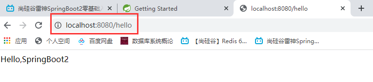

   > 我们现在基本上省略了很多以前的配置文件，我们现在连Tomcat都不用安装，只需要启动main方法就可以了，但是SpringBoot更强大的还在于可以简化我们的配置信息，我们未来所有的配置都可以配置在一个配置文件里面，在src/main/resources下创建application.properties固定名称的配置文件，在这个配置文件中我们可以修改Tomcat的一些设置包括SpringMVC的一些配置等等

6. 比如我们修改Tomcat的端口号为8888，就在配置文件中配置如下内容，再次启动就可以发现端口号改变了

   ```properties
   server.port=8888
   ```

   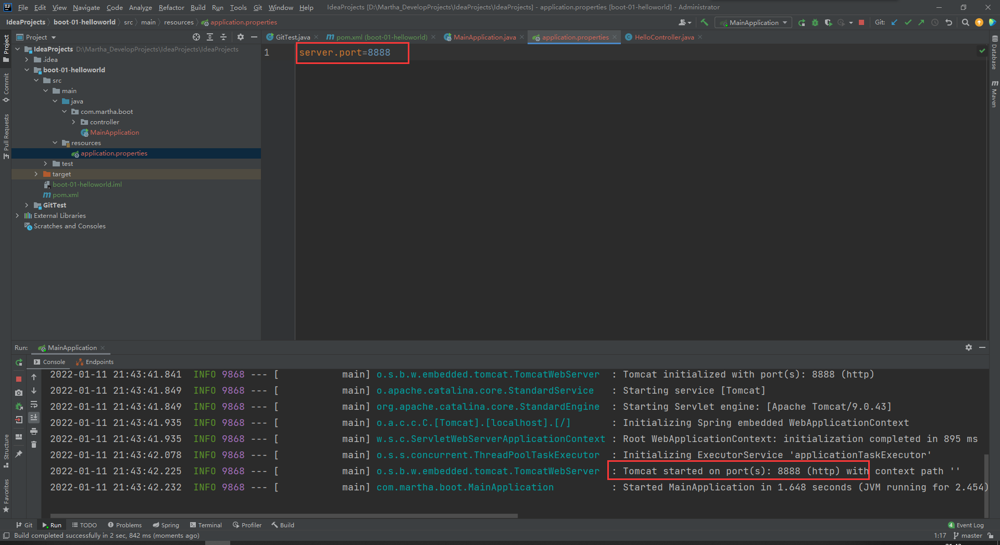

#### SpringBoot部署

> 我们之前使用SSM编写的项目，必须打成war包再部署到Linux的Tomcat目录下，而现在不需要了，现在我们直接创建一个可执行的jar包，只要引入了SpringBoot给我们提供的一个插件，我们就可以直接将我们的项目打成一个jar包，这个jar包自带了我们整套的运行环境，我们一般将这个jar包称为fat jar小胖jar，Maven插件如下：

```xml
<build>
    <plugins>
        <plugin>
            <groupId>org.springframework.boot</groupId>
            <artifactId>spring-boot-maven-plugin</artifactId>
        </plugin>
    </plugins>
</build>
```

> 部署完插件就开始打包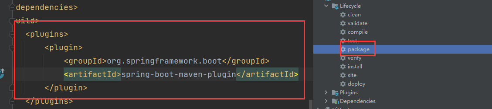
>
> 打成jar包之后，我们就可以在本地路径的target目录使用cmd命令行进行java -jar 运行这个jar包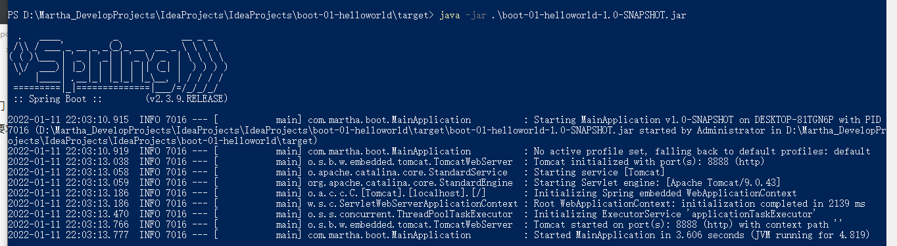
>
> 启动后我们也可以在浏览器上进行访问，所以说SpringBoot非常强大，从开发到配置到部署都帮我们简化了，所以以后我们要用到SpringBoot的功能，就必须引入SpringBoot的父工程依赖，我们想要开发web就必须引入web场景依赖

# 了解自动配置原理

## SpringBoot的特点

### 依赖管理

#### 父项目做依赖管理

> 我们学过Maven都知道，父项目一般就是用来做依赖管理的，父项目中可能会声明非常多的依赖，子项目只要继承了这个父项目，子项目之后写依赖就不需要版本号了，所以当我们在pom.xml文件中声明了父项目依赖，我们继承了这个父项目，该父项目是2.3.9版本的，我们在下边即使是引入了其他所有的依赖，我们都没有写过版本号，所以这个父项目是用来做依赖管理的，那么它到底在管理啥呢？

```xml
<parent>
    <groupId>org.springframework.boot</groupId>
    <artifactId>spring-boot-starter-parent</artifactId>
    <version>2.3.9.RELEASE</version>
</parent>
<!--它的父项目又是-->
<parent>
    <groupId>org.springframework.boot</groupId>
    <artifactId>spring-boot-dependencies</artifactId>
    <version>2.3.9.RELEASE</version>
</parent>
<!--而在这里面，帮助我们声明规范好了几乎所有开发中常用的依赖的版本号，所以我们无需写版本号-->
```

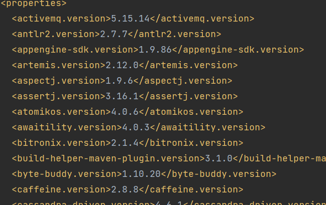

> 在依赖管理中，父项目将我们开发中常用的这些jar包版本都帮我们规范好了，而且这些版本一般就是当前我们SpringBoot支持的这些版本，那万一开发中我们想要变换版本怎么办，因为SpringBoot帮我们自动仲裁的这个版本，我们也可以将其称为SpringBoot的**自动版本仲裁机制**，但是如果我们如果使用他规定好的8版本的mysql版本，我的MySQL数据库就必须是8版本的数据库，但是MySQL一般我还是装的5或6，那么我就必须得修改MySQL驱动，比如我们就想使用5版本的MySQL数据库，那我们就要自定义修改版本号，步骤如下：

1. 我们首先要确定SpringBoot仲裁版本使用的标签属性名，比如它仲裁MySQL版本的标签属性名为mysql.version，那么我们就可以在pom.xml文件中使用properties标签将版本号自定义，如下：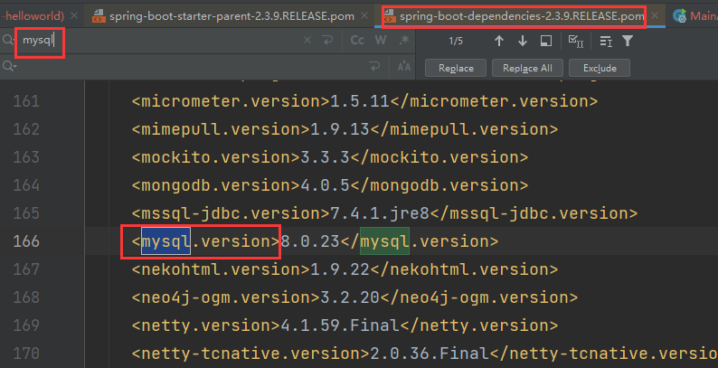

   ```xml
   <properties>
   	<mysql.version>5.5.20</mysql.version>
   </properties>
   ```

#### starter场景启动器

> 我们一般都会见到很多spring-boot-starter-*，这个 * 就代表某种场景，比如spring-boot-starter-web就是web场景启动器，用于做web开发的，只要引入starter，然后我们这个场景的所有常规需要的依赖都会自动帮我们引入，因为Maven的依赖传递原则
>
> SpringBoot所有支持的场景：https://docs.spring.io/spring-boot/docs/current/reference/html/usin-spring-boot.html#using-boot-starter
>
> 除了使用官方的启动器场景，也可以自定义场景启动器，所以之后见到*.spring-boot-starter一般都是第三方为我们提供的简化开发的场景启动器
>
> 所有场景启动器依赖最底层的依赖都会依赖下面的核心依赖
>
> ```xml
> <dependency>
> 	<groupId>org.springframework.boot</groupId>
>     <artifactId>spring-boot-starter</artifactId>
> 	<version>2.3.9.RELEASE</version>
>     <scope>compile</scope>
> </dependency>
> ```
>
> 所以我们以后引入依赖都可以不写版本号，但是也并不是绝对的，如果你引入的依赖是非SpringBoot版本仲裁的依赖，那么我们必须显式声明版本号

### 自动配置

+ 自动配好Tomcat

  > SpringBoot引入了Tomcat依赖，并配置了Tomcat

  ```xml
  <dependency>
      <groupId>org.springframework.boot</groupId>
      <artifactId>spring-boot-starter-tomcat</artifactId>
      <version>2.3.9.RELEASE</version>
      <scope>compile</scope>
  </dependency>
  ```

+ 自动配置好了SpringMVC

  > 引入了SpringMVC全套组件，并自动配置好了SpringMVC的常用功能，例如字符编码等、文件上传等问题，所以SpringBoot已经帮助我们配置好了所有Web开发的常见场景

  ```xml
  <dependency>
      <groupId>org.springframework</groupId>
      <artifactId>spring-webmvc</artifactId>
      <version>5.2.13.RELEASE</version>
      <scope>compile</scope>
  </dependency>
  ```

+ 自动配置好了默认的包结构扫描

  > 主程序所在的包及其下面的所有子包里面的组件都会被默认扫描进来，所以我们无需配置以前的扫描包，若想要改变扫描包路径，有两种方法

  1. 在主程序类上方使用@ComponentScan注解指定扫描的包路径
  2. @SpringBootApplication(scanBasePackages="com.martha");显式在该主程序注解标识中指定scanBasePackages属性的值为包路径

+ 各种配置都具有默认值

  > 默认配置最终都是映射到某一个类上的，配置文件的值最终会绑定到每个类上，这个类会在容器中创建对象

+ 按需加载所有自动配置项

  > 我们引入了哪些场景，这些场景的自动配置才会开启
  >
  > SpringBoot的所有自动配置功能都在spring-boot-autoconfigure包中

# SpringBoot容器功能

## @Configuration组件添加至容器

> 我们之前添加类组件至SpringIOC容器，可以使用配置文件中配置bean标签的方式，但是我们现在在SpringBoot场景下，只需要创建一个config包，且定义一个MyConfig类，在这个类上方标注一个@Configuration注解，这样就告诉SpringBoot这是一个配置类，该配置类就等同于我们的之前的配置文件，我们在配置类中写一个方法就相当于配置文件中的一个标签

```java
/*
	配置类里面使用@Bean标注在方法上给容器注册类组件，默认是单实例的，有且只有一个引用对象地址
	配置类本身也是组件
	proxyBeanMethods：代理bean的方法，值默认为ture，即我们的配置类会生成一个代理对象，通过代理对象调用方法，SpringBoot总会检查这个组件是否存在在容器中，存在就拿过来用，不存在再进行创建，所以一直保持着组件单实例，但是若将其设置为false，那么SpringBoot就不会检查，而是每次调用方法都会新创建一个bean实例，这时候两者的引用地址就不相同了，这也就引申出了配置类的Full和Lite轻量级模式
	Full：@Configuration(proxyBeanMethods = true)
	Lite：@Configuration(proxyBeanMethods = false)
	这就涉及到组件依赖的事儿了，如果User依赖于另一个Bean对象，那么我们建议是Full模式，能保证BeanA依赖的BeanB是同一个对象，如果Bean之间没有组件依赖，只是单单注册组件到容器中而已，那么我们推荐使用Lite模式，这样SpringBoot启动就会比较快
*/
@Configuration
public class MyConfig {
    @Bean // 给容器中添加组件，以方法名作为组件的id，返回值类型就是组件类型，返回的对象值就是容器中的实例
    public User user01(){
        return new User("Martha",21);
    }
    
    @Bean("user") // 也可以自定义组件id
    public User user01(){
        return new User("Martha",21);
    }
}
```

> 在主程序中测试容器中有无该实例对象

```java
@SpringBootApplication
public class MainApplication {
    public static void main(String[] args) {
        ConfigurableApplicationContext run = SpringApplication.run(MainApplication.class, args);
        // 查看容器中的组件名称，即组件的id
        String[] beanDefinitionNames = run.getBeanDefinitionNames();
        for (String beanDefinitionName : beanDefinitionNames) {
            System.out.println(beanDefinitionName);
        }
        // 从容器中获取组件
        User user = run.getBean("user01",User.class);
        System.out.println(user);//User{name='Martha', age=21}
    }
}
```

## @Import给容器导入组件

> 使用@Import注解，它可以自动地调用指定类的无参构造器创建出对象放到容器中

```java
@Import({User.class,Pet.class})
@Configuration
public class MyConfig {
    @Bean // 给容器中添加组件，以方法名作为组件的id，返回值类型就是组件类型，返回的对象值就是容器中的实例
    public User user01(){
        return new User("Martha",21);
    }
}
```

> 我们在主程序中测试，获取容器中指定对象的全类名

```java
@SpringBootApplication
public class MainApplication {
    public static void main(String[] args) {
        ConfigurableApplicationContext run = SpringApplication.run(MainApplication.class, args);
        // 从容器中获取指定组件全类名
        String[] beanNamesForType = run.getBeanNamesForType(User.class);
        for (String s : beanNamesForType) {
            System.out.println(s); // com.martha.boot.bean.User
        }
    }
}
```

## @Conditional条件装配

> 意思就是当我们组件满足@Conditional注解指定的条件之后，我们才将该组件加入到容器中或者干其他相应的事儿

```java
@Configuration
public class MyConfig {
    @ConditionalOnBean(name = "pet") // 当容器中存在id为pet的类组件时才创建user01对象并加入到容器中
    @Bean
    public User user01(){
        return new User("Martha",21);
    }
}
```

> 如果@ConditionalOnBean(name = "pet")加入到类上方，就意味着条件成立，类中的所有方法都执行，条件不成立则都不执行，当然加入在类中某一个方法上方只会约束该方法的执行

## @ImportResource

> 导入资源，之前使用Spring配置文件的方式注册组件，若组件过多，那么我们需要一个一个手写换成配置类的方式，这样太麻烦，所以可以在配置类上方使用@ImportResource("classpath:beans.xml")的方式指定原Spring配置文件的路径，将配置文件中的内容进行解析，怎么样配置的就怎么样解析，比如配置了组件，那么就自动将组件装配到容器中

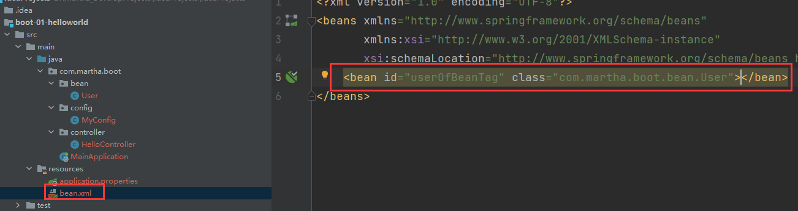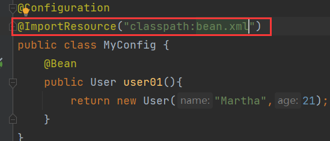

```java
@SpringBootApplication
public class MainApplication {
    public static void main(String[] args) {
        ConfigurableApplicationContext run = SpringApplication.run(MainApplication.class, args);
        // 判断容器中是否包含指定id的组件
        boolean userOfBeanTag = run.containsBean("userOfBeanTag");
        System.out.println(userOfBeanTag); // true
    }
}
```

## SpringBoot底层配置绑定

#### 方式一

> 我们经常习惯将经常会变化的信息配置到配置文件中，比如Java基础那时候的properties配置文件，比如将数据库的链接地址、账号、密码包括数据库连接池大小的这些属性配置到配置文件中，为了方便我们会将这个配置文件中的内容又一一解析到我们数据库连接池JavaBean对象中，所以这个实现场景说白了就是将配置文件中的所有配置绑定到JavaBean中，这个绑定过程若使用Java原生代码做挺麻烦的，但是在SpringBoot中这个过程将会非常简单，那就是配置绑定，我们只需要一个注解@ConfigurationProperties就行了，流程如下：

1. 假设有一个Car类，属性为brand和price，当然肯定要有getter、setter方法，和无参构造器

2. 在SpringBoot全局配置文件中即application.properties中配置属性值信息，如下

   ```properties
   mycar.brand=Maserati
   mycar.price=1400000
   ```

3. 在Car类上方标注@Component注解和@ConfigurationProperties注解，@Component意为将类交由容器管理，因为在容器中的组件才会拥有SpringBoot容器提供的强大功能，@ConfigurationProperties(prefix = "mycar")指定前缀即可

   ```java
   @Component
   @ConfigurationProperties(prefix = "mycar")
   public class Car {
       private String brand;
       private double price;
   
       public String getBrand() {
           return brand;
       }
   
       public void setBrand(String brand) {
           this.brand = brand;
       }
   
       public double getPrice() {
           return price;
       }
   
       public void setPrice(double price) {
           this.price = price;
       }
   
       @Override
       public String toString() {
           return "Car{" +
               "brand='" + brand + '\'' +
               ", price=" + price +
               '}';
       }
   }
   ```

4. 接下来我们就可以测试，我们的Car类的属性值是否已经与配置文件中规定的值绑定上了

   ```java
   @RestController
   public class HelloController {
   
       @Autowired
       private Car car;
   
       @RequestMapping("/car")
       public Car getCar(){
           return car;
       }
   }
   ```

5. 可以看到绑定成功了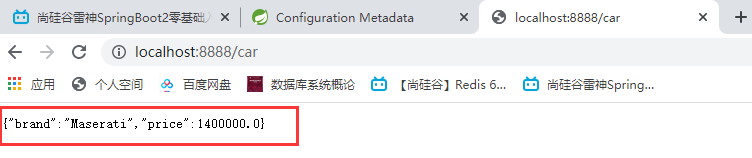

#### 方式二

> 这种方式一定要在配置类中写，首先配置类本身就是容器中的组件了，所以我们可以不在JavaBean类中声明@Component注解，（比如一些第三方类我们要使用属性绑定我们还不能在他们的类上方加上@Component注解），然后我们在配置类上方声明@EnableConfigurationProperties(xxx.class)，意思是开启我们属性配置功能，括号中就定义指定的Java类即可为该类开启属性值绑定功能
>
> @EnableConfigurationProperties(Car.class)有两个功能，第一个就是开启Car属性配置功能，只有开启了Car类的属性配置绑定功能，Car类上方的属性配置注解才会生效；第二个功能就是将Car这个组件自动注测到容器中

```java
@ConfigurationProperties(prefix = "mycar")
public class Car {
    private String brand;
    private double price;

    public String getBrand() {
        return brand;
    }

    public void setBrand(String brand) {
        this.brand = brand;
    }

    public double getPrice() {
        return price;
    }

    public void setPrice(double price) {
        this.price = price;
    }

    @Override
    public String toString() {
        return "Car{" +
                "brand='" + brand + '\'' +
                ", price=" + price +
                '}';
    }
}
```

```java
@Configuration
@EnableConfigurationProperties(Car.class)
public class MyConfig {
    @Bean
    public User user01(){
        return new User("Martha",21);
    }
}
```

> 然后测试，还是可以将全局配置文件中的属性值自动绑定到Java类

# 深入了解SpringBoot自动配置原理

> 从SpringBoot的主程序入手，@SpringBootApplication注解分为三个注解，分别是@SpringBootConfiguration、@EnableAutoConfiguration、@ComponentScan("xxx")，我们来一一分析这三个注解

#### @SpringBootConfiguration

> 点进去会发现这个注解其实就是一个@Configuration，代表当前是一个配置类，也就是我们的主程序MainApplication类也是SpringBoot中的一个配置类，所以也就没啥可说的了

#### @ComponentScan

> 这个注解其实就是一个包扫描，指定我们要扫描那些东西

#### @EnableAutoConfiguration

> 这个是非常关键的一个注解，前两个都没啥意思，最重要的就是这个注解，那么它都干了哪些？
>
> @EnableAutoConfiguration是由@AutoConfigurationPackage和@Import({AutoConfigurationImportSelector.class})两个注解组合而成

##### @AutoConfigurationPackage

> 翻译过来就是自动配置包

1. 进入源码我们发现这个注解中又是一个@Import注解

   ```java
   @Import({Registrar.class})// 利用Registrar给容器中导入一系列组件
   public @interface AutoConfigurationPackage {...}
   ```

   > @Import注解就是往容器中导入一个组件，这个组件叫做Registrar，这个Registrar是个静态内部类，它实现了两个方法，也就是说我们利用Registrar给容器中批量注册组件，因为Import我们一个一个注册太麻烦了，所以Registrar就写了一段代码批量注册

   ```java
   static class Registrar implements ImportBeanDefinitionRegistrar, DeterminableImports {
       Registrar() {
       }
   	/*
   		方法参数AnnotationMetadata metadata，就是传进来注解元信息，是啥注解呢，就是@AutoConfigurationPackage注解，因为@EnableAutoConfiguration是标注在了主程序类上方，而@EnableAutoConfiguration又囊括了@AutoConfigurationPackage注解，所以相当于@AutoConfigurationPackage注解标注在了主程序类的上方
   		代码.getPackageName.toArray(new String[0])，这里我们就可以发现，其实这段代码目的就是获取主程序类所在的包名，所以大概意思就是我们register类的功能就是将主程序类所在的包及其包下所有的组件都批量注册进容器，这就解释了为啥我们默认的包路径是主程序类所在的包，这下我们的@AutoConfigurationPackage注解就解释清楚了
   	*/
       public void registerBeanDefinitions(AnnotationMetadata metadata, BeanDefinitionRegistry registry) {
           AutoConfigurationPackages.register(registry, (String[])(new AutoConfigurationPackages.PackageImports(metadata)).getPackageNames().toArray(new String[0]));
       }
   
       public Set<Object> determineImports(AnnotationMetadata metadata) {
           return Collections.singleton(new AutoConfigurationPackages.PackageImports(metadata));
       }
   }
   ```

##### @Import({AutoConfigurationImportSelector.class})

> 顾名思义，这个注解是利用Selector再来给容器中导入一些东西，点进AutoConfigurationImportSelector类我们可以发现一个方法

```java
// 该方法就是将String数组中的组件选择导入进容器中，主要的方法就是getAutoConfigurationEntry(annotationMetadata);方法，利用这个方法给容器中批量导入一些组件
public String[] selectImports(AnnotationMetadata annotationMetadata) {
    if (!this.isEnabled(annotationMetadata)) {
        return NO_IMPORTS;
    } else {
        AutoConfigurationImportSelector.AutoConfigurationEntry autoConfigurationEntry = this.getAutoConfigurationEntry(annotationMetadata);
        return StringUtils.toStringArray(autoConfigurationEntry.getConfigurations());
    }
}
```

这个getAutoConfigurationEntry方法后面又调用getCandidateConfigurations方法执行后获得到所有需要导入到容器中的配置类，共127个组件，这些组件都要被导入到容器中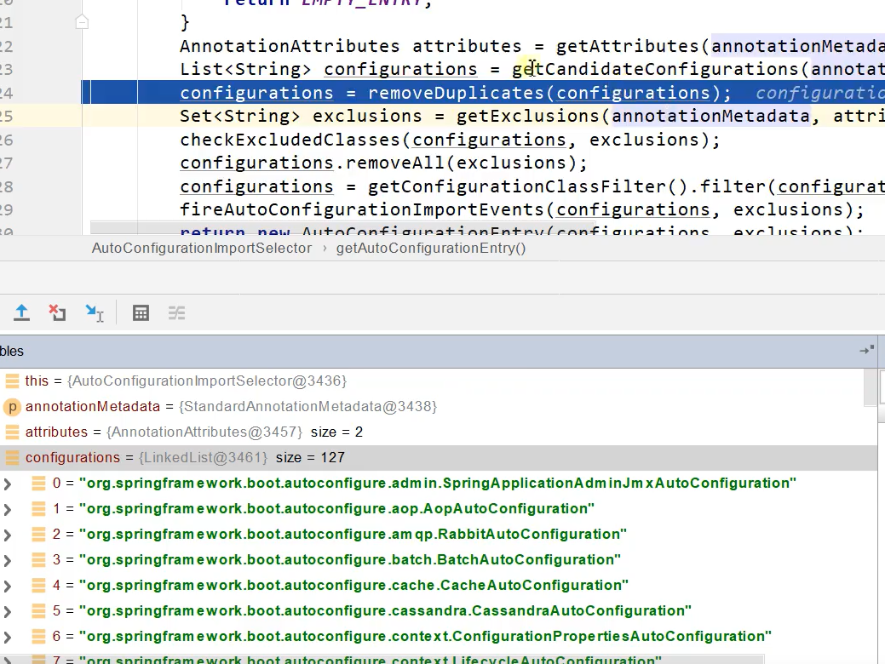

> 那么它怎么知道是这些类呢？点进去getCandidateConfigurations()方法我们发现，它其实是利用Spring的工厂加载器加载一些东西得到所有组件private static Map<String, List<String>> loadSpringFactories(@Nullable ClassLoader classLoader) {...}，内部说白了就是从META-INF/spring.factories位置来加载一个文件，默认会扫描我们当前系统中所有META-INF/spring.factories位置的文件，我们在依赖中找到spring-boot-autoconfigure-2.3.9.RELEASE.jar包，它里面也有META-INF/spring.factories文件，所有的127个组件的全类名都是在这个文件中写死的，当SpringBoot一启动，就要给容器中加载这些配置类
>
> 但是我们主程序启动过，获取容器中所有组件都可能没有这么多组件，事实上，虽然SpringBoot将这配置文件中的组件都加载进容器中，但是哪些生效哪些不生效就是我们接下来要了解的按需开启自动配置项

## 按需开启自动配置项

> 虽然我们我127个场景的所有自动配置启动的时候默认全部加载，但是最终都会按需配置，其实在底层就是得益于SpringBoot的条件装配注解在发挥作用，因为好多东西都缺少条件，所以并不会被加载进容器中，所以这就是SpringBoot自动配置的核心，说白了就是按照条件装配规则，这些127个组件最终都会被按需注册进容器中

# SpringBoot开发的最佳步骤

1. 要开发啥就引入啥的场景依赖
2. 查看SpringBoot自动配置了哪些（可选）
   1. 自己分析，引入场景对应的自动配置一般都生效了
   2. 在全局配置文件中debug=true开启自动配置报告，Negative的都是不生效的，Positive都是生效的
3. 是否需要自己修改配置项（数据库账号密码之类）
   1. 可以参照文档修改配置项
   2. 自己分析底层源码
4. 自定义加入或者替换组件类

# Lombok

> 能简化我们JavaBean的开发，我们之前需要对JavaBean的属性进行显式声明getter、setter方法、有参无参构造器、重写toString()等一大堆，有了Lombok我们就能简化这些操作

1. 在pom.xml文件中引入Lombok的依赖

   ```xml
   <dependency>
   	<groupId>org.projectlombok</groupId>
       <artifactId>lombok</artifactId>
   </dependency>
   ```

2. 为了在IDEA中使用Lombok，我们在IDEA中安装Lombok插件，安装成功后重启IDEA即可，这个插件就会帮助我们在编译的时候自动地生成getter、setter方法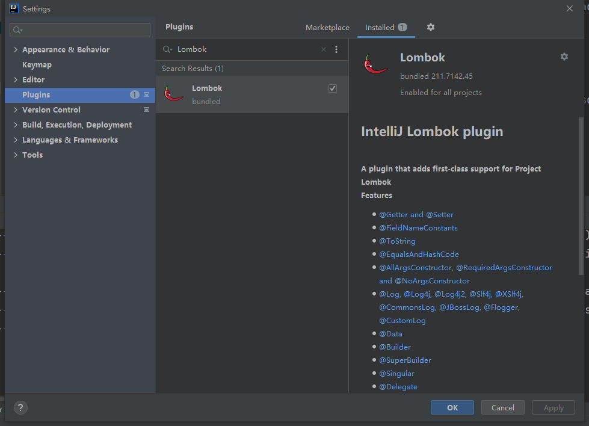

3. 然后就可以在JavaBean上方声明@Data注解，他就可以为我们自动在编译的时候生成属性对应的getter、setter方法

   ```java
   @NoArgsConstructor // 编译时自动生成无参构造器
   @AllArgsConstructor // 编译时自动生成全参构造器
   @ToString // 编译时自动生成toString方法
   @Data // 编译时自动生成属性对应的getter、setter方法
   @EqualsAndHashCode // 编译时自动重写属对应的equals和hashCode方法
   public class User {
       private String name;
       private Integer age;
   }
   ```

   > 有参构造器需要自定义属性，那么就显式声明即可，当然也可以直接在类上方（比如controller类）标注@Slf4j，帮我们注入日志类，这样我们就可以直接在JavaBean中打印日志输出了

```java
@Slf4j
@RestController
public class HelloController {

    @Autowired
    private Car car;

    @RequestMapping("/car")
    public Car getCar(){
        log.info("请求来了");
        return car;
    }
}
```

# dev-tools

> 它的作用就是热部署，我们每次修改完页面，我们希望不要每次都重启项目，只要有了dev-tools，以后我们在项目中最什么改变，我们只需要Ctrl+F9即Build -- build project就能实时生效，严格意义上只是自动重启而已，静态文件就会直接编译，代码文件就需要自动重启项目

pom.xml文件中引入依赖

```xml
<dependency>
	<grouptId>org.springframework.boot</grouptId>
    <artifactId>spring-boot-devtools</artifactId>
    <optional>true</optional>
</dependency>
```

# SpringInitializr

> 我们之前创建SpringBoot的Maven工程，创建完了还要引入依赖，还是很麻烦，直接选择SpringInitializr即Spring初始化向导就能直接创建好，以后开发我们都是选择它来创建项目结构

1. 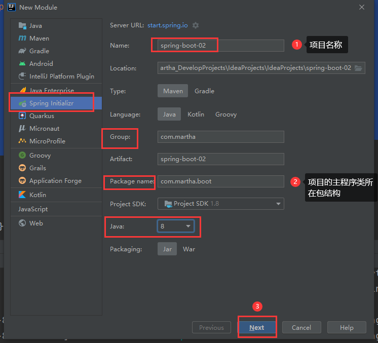
2. 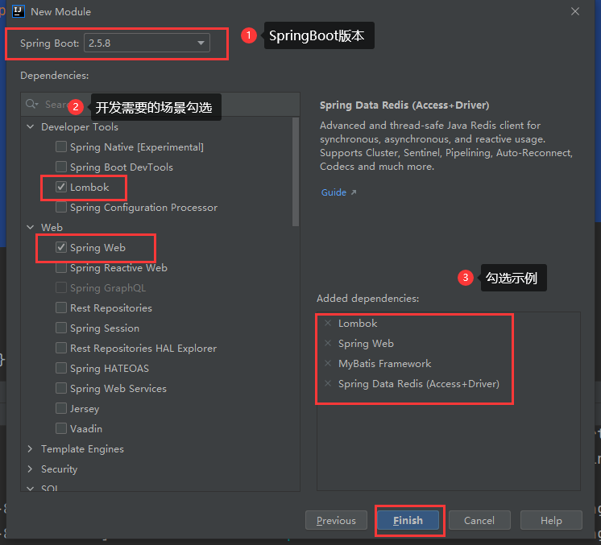

> 一切都会帮我们搭建好，包括主程序类，我们只需要关注开发即可

# SpringBoot2核心技术

## yaml配置文件

> 配置文件我们之前入门springBoot的时候使用的是application..properties，但是除了properties配置文件，SpringBoot还兼容另外一种配置文件，叫做yaml，yaml就是一种标记语言，非常适合用来做以数据为中心的配置文件，比如我们这些配置都是来配置一些数据存储，而不是一些行为动作

### yaml基本语法

+ `key: value`，注意中间具有空格
+ 大小写敏感
+ 使用缩进表示层级关系
+ 缩进不允许tab，只允许空格
+ 缩进的空格数不重要吗，只要相同层级的元素左对齐即可
+ \#表示注释
+ “与”表示字符串内容会被转义，前加 / 表示不转义

### yaml数据类型表示

#### 字面量

> 字面量：单个且不可再分的值，date、boolean、string、number、null，这些直接写即可

#### 对象

> 对象：键值对的集合（map、hash、set、object）

+ 行内写法：k: {k1:v1,k2:v2...}

+ 

  ```yaml
  k: 
  	k1: v1
  	k2: v2
  	...
  ```

#### 数组

> 一组按次序排列的值（array、list、queue）

+ 行内写法：k: [v1,v2,v3,...]

+ 

  ```yaml
  k: 
  	- v1
  	- v2
  	- v3
  	...
  ```

### 实践测试

1. 首先我们在src/main/java下创建application.yaml(yml)文件，该文件可以和application.properties并存，并且共同生效
2. 创建一个JavaBean用于测试数据类型的yaml赋值操作，当然别忘了JavaBean与配置文件绑定

```java
@Data
@ToString
@ConfigurationProperties(prefix = "person")
@Component
public class Person {
    private String name;
    private Boolean boss;
    private Date birthday;
    private Integer age;
    private String[] hobby;
    private List<String> animal;
    private Map<String,Object> score;
    private Set<Double> salarys;
    private Pet pet;
    private Map<String,List<Pet>> allPets;
}
```

3. 在yaml配置文件中一一赋值

   ```yaml
   person:
     name: Martha
     boss: true
     birthday: 2000/09/17
     age: 21
     hobby: [JAVA,HTML,ANDROID]
     animal: [拉布拉多,英短]
     score: {JAVA: 97,HTML: 88}
     salary: [999.0,666.0]
     pet:
       name: 阿猫
     allPets: {healthy: [name: x1,name: x2],sicky: [name: y1,name: y2]}
     
   # 或
   person:
     name: Martha
     boss: true
     birthday: 2000/09/17
     age: 21
     hobby:
       - JAVA
       - HTML
     animal:
       - LA
       - DA
     score:
       JAVA: 97
       HTML: 88
     salary:
       - 999.0
       - 666.0
     pet:
       name: 阿猫
     allPets:
       healthy:
         [name: a]
       sicky:
         [name: b]
   ```

   > 我们可以看到字符串可以不加引号，当然加了单引号或者双引号都是一样可以赋值的，区别就在转义字符上，双引号中的转义字符会生效，单引号中的转义字符不生效

### yaml自定义类绑定属性提示

> 我们发现IDEA给我们提示说SpringBoot配置的注释处理器没有在类路径下
>
> 所以若我们想要写yaml的时候有提示我们就将这个处理器配置上

```xml
<dependency>
    <groupId>org.springframework.boot</groupId>
    <artifactId>spring-boot-configuration-processor</artifactId>
    <optional>true</optional>
</dependency>
```

> 配置完后，重启一下项目再终止，就可以看到有提示了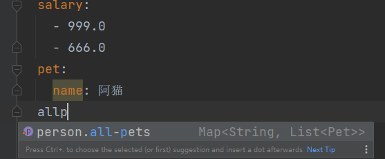
>
> 这里由于我们的p是大写，在这里它all-pets就相当于allPets一样的

> 由于这个配置处理器与我们的项目无关，所以SpringBoot建议我们不要将其打包部署，所以我们需要添加下面的内容到打包插件标签中，在打包的时候排除掉这个配置器

```xml
<plugin>
    <groupId>org.springframework.boot</groupId>
    <artifactId>spring-boot-maven-plugin</artifactId>
    <configuration>
        <excludes>
            <exclude>
                <groupId>org.springframework.boot</groupId>
                <artifactId>spring-boot-configuration-processor</artifactId>
            </exclude>
        </excludes>
    </configuration>
</plugin>
```

### 锚点与引用

#### 前言

》 在[yaml](https://so.csdn.net/so/search?q=yaml&spm=1001.2101.3001.7020)文件中如何引用变量?当我们在一个yaml文件中写很多测试数据时候，比如一些配置信息像用户名，邮箱，数据库配置等很多地方都会重复用到。
》 重复的数据，如果不设置变量，后续维护起来就很困难。
》 yaml文件里面也可以设置变量([锚点](https://so.csdn.net/so/search?q=锚点&spm=1001.2101.3001.7020)&)，其它地方重复用到的话，可以用*引用

#### 锚点与引用

》 对于重复的数据，可以单独写到yaml文件的开头位置，其它的地方用到的可以用*引用

```yaml
userinfo: &userinfo
    user: yoyo
    email: 283340479@qq.com

test1:
   name: testcase 1
   data:
       <<: *userinfo
       tel: 12345678901

test2:
    name: testcase 2
    data:
        <<: *userinfo
        tel: 15201234023

# 等同于下面的数据
userinfo:
    user: yoyo
    email: 283340479@qq.com

test1:
   name: testcase 1
   data:
       user: yoyo
       email: 283340479@qq.com
       tel: 12345678901

test2:
    name: testcase 2
    data:
        user: yoyo
        email: 283340479@qq.com
        tel: 15201234023
```

》 &用来建立锚点（userinfo），<<表示合并到当前数据，*用来引用锚点

#### 引用value值

》 上面的例子是对userinfo整体的数据，引用到其它地方了，有时候我们只想引用其中的一个值，如email的值，如何实现呢？

```yaml
userinfo: &userinfo
    user: yoyo
    email: &email 283340479@qq.com

test3:
   name: testcase 3
   data:
       user: admin
       email: *email
       tel: 12345678901

test4:
   name: testcase 5
   data:
       user: test123
       email: *email
       tel: 12345678902
# 等同于下面的数据
userinfo:
    user: yoyo
    email: 283340479@qq.com
test3:
   name: testcase 3
   data:
       user: admin
       email: 283340479@qq.com
       tel: 12345678901
test4:
   name: testcase 5
   data:
       user: test123
       email: 283340479@qq.com
       tel: 12345678902
```

》 这样就可以把重复的数据，单独写到一个配置，其它地方*引用就可以了
》
》  **待解决的问题**：yaml文件中配置多条数据，写成多个文档的格式（即使用—分割，返回的数据为list格式）时，使用该方法会报错，是否有解决方法呢

# Web开发

## 静态资源规则与定制化

### 静态资源访问

1. 在当前类路径下，只要你有/static、/public、/resources、/META-INF/resources这样的目录结构，这些目录都能当作静态资源目录，只要静态资源放在这些目录下，启动项目后，通过项目根路径 / + 静态资源名称就可以直接访问到该静态资源

   > 但是如果请求路径和静态资源名重名了，那么根据SpringMVC底层原理，就会先去Controller层看有无对应请求，有的话直接处理，若Controller层没有对应请求映射，那么就会将请求交由静态资源处理器处理，有的话就返回资源，没有最后就404

2. 因为SpringBoot将这个静态资源的访问默认设置为 根路径 + 静态资源名就能直接访问，但是也可以自定义一下访问静态资源的路径前缀，这是我们以后经常用的，日后我们的web应用静态资源会很多，然后还有一些动态请求，我们应用里边肯定会有拦截器要做一些功能，比如登录拦截器，只有登录后才能访问一些动态请求，所以如果我们没有自定义静态资源的访问前缀，拦截器拦截/**，就会将静态资源也拦住，为了拦截器配置方便，我们让所有的静态资源访问都带有一个前缀，我们让拦截器放行以指定前缀路径开始的所有请求，这样就会非常方便地过滤掉静态资源请求，所以我们一般想要对静态资源的访问添加前缀，只需要在yaml中配置如下内容即可：

   ```yaml
   # 静态资源的访问前缀为/resources
   spring:
     mvc:
       static-path-pattern: /resources/**
   ```

3. 另外，静态资源的默认目录位置也可以改变，SpringBoot给我们提供了四个默认静态资源目录结构，我们也可以改变默认的静态资源存放目录，使用如下配置即可：

   ```yaml
   # 自定义并注册静态资源目录，可以映射多个静态资源目录（逗号隔开），所以使用数组表示
   spring:
     resources:
       static-locations: [classpath:/myresources/]
   ```

   > 一旦自定义后，SpringBoot默认的四个静态资源目录就失效了，就无法访问到了

## 欢迎页

> SpringBoot支持两种方式的欢迎页，一种是静态方式，一种是模板方式，如果是第一种，那我们就将index.html页面放到静态资源路径下，那么它就会被当作欢迎页，也就是访问我们项目根路径默认展示的页面，欢迎页的所处目录路径必须是/**，源码如下

```java
WelcomePageHandlerMapping(TemplateAvailabilityProviders templateAvailabilityProviders, ApplicationContext applicationContext, Resource welcomePage, String staticPathPattern) {
    // 且静态资源目录必须是/**，才设置欢迎页
    if (welcomePage != null && "/**".equals(staticPathPattern)) {
        logger.info("Adding welcome page: " + welcomePage);
        this.setRootViewName("forward:index.html");
    } else if (this.welcomeTemplateExists(templateAvailabilityProviders, applicationContext)) {
        // 如果欢迎页不存在在静态资源目录，就会调用Controller，看能不能处理
        logger.info("Adding welcome page template: index");
        this.setRootViewName("index");
    }

}
```

## favicon功能

> 我们只需要将网站小图标放到SpringBoot静态资源目录中，并且名称一定要叫做`favicon.ico`，这样它就会自动地作为网站的图标了，若访问没出来，清除缓存试试看，这与底层代码无关，浏览器会默认发送请求到当前项目下的favicon.ico功能，由于我们加了静态资源访问前缀，那么图标就会失效

## 静态资源原理

1. SpringBoot启动回默认加载很多xxxAutoConfiguration自动配置类，我们做web开发，那么相应的web自动配置组件也为我们加载好了，但主要是WebMvcAutoConfiguration，这个自动配置类才是SpringMVC的自动配置类

2. SpringMVC自动配置类大多集中在WebMvcAutoConfiguration，当然还有其他自动配置才能完成我们完整的自动功能

3. 我们找到了WebMvcAutoConfiguration自动配置类后，首先就要看它是否生效，显然它是生效的

4. 我们看到一些配置类，全局配置文件的相关属性进行了绑定，如WebMvcProperties（前缀为spring.mvc）、ResourceProperties（前缀为spring.resources）

5. 一个配置类如果内部只有有参构造器，有参构造器中所有参数的值都会默认从容器中获取

   ```java
   /*
   	WebMvcProperties 从容器中获取和spring.mvc绑定的所有属性值的对象
   	ListableBeanFactory：即Spring的bean工厂
   	HttpMessageConverters 找到所有的HttpMessageConverters
   	ResourceHandlerRegistrationCustomizer 找到资源处理器的自定义器
   	DispatcherServletPath
   	ServletRegistrationBean 给应用注册Servlet、Filter、Listener等等
   */
   public WebMvcAutoConfigurationAdapter(WebMvcProperties mvcProperties, ListableBeanFactory beanFactory, ObjectProvider<HttpMessageConverters> messageConvertersProvider, ObjectProvider<WebMvcAutoConfiguration.ResourceHandlerRegistrationCustomizer> resourceHandlerRegistrationCustomizerProvider, ObjectProvider<DispatcherServletPath> dispatcherServletPath, ObjectProvider<ServletRegistrationBean<?>> servletRegistrations) {
       this.mvcProperties = mvcProperties;
       this.beanFactory = beanFactory;
       this.messageConvertersProvider = messageConvertersProvider;
       this.resourceHandlerRegistrationCustomizer = (WebMvcAutoConfiguration.ResourceHandlerRegistrationCustomizer)resourceHandlerRegistrationCustomizerProvider.getIfAvailable();
       this.dispatcherServletPath = dispatcherServletPath;
       this.servletRegistrations = servletRegistrations;
   }
   ```

6. 所有的资源默认处理规则就在如下代码

   ```java
   protected void addResourceHandlers(ResourceHandlerRegistry registry) {
       super.addResourceHandlers(registry);
       // 这边判断isAddMappings，默认是true，即所有静态资源能被直接访问，当然也可以在配置文件中配置spring.resources.add-mappings: false即可使静态资源无法访问
       if (!this.resourceProperties.isAddMappings()) {
           logger.debug("Default resource handling disabled");
       } else {
           this.addResourceHandler(registry, "/webjars/**", "classpath:/META-INF/resources/webjars/");
           this.addResourceHandler(registry, this.mvcProperties.getStaticPathPattern(), this.resourceProperties.getStaticLocations());
       }
   }
   ```

   ```java
   private void addResourceHandler(ResourceHandlerRegistry registry, String pattern, String... locations) {
       if (!registry.hasMappingForPattern(pattern)) {
           ResourceHandlerRegistration registration = registry.addResourceHandler(new String[]{pattern});
           registration.addResourceLocations(locations);
         /*
         	这里还能配置静态资源缓存，缓存以秒为单位，我们只需要在配置文件中配置spring.resources.cache.period: 1000，则意味着我们所有的静态资源可以存储多少秒，以后浏览器就会将这个静态资源给我们默认存储1000秒的时间，在这么长时间内，我们的静态资源就都不用去访问了
         */ registration.setCachePeriod(this.getSeconds(this.resourceProperties.getCache().getPeriod()));
           registration.setCacheControl(this.resourceProperties.getCache().getCachecontrol().toHttpCacheControl());
           this.customizeResourceHandlerRegistration(registration);
           this.autoConfiguredResourceHandlers.add(pattern);
       }
   }
   ```


## REST风格

> 我们在做所有Web开发之前，我们最先要做的就是请求映射，我们要编写一个Controller，在每一个方法上使用@RequestMapping注解来声明我们这个方法能处理什么请求，将这个声明 过程称为请求映射
>
> 开发中我们都习惯使用Rest风格
>
> + 以前我们的URL是这样：/getUser、/deleteUser、/addUser、/saveUser
> + 现在我们使用Rest风格：/user，通过请求方式来决定如何操作 GET获取、DELETE删除、PUT修改、POST保存即插入

1. 在表单中添加隐藏域

   ```html
   <!--PUT方式，小写的值也可以-->
   <form action="/user" method="POST">
       <input name="_method" type="hidden" value="PUT"/>
       ..
   </form>
   <!--DELETE方式，小写的值也可以-->
   <form action="/user" method="POST">
       <input name="_method" type="hidden" value="DELETE"/>
       ..
   </form>
   ```

2. 手动开启允许请求方式转换

   ```yaml
   mvc:
    hiddenmethod:
      filter:
        enabled: true
   ```

> 原理（表单提交使用RestFul风格）：按照要求我们在表单中带了参数为_method的隐藏域，请求过来会被HiddenHttpMethodFilter拦截，首先通过方法参数获取到我们原生的请求Request，然后会判断我们原生请求的请求方式是不是POST，这就要求我们表单提交的时候必须是POST方式，才能使用表单Rest风格，这时候判断正常后，就会获取到\_method的值，这个值不是空的以后就会将其不管大小写都会转换为大写，然后再判断是否兼容以下请求：PUT、DELETE、PATCH，兼容则进行包装，通过requestWrapper重写getMethod的方法，返回的就是对应的请求方式的值，过滤器链放行的时候用的就是wrapper过的request，当然只限于表单发送这种请求方式的时候底层是这么执行的，若一些客户端工具直接发送这种请求方式的请求，就不会进行包装直接放行（如安卓客户端或者PostMan能够直接发送PUT和DELETE方式的请求，那就无需过滤）

> 扩展：如何改变默认_method的属性名为自定义的名称
>
> + SpringBoot会判断有没有HiddenHttpMethodFilter，如果有就用我们自己的，没有就用它的，所以我们可以在配置类中自定义一个HiddenHttpMethodFilter，然后修改_method即可

```java
@Configuration
public class WebConfig{
    public HiddenHttpMethodFilter hiddenHttpMethodFilter(){
        HiddenHttpMethodFilter methodFilter = new HiddenHttpMethodFilter();
        methodFilter.setMethodParam("_myMethod");
        return methodFilter;
    }
}
```

## 请求映射原理

> 我们每次发请求，它到底是怎么找到那个方法来处理这个请求呢
>
> 在SpringBoot中，所有的请求都会交给DispatcherServlet处理，因为其底层还是使用SpringMVC，而DispatcherServlet是处理所有请求的开始，SpringMVC功能分析都从DispatcherSerblet的doDispatcher方法开始，这个方法是处理所有请求的开始，研究源码发现其实所有的请求映射信息都事先保存在了HandlerMapping中
>
> + SpringBoot自动配置欢迎页的HandlerMapping，访问/就能访问到index.html
> + 请求一进来就循环尝试所有的HandlerMapping看是否有请求信息
>   + 如果有就找到这个请求对应的handler
>   + 如果没有就是下一个HandlerMapping
>
> + 若我们需要一些自定义的映射处理，我们也可以自己给容器中放HandlerMapping，自定义HandlerMapping

## 普通参数与基本注解

> SpringMVC在底层处理web请求时可以接收的传参类型
>
> + 使用注解方式接受参数：
>   + @PathVariable路径变量获取对应路径参数值
>   + @RequestHeader获取请求头
>   + @CookieValue获取Cookie信息
>   + @RequestBody

```java
// 如果路径变量后标注的是双String类型的Map，那么会自动将请求参数封装为键值对
@GetMapping("/user/{id}/owner/{username}")
public Map<String,Object> getMap(@PathVariable("id") String id,
                                 @PathVariable("username") String username,
                                 @PathVariable Map<String,String> kv){
    Map<String,Object> map = new HashMap<String,Object>();
    map.put("id",id);
    map.put("username",username);
    map.put("kv",kv);
    return map;
}
```

```java
@GetMapping("/user")
public Map<String,Object> getMap(@RequestHeader("User-Agent") String agent,@RequestHeader Map<String,String> allHeaders){
    Map<String,Object> map = new HashMap<String,Object>();
    map.put("agent",agent);
    map.put("headers",allHeaders);
    return map;
}
```

### @RequestAttribute

> 作用就是获取Request域属性

```java
@RequestMapping("/goto")
public String toPage(HttpServletRequest request){
    request.setAttribute("value","成功了..");
    return "forward:/success";
}
@ResponseBody
@RequestMapping("/success")
public Map<String,Object> map(@RequestAttribute("value") String msg){
    Map<String,Object> map = new HashMap();
    map.put("value",msg);
    return map;
}
```

### @MatrixVariable矩阵变量

> 矩阵变量应该绑定在路径变量中
>
> + 之前我们获取请求参数都是/cars/{path}?key=value这种参数的获取方式一般通过@RequestParam注解获取
> + 使用矩阵变量：/cars/{path;key=value;brand=byd,audi,bmw}我们以分号来分隔一些kv，以分号的这种写法我们称为矩阵变量
> + 有一道面试题，比如我们的Cookie被禁用了，那么Session中的内容怎么使用，现在就牵扯到一个原理，就是我们往Session中保存了一个kv，每一个用户都有一个jsessionid，这个jsessionid会被保存在cookie中，而cookie每次发请求都会携带，所以Cookie没被禁用之前，每次发请求，服务器会将Cookie中的jsessionid取出并找到session对象，调用session对象的get方法就能获取session中的内容，而Cookie被禁用时，服务器就无法正常获取session的信息，这时候就需要使用矩阵变量了（/abc;jsessionid=xxx）这样的行为我们称为URL重写，路径重写就是将Cookie中的值使用矩阵变量的方式传递到服务器，如果我们使用请求参数的方式进行传递，就难以区分，而矩阵变量一般都是代表Cookie中的kv，所以这么一传递，我们想要获取矩阵变量的值，首先所有的信息都是绑定在路径变量中的，而整个访问路径还是/cars/sell;low=34;brand=byd,audi,bmw，矩阵变量写法就是一个key对应一个value，一个key对应多个value使用逗号隔开即可，所以只要见到封号kv，这都是矩阵变量的方式，如果多层路径对应一个矩阵变量，那么放在一起看，一个矩阵变量对应一个路径
>
> 以下是矩阵变量的获取
>
> 注意：SpringBoot默认禁用了矩阵变量的功能，SpringBoot对于请求路径的处理都是使用UrlPathHelper进行解析，里面有一个removeSemicolonContent属性，它默认是true，即会移除默认的分号内容，我们当然不能让他移除

```java
// 自定义一个webMvcConfigurer，将封号移除修改为false
@Bean
public WebMvcConfigurer webMvcConfigurer(){
    return new WebMvcConfigurer(){
        @Override
        public void configurePathMatch(PathMatchConfigurer configurer){
            UrlPathHelper urlPathHelper = new UrlPathHelper();
            urlPathHelper.setRemoveSemicolonContent(false);
            configurer.setUrlPathHelper(urlPathHelper);
        }
    };
}
```

```java
//  /cars/sell;low=34;brand=byd,audi,bmw
@ResponseBody
// 矩阵变量必须要有URL路径变量才能被解析
@GetMapping("/cars/{path}")
public Map carsSell(@MatrixVariable("low") Integer low, @MatrixVariable("brand") List<String> brands,
                    @PathVariable("path") String path){
    Map<String,Object> map = new HashMap();
    map.put("low",low);
    map.put("brand",brands);
    map.put("path",path);
    return map;
}

//  /boss/1;age=20/2;age=10
@ResponseBody
@GetMapping("/boss/{bossId}/{empId}")
public Map boss(@MatrixVariable(value="age",pathVar = "bossId") String bossId,@MatrixVariable(value="age",pathVar = "empId") String empId){
    Map<String,Object> map = new HashMap();
    map.put("bossId",bossId);
    map.put("empId",empId);
    return map;
}
```

## 控制器方法

### 参数封装及原理

#### Model、Map类型形参原理

+ 往Map或Model中存放键值对数据在底层中最终会在渲染页面之前将二者存放的键值对数据一一往**request请求域中存放**

+ 在控制器方法形参中，**Map类型与Model类型在底层其实是同一个对象**-`BindingAwareModelMap`，可以理解为他们两就是相等的

+ 往Map或Model中存放键值对其实就是往request域中存放键值对，代码测试如下

  ```java
  @Controller
  public class WebController {
      @RequestMapping("/page01")
      public String toPage(Map<String, Object> map, Model model) {
          map.put("name", "Martha"); // map 添加姓名
          model.addAttribute("age", 21); // model 添加年龄
          return "forward:/page02"; // 请求转发
      }
  
      @ResponseBody // {"name":"Martha","age":21}
      @RequestMapping("/page02")
      public Map<String,Object> toPage02(HttpServletRequest request) {
          Map<String,Object> map = new HashMap<String,Object>();
          map.put("name", request.getAttribute("name"));
          map.put("age", request.getAttribute("age"));
          return map;
      }
  }
  ```

  > 可见，Model和Map在底层是同一个对象，且往二者中存放数据最终会存放到请求域中

#### 自定义JavaBean对象封装原理

> ​	页面提交的请求数据，无论是使用GET或POST请求方式，其value都可以与JavaBean对象的属性相绑定，这称为数据绑定

**默认的数据绑定要求**

+ 前端
  + 表单中input标签的name属性值与JavaBean的属性名称一致
  + 若JavaBean的属性为另一个对象，则input标签的name属性值可采用级联属性声明
+ 后端
  + 控制层中请求映射的的控制器方法的形参类型为对应的JavaBean对象

**底层**

+ 自定义的JavaBean参数使用的是ServletModelAttributeMethodProcessor处理器来进行解析

+ 其次底层会判断该参数是不是简单类型，显然我们的JavaBean形参并不是简单类型

+ 底层会使用一个WebDataBinder绑定器组件来进行数据绑定操作，将request请求中携带的参数绑定到JavaBean中，在此之前，该JavaBean在底层会反射创建一个对象出来，用于存放对应的参数值数据，当然，因为HTTP超文本传输协议万物皆文本，所以底层还需要使用到转换器，比如将String转换为Integer（所以大概流程就是底层会反射创建一个与控制器方法形参相同类型的JavaBean对象，通过转换器对请求参数文本进行解析并转换为JavaBean对应属性的类型，然后通过反射将值一一设置进该对象中，后续应该就是将该对引用传递给我们的控制器形参）

+ 代码测试如下：

  ```java
  // JavaBean
  @Data
  @ToString
  @AllArgsConstructor
  @NoArgsConstructor
  public class Person {
      private String name;
      private Integer age;
      private Pet pet;
  }
  
  @Data
  @ToString
  @AllArgsConstructor
  @NoArgsConstructor
  public class Pet {
      private String name;
      private double weight;
  }
  ```

  ```html
  <!--HTML-->
  <form action="/person" method="POST">
      姓名：<input type="text" name="name" value="Martha">
      年龄：<input type="text" name="age" value="21">
      宠物姓名：<input type="text" name="pet.name" value="英短">
      宠物体重：<input type="text" name="pet.weight" value="12.00">
      <input type="submit" value="提交">
  </form>
  ```

  ```java
  // controller
  @ResponseBody // {"name":"Martha","age":21,"pet":{"name":"英短","weight":12.0}}
  @PostMapping("/person")
  public Person person(Person person){
      return person;
  }
  ```

#### 自定义Converter原理

> ​	WebDataBinder在底层注册了许多的数据转换器，可以将文本转换为对应的Java数据类型，我们在提交表单时，使用级联属性声明的方式触发了底层默认的转换机制，那么我们若想不使用级联属性声明的方式，还能为JavaBean进行数据绑定，我们就可以自定义一个转换器，该转换器会在底层被注册，然后进行匹配，只要原类型和转换类型匹配则进入执行

```html
<form action="/person" method="POST">
    姓名：<input type="text" name="name" value="Martha">
    年龄：<input type="text" name="age" value="21">
    <!--要求信息使用逗号分隔，且姓名在前，体重在后-->
    宠物信息：<input type="text" name="pet" value="英短,20.00">
    <input type="submit" value="提交">
</form>
```

```java
@Configuration
public class WebConfig {
    @Bean
    public WebMvcConfigurer webMvcConfigurer(){
        return new WebMvcConfigurer(){
            // 通过重写格式化器方法自定义添加一个转换器，并指定转换规则
            @Override
            public void addFormatters(FormatterRegistry registry) {
                // 由String类型转为指定类型Pet
                registry.addConverter(new Converter<String, Pet>() {
                    @Override
                    public Pet convert(String s) {
                        if(StringUtils.isEmpty(s))
                            return null;
                        String[] result = s.split(",");
                        Pet pet = new Pet();
                        pet.setName(result[0]);
                        pet.setWeight(Double.parseDouble(result[1]));
                        return pet;
                    }
                });
            }
        };
    }
}
```

#### returnValueHandler原理

+ 底层有许多返回值处理器在控制器方法返回值之前就已经准备好了，返回值处理器会被挨个遍历，通过supportsReturnType看返回值处理器是否支持该控制器方法的返回值
+ 若支持就会调用handleReturnValue进行返回值处理，若控制器方法标注了@ResponseBody注解就会使用RequestResponseBodyMethodProcessor处理器进行返回值处理
+ 其中有一个MediaType媒体类型，这就牵扯到了内容协商，内容协商的意思就是浏览器默认会以请求头的方式告诉服务器它能够接受什么样的内容类型，在请求头的Accept属性声明了可接收类型
+ 服务器根据自身的能力，决定服务器能生产什么样的数据给浏览器，所以浏览器说我能接收什么样的，服务器说我能生产什么样的，比如生产JSON数据给浏览器
+ 确定了内容之后，SpringMVC会挨个遍历所有容器底层的HttpMessageConverter，看哪一个消息转换器能处理这个内容数据，而这个消息转换器底层也是会判断是否能将一个Java对象转换为指定的媒体类型，反之也可，例如Person转为JSON，或者JSON转Person

#### HttpMessageConverter原理

+ SpringMVC会挨个遍历所有容器底层的HttpMessageConverter，看哪一个消息转换器能处理这个内容数据，而这个消息转换器底层也是会判断是否能将一个Java对象转换为指定的媒体类型，反之也可，例如Person转为JSON，或者JSON转Person
+ 最终会使用MappingJackson2HttpMessageConverter将对象转换为JSON并写出到浏览器，利用底层的objectMapper转换的

#### 内容协商原理

> 服务器根据客户端接收能力的不同返回不同类型的数据

+ 判断当前响应头中是否有确定的内容类型
+ 获取客户端所能接收的内容类型，客户端发请求的时候就会告诉服务器所能接收的内容类型，也就是请求头中的Accept字段，这时候服务器会使用默认的请求头策略来获取请求头中Accept字段的值
+ 遍历循环所有的MessageConverter，找到能支持操作将对象转为对应内容类型的转换器，将该转换器支持的内容类型统计出来
+ 将客户端想要的内容类型与服务器能提供的类型进行最佳匹配
+ 用支持将对象转为最佳匹配的媒体类型的转换器，调用它进行转换
+ 因浏览器对xml文本接收的权重比JSON文本高（服务器会按照权重降序排序），所以最佳匹配时，会优先选择将对象转换为xml文本

#### 基于请求参数的内容协商原理

> 因为若通过浏览器直接发送请求，是无法修改请求头的Accept字段的，它一直都会优先接收xml文本，所以我们需要通过开启基于请求参数的内容协商功能，并且在浏览器发请求时指定format字段请求参数，format字段是啥那么服务器就给我们响应啥

**步骤**

```yaml
# 开启基于请求参数的内容协商功能
spring:
  mvc:
    contentnegotiation:
      favor-parameter: true
```

```xml
<!--引入xml的依赖-->
<dependency>
    <groupId>com.fasterxml.jackson.dataformat</groupId>
    <artifactId>jackson-dataformat-xml</artifactId>
</dependency>
```

> 在浏览器地址栏路径后加上?format=xml或?format=json等就可以接收不同内容类型的文本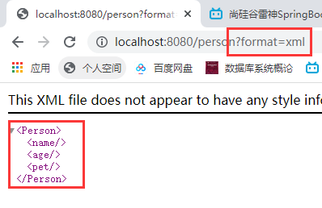
>
> 原理如下：

+ 携带format请求参数并不会修改浏览器请求头中的Accept字段
+ 当我们开启了请求参数内容协商时，内容协商管理器中会多出一个请求参数策略，默认优先于请求头策略
+ 服务器通过获取请求参数中的format的值，然后包装为媒体类型，通过最佳匹配最后响应给浏览器

#### 自定义MessageConverter

> 若自定义app发送请求，媒体类型也是自定义扩展的媒体类型（如application/x-Martha），那么我们就需要自定义消息转换器了

1. 首先自定义一个实现了HttpMessageConverter的类，并重写对应方法，由于我们只是进行返回值处理，那么就重写写出方法即可

   ```java
   public class MarthaMessageConverter implements HttpMessageConverter<Person> {
   
       @Override
       public boolean canRead(Class<?> aClass, MediaType mediaType) {
           return false;
       }
   
       @Override
       public boolean canWrite(Class<?> aClass, MediaType mediaType) {
           return true;
       }
   
       @Override
       public List<MediaType> getSupportedMediaTypes() {
           // 将我们自定义的媒体类型注册一下，因为服务器要统计所有的MessageConverter都能处理哪种媒体类型，我们定义的这个Converter能处理application/x-Martha这种类型
           return MediaType.parseMediaTypes("application/x-Martha");
       }
   
       @Override
       public Person read(Class<? extends Person> aClass, HttpInputMessage httpInputMessage) throws IOException, HttpMessageNotReadableException {
           return null;
       }
   
       @Override
       public void write(Person person, MediaType mediaType, HttpOutputMessage httpOutputMessage) throws IOException, HttpMessageNotWritableException {
           // 这边定义写出要以何种格式，比如我们就要使用封号分隔即可
           String result = person.getName() + ";" + person.getAge();
           // 将我们自己定义好的格式文本写出
           httpOutputMessage.getBody().write(result.getBytes());
       }
   }
   
   ```

2. 在配置类的中进行注册

   ```java
   @Configuration
   public class WebConfig {
       @Bean
       public WebMvcConfigurer webMvcConfigurer(){
           return new WebMvcConfigurer(){
               @Override
               public void extendMessageConverters(List<HttpMessageConverter<?>> converters) {
                   // 将我们自定义的消息转换器添加进系统的消息转换器序列
                   converters.add(new MarthaMessageConverter());
               }
           }
       }
   }
   ```

#### 自定义内容协商策略

## 各种类型参数解析原理

1. 首先从HandlerMapping中找到能处理请求的Handler（即Controller.method()）
2. 为当前Handler找一个适配器HandlerAdapter，处理器的适配器有四种
   + RequestMappingHandlerAdapter：支持标注了@RequestMapping注解的控制器方法
   + HandlerFunction：支持函数式编程的控制器方法
   + HttpRequestHandlerAdapter
   + SimpleControllerHandlerAdapter

3. 当然我们默认拿到的就是RequestMappingHandlerAdapter适配器


# 视图解析与模板引擎

1. 引入Thymeleaf依赖

   ```xml
   <dependency>
       <groupId>org.springframework.boot</groupId>
       <artifactId>spring-boot-starter-thymeleaf</artifactId>
   </dependency>
   ```

2. 在HTML页面引入Thymeleaf的名称空间

   ```html
   xmlns:th="http://www.thymeleaf.org"
   ```

   